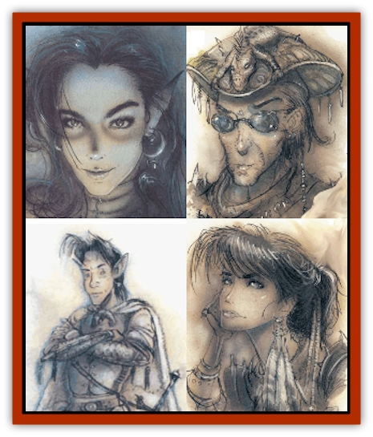
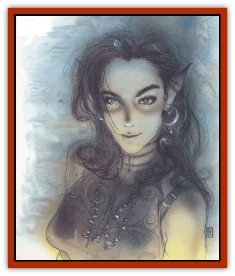
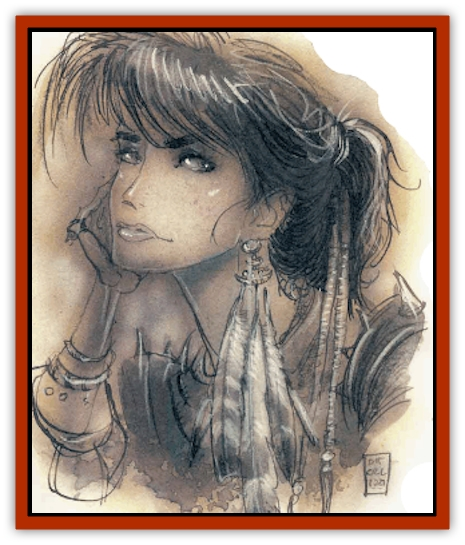
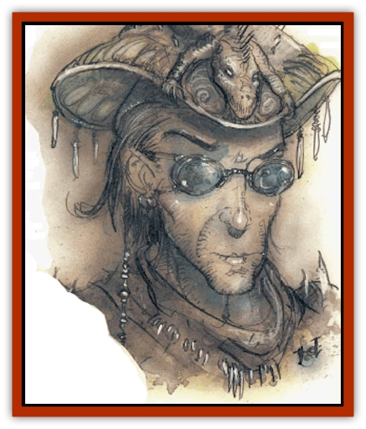
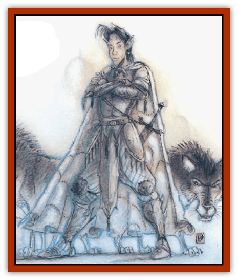

# Animal Lord

| Statistic | **Cat Lord** | **Hawk Lord** | **Lizard Lord** | **Wolf Lord** |
| --- | --- | --- | --- | --- |
| **Activity Cycle:** | Any | Any | Any | Any |
| **Alignment:** | Neutral | Neutral | Neutral | Neutral |
| **Armor Class:** | 3 | 4 | 3 | 5 |
| **Climate/Terrain:** | Beastlands | Beastlands | Beastlands | Beastlands |
| **Damage/Attack:** | See below | See below | See below | See below |
| **Diet:** | Carnivore | Carnivore | Carnivore | Carnivore |
| **Frequency:** | Unique | Unique | Unique | Unique |
| **Hit Dice:** | 15 (122 hp) | 15 (122 hp) | 15 (122 hp) | 15 (122 hp) |
| **Intelligence:** | Exceptional (15-16) | Exceptional (15-16) | Exceptional (15-16) | Exceptional (15-16) |
| **Magic Resistance:** | 50% | 50% | 50% | 50% |
| **Morale:** | Champion (15-16) | Champion (15-16) | Champion (15-16) | Champion (15-16) |
| **Movement:** | 21 | 12, Fl 24 (C) | 15 | 15 |
| **No. Appearing:** | 1 | 1 | 1 | 1 |
| **No. of Attacks:** | See below | See below | See below | See below |
| **Organization:** | Solitary | Solitary | Solitary | Solitary |
| **Size:** | See below | See below | See below | See below |
| **Special Attacks:** | Magical weapons, / rake, darts | Dive | Hypnotism | Poison |
| **Special Defenses:** | Danger sense | Danger sense | Danger sense, / weapon immunity | Danger sense, / weapon immunity |
| **THAC0:** | 5 | 5 | 5 | 5 |
| **Treasure:** | Nil | Nil | Nil | Nil |
| **XP Value:** | 18,000 | 18,000 | 18,000 | 18,000 |

The four animal lords listed above are only examples of the many lords who live in the Beastlands. For each variety of animal there is a corresponding animal lord. For instance, there is a fox lord, an [[Owl|owl]] lord, a [[Horse|horse]] lord, and hundreds of other animal lords.

Animal lords can appear in humanoid or animal form. Their humanoid form encompasses the subtle features of the animal in question, and they are about 6 feet tall. In animal form, they look like the animal over which they have dominion. The [[Cat_Great|tiger]] lord looks like a sleek tiger, the [[Badger|badger]] lord appears as a badger, and so on.

All animal lords have a natural telepathy or *ESP* that is always active, making them impossible to surprise or deceive. They also have a keen danger sense that borders on precognition. In mortal danger the lord is 90% likely to have a <q>had feeling</q> and 25% likely to know exactly what will happen.

**Combat:** Each of the animal lords has a unique style of combat depending on the animal over which they have dominion. Their propensity for combat differs with each lord; some are naturally more aggressive than others. For instanced, the [[Wolf|wolf]] lord is obviously more assertive than the rabbit lord.

As a rule, specific animal lords approach combat situations as their animal counterparts do: predators attack, whereas herbivores flee. However, some animal lords see themselves as protectors of their subject creatures. The [[Camel|camel]] lord, for instance, runs with a herd, fighting ferociously when necessary to protect the flight of the camels.

Attack forms vary as widely as attitude among the animal lords. Listed below are the combat abilities of the four animal lords detailed here. They provide guidelines for the other lords.

All animal lords have the spell-like abilities *anti-magic shell* (3 times per day), *charm person* on any one person affectionate to the lord's animal, *plane shift*, and *teleport*.

Animal lords are immune to all *charm*-related spells, including spells that compel action (for example, geas). They can summon 2 to 12 animals of the lord's type (three times per day, 100% success). They also have superior senses according to the lord's animal. For example, the hawk lord has excellent eyesight.

**Habitat/Society:** Although it is incorrect to call the animal lords immoral, they are amoral, especially when dealing with outside affairs. The animal lords care little for anything but matters directly related to their business. They conduct day-to-day affairs related to the animal over which they hold dominion with little regard for the world around them.

Even so, the animal lords can benefit other animals or people. If a person or animal enters a lord's territory, the lord often aids the creature to get rid of it rather than let it die. But in other dealings an animal lord can be brutal and uncaring. There is, as they say, no such thing as animal politics.

**Ecology:** These immortal spirits are, in a sense, gods to their respective animals. If an animal lord's form is killed, its essence reappears in another of its animals, far away, perhaps even on another plane.

The driving force of the animal lords is nature, which rules their will. For instance, although the rabbit lord seeks vengeance upon men for destroying the homeland of rabbits, he sheds no tear for a rabbit killed by natural predators. This is the way of nature.

## Cat Lord

The lord of cats, in her human form, looks like a dark-haired, green eyed human with a lithe form. The one trait that separates her from other humans is her catlike eyes with vertical pupils. In her cat form, she looks loke a black panther with fiery red eyes and fierce strength.

**Combat:** In human form the cat lord wields a *long sword of wounding* with which she can attack twice per round. She also employs *darts +2* with a +3 bonus to hit because of her Dexterity. She has ten *darts* at the beginning of any combat.

When in cat form, the cat lord attacks with two huge paws (each does 1d4 points of damage) and a vicious bite (1d10 points of damage). If both front paws hit, the cat may rake with her two back claws for an additional 1d4 points of damage each.

**Habitat/Society:** The cat lord tends to the affairs of felines both in the Inner and Outer Planes. She arrives whenever humans drive cats out of their natural habitat. She also leads prides of cats out of danger by assuming leadership of the pride. Though this may mean killing the current leader of a pride, the lord sees this as a necessary evil for the good of the group.

Nonfelines see the cat lord in different ways according to their disposition toward cats in general. To cat lovers, the cat lord has a Charisma of 22 and seems attractive. To those indifferent to cats, she has a Charisma of 10 and seems an interesting human. To those who dislike or hate cats, the cat lord has a Charisma of 10 and seems repulsive and intimidating.

Some view the cat lord as evil, others as good. Neither view is true, for the cat lord does not bother with the affairs of men.

## Hawk Lord

In human form, the [[Hawk|hawk]] lord is a beautiful, independent-looking woman with charismatic features. She carries herself with confidence and a noble demeanor. In animal form, she is a large hawk with distinctive whi markings and a tremendous wingspan.

**Combat:** Of the four animal lords detailed here, the hawk lord fights most weakly in human form. Her THAC0 increases to 20 when human, and she has no proficiency in any weapon. She can cast *charm person*, as per the wizard spell, seven times per day.

In animal form, the hawk lord can use her claws (1d6 points of damage) and beak (1d4 points of damage). However, she prefers a plummeting dive from 100 feet or higher. She may not attack with her beak when diving, but her claw attacks gain +2 to hit and do 2d6 points of damage apiece.

**Habitat/Society:** The noble hawk lord, unlike most of the animal lords, finds pleasure in dealing with humans. In human form she often walks the fields and meets people.

The hawk lord deals with the affairs of hawks everywhere. She appears frequently in the Upper Planes and the Prime Material Plane when hawks flee their homeland or are otherwise endangered.

## Lizard Lord

The <a href="lizard">lizard</a> lord is one of the most easily recognized animal lords. He sometimes appears as an imperious human male with the jeweled, beaded skin of a gila monster. In animal form, he appears as a huge gila monster or komodo dragon.

**Combat:** In human form the lizard lord rarely uses weapons, preferring instead to depend on his strong *hypnotism* ability. Creatures meeting the lizard lord's gaze must save vs. spell at a -3 penalty or become susceptible to the lord's suggestions.

In animal form, the lizard lord may bite for 2d6 points of damage. Any creature bitten on an attack roll of natural 20 takes double damage and is trapped in the animal lord's jaws, thereafter taking normal damage each round until the victim escapes or dies. The lizard lord is also immune to attacks by blunt weapons in this form.

**Habitat/Society:** The lizard lord is one of the most aloof animal lords. He rarely takes human form, and even less rarely involves himself in the affairs of nonreptile kind. Usually sedentary, he only infrequently rouses himself out of his torpor, and that only at some great calamity to his people. Once active, however, he is implacable in his anger and desire for vengeance.

## Wolf Lord

The lord of [[Wolf|wolves]] appears more human than most animal lords, as a teenaged boy with sharp, lupine features, an intelligent face, and eyes bright with life. In animal form, the wolf lord is a gray wolf that leads huge wolf packs.

**Combat:** In human form, the wolf lord is a weak fighter. He always transforms into a wolf when entering combat. In human form the lord wields a dagger coated with poison (class E, injected, immediate, death/20). The dagger is so enchanted that when the wolf lord wields it, it never runs dry of poison.

In animal form, the wolf lord bites twice per round (2d6 points of damage). In animal form the wolf lord is immune to nonmagical weapons.

**Habitat/Society:** Even in human form, this strange and alarming lord shows lupine characteristics: He is cunning, wily, and at times brutal.

---
## Discovery & Documentation

**Source Publication:** MC8 Outer Planes Appendix (1990)
**Campaign Setting:** Planescape
**Author(s):** Timothy B. Brown, Jamie LaFountain

### Other Creatures Found in This Source Book
   * [[Aasimon_Agathinon|Aasimon, Agathinon]]
   * [[Aasimon_Deva|Aasimon, Deva]]
   * [[Aasimon_Light|Aasimon, Light]]
   * [[Aasimon_General_Information|Aasimon, General Information]]
   * [[Aasimon_Planetar|Aasimon, Planetar]]
   * [[Aasimon_Solar|Aasimon, Solar]]
   * [[Air_Sentinel|Air Sentinel]]
   * [[Archon|Archon]]
   * [[Baatezu_Lesser_Abishai|Baatezu, Lesser, Abishai]]
   * [[Baatezu_Greater_Amnizu|Baatezu, Greater, Amnizu]]
   * [[Baatezu_Lesser_Barbazu|Baatezu, Lesser, Barbazu]]
   * [[Baatezu_Greater_Cornugon|Baatezu, Greater, Cornugon]]
   * [[Baatezu_Lesser_Erinyes|Baatezu, Lesser, Erinyes]]
   * [[Baatezu_General_Information|Baatezu, General Information]]
   * [[Baatezu_Greater_Gelugon|Baatezu, Greater, Gelugon]]
   * [[Baatezu_Lesser_Hamatula|Baatezu, Lesser, Hamatula]]
   * [[Baatezu_Lemure|Baatezu, Lemure]]
   * [[Baatezu_Least_Nupperibo|Baatezu, Least, Nupperibo]]
   * [[Baatezu_Lesser_Osyluth|Baatezu, Lesser, Osyluth]]
   * [[Baatezu_Greater_Pit_Fiend|Baatezu, Greater, Pit Fiend]]
   * [[Baatezu_Least_Spinagon|Baatezu, Least, Spinagon]]
   * [[Balaena|Balaena]]
   * [[Bariaur|Bariaur]]
   * [[Bebilith|Bebilith]]
   * [[Bodak|Bodak]]
   * [[Dog_Moon|Dog, Moon]]
   * [[Dragon_Adamantite|Dragon, Adamantite]]
   * [[Einheriar|Einheriar]]
   * [[Gehreleth|Gehreleth]]
   * [[Githyanki|Githyanki]]
   * [[Githzerai|Githzerai]]
   * [[Hordling|Hordling]]
   * [[Lammasu_Celestial|Lammasu, Celestial]]
   * [[Larva|Larva]]
   * [[Maelephant|Maelephant]]
   * [[Marut|Marut]]
   * [[Mediator|Mediator]]
   * [[Mortai|Mortai]]
   * [[Night_Hag|Night Hag]]
   * [[Nightmare|Nightmare]]
   * [[Noctral|Noctral]]
   * [[Per|Per]]
   * [[Phoenix|Phoenix]]
   * [[Slaad|Slaad]]
   * [[Tanar'ri_Greater_Babau|Tanar'ri, Greater, Babau]]
   * [[Tanar'ri_Greater_Chasme|Tanar'ri, Greater, Chasme]]
   * [[Tanar'ri_Greater_Nabassu|Tanar'ri, Greater, Nabassu]]
   * [[Tanar'ri_Least_Dretch|Tanar'ri, Least, Dretch]]
   * [[Tanar'ri_Least_Manes|Tanar'ri, Least, Manes]]
   * [[Tanar'ri_Least_Rutterkin|Tanar'ri, Least, Rutterkin]]
   * [[Tanar'ri_Lesser_Alu-Fiend|Tanar'ri, Lesser, Alu-Fiend]]
   * [[Tanar'ri_Lesser_Bar-Lgura|Tanar'ri, Lesser, Bar-Lgura]]
   * [[Tanar'ri_Lesser_Cambion|Tanar'ri, Lesser, Cambion]]
   * [[Tanar'ri_Lesser_Succubus|Tanar'ri, Lesser, Succubus]]
   * [[Tanar'ri_Guardian_Molydeus|Tanar'ri, Guardian, Molydeus]]
   * [[Tanar'ri_General_Information|Tanar'ri, General Information]]
   * [[Tanar'ri_True_Balor|Tanar'ri, True, Balor]]
   * [[Tanar'ri_True_Glabrezu|Tanar'ri, True, Glabrezu]]
   * [[Tanar'ri_True_Hezrou|Tanar'ri, True, Hezrou]]
   * [[Tanar'ri_True_Marilith|Tanar'ri, True, Marilith]]
   * [[Tanar'ri_True_Nalfeshnee|Tanar'ri, True, Nalfeshnee]]
   * [[Tanar'ri_True_Vrock|Tanar'ri, True, Vrock]]
   * [[Titan|Titan]]
   * [[Translator|Translator]]
   * [[T'uen-rin|T'uen-rin]]
   * [[Vaporighu|Vaporighu]]
   * [[Warden_Beast|Warden Beast]]
   * [[Yugoloth_Greater_Arcanaloth|Yugoloth, Greater, Arcanaloth]]
   * [[Yugoloth_Lesser_Dergoloth|Yugoloth, Lesser, Dergoloth]]
   * [[Yugoloth_Lesser_Hydroloth|Yugoloth, Lesser, Hydroloth]]
   * [[Yugoloth_General_Information|Yugoloth, General Information]]
   * [[Yugoloth_Lesser_Mezzoloth|Yugoloth, Lesser, Mezzoloth]]
   * [[Yugoloth_Greater_Nycaloth|Yugoloth, Greater, Nycaloth]]
   * [[Yugoloth_Lesser_Piscoloth|Yugoloth, Lesser, Piscoloth]]
   * [[Yugoloth_Greater_Ultroloth|Yugoloth, Greater, Ultroloth]]
   * [[Yugoloth_Lesser_Yagnoloth|Yugoloth, Lesser, Yagnoloth]]
   * [[Zoveri|Zoveri]]
