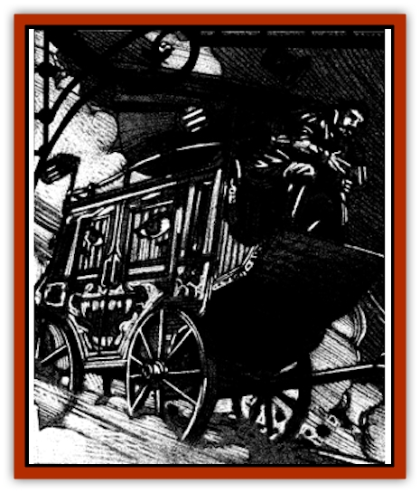

# Animator - Common

| Statistic | **Animator, Common** |
| --- | --- |
| **Activity Cycle:** | Any |
| **Alignment:** | Chaotic evil |
| **Armor Class:** | Varies |
| **Climate/Terrain:** | Ravenloft |
| **Damage/Attack:** | 1d8 |
| **Diet:** | Karmic resonances |
| **Frequency:** | Very rare |
| **Hit Dice:** | Varies |
| **Intelligence:** | Exceptional (15-16) |
| **Magic Resistance:** | Nil |
| **Morale:** | Average (8-10) |
| **Movement:** | 12 |
| **No. Appearing:** | 1 |
| **No. of Attacks:** | 1 |
| **Organization:** | Solitary |
| **Size:** | M to L (4-12' tall) |
| **Special Attacks:** | Varies |
| **Special Defenses:** | Varies |
| **THAC0:** | Varies |
| **Treasure:** | Nil |
| **XP Value:** | Varies |

More powerful than the [[Animator_Minor|minor animator]], this creature can enter larger objects such as coaches or stoves and bring them to life. The power of the common [[Animator_General_Information|animator]] is such that it can bestow an unusual power upon its host object. This power can range from annoying to deadly. For example, an animator that has taken control of a cast-iron stove might cause it to spew forth a jet of flame when its door is opened.

The common animator has no direct ability to communicate. From time to time, however, these creatures might deliver messages to their wards by scratching words into a wooden surface, tapping in code. or some similar manner. This is strictly onesided, however, as all efforts to speak with or instruct the animator will fail. This includes the use of magical or psionic abilities. Any direct attempt to touch the mind of an animator may well require a madness check at the DM's discretion.

**Combat:** A common animator may activate all of the moving parts of the object that it occupies. For example, a coach may roll around on its own volition, a piano might play itself at will, and the drawers of a dresser could open and shut without warning.

When it is not controlling a weapon of some type, the animator must employ some indirect manned of attack to harm its victims, An attack roll is required with the creature's THAC0 being determined by its weight and composition (see [[Animator_General_Information|Animator, General Information]]). In most cases, the damage from such an attack is limited to 1d8 points. If the attack has some unusual side effect, a saving throw might be required to avoid more severe injury. For example, an animated coach might attempt to pitch its driver from his seat, probably requiring him to make a Dexterity Check to avoid being dismounted. If the poor fellow were thrown under the wheels of a passing wagon. he might then be required to make a saving throw vs. paralyzation to avoid being crushed to death.

In addition to such physical attacks, a common animator enables the object it possesses to deliver a magical attack of some sort. The effects of such powers range dramatically and are based upon the object in which the creature resides. A large cast-iron stove may have the ability to breathe fire, a piano may have the power to cast an *Otto's irresistible dance* spell on those who hear it play, and a small fishing boat might be able to entangle its occupants in lines and nets. Whatever the nature of the magical effect, it generally mirrors the effects of a wizard or priest spell of up to 4th level. The spell-like power of an animator is normally one that inflicts harm, they never have healing or beneficial powers.

Animators of all types are immune to any form of mind- or biology-affecting spells and attacks. Thus, they cannot be *charmed*, *held*, or poisoned. The nature of the object in which the animator resides dictates its vulnerability to other forms of attack.

**Habitat/Society:** When not in possession of an object, animators are assumed to drift like insubstantial vapors through the world. When they sense strong negative emotions, they move in and feed. In this state, there seems to be no barrier that the creature cannot pass in its pursuit of a home.

**Ecology:** Common animators, like other animators, thrive on existing and residual emotions of the living. Some creatures inhabit places associated with a particularly emotional death, and are often mistaken for [[Ghost|ghosts]] or other forms of incorporeal undead.

---
## Discovery & Documentation

**Source Publication:** Ravenloft Appendix III (1991)
**Campaign Setting:** Ravenloft
**Author(s):** Kirk Botulla

### Other Creatures Found in This Source Book
   * [[Akikage|Akikage]]
   * [[Animator_Greater|Animator, Greater]]
   * [[Animator_Minor|Animator, Minor]]
   * [[Animator_General_Information|Animator, General Information]]
   * [[Bakhna_Rakhna|Bakhna Rakhna]]
   * [[Baobhan_Sith|Baobhan Sith]]
   * [[Beetle_Scarab|Beetle, Scarab]]
   * [[Boneless|Boneless]]
   * [[Boowray|Boowray]]
   * [[Bruja|Bruja]]
   * [[Carrionette|Carrionette]]
   * [[Carrion_Stalker|Carrion Stalker]]
   * [[Cat_Midnight|Cat, Midnight]]
   * [[Cat_Skeletal|Cat, Skeletal]]
   * [[Cloaker_Resplendent|Cloaker, Resplendent]]
   * [[Cloaker_Shadow|Cloaker, Shadow]]
   * [[Cloaker_Undead|Cloaker, Undead]]
   * [[Corpse_Candle|Corpse Candle]]
   * [[Death's_Head_Tree|Death's Head Tree]]
   * [[Doppelganger_Ravenloft|Doppelganger (Ravenloft)]]
   * [[Familiar_Pseudo-|Familiar, Pseudo-]]
   * [[Familiar_Undead|Familiar, Undead]]
   * [[Feathered_Serpent|Feathered Serpent]]
   * [[Fenhound|Fenhound]]
   * [[Figurine_Ceramic|Figurine, Ceramic]]
   * [[Figurine_Crystal|Figurine, Crystal]]
   * [[Figurine_Ivory|Figurine, Ivory]]
   * [[Figurine_Obsidian|Figurine, Obsidian]]
   * [[Figurine_Porcelain|Figurine, Porcelain]]
   * [[Figurine_General_Information|Figurine, General Information]]
   * [[Fleas_of_Madness|Fleas of Madness]]
   * [[Furies|Furies]]
   * [[Geist|Geist]]
   * [[Ghost_Animal|Ghost, Animal]]
   * [[Golem_Flesh_Ravenloft|Golem, Flesh (Ravenloft)]]
   * [[Golem_Mist_Ravenloft|Golem, Mist (Ravenloft)]]
   * [[Golem_Wax_Ravenloft|Golem, Wax (Ravenloft)]]
   * [[Gremishka|Gremishka]]
   * [[Hag_Spectral|Hag, Spectral]]
   * [[Head_Hunter|Head Hunter]]
   * [[Hearth_Fiend|Hearth Fiend]]
   * [[Hebi-No-Onna|Hebi-No-Onna]]
   * [[Hound_Phantom|Hound, Phantom]]
   * [[Hound_Skeletal|Hound, Skeletal]]
   * [[Imp_Wishing|Imp, Wishing]]
   * [[Ivy_Crawling|Ivy, Crawling]]
   * [[Jack_Frost|Jack Frost]]
   * [[Jolly_Roger|Jolly Roger]]
   * [[Kizoku|Kizoku]]
   * [[Lashweed|Lashweed]]
   * [[Leech_Magical|Leech, Magical]]
   * [[Leech_Psionic|Leech, Psionic]]
   * [[Lich_Defiler|Lich, Defiler]]
   * [[Lich_Drow|Lich, Drow]]
   * [[Lich_Elemental|Lich, Elemental]]
   * [[Lich_Psionic|Lich, Psionic]]
   * [[Living_Tattoo|Living Tattoo]]
   * [[Lycanthrope_Loup-garou|Lycanthrope, Loup-garou]]
   * [[Lycanthrope_Werejackal|Lycanthrope, Werejackal]]
   * [[Lycanthrope_Werejaguar_Ravenloft|Lycanthrope, Werejaguar (Ravenloft)]]
   * [[Lycanthrope_Wereleopard|Lycanthrope, Wereleopard]]
   * [[Lycanthrope_Wereray|Lycanthrope, Wereray]]
   * [[Mist_Ferryman|Mist Ferryman]]
   * [[Moor_Man|Moor Man]]
   * [[Obedient|Obedient]]
   * [[Odem|Odem]]
   * [[Paka|Paka]]
   * [[Plant_Blood_Rose|Plant, Blood Rose]]
   * [[Plant_Fearweed|Plant, Fearweed]]
   * [[Radiant_Spirit|Radiant Spirit]]
   * [[Recluse|Recluse]]
   * [[Remnant_Aquatic|Remnant, Aquatic]]
   * [[Rushlight|Rushlight]]
   * [[Sea_Spawn_Master|Sea Spawn, Master]]
   * [[Sea_Spawn_Minion|Sea Spawn, Minion]]
   * [[Shadow_Asp|Shadow Asp]]
   * [[Shattered_Brethren|Shattered Brethren]]
   * [[Skeleton_Archer|Skeleton, Archer]]
   * [[Skeleton_Insectoid|Skeleton, Insectoid]]
   * [[Skin_Thief|Skin Thief]]
   * [[Spirit_Psionic|Spirit, Psionic]]
   * [[Strahd_Skeleton|Strahd Skeleton]]
   * [[Strahd_Zombie|Strahd Zombie]]
   * [[Unicorn_Shadow|Unicorn, Shadow]]
   * [[Vampire_Drow|Vampire, Drow]]
   * [[Vampire_Nosferatu|Vampire, Nosferatu]]
   * [[Vampire_Oriental|Vampire, Oriental]]
   * [[Virus_General_Information|Virus, General Information]]
   * [[Virus_I|Virus I]]
   * [[Virus_II|Virus II]]
   * [[Virus_III|Virus III]]
   * [[Vorlog|Vorlog]]
   * [[Will_O'Dawn|Will O'Dawn]]
   * [[Will_O'Deep|Will O'Deep]]
   * [[Will_O'Mist|Will O'Mist]]
   * [[Will_O'Sea|Will O'Sea]]
   * [[Zombie_Cannibal|Zombie, Cannibal]]
   * [[Zombie_Desert|Zombie, Desert]]
   * [[Zombie_Wolf|Zombie Wolf]]
   * [[Zombie_Fog|Zombie Fog]]
