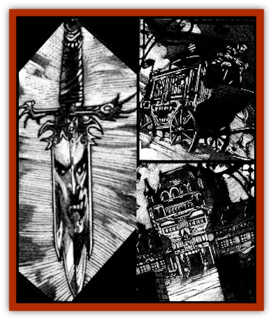

# Animator - General Information

*Hit Dice:* The amount of damage that an animator can sustain before being destroyed is based upon its size and the material from which it is made. The base HD value for an object possessed by an animator is 1 per 10 pounds of weight (rounded up). Thus, an animator controlling a heavy crossbow (14 pounds) has 2 HD.

*Hit Points:* The number of hit points that an animated object has (or Hit Die) is based upon its composition. Simply subtract the object's base AC (as indicated above) from 11 to determine how many hit points an object has per die. Thus, an item made of glass has 1 hit point per die while something fashioned from cast iron has 10. Simply multiply this by the number of Hit Dice that the object has and you'll know how many hit points it has. The crossbow mentioned in the previous example is made of hardwood and would have 6 points per HD for a total of 12 hit points.

**Battling an Animator:** There are three basic ways to combat an animator. The first (and generally the easiest) is to disable the object that it inhabits. Once this is done, an attempt can be made to drive the creature out of its host or even destroy it.

An animator can often be rendered harmless by anchoring the object that it has possessed in some way. The aforementioned crossbow might simply be locked in a safe. This is only a temporary solution for the spirit will simply abandon the object and seek out another one.

Powerful magical spells such as *dispel evil* or *wish* can be used to drive the spirit from its home. This does not prevent the animator from returning to the object later, but that process is quite time-consuming.

The destruction of the object in which an animator resides does not actually harm the creature. However. it does drive it out of the item and forces the creature to seek a new home.

Just as some spells can force the creature to flee the object in which it resides, others can trap it there for a period of time. Only by doing this and then destroying the object that holds the spirit of the animator is it possible to finally kill the creature. The animator can be contained with either a *quest* or *geas* spell, although others might suffice, at the DM's option.

---
## Discovery & Documentation

**Source Publication:** Ravenloft Appendix III (1991)
**Campaign Setting:** Ravenloft
**Author(s):** Kirk Botulla

### Other Creatures Found in This Source Book
   * [[Akikage|Akikage]]
   * [[Animator_Common|Animator, Common]]
   * [[Animator_Greater|Animator, Greater]]
   * [[Animator_Minor|Animator, Minor]]
   * [[Bakhna_Rakhna|Bakhna Rakhna]]
   * [[Baobhan_Sith|Baobhan Sith]]
   * [[Beetle_Scarab|Beetle, Scarab]]
   * [[Boneless|Boneless]]
   * [[Boowray|Boowray]]
   * [[Bruja|Bruja]]
   * [[Carrionette|Carrionette]]
   * [[Carrion_Stalker|Carrion Stalker]]
   * [[Cat_Midnight|Cat, Midnight]]
   * [[Cat_Skeletal|Cat, Skeletal]]
   * [[Cloaker_Resplendent|Cloaker, Resplendent]]
   * [[Cloaker_Shadow|Cloaker, Shadow]]
   * [[Cloaker_Undead|Cloaker, Undead]]
   * [[Corpse_Candle|Corpse Candle]]
   * [[Death's_Head_Tree|Death's Head Tree]]
   * [[Doppelganger_Ravenloft|Doppelganger (Ravenloft)]]
   * [[Familiar_Pseudo-|Familiar, Pseudo-]]
   * [[Familiar_Undead|Familiar, Undead]]
   * [[Feathered_Serpent|Feathered Serpent]]
   * [[Fenhound|Fenhound]]
   * [[Figurine_Ceramic|Figurine, Ceramic]]
   * [[Figurine_Crystal|Figurine, Crystal]]
   * [[Figurine_Ivory|Figurine, Ivory]]
   * [[Figurine_Obsidian|Figurine, Obsidian]]
   * [[Figurine_Porcelain|Figurine, Porcelain]]
   * [[Figurine_General_Information|Figurine, General Information]]
   * [[Fleas_of_Madness|Fleas of Madness]]
   * [[Furies|Furies]]
   * [[Geist|Geist]]
   * [[Ghost_Animal|Ghost, Animal]]
   * [[Golem_Flesh_Ravenloft|Golem, Flesh (Ravenloft)]]
   * [[Golem_Mist_Ravenloft|Golem, Mist (Ravenloft)]]
   * [[Golem_Wax_Ravenloft|Golem, Wax (Ravenloft)]]
   * [[Gremishka|Gremishka]]
   * [[Hag_Spectral|Hag, Spectral]]
   * [[Head_Hunter|Head Hunter]]
   * [[Hearth_Fiend|Hearth Fiend]]
   * [[Hebi-No-Onna|Hebi-No-Onna]]
   * [[Hound_Phantom|Hound, Phantom]]
   * [[Hound_Skeletal|Hound, Skeletal]]
   * [[Imp_Wishing|Imp, Wishing]]
   * [[Ivy_Crawling|Ivy, Crawling]]
   * [[Jack_Frost|Jack Frost]]
   * [[Jolly_Roger|Jolly Roger]]
   * [[Kizoku|Kizoku]]
   * [[Lashweed|Lashweed]]
   * [[Leech_Magical|Leech, Magical]]
   * [[Leech_Psionic|Leech, Psionic]]
   * [[Lich_Defiler|Lich, Defiler]]
   * [[Lich_Drow|Lich, Drow]]
   * [[Lich_Elemental|Lich, Elemental]]
   * [[Lich_Psionic|Lich, Psionic]]
   * [[Living_Tattoo|Living Tattoo]]
   * [[Lycanthrope_Loup-garou|Lycanthrope, Loup-garou]]
   * [[Lycanthrope_Werejackal|Lycanthrope, Werejackal]]
   * [[Lycanthrope_Werejaguar_Ravenloft|Lycanthrope, Werejaguar (Ravenloft)]]
   * [[Lycanthrope_Wereleopard|Lycanthrope, Wereleopard]]
   * [[Lycanthrope_Wereray|Lycanthrope, Wereray]]
   * [[Mist_Ferryman|Mist Ferryman]]
   * [[Moor_Man|Moor Man]]
   * [[Obedient|Obedient]]
   * [[Odem|Odem]]
   * [[Paka|Paka]]
   * [[Plant_Blood_Rose|Plant, Blood Rose]]
   * [[Plant_Fearweed|Plant, Fearweed]]
   * [[Radiant_Spirit|Radiant Spirit]]
   * [[Recluse|Recluse]]
   * [[Remnant_Aquatic|Remnant, Aquatic]]
   * [[Rushlight|Rushlight]]
   * [[Sea_Spawn_Master|Sea Spawn, Master]]
   * [[Sea_Spawn_Minion|Sea Spawn, Minion]]
   * [[Shadow_Asp|Shadow Asp]]
   * [[Shattered_Brethren|Shattered Brethren]]
   * [[Skeleton_Archer|Skeleton, Archer]]
   * [[Skeleton_Insectoid|Skeleton, Insectoid]]
   * [[Skin_Thief|Skin Thief]]
   * [[Spirit_Psionic|Spirit, Psionic]]
   * [[Strahd_Skeleton|Strahd Skeleton]]
   * [[Strahd_Zombie|Strahd Zombie]]
   * [[Unicorn_Shadow|Unicorn, Shadow]]
   * [[Vampire_Drow|Vampire, Drow]]
   * [[Vampire_Nosferatu|Vampire, Nosferatu]]
   * [[Vampire_Oriental|Vampire, Oriental]]
   * [[Virus_General_Information|Virus, General Information]]
   * [[Virus_I|Virus I]]
   * [[Virus_II|Virus II]]
   * [[Virus_III|Virus III]]
   * [[Vorlog|Vorlog]]
   * [[Will_O'Dawn|Will O'Dawn]]
   * [[Will_O'Deep|Will O'Deep]]
   * [[Will_O'Mist|Will O'Mist]]
   * [[Will_O'Sea|Will O'Sea]]
   * [[Zombie_Cannibal|Zombie, Cannibal]]
   * [[Zombie_Desert|Zombie, Desert]]
   * [[Zombie_Wolf|Zombie Wolf]]
   * [[Zombie_Fog|Zombie Fog]]
