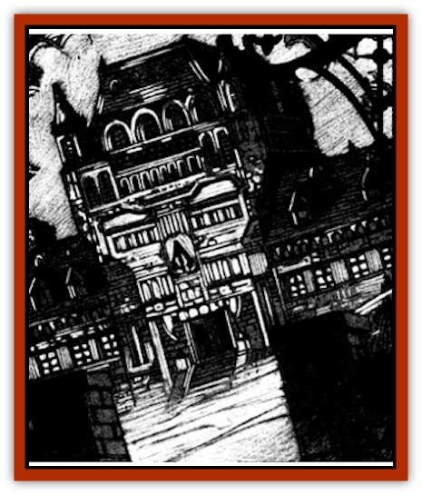

# Animator - Greater

| Statistic | **Animator, Greater** |
| --- | --- |
| **Activity Cycle:** | Any |
| **Alignment:** | Chaotic evil |
| **Armor Class:** | Varies |
| **Climate/Terrain:** | Ravenloft |
| **Damage/Attack:** | 1d12 |
| **Diet:** | Karmic resonances |
| **Frequency:** | Very rare |
| **Hit Dice:** | Varies |
| **Intelligence:** | Exceptional (15-16) |
| **Magic Resistance:** | Nil |
| **Morale:** | Average (8-10) |
| **Movement:** | Nil (with exceptions) |
| **No. Appearing:** | 1 |
| **No. of Attacks:** | 1 |
| **Organization:** | Solitary |
| **Size:** | L+ (12' tall or larger) |
| **Special Attacks:** | Spell ability |
| **Special Defenses:** | Spell immunity |
| **THAC0:** | Varies |
| **Treasure:** | Nil |
| **XP Value:** | Varies |

The strongest of its kind, a greater [[Animator_General_Information|animator]] can inhabit entire buildings or great sailing ships, turning them into vast, living death traps. The terrific power of these creatures enables them to manifest a bizarre array of unusual abilities with which to torment those trapped within their walls. In addition, these mighty animators are able to manifest a wide variety of powerful spelllike abi1ities that make them particularly deadly and unpredictable.

Unlike others of its ilk, the greater animator has the power to communicate once per day. It generally does this in some unusual and shocking manner. For example, an animated house might have walls that bleed and form words or messages. The animator will not converse and its messages are limited to one word per Hit Die. These messages are never real efforts to communicate; rather they are threats or other expressions of the negative emotions upon which the creature feeds.

Any magical or psionic attempt to communicate directly with the mind of an animator fails and requires a madness check. Because of the power of these creatures, however, such attempts also require the person attempting such communication to make a saving throw vs. spell or fall under the effects of a *domination* spell.

**Combat:** The greater animator occupies objects of large or better size. It can operate all of the moving parts of the object it occupies and does so as if it had the strength of a hill giant (19). Thus, a house occupied by an animator could deliver a crushing blow by slamming someone in a door, and an animated ship could probably turn the wheel to go where it wanted despite the best efforts of the helmsman to hold a steady course.

When an animator is capable of making a direct attack on someone, a typical blow will cause 1d12 points of damage. Under special circumstances, the damage might be more or a saving throw might be required to avoid additional injury. A sailor in the crow's-nest of a ship might find himself struck by part of the mast and forced to make a saving throw or ability check to avoid falling to the deck.

In addition, the greater animator has a large number of spell-like abilities that it can use at its will. Every greater animator may use the following spell-like abilities twice per day as if cast by a 12th level spell wizard or priest: *animate dead*, *animate object*, *weather summoning*, *control temperature 10' radius*, *control winds*, *cantrip*, *summon swarm*, *summon insects*. The use of the *animate object* spell by these creatures is limited to items that are native to the space it has inhabited. Thus, a greater animator could mobilize any of the furniture or utensils in the house but could not affect objects brought into the house by adventurers. The greater animator may use *animate dead* to mobilize skeletons and corpses that lie buried beneath it or die on its premises.

Animators of all types are immune to any form of mind- or biology-affecting spells and attacks. Thus, they cannot be *charmed*, *held*, or poisoned. The nature of the object in which the animator resides dictates its vulnerability to other forms of attack.

**Habitat/Society:** Greater animators display the same emotional volatility as their [[Animator_Minor|minor]] and [[Animator_Common|common]] cousins. They tend to be less cunning and deceptive in their evil deeds, however, employing their great strength and spell abilities simply to crush and devastate their enemies.

**Ecology:** Like all animators, the greater animator thrives upon the powerful emotions of the living. Because of its more pronounced hunger, this creature will often go to great lengths to induce fear in its victims before killing them.

---
## Discovery & Documentation

**Source Publication:** Ravenloft Appendix III (1991)
**Campaign Setting:** Ravenloft
**Author(s):** Kirk Botulla

### Other Creatures Found in This Source Book
   * [[Akikage|Akikage]]
   * [[Animator_Common|Animator, Common]]
   * [[Animator_Minor|Animator, Minor]]
   * [[Animator_General_Information|Animator, General Information]]
   * [[Bakhna_Rakhna|Bakhna Rakhna]]
   * [[Baobhan_Sith|Baobhan Sith]]
   * [[Beetle_Scarab|Beetle, Scarab]]
   * [[Boneless|Boneless]]
   * [[Boowray|Boowray]]
   * [[Bruja|Bruja]]
   * [[Carrionette|Carrionette]]
   * [[Carrion_Stalker|Carrion Stalker]]
   * [[Cat_Midnight|Cat, Midnight]]
   * [[Cat_Skeletal|Cat, Skeletal]]
   * [[Cloaker_Resplendent|Cloaker, Resplendent]]
   * [[Cloaker_Shadow|Cloaker, Shadow]]
   * [[Cloaker_Undead|Cloaker, Undead]]
   * [[Corpse_Candle|Corpse Candle]]
   * [[Death's_Head_Tree|Death's Head Tree]]
   * [[Doppelganger_Ravenloft|Doppelganger (Ravenloft)]]
   * [[Familiar_Pseudo-|Familiar, Pseudo-]]
   * [[Familiar_Undead|Familiar, Undead]]
   * [[Feathered_Serpent|Feathered Serpent]]
   * [[Fenhound|Fenhound]]
   * [[Figurine_Ceramic|Figurine, Ceramic]]
   * [[Figurine_Crystal|Figurine, Crystal]]
   * [[Figurine_Ivory|Figurine, Ivory]]
   * [[Figurine_Obsidian|Figurine, Obsidian]]
   * [[Figurine_Porcelain|Figurine, Porcelain]]
   * [[Figurine_General_Information|Figurine, General Information]]
   * [[Fleas_of_Madness|Fleas of Madness]]
   * [[Furies|Furies]]
   * [[Geist|Geist]]
   * [[Ghost_Animal|Ghost, Animal]]
   * [[Golem_Flesh_Ravenloft|Golem, Flesh (Ravenloft)]]
   * [[Golem_Mist_Ravenloft|Golem, Mist (Ravenloft)]]
   * [[Golem_Wax_Ravenloft|Golem, Wax (Ravenloft)]]
   * [[Gremishka|Gremishka]]
   * [[Hag_Spectral|Hag, Spectral]]
   * [[Head_Hunter|Head Hunter]]
   * [[Hearth_Fiend|Hearth Fiend]]
   * [[Hebi-No-Onna|Hebi-No-Onna]]
   * [[Hound_Phantom|Hound, Phantom]]
   * [[Hound_Skeletal|Hound, Skeletal]]
   * [[Imp_Wishing|Imp, Wishing]]
   * [[Ivy_Crawling|Ivy, Crawling]]
   * [[Jack_Frost|Jack Frost]]
   * [[Jolly_Roger|Jolly Roger]]
   * [[Kizoku|Kizoku]]
   * [[Lashweed|Lashweed]]
   * [[Leech_Magical|Leech, Magical]]
   * [[Leech_Psionic|Leech, Psionic]]
   * [[Lich_Defiler|Lich, Defiler]]
   * [[Lich_Drow|Lich, Drow]]
   * [[Lich_Elemental|Lich, Elemental]]
   * [[Lich_Psionic|Lich, Psionic]]
   * [[Living_Tattoo|Living Tattoo]]
   * [[Lycanthrope_Loup-garou|Lycanthrope, Loup-garou]]
   * [[Lycanthrope_Werejackal|Lycanthrope, Werejackal]]
   * [[Lycanthrope_Werejaguar_Ravenloft|Lycanthrope, Werejaguar (Ravenloft)]]
   * [[Lycanthrope_Wereleopard|Lycanthrope, Wereleopard]]
   * [[Lycanthrope_Wereray|Lycanthrope, Wereray]]
   * [[Mist_Ferryman|Mist Ferryman]]
   * [[Moor_Man|Moor Man]]
   * [[Obedient|Obedient]]
   * [[Odem|Odem]]
   * [[Paka|Paka]]
   * [[Plant_Blood_Rose|Plant, Blood Rose]]
   * [[Plant_Fearweed|Plant, Fearweed]]
   * [[Radiant_Spirit|Radiant Spirit]]
   * [[Recluse|Recluse]]
   * [[Remnant_Aquatic|Remnant, Aquatic]]
   * [[Rushlight|Rushlight]]
   * [[Sea_Spawn_Master|Sea Spawn, Master]]
   * [[Sea_Spawn_Minion|Sea Spawn, Minion]]
   * [[Shadow_Asp|Shadow Asp]]
   * [[Shattered_Brethren|Shattered Brethren]]
   * [[Skeleton_Archer|Skeleton, Archer]]
   * [[Skeleton_Insectoid|Skeleton, Insectoid]]
   * [[Skin_Thief|Skin Thief]]
   * [[Spirit_Psionic|Spirit, Psionic]]
   * [[Strahd_Skeleton|Strahd Skeleton]]
   * [[Strahd_Zombie|Strahd Zombie]]
   * [[Unicorn_Shadow|Unicorn, Shadow]]
   * [[Vampire_Drow|Vampire, Drow]]
   * [[Vampire_Nosferatu|Vampire, Nosferatu]]
   * [[Vampire_Oriental|Vampire, Oriental]]
   * [[Virus_General_Information|Virus, General Information]]
   * [[Virus_I|Virus I]]
   * [[Virus_II|Virus II]]
   * [[Virus_III|Virus III]]
   * [[Vorlog|Vorlog]]
   * [[Will_O'Dawn|Will O'Dawn]]
   * [[Will_O'Deep|Will O'Deep]]
   * [[Will_O'Mist|Will O'Mist]]
   * [[Will_O'Sea|Will O'Sea]]
   * [[Zombie_Cannibal|Zombie, Cannibal]]
   * [[Zombie_Desert|Zombie, Desert]]
   * [[Zombie_Wolf|Zombie Wolf]]
   * [[Zombie_Fog|Zombie Fog]]
