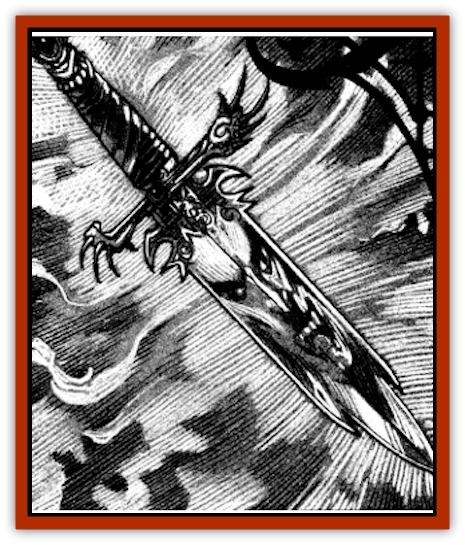

# Animator - Minor

| Statistic | **Animator, Minor** |
| --- | --- |
| **Activity Cycle:** | Any |
| **Alignment:** | Chaotic evil |
| **Armor Class:** | Varies |
| **Climate/Terrain:** | Ravenloft |
| **Damage/Attack:** | 1d4 |
| **Diet:** | Karmic resonances |
| **Frequency:** | Very rare |
| **Hit Dice:** | Varies |
| **Intelligence:** | Exceptional (15-16) |
| **Magic Resistance:** | Nil |
| **Morale:** | Average (8-10) |
| **Movement:** | 9 |
| **No. Appearing:** | 1 |
| **No. of Attacks:** | 1 |
| **Organization:** | Solitary |
| **Size:** | T to S (1&rdquo; to 4') |
| **Special Attacks:** | Nil |
| **Special Defenses:** | Spell immunity |
| **THAC0:** | Varies |
| **Treasure:** | Nil |
| **XP Value:** | Varies |

As the weakest of its kind, a minor [[Animator_General_Information|animator]] can only take control of small objects. Thus, a minor animator might possess a clay mug and cause it to topple over, spilling the hot coffee within onto its target. This type of creature is seldom deadly, but can be menacing if it gains control of a weapon or other dangerous object. Objects controlled by a minor animator gain no special abilities.

The true appearance of animators remains a mystery. When these creatures are not in control of a physical object, they are utterly insubstantial and invisible. It is probable that they would seem vaporous to someone able to detect invisible things when forced out of their host object.

Minor animators have no language, and any magical attempt to communicate with them is doomed to failure. Those who attempt to achieve some manner of telepathic contact with the animator will find that its mind is utterly unlike that of a human or demihuman, thus forcing the psionicist to make a madness check.

**Combat:** Minor animators can only possess objects of tiny or small size. This greatly limits the amount of damage the creatures can inflict in combat. Thus, they tend to inhabit things that are inherently very dangerous. Examples include a dagger, shaving razor, leather garotte, or knitting needle.

Minor animators are seldom engaged in direct combat. Their limited motive powers force them to be more subtle. Thus, a length of rope controlled by an animator might coil itself around the neck of a sleeping victim or a kitchen knife might topple off a counter and impale someone's foot.

Animators vary wildly in their capacity to inflict harm on their targets. As a rule, minor animators are unable to inflict more than 1d4 points of damage from any attack they make. There are exceptions, of course, but this is a good guideline. For example, an animated rope might trip someone and cause him to tumble down a flight of stairs. This could cause much more damage and might even require the victim to make a saving throw to escape serious injury.

Animators of all types are immune to any form of mind- or biology-affecting spells and attacks. Thus, they cannot be *charmed*, *held*, or poisoned. The nature of the object in which the animator resides dictates its vulnerability to other forms of attack.

**Habitat/Society:** Minor animators can possess any type of ordinary object. A rope, a bucket, a dagger, or a pillow may become the home of one of these impulsive spirits. Because of its evil nature, the animator will generally attempt to lake control of items that can cause injury.

Minor animators are the most volatile and least predictable of their kind, making up for their limited power by being exceptionally evil and terribly cunning. Well aware of the fact that they can seldom make effective direct attacks, they strike at their victims obliquely. A thief adventurer whose dagger has been possessed by an animator may awake one morning to discover that his weapon is buried in the back of a rival party member. Since the weapon doesn't appear to be enchanted, even with the casting of a *detect magic* spell, the innocent rogue is likely to come under suspicion for the crime.

Minor animators are also intelligent enough to play dumb when it is appropriate. Since it is unlikely to be detected until it chooses to act, the creature knows that it can simply lie in wait for a perfect opportunity to strike.

**Ecology:** The common animator seems to thrive on existing and residual emotions generated by other creatures. Exactly how it derives nourishment from these vibrations is unknown to even the wisest of sages.

Almost nothing is known about whether these creatures interact with one another or have any sort of social structure. It seems unlikely that they do. As they are not undead, it seems likely that they must reproduce in some way, although no evidence exists to suggest what that might be.

---
## Discovery & Documentation

**Source Publication:** Ravenloft Appendix III (1991)
**Campaign Setting:** Ravenloft
**Author(s):** Kirk Botulla

### Other Creatures Found in This Source Book
   * [[Akikage|Akikage]]
   * [[Animator_Common|Animator, Common]]
   * [[Animator_Greater|Animator, Greater]]
   * [[Animator_General_Information|Animator, General Information]]
   * [[Bakhna_Rakhna|Bakhna Rakhna]]
   * [[Baobhan_Sith|Baobhan Sith]]
   * [[Beetle_Scarab|Beetle, Scarab]]
   * [[Boneless|Boneless]]
   * [[Boowray|Boowray]]
   * [[Bruja|Bruja]]
   * [[Carrionette|Carrionette]]
   * [[Carrion_Stalker|Carrion Stalker]]
   * [[Cat_Midnight|Cat, Midnight]]
   * [[Cat_Skeletal|Cat, Skeletal]]
   * [[Cloaker_Resplendent|Cloaker, Resplendent]]
   * [[Cloaker_Shadow|Cloaker, Shadow]]
   * [[Cloaker_Undead|Cloaker, Undead]]
   * [[Corpse_Candle|Corpse Candle]]
   * [[Death's_Head_Tree|Death's Head Tree]]
   * [[Doppelganger_Ravenloft|Doppelganger (Ravenloft)]]
   * [[Familiar_Pseudo-|Familiar, Pseudo-]]
   * [[Familiar_Undead|Familiar, Undead]]
   * [[Feathered_Serpent|Feathered Serpent]]
   * [[Fenhound|Fenhound]]
   * [[Figurine_Ceramic|Figurine, Ceramic]]
   * [[Figurine_Crystal|Figurine, Crystal]]
   * [[Figurine_Ivory|Figurine, Ivory]]
   * [[Figurine_Obsidian|Figurine, Obsidian]]
   * [[Figurine_Porcelain|Figurine, Porcelain]]
   * [[Figurine_General_Information|Figurine, General Information]]
   * [[Fleas_of_Madness|Fleas of Madness]]
   * [[Furies|Furies]]
   * [[Geist|Geist]]
   * [[Ghost_Animal|Ghost, Animal]]
   * [[Golem_Flesh_Ravenloft|Golem, Flesh (Ravenloft)]]
   * [[Golem_Mist_Ravenloft|Golem, Mist (Ravenloft)]]
   * [[Golem_Wax_Ravenloft|Golem, Wax (Ravenloft)]]
   * [[Gremishka|Gremishka]]
   * [[Hag_Spectral|Hag, Spectral]]
   * [[Head_Hunter|Head Hunter]]
   * [[Hearth_Fiend|Hearth Fiend]]
   * [[Hebi-No-Onna|Hebi-No-Onna]]
   * [[Hound_Phantom|Hound, Phantom]]
   * [[Hound_Skeletal|Hound, Skeletal]]
   * [[Imp_Wishing|Imp, Wishing]]
   * [[Ivy_Crawling|Ivy, Crawling]]
   * [[Jack_Frost|Jack Frost]]
   * [[Jolly_Roger|Jolly Roger]]
   * [[Kizoku|Kizoku]]
   * [[Lashweed|Lashweed]]
   * [[Leech_Magical|Leech, Magical]]
   * [[Leech_Psionic|Leech, Psionic]]
   * [[Lich_Defiler|Lich, Defiler]]
   * [[Lich_Drow|Lich, Drow]]
   * [[Lich_Elemental|Lich, Elemental]]
   * [[Lich_Psionic|Lich, Psionic]]
   * [[Living_Tattoo|Living Tattoo]]
   * [[Lycanthrope_Loup-garou|Lycanthrope, Loup-garou]]
   * [[Lycanthrope_Werejackal|Lycanthrope, Werejackal]]
   * [[Lycanthrope_Werejaguar_Ravenloft|Lycanthrope, Werejaguar (Ravenloft)]]
   * [[Lycanthrope_Wereleopard|Lycanthrope, Wereleopard]]
   * [[Lycanthrope_Wereray|Lycanthrope, Wereray]]
   * [[Mist_Ferryman|Mist Ferryman]]
   * [[Moor_Man|Moor Man]]
   * [[Obedient|Obedient]]
   * [[Odem|Odem]]
   * [[Paka|Paka]]
   * [[Plant_Blood_Rose|Plant, Blood Rose]]
   * [[Plant_Fearweed|Plant, Fearweed]]
   * [[Radiant_Spirit|Radiant Spirit]]
   * [[Recluse|Recluse]]
   * [[Remnant_Aquatic|Remnant, Aquatic]]
   * [[Rushlight|Rushlight]]
   * [[Sea_Spawn_Master|Sea Spawn, Master]]
   * [[Sea_Spawn_Minion|Sea Spawn, Minion]]
   * [[Shadow_Asp|Shadow Asp]]
   * [[Shattered_Brethren|Shattered Brethren]]
   * [[Skeleton_Archer|Skeleton, Archer]]
   * [[Skeleton_Insectoid|Skeleton, Insectoid]]
   * [[Skin_Thief|Skin Thief]]
   * [[Spirit_Psionic|Spirit, Psionic]]
   * [[Strahd_Skeleton|Strahd Skeleton]]
   * [[Strahd_Zombie|Strahd Zombie]]
   * [[Unicorn_Shadow|Unicorn, Shadow]]
   * [[Vampire_Drow|Vampire, Drow]]
   * [[Vampire_Nosferatu|Vampire, Nosferatu]]
   * [[Vampire_Oriental|Vampire, Oriental]]
   * [[Virus_General_Information|Virus, General Information]]
   * [[Virus_I|Virus I]]
   * [[Virus_II|Virus II]]
   * [[Virus_III|Virus III]]
   * [[Vorlog|Vorlog]]
   * [[Will_O'Dawn|Will O'Dawn]]
   * [[Will_O'Deep|Will O'Deep]]
   * [[Will_O'Mist|Will O'Mist]]
   * [[Will_O'Sea|Will O'Sea]]
   * [[Zombie_Cannibal|Zombie, Cannibal]]
   * [[Zombie_Desert|Zombie, Desert]]
   * [[Zombie_Wolf|Zombie Wolf]]
   * [[Zombie_Fog|Zombie Fog]]
