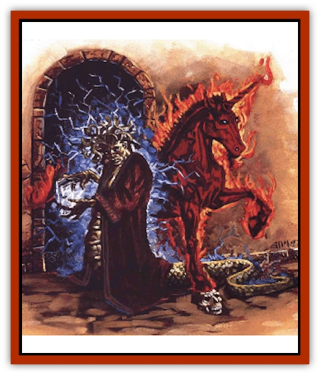

# Animental

| Statistic | **Animental** |
| --- | --- |
| **Activity Cycle:** | Any |
| **Alignment:** | Neutral |
| **Armor Class:** | Varies |
| **Climate/Terrain:** | Inner Planes |
| **Damage/Attack:** | Varies |
| **Diet:** | Varies (usually carnivorous) |
| **Frequency:** | Common (animals), rare (monsters) |
| **Hit Dice:** | Varies |
| **Intelligence:** | Varies |
| **Magic Resistance:** | Nil |
| **Morale:** | Varies |
| **Movement:** | Varies |
| **No. Appearing:** | Varies (usually 1) |
| **No. of Attacks:** | Varies |
| **Organization:** | Varies (usually solitary) |
| **Size:** | Varies |
| **Special Attacks:** | Varies |
| **Special Defenses:** | Varies |
| **THAC0:** | Varies |
| **Treasure:** | Nil |
| **XP Value:** | Varies |

It's said that the Elemental Planes shape the Prime Material Plane, forming the basis for all things found there. Sometimes, however, it works the other way.

See, when an animal dies on the Prime, its spirit usually wends its way to the Outer Plane that most closely matches the alignment or devotion it had while alive (often, the Beastlands). Sometimes, though, a portion of the deader's life energy is left over, and it passes through to the Inner Planes instead - most likely shunted through a vortex leading to one of the Elemental Planes. The residual force finds its way to a new plane of primal energy and matter, where, like a reflection in a pond, it creates a duplicate or the beast it once animated on the Prime. The new form - known as an animental - is composed of whatever element is at hand.

Thus, inner-planar travelers have encountered [[Bird|birds]] made of fire, [[Snake|snakes]] made of smoke, [[Wolf|wolves]] made of water, and elk made of ice. But animentals can resemble monsters, too, though it happens a bit more rarely. A planewalker might find a [[Griffon|griffon]] composed of minerals, a [[Basilisk|basilisk]] formed from air, or a [[Dragon_General_Information|dragon]] made of lightning. The combinations are usually surprising, and only rarely make "logical" sense. For example, most folks'd expect an animental [[Fish|fish]] to be shaped out of water or a bird to be made from air, but such combinations occur no more frequently than any other.

For reasons no graybeards yet tumbled to, no one's ever seen elemental humanoids created in this fashion. The Inner Planes just don't seem to spawn counterparts for humans, elves, dwarves, or even monsters like [[Orc|orcs]], [[Gnoll|gnolls]], and [[Ogre|ogres]]. But that doesn't stop berks from rattling their bone-boxes. One well-known rumor talks about animental giants, but no proofs been given to date. Still, chant has it that animental humanoids *do* exist and are, in fact, the true progenitors of [[Genie|geniekind]]. Others say that the reason no one's run into animental humanoids is that they'd all rounded up by [[Genie|dao]] slavers. Both of these rumors seem extraordinarily far-fetched.

**Combat:** In general, an animental fights in the same manner as the actual beast it represents. In almost every way, however, it's slightly superior to its prime-material counterpart.

While the animental's Hit Dice, THAC0, number of attacks, and Intelligence all remain the same, it usually inflicts greater damage and has a better Armor Class. First of all, the creature's physical attacks are enhanced by its new composition, whether it's due to heat from flame, steam, or magma; the choking fumes of smoke or ash; the impact of stony earth or forceful air; and so on. Thus, all damage per attack is increased by an additional 1d4 points for animentals of size S or M, 1d6 points for animentals of size L and 1d8 points for those even larger. The creature's new composition enhances its natural defenses, too - the animental's Armor Class improves by two steps (due to the noncorporeal nature of flame or steam, the protection of hardy earth or mineral, and so on).

Special attacks involving elements, such as a petrifying gaze (stone) or flaming breath (fire), are retained only if the animental is composed of the appropriate element. If the creature can't use the special attack, approximately 25% of the time it adopts a new and more appropriate power. For example, a [[Medusa|medusa]] made of fire might turn her victims into pillars of flame via her gaze (or, perhaps, simply into volcanic obsidian or ash). A [[Dragon_Chromatic_Blue|blue dragon]] that's become a beast of ooze might see its lightning breath replaced by a gout of corrosive slime.

The animental has about a 50% chance of retaining other special abilities - such as poison, regeneration, disease, and so forth - and a 30% chance of retaining spell-like abilities.

All animentals can fly or swim through their respective element without difficulty, but they otherwise move at the normal rate for the prime-material creature they mirror.

When slain, animentals revert to their component elements (a stone [[Bat|bat]] crumbles to pebbles, a smoke [[Dragonne|dragonne]] fades away, and so on), leaving no trace that they ever existed.

**Habitat/Society:** Being creatures that exist as imitations of life rather than as true life, these beasts have no real culture. They're truly natives of their own elements, unable to leave their home planes except in the most special of circumstances (such as when summoned by a rare spell into an area that has large amounts of their respective element). Most other elemental beings ignore animentals as phantoms, though a few employ them as guards or pets.

Remember, though, that not all animentals are "dumb" beasts. They keep the same Intelligence they had when they lived as real creatures. That means that if the original, flesh-and-blood being was able to communicate in some manner (speech, telepathy, or the like), the animental can do the same.

**Ecology:** Animentals are aberrations, an exception to all the rules; they fit into the strange ecologies of the Inner Planes as best they can. Because most of those planes have no plant life, even "normally" herbivorous beasts become meat-eaters, preying upon visitors or other inhabitants found there.

The point should be made that animentals are no longer the creatures they were, no longer made of flesh and blood, no longer slaves to terrestrial natures. They've become beasts of elemental energy and matter - only their appearances still bring to mind the animals or monsters they used to be. Many graybeards theorize that animentals aren't even living beings in the truest sense, and are, in fact, little more than reflections of life, with no more substance than images in a mirror. This might be overstating the point, but the essence of the statement gives a body something to rattle about in his brain-box.

---
## Discovery & Documentation

**Source Publication:** Planescape III (1996)
**Campaign Setting:** Planescape
**Author(s):** Monte Cook

### Other Creatures Found in This Source Book
   * [[Archomental_Evil|Archomental, Evil]]
   * [[Archomental_Good|Archomental, Good]]
   * [[Belker|Belker]]
   * [[Bzastra|Bzastra]]
   * [[Chososion|Chososion]]
   * [[Darklight|Darklight]]
   * [[Devete|Devete]]
   * [[Devourer_Planescape|Devourer (Planescape)]]
   * [[Dharum_Suhn|Dharum Suhn]]
   * [[Egarus|Egarus]]
   * [[Elemental_Athas_Lesser_Air_Earth|Elemental (Athas), Lesser, Air/Earth]]
   * [[Elemental_Athas_Lesser_Fire_Water|Elemental (Athas), Lesser, Fire/Water]]
   * [[Elemental_Fire_Kin_Salamander_II|Elemental, Fire Kin, Salamander II]]
   * [[Entrope|Entrope]]
   * [[Facet|Facet]]
   * [[Frost_Salamander|Frost Salamander]]
   * [[Fundamental_Air_Earth|Fundamental, Air/Earth]]
   * [[Fundamental_Fire_Water|Fundamental, Fire/Water]]
   * [[Fundamental_All_Elements|Fundamental, All Elements]]
   * [[Garmorm|Garmorm]]
   * [[Homunculus_Elemental|Homunculus, Elemental]]
   * [[Immoth|Immoth]]
   * [[Khargra|Khargra]]
   * [[Klyndes|Klyndes]]
   * [[Magran|Magran]]
   * [[Menglis|Menglis]]
   * [[Nathri|Nathri]]
   * [[Ooze_Sprite|Ooze Sprite]]
   * [[Paraelemental|Paraelemental]]
   * [[Phirblas|Phirblas]]
   * [[Psurlon|Psurlon]]
   * [[Quasielemental_Negative|Quasielemental, Negative]]
   * [[Quasielemental_Positive|Quasielemental, Positive]]
   * [[Rast|Rast]]
   * [[Ravid|Ravid]]
   * [[Ruvoka|Ruvoka]]
   * [[Scile|Scile]]
   * [[Shad|Shad]]
   * [[Shocker|Shocker]]
   * [[Sislan|Sislan]]
   * [[Suisseen|Suisseen]]
   * [[Terithran|Terithran]]
   * [[Thoqqua|Thoqqua]]
   * [[Trilloch|Trilloch]]
   * [[Tsnng|Tsnng]]
   * [[Ungulosin|Ungulosin]]
   * [[Vacuous|Vacuous]]
   * [[Wavefire|Wavefire]]
   * [[Xag-Ya_Xeg-Yi|Xag-Ya/Xeg-Yi]]
   * [[Xill|Xill]]
