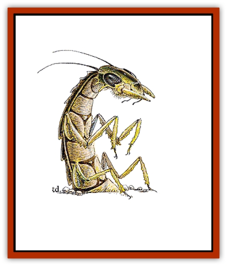

# Ankheg

| Statistic | **Ankheg** |
| --- | --- |
| **Activity Cycle:** | Any |
| **Alignment:** | Neutral |
| **Armor Class:** | Overall 2, underside 4 |
| **Climate/Terrain:** | Temperate and tropical/Plains and forests |
| **Damage/Attack:** | 3-18 (crush)+1-4 (acid) |
| **Diet:** | Omnivore |
| **Frequency:** | Rare |
| **Hit Dice:** | 3-8 |
| **Intelligence:** | Non- (0) |
| **Magic Resistance:** | Nil |
| **Morale:** | Average (9) |
| **Movement:** | 12, Br 6 |
| **No. Appearing:** | 1-6 |
| **No. of Attacks:** | 1 |
| **Organization:** | Brood |
| **Size:** | L-H (10-20' long) |
| **Special Attacks:** | Squirt acid |
| **Special Defenses:** | Nil |
| **THAC0:** | 17-13 |
| **Treasure:** | C |
| **XP Value:** | 175-975 |

The ankheg is a burrowing monster usually found in forests or choice agricultural land. Because of its fondness for fresh meat, the ankheg is a threat to any creature unfortunate enough to encounter it.

The ankheg resembles an enormous many-legged worm. Its six legs end in sharp hooks suitable for burrowing and grasping, and its powerful mandibles are capable of snapping a small tree in half with a single bite. A tough chitinous shell, usually brown or yellow, covers its entire body except for its soft pink belly. The ankheg has glistening black eyes, a small mouth lined with tiny rows of chitinous teeth, and two sensitive antennae that can detect movement of man-sized creatures up to 300 feet away.

**Combat:** The ankheg's preferred attack method is to lie 5 to 10 feet below the surface of the ground until its antennae detect the approach of a victim. It then burrows up beneath the victim and attempts to grab him in its mandibles, crushing and grinding for 3d6 points of damage per round while secreting acidic digestive enzymes to cause an additional 1d4 points of damage per round until the victim is dissolved. The ankheg can squirt a stream of acidic enzymes once every six hours to a distance of 30 feet. However, since it is unable to digest food for six hours after it squirts enzymes, it uses this attack technique only when desperate. A victim struck by the stream of acidic enzymes suffers 8d4 points of damage (half damage if the victim rolls a successful saving throw vs. poison).

**Habitat/Society:** The ankheg uses its mandibles to continuously dig winding tunnels 30-40 feet deep in the rich soil of forests or farmlands. The hollowed end of a tunnel serves as a temporary lair for sleeping, eating, or hibernating. When an ankheg exhausts the food supply in a particular forest or field, it moves on to another.

Autumn is mating season for ankhegs. After the male fertilizes the female, the female kills him and deposits 2d6 fertilized eggs in his body. Within a few weeks, about 75% of the eggs hatch and begin feeding. In a year, the young ankhegs resemble adults and can function independently. Young ankhegs have 2 Hit Dice and an AC 2 overall and an AC 4 for their undersides; they bite for 1d4 points of damage (with an additional 1d4 points of damage from enzyme secretions), and spit for 4d4 points of damage to a distance of 30 feet. In every year thereafter, the ankheg functions with full adult capabilities and gains an additional Hit Die until it reaches 8 Hit Dice.

Beginning in its second year of life, the ankheg sheds its chitinous shell just before the onset of winter. It takes the ankheg two days to shed its old shell and two weeks to grow a new one. During this time, the sluggish ankheg is exceptionally vulnerable. Its overall AC is reduced to 5 and its underside AC is reduced to 7. Additionally, it moves at only half its normal speed, its mandible attack inflicts only 1d10 points of damage, and it is unable to squirt acidic enzymes. While growing a new shell, it protects itself by hiding in a deep tunnel and secreting a repulsive fluid that smells like rotten fruit. Though the aroma discourages most creatures, it can also pinpoint the ankheg's location for human hunters and desperately hungry predators.

Ankhegs living in cold climates hibernate during the winter. Within a month after the first snowfall, the ankheg fashions a lair deep within the warm earth where it remains dormant until spring. The hibernating ankheg requires no food, subsisting instead on nutrients stored in its shell. The ankheg does not secrete aromatic fluid during this time and is thus relatively safe from detection. Though the ankheg's metabolism is reduced, its antennae remain functional, able to alert it to the approach of an intruder. A disturbed ankheg fully awakens in 1d4 rounds, after which time it can attack and move normally.

The ankheg does not hoard treasure. Items that were not dissolved by the acidic enzymes fall where they drop from the ankheg's mandibles and can be found scattered throughout its tunnel system.

**Ecology:** Though a hungry ankheg can be fatal to a farmer, it can be quite beneficial to the farmland. Its tunnel system laces the soil with passages for air and water, while the ankheg's waste products add rich nutrients. The ankheg will eat decayed organic matter in the earth, but it prefers fresh meat. All but the fiercest predators avoid ankhegs. Dried and cured ankheg shells can be made into armor with an AC of 2, and its digestive enzymes can be used as regular acid.

---
## Discovery & Documentation

**Source Publication:** Monstrous Manual (1995)
**Campaign Setting:** Advanced Dungeons & Dragons 2nd Edition
**Author(s):** Tim Beach

### Other Creatures Found in This Source Book
   * [[Aarakocra|Aarakocra]]
   * [[Aboleth|Aboleth]]
   * [[Arcane|Arcane]]
   * [[Argos|Argos]]
   * [[Aurumvorax|Aurumvorax]]
   * [[Baatezu_Lesser_Abishai|Baatezu, Lesser, Abishai]]
   * [[Baatezu_General_Information|Baatezu, General Information]]
   * [[Baatezu_Greater_Pit_Fiend|Baatezu, Greater, Pit Fiend]]
   * [[Banshee|Banshee]]
   * [[Basilisk|Basilisk]]
   * [[Bat|Bat]]
   * [[Bear|Bear]]
   * [[Beetle_Giant|Beetle, Giant]]
   * [[Behir|Behir]]
   * [[Beholder_and_Beholder-kin_I|Beholder and Beholder-kin I]]
   * [[Beholder_and_Beholder-kin_II|Beholder and Beholder-kin II]]
   * [[Bird|Bird]]
   * [[Brain_Mole|Brain Mole]]
   * [[Broken_One|Broken One]]
   * [[Brownie|Brownie]]
   * [[Bugbear|Bugbear]]
   * [[Bulette|Bulette]]
   * [[Bullywug|Bullywug]]
   * [[Carrion_Crawler|Carrion Crawler]]
   * [[Cat_Great|Cat, Great]]
   * [[Catoblepas|Catoblepas]]
   * [[Cat_Small|Cat, Small]]
   * [[Cave_Fisher|Cave Fisher]]
   * [[Centaur|Centaur]]
   * [[Centipede|Centipede]]
   * [[Chimera|Chimera]]
   * [[Cloaker|Cloaker]]
   * [[Cockatrice|Cockatrice]]
   * [[Couatl|Couatl]]
   * [[Crabman|Crabman]]
   * [[Crawling_Claw|Crawling Claw]]
   * [[Crocodile|Crocodile]]
   * [[Crustacean_Giant|Crustacean, Giant]]
   * [[Crypt_Thing|Crypt Thing]]
   * [[Death_Knight|Death Knight]]
   * [[Deepspawn|Deepspawn]]
   * [[Dinosaur_I|Dinosaur I]]
   * [[Displacer_Beast|Displacer Beast]]
   * [[Dog|Dog]]
   * [[Dog_Moon|Dog, Moon]]
   * [[Dolphin|Dolphin]]
   * [[Doppelganger|Doppelganger]]
   * [[Dracolich|Dracolich]]
   * [[Dragon_Brown|Dragon, Brown]]
   * [[Dragon_Chromatic_Black|Dragon, Chromatic, Black]]
   * [[Dragon_Chromatic_Blue|Dragon, Chromatic, Blue]]
   * [[Dragon_Chromatic_Green|Dragon, Chromatic, Green]]
   * [[Dragon_Cloud|Dragon, Cloud]]
   * [[Dragon_Chromatic_Red|Dragon, Chromatic, Red]]
   * [[Dragon_Chromatic_White|Dragon, Chromatic, White]]
   * [[Dragon_Deep|Dragon, Deep]]
   * [[Dragon_Gem_Amethyst|Dragon, Gem, Amethyst]]
   * [[Dragon_Gem_Crystal|Dragon, Gem, Crystal]]
   * [[Dragon_Gem_Emerald|Dragon, Gem, Emerald]]
   * [[Dragon_Gem_Sapphire|Dragon, Gem, Sapphire]]
   * [[Dragon_Gem_Topaz|Dragon, Gem, Topaz]]
   * [[Dragon_Metallic_Brass|Dragon, Metallic, Brass]]
   * [[Dragon_Metallic_Bronze|Dragon, Metallic, Bronze]]
   * [[Dragon_Metallic_Copper|Dragon, Metallic, Copper]]
   * [[Dragon_Mercury|Dragon, Mercury]]
   * [[Dragon_Metallic_Gold|Dragon, Metallic, Gold]]
   * [[Dragon_Mist|Dragon, Mist]]
   * [[Dragon_Metallic_Silver|Dragon, Metallic, Silver]]
   * [[Dragon_General_Information|Dragon, General Information]]
   * [[Dragon_Shadow|Dragon, Shadow]]
   * [[Dragon_Steel|Dragon, Steel]]
   * [[Dragon_Yellow|Dragon, Yellow]]
   * [[Dragonne|Dragonne]]
   * [[Dragon_Turtle|Dragon Turtle]]
   * [[Dragonet_Faerie_Dragon|Dragonet, Faerie Dragon]]
   * [[Dragonet_Fire_Drake|Dragonet, Fire Drake]]
   * [[Dragonet_Pseudodragon|Dragonet, Pseudodragon]]
   * [[Dryad|Dryad]]
   * [[Dwarf_Derro|Dwarf, Derro]]
   * [[Dwarf|Dwarf]]
   * [[Elemental_Athas_General_Information|Elemental (Athas), General Information]]
   * [[Elemental_Air_Kin|Elemental, Air Kin]]
   * [[Elemental_Earth_Kin|Elemental, Earth Kin]]
   * [[Elemental_Fire_Kin|Elemental, Fire Kin]]
   * [[Elemental_Water_Kin|Elemental, Water Kin]]
   * [[Elemental_of_Chaos_Air_Earth|Elemental of Chaos, Air/Earth]]
   * [[Elemental_of_Chaos_Fire_Water|Elemental of Chaos, Fire/Water]]
   * [[Elemental_Composite|Elemental, Composite]]
   * [[Elemental_Air_Earth|Elemental, Air/Earth]]
   * [[Elemental_Fire_Water|Elemental, Fire/Water]]
   * [[Elemental_General_Information|Elemental, General Information]]
   * [[Elephant|Elephant]]
   * [[Elf|Elf]]
   * [[Elf_Aquatic|Elf, Aquatic]]
   * [[Elf_Drow|Elf, Drow]]
   * [[Ettercap|Ettercap]]
   * [[Eyewing|Eyewing]]
   * [[Feyr|Feyr]]
   * [[Fish|Fish]]
   * [[Frog|Frog]]
   * [[Fungus|Fungus]]
   * [[Galeb_Duhr|Galeb Duhr]]
   * [[Gargantua|Gargantua]]
   * [[Gargoyle_I|Gargoyle I]]
   * [[Genie|Genie]]
   * [[Ghost|Ghost]]
   * [[Ghoul|Ghoul]]
   * [[Giant_Cloud|Giant, Cloud]]
   * [[Giant_Cyclops|Giant, Cyclops]]
   * [[Giant_Desert|Giant, Desert]]
   * [[Giant_Ettin|Giant, Ettin]]
   * [[Giant_Firbolg|Giant, Firbolg]]
   * [[Giant_Fire|Giant, Fire]]
   * [[Giant_Fog|Giant, Fog]]
   * [[Giant_Fomorian|Giant, Fomorian]]
   * [[Giant_Frost|Giant, Frost]]
   * [[Giant_Hill|Giant, Hill]]
   * [[Giant_Jungle|Giant, Jungle]]
   * [[Giant_Mountain|Giant, Mountain]]
   * [[Giant_Reef|Giant, Reef]]
   * [[Giant_Stone|Giant, Stone]]
   * [[Giant_Storm|Giant, Storm]]
   * [[Giant_Verbeeg|Giant, Verbeeg]]
   * [[Giant_Wood|Giant, Wood]]
   * [[Gibberling|Gibberling]]
   * [[Giff|Giff]]
   * [[Gith|Gith]]
   * [[Gith_Pirate_of|Gith, Pirate of]]
   * [[Githyanki|Githyanki]]
   * [[Githzerai|Githzerai]]
   * [[Gloomwing|Gloomwing]]
   * [[Gnoll|Gnoll]]
   * [[Gnome|Gnome]]
   * [[Gnome_Spriggan|Gnome, Spriggan]]
   * [[Goblin|Goblin]]
   * [[Golem_General_Information|Golem, General Information]]
   * [[Golem_I_Greater_Golem|Golem I (Greater Golem)]]
   * [[Golem_II_Lesser_Golem|Golem II (Lesser Golem)]]
   * [[Golem_III|Golem III]]
   * [[Golem_IV|Golem IV]]
   * [[Golem_V|Golem V]]
   * [[Golem_VI_Stone_Variants|Golem VI (Stone Variants)]]
   * [[Gorgon|Gorgon]]
   * [[Grell_Colonial|Grell, Colonial]]
   * [[Gremlin_Jermlaine|Gremlin, Jermlaine]]
   * [[Gremlin|Gremlin]]
   * [[Griffon|Griffon]]
   * [[Grimlock|Grimlock]]
   * [[Grippli|Grippli]]
   * [[Hag|Hag]]
   * [[Halfling|Halfling]]
   * [[Harpy|Harpy]]
   * [[Hatori|Hatori]]
   * [[Haunt|Haunt]]
   * [[Hell_Hound|Hell Hound]]
   * [[Heucuva|Heucuva]]
   * [[Hippocampus|Hippocampus]]
   * [[Hippogriff|Hippogriff]]
   * [[Hobgoblin|Hobgoblin]]
   * [[Homunculus|Homunculus]]
   * [[Hook_Horror|Hook Horror]]
   * [[Horse|Horse]]
   * [[Human|Human]]
   * [[Hydra|Hydra]]
   * [[Imp|Imp]]
   * [[Insect_Giant|Insect, Giant]]
   * [[Insect_Swarm|Insect Swarm]]
   * [[Intellect_Devourer|Intellect Devourer]]
   * [[Invisible_Stalker|Invisible Stalker]]
   * [[Ixitxachitl|Ixitxachitl]]
   * [[Jackalwere|Jackalwere]]
   * [[Kenku|Kenku]]
   * [[Ki-rin|Ki-rin]]
   * [[Kirre|Kirre]]
   * [[Kobold|Kobold]]
   * [[Kuo-Toa|Kuo-Toa]]
   * [[Lamia|Lamia]]
   * [[Lammasu|Lammasu]]
   * [[Leech|Leech]]
   * [[Leprechaun|Leprechaun]]
   * [[Leucrotta|Leucrotta]]
   * [[Lich|Lich]]
   * [[Living_Wall|Living Wall]]
   * [[Lizard|Lizard]]
   * [[Lizard_Man|Lizard Man]]
   * [[Locathah|Locathah]]
   * [[Lurker|Lurker]]
   * [[Lycanthrope_General_Information|Lycanthrope, General Information]]
   * [[Lycanthrope_Seawolf|Lycanthrope, Seawolf]]
   * [[Lycanthrope_Werebear|Lycanthrope, Werebear]]
   * [[Lycanthrope_Wereboar|Lycanthrope, Wereboar]]
   * [[Lycanthrope_Werebat|Lycanthrope, Werebat]]
   * [[Lycanthrope_Werefox|Lycanthrope, Werefox]]
   * [[Lycanthrope_Wererat|Lycanthrope, Wererat]]
   * [[Lycanthrope_Wereraven|Lycanthrope, Wereraven]]
   * [[Lycanthrope_Weretiger|Lycanthrope, Weretiger]]
   * [[Lycanthrope_Werewolf|Lycanthrope, Werewolf]]
   * [[Mammal|Mammal]]
   * [[Mammal_Giant|Mammal, Giant]]
   * [[Mammal_Herd_I|Mammal, Herd I]]
   * [[Mammal_Small|Mammal, Small]]
   * [[Manscorpion|Manscorpion]]
   * [[Manticore|Manticore]]
   * [[Medusa_Maedar|Medusa, Maedar]]
   * [[Medusa|Medusa]]
   * [[Mephit_General_Information|Mephit, General Information]]
   * [[Merman|Merman]]
   * [[Mimic|Mimic]]
   * [[Mind_Flayer|Mind Flayer]]
   * [[Minotaur|Minotaur]]
   * [[Mist_Crimson_Death|Mist, Crimson Death]]
   * [[Mist_Vampiric|Mist, Vampiric]]
   * [[Mold_I|Mold I]]
   * [[Moldman|Moldman]]
   * [[Mongrelman|Mongrelman]]
   * [[Morkoth|Morkoth]]
   * [[Muckdweller|Muckdweller]]
   * [[Mudman|Mudman]]
   * [[Mummy_Greater|Mummy, Greater]]
   * [[Mummy|Mummy]]
   * [[Myconid|Myconid]]
   * [[Naga|Naga]]
   * [[Naga_Dark|Naga, Dark]]
   * [[Neogi|Neogi]]
   * [[Nightmare|Nightmare]]
   * [[Nymph|Nymph]]
   * [[Octopus_Giant|Octopus, Giant]]
   * [[Ogre|Ogre]]
   * [[Ogre_Half-|Ogre, Half-]]
   * [[Ooze_Slime_Jelly_I|Ooze/Slime/Jelly I]]
   * [[Ooze_Slime_Jelly_II|Ooze/Slime/Jelly II]]
   * [[Ooze_Slime_Jelly_Slithering_Tracker|Ooze/Slime/Jelly, Slithering Tracker]]
   * [[Orc|Orc]]
   * [[Otyugh|Otyugh]]
   * [[Owlbear_I|Owlbear I]]
   * [[Pegasus|Pegasus]]
   * [[Peryton|Peryton]]
   * [[Phantom|Phantom]]
   * [[Phoenix|Phoenix]]
   * [[Piercer|Piercer]]
   * [[Plant_Dangerous_I|Plant, Dangerous I]]
   * [[Plant_Intelligent|Plant, Intelligent]]
   * [[Poltergeist|Poltergeist]]
   * [[Pudding_Deadly|Pudding, Deadly]]
   * [[Quaggoth|Quaggoth]]
   * [[Rakshasa|Rakshasa]]
   * [[Rat|Rat]]
   * [[Rat_Osquip|Rat, Osquip]]
   * [[Remorhaz|Remorhaz]]
   * [[Revenant|Revenant]]
   * [[Roc|Roc]]
   * [[Roper|Roper]]
   * [[Rust_Monster|Rust Monster]]
   * [[Sahuagin|Sahuagin]]
   * [[Satyr|Satyr]]
   * [[Scorpion|Scorpion]]
   * [[Sea_Lion|Sea Lion]]
   * [[Selkie|Selkie]]
   * [[Shadow|Shadow]]
   * [[Shedu|Shedu]]
   * [[Sirine|Sirine]]
   * [[Skeleton|Skeleton]]
   * [[Skeleton_Giant|Skeleton, Giant]]
   * [[Skeleton_Warrior|Skeleton, Warrior]]
   * [[Slaad|Slaad]]
   * [[Slug_Giant|Slug, Giant]]
   * [[Snake|Snake]]
   * [[Snake_Winged|Snake, Winged]]
   * [[Spectre|Spectre]]
   * [[Sphinx|Sphinx]]
   * [[Spider|Spider]]
   * [[Sprite|Sprite]]
   * [[Squid_Giant|Squid, Giant]]
   * [[Stirge|Stirge]]
   * [[Su-Monster|Su-Monster]]
   * [[Swanmay|Swanmay]]
   * [[Tabaxi|Tabaxi]]
   * [[Tako|Tako]]
   * [[Tanar'ri_True_Balor|Tanar'ri, True, Balor]]
   * [[Tanar'ri_True_Marilith|Tanar'ri, True, Marilith]]
   * [[Tarrasque|Tarrasque]]
   * [[Tasloi|Tasloi]]
   * [[Thought_Eater|Thought Eater]]
   * [[Thri-kreen|Thri-kreen]]
   * [[Titan|Titan]]
   * [[Toad_Giant|Toad, Giant]]
   * [[Treant|Treant]]
   * [[Triton|Triton]]
   * [[Troglodyte|Troglodyte]]
   * [[Troll|Troll]]
   * [[Umber_Hulk|Umber Hulk]]
   * [[Unicorn|Unicorn]]
   * [[Urchin|Urchin]]
   * [[Vampire|Vampire]]
   * [[Wemic|Wemic]]
   * [[Whale|Whale]]
   * [[Wight|Wight]]
   * [[Will_O'Wisp|Will O'Wisp]]
   * [[Wolf|Wolf]]
   * [[Wolfwere|Wolfwere]]
   * [[Worm|Worm]]
   * [[Wraith|Wraith]]
   * [[Wyvern|Wyvern]]
   * [[Xorn|Xorn]]
   * [[Yeti|Yeti]]
   * [[Yuan-ti_Histachii|Yuan-ti, Histachii]]
   * [[Yuan-ti|Yuan-ti]]
   * [[Yugoloth_Guardian|Yugoloth, Guardian]]
   * [[Zaratan|Zaratan]]
   * [[Zombie|Zombie]]
