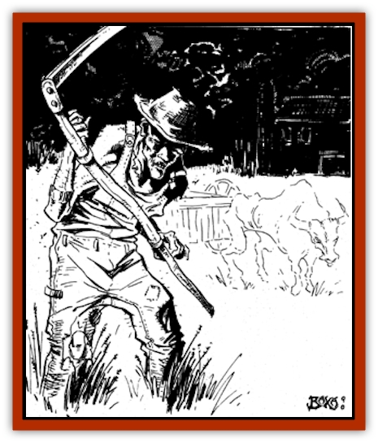
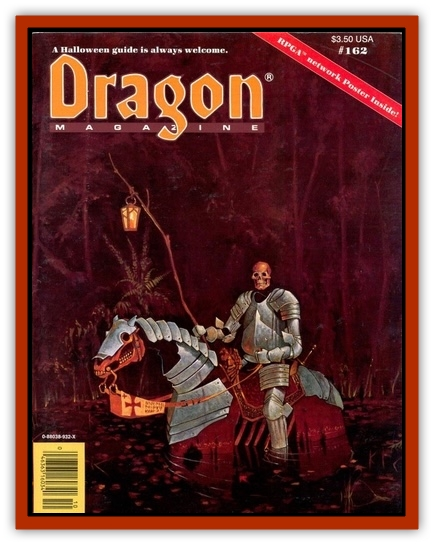

# Ankou

| Statistic | **Ankou** |
| --- | --- |
| **Activity Cycle:** | Night |
| **Alignment:** | Neutral evil |
| **Armor Class:** | 6 |
| **Climate/Terrain:** | Any inhabited area |
| **Damage/Attack:** | By weapon type (doubled) |
| **Diet:** | None |
| **Frequency:** | Very rare (Rare) |
| **Hit Dice:** | 8 |
| **Intelligence:** | Low (5-7) |
| **Magic Resistance:** | Nil |
| **Morale:** | Champion (15-16) |
| **Movement:** | 6 |
| **No. Appearing:** | 1 |
| **No. of Attacks:** | 2 |
| **Organization:** | Solitary |
| **Size:** | M |
| **Special Attacks:** | Nil |
| **Special Defenses:** | Never surprised; detects hidden or invisible beings within 60' |
| **THAC0:** | 13 |
| **Treasure:** | Nil |
| **XP Value:** | 975 |

The ankou is an undead creature who was a miserly farmer or peasant in life, a person so debased as to have murdered his own family out of greed or to have allowed his family to perish rather than share his hoard of food with them. When death claims such a person, his soul sometimes returns as an ankou, roaming the countryside in search of other victims to collect.

An ankou appears quite ordinary at a distance, seeming to be a poor farmer on the road late at night, perhaps returning from a market town. It wears typical rural clothing: ragged shoes or boots; worn, patched and dusty work clothes; and sometimes a broad-brimmed work hat set to cover its eyes. Closer inspection reveals it as an emaciated old man, with parched lips and with skin pulled tightly across the face and body.

Three things upset this picture. First, an ankou is usually armed with a farmer's scythe (50%), a long sword that it carries without a scabbard (20%), or a large club (20%); it is unarmed 10% of the time. Second, as an ankou takes its slow; stiff, and deliberate steps forward, its head never ceases to turn from side to side, its glowing, flame-red eyes scanning the land to either side looking for prey. Third, the ankou is always followed by an apparently sourceless, wooden creaking sound. This is a product of an invisible cart pulled by an equally invisible ox or horse that is even more emaciated than the ankou. The purpose of the cart (a gift of some netherworld god of evil) is to carry away the bodies of the ankou?s victims, leaving behind nothing to mark its victims? last struggles. Sometimes the sound of the cart can be heard minutes before the ankou appears, apparently stepping out of the lengthening shadows of dusk or merely approaching along a darkened road.

**Combat:** The ankou is not particular about whom it kills, but it is more likely to be encountered by solitary travelers than by groups (treat the ankou as if it were only "rare" on such occasions). It has excellent senses of hearing and sight, so it can detect anyone in hiding and cannot be surprised. Even with this ability, it will still attack only those who are accessible. The ankou cannot cross open water or flame, though rough ground slows neither itself nor its beast-drawn cart.

In combat the ankou usually fights with a weapon, doing double damage on all hits (2-16 hp damage with a sword, club, or scythe) because of its great strength and carefully aimed attacks. As it is as slow as a [[Zombie|zombie]], it gets only one attack per round and always strikes last.

If unarmed, an ankou attacks by grabbing at its opponent and attempting to wrap its thin arms around the victim's chest to crush him. The ankou needs to make a single to-hit roll; if it succeeds, the ankou has caught the victim in a bear hug of fantastic strength, its fingers locking together with startling power. Every round thereafter, the ankou does damage equal to the victim's armor class (armor type and magical bonuses apply, but shield and dexterity bonuses do not, for the purposes of this calculation). Victims with armor classes of 1 or less take no damage. The hugged victim may attack the ankou with a one-handed melee weapon at -2 to hit; he may instead elect to attempt to break the ankou?s hold, which can be done if he makes a successful bend bars/lift gates strength roll (one attempt per round allowed with no limit to the number of attempts).

Being undead, the ankou is unaffected by spells involving *sleep*, *hold*, *charm*, or cold of any sort, and its excellent senses negate the effects of many illusions (giving it a bonus of +3 on saving throws vs. illusions). It can be turned by good clerics (or caused to ignore evil ones) as if it were a spectre. The touch of holy water instantly causes it and its cart to return to the nether realms of Tartarus without the possibility of a saving throw.

The invisible cart and beast of burden can be directly attacked only by casting a *dispel evil* or *exorcise* spell upon them, which will instantly destroy them (though they will re-form on the following night if the ankou still exists). Weapon blows and magical effects are ineffective against them.

**Habitat/Society:** The ankou is a very slow and patient creature with the ceaseless endurance of the undead. If an ankou ?s victim escapes alive, it will follow him at its slow, plodding pace for the rest of the night, until it either catches and dispassionately kills him, or until the first light of dawn intrudes, banishing the ankou back to Tartarus until the next dusk. It has no memory to speak of and so will not resume its pursuit the next night out of any spite. But if the ankou encounters the same traveler on some subsequent night, it will attack him normally, as if the first encounter had never occurred.

**Ecology:** The ankou is probably the undead that contributes the least to the ecology of a world. As with others of its ilk, it neither eats nor can be safely eaten by Prime Material plane dwellers. But unlike other undead, it does not leave even the lifeless bodies of its victims behind to be eaten or picked through for treasures. All that remains after an ankou's attack are a line of the victim?s footprints that end at the point where the victim was waylaid by the driver of an ox- or horse-pulled cart, and the wheel ruts that continue down the road, fading to nothingness.

---
## Discovery & Documentation

**Source Publication:** Dragon162 (1990)
**Campaign Setting:** Dragon Magazine
**Author(s):** Spike Y. Jones, Thomas Baxa

### Other Creatures Found in This Source Book
   * [[Skotos|Skotos]]
