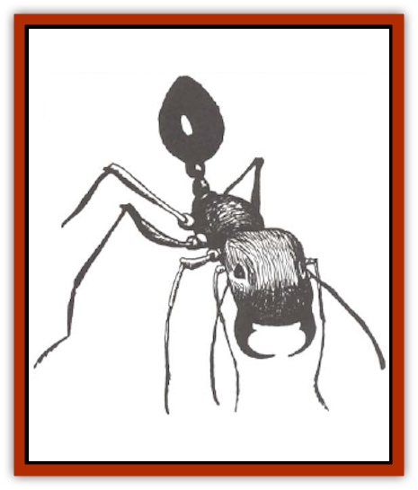

# Ant

| Statistic | **Giant** | **Swarm** |
| --- | --- | --- |
| **Activity Cycle:** | Day | Day |
| **Alignment:** | Neutral | Neutral |
| **Armor Class:** | 3 | 10 |
| **Climate/Terrain:** | Tropical/Forest, hills and plains | Tropical/Forest, hills, and plains |
| **Damage/Attack:** | Worker: 1-6 / Warrior: 2-8 | See below |
| **Diet:** | Omnivore | Omnivore |
| **Frequency:** | Rare | Very rare |
| **Hit Dice:** | Worker: 2 / Warrior: 3 | 1 hp per 10 ants |
| **Intelligence:** | Animal (1) | Animal (1) |
| **Magic Resistance:** | Nil | Nil |
| **Morale:** | Average (9) | Unsteady (6) |
| **Movement:** | 18 | 6 |
| **No. Appearing:** | 1-100 | See below |
| **No. of Attacks:** | 1 | 1 |
| **Organization:** | Colony | Colony |
| **Size:** | T (2' long) | See below |
| **Special Attacks:** | Warriors have poison sting | Poison |
| **Special Defenses:** | Nil | Nil |
| **THAC0:** | 16 | See below |
| **Treasure:** | Q&times;3,S | Nil |
| **XP Value:** | Worker: 35 / Warrior: 175 | See below |

Giant ants form cooperative colonies in tropical regions. They are normally docile, but they can be fierce fighters if their nest is threatened.

Giant ants are black, red, or brown. A giant ant's body is covered with by a thick outer skeleton that serves as protection and prevents the body from dehydrating. Two thin antennae sprout from the head and are used for smelling and feeling. An ant's scissor-like mandibles can cut, carry, or dig. Six long legs covered with fine bristles grow from the thorax, while the abdomen contains most of the internal organs.

**Combat:** Both worker and warrior ants will fight. If a warrior ant manages to bite, it will also attempt to sting for 3d4 points of damage. A successful saving throw vs. poison reduces the sting damage to 1d4 hp. The queen ant has 10 Hit Dice but neither moves nor attacks. If she is killed, the remaining ants become confused (as if affected by the spell) for six rounds, then scramble from the nest.

**Habitat/Society:** A giant ant colony makes its nest underground in a series of rooms and passages. Mounds of dirt and twigs mark the entrances. The passages may reach a depth of 16 feet, and the entire nest may be spread out ever an area exceeding several thousand square yards.

When encountered in the wilderness, there is a 90% chance that all of the ants are workers. Encountered in their colony, there is usually one warrior ant for every five workers; a typical colony consists of 100-200 workers, 20-40 warriors, and a single queen. The warriors are responsible for guarding the queen and defending the nest. All other duties are divided among the workers. Some gather food, some clean the nest, some attend to the developing larvae. Others suck nectar from flowers and produce honey. Storage ants, a special type of worker, swallow the honey until they are too fat to move or work. In times of scarce food, the storage ants expel the honey from their mouths to feed the rest of the colony.

The queen has no responsibilities other than to lay thousands of eggs per week. Her chamber also contains the colony's treasure, usually shiny jewels the workers collect on hunting expeditions. Nurse ants care for the young in an egg chamber; the larvae hatch and develop into adults in just a few weeks. From 5-50 workers and 5 warriors guard the nursery chamber.

**Ecology:** Giant ants prefer to eat seeds and grasses but they will also eat meat if given the opportunity. Neither giant ants nor their eggs have any commercial value, though some gourmets enjoy their honey. In a pinch, giant ants are a good source of protein.

**Swarm**

  There is no sight more fearsome than a swarm of red or golden army ants on the march through a tropical forest, steadily consuming everything in their path. The individual ants resemble smaller versions of giant ants, red or golden in color with powerful mandibles. The swarm is a mobile colony of 3/4"-long workers numbering in the thousands (to determine the number of ants in the swarm, roll 1d10 and multiply the result by 1,500). A single queen, identical to the workers except for her sex and tiny unusable wings, marches in the center the swarm. If the queen is killed, the swarm dissipates.

The swarm moves in a straight line as a solid block of ants (about 150 ants per square foot). The ants eat all organic matter in their path, including any creatures too, slow to get out of their way. If the ants approach a river or other obstacle, they turn 90 degrees and continue their march. They will not go out of their way to attack and are therefore easy to avoid. Any creature in contact with the swarm has a 90% chance per round of suffering 1d6 points of damage from bites; if bitten, the creature must roll a successful saving throw vs. poison or suffer an additional 1d2 points of damage from the mild poison. Check for bites and poison for each round the creature is in contact with the swarm. Each point of damage inflicted on the swarm kills 1d20 ants. Ants may be scattered with smoke or like; immersion in water washes them off. If half of a swarm is killed, the surviving ants attempt to scatter and hide; since the ants scatter equally in every direction, this actually increases the possibility a creature in the vicinity may be attacked. If an entire swarm is killed, award 975 experience points per 1,500 ants.

---
## Discovery & Documentation

**Source Publication:** MC2 Volume II (1993)
**Campaign Setting:** Advanced Dungeons & Dragons 2nd Edition
**Author(s):** Jay Batista, Scott Bennie, Grant Boucher, William W. Connors, Steve Gilbert, Heike Kubasch, James Lowder, David Edward Martin, Bruce Nesmith, Jean Rabe, Rick Swan, John J. Terra, Gary L. Thomas

### Other Creatures Found in This Source Book
   * [[Ant_Lion_Giant|Ant Lion, Giant]]
   * [[Ape_Carnivorous|Ape, Carnivorous]]
   * [[Baboon|Baboon]]
   * [[Badger|Badger]]
   * [[Barracuda|Barracuda]]
   * [[Beetle_Giant|Beetle, Giant]]
   * [[Bulette|Bulette]]
   * [[Bullywug|Bullywug]]
   * [[Dwarf_Duergar|Dwarf, Duergar]]
   * [[Dwarf_Gully|Dwarf, Gully]]
   * [[Eagle|Eagle]]
   * [[Eel|Eel]]
   * [[Elemental_Air_Kin|Elemental, Air Kin]]
   * [[Elemental_Water_Kin|Elemental, Water Kin]]
   * [[Elemental_Water_Kin_Water_Weird|Elemental, Water Kin, Water Weird]]
   * [[Firestar|Firestar]]
   * [[Firetail|Firetail]]
   * [[Fish_Giant|Fish, Giant]]
   * [[Frog|Frog]]
   * [[Gorgon|Gorgon]]
   * [[Hawk|Hawk]]
   * [[Heucuva|Heucuva]]
   * [[Hippocampus|Hippocampus]]
   * [[Hippogriff|Hippogriff]]
   * [[Kelpie|Kelpie]]
   * [[Kenku|Kenku]]
   * [[Killmoulis|Killmoulis]]
   * [[Kuo-Toa|Kuo-Toa]]
   * [[Lamia|Lamia]]
   * [[Lammasu|Lammasu]]
   * [[Lamprey|Lamprey]]
   * [[Leech|Leech]]
   * [[Leprechaun|Leprechaun]]
   * [[Leucrotta|Leucrotta]]
   * [[Locathah|Locathah]]
   * [[Lycanthrope_Wereboar|Lycanthrope, Wereboar]]
   * [[Lycanthrope_Werefox|Lycanthrope, Werefox]]
   * [[Mammal_Minimal|Mammal, Minimal]]
   * [[Mammal_Small|Mammal, Small]]
   * [[Mimic|Mimic]]
   * [[Morkoth|Morkoth]]
   * [[Muckdweller|Muckdweller]]
   * [[Myconid|Myconid]]
   * [[Naga|Naga]]
   * [[Obliviax|Obliviax]]
   * [[Octopus_Giant|Octopus, Giant]]
   * [[Otyugh|Otyugh]]
   * [[Piranha|Piranha]]
   * [[Plant_Dangerous_I|Plant, Dangerous I]]
   * [[Plant_Intelligent|Plant, Intelligent]]
   * [[Poltergeist|Poltergeist]]
   * [[Porcupine|Porcupine]]
   * [[Rat_Osquip|Rat, Osquip]]
   * [[Roc|Roc]]
   * [[Roper|Roper]]
   * [[Rot_Grub|Rot Grub]]
   * [[Rust_Monster|Rust Monster]]
   * [[Sahuagin|Sahuagin]]
   * [[Sea_Lion|Sea Lion]]
   * [[Sea_Horse_Giant|Sea Horse, Giant]]
   * [[Shambling_Mound|Shambling Mound]]
   * [[Shark|Shark]]
   * [[Sphinx|Sphinx]]
   * [[Squid_Giant|Squid, Giant]]
   * [[Stirge|Stirge]]
   * [[Swanmay|Swanmay]]
   * [[Tarrasque|Tarrasque]]
   * [[Tasloi|Tasloi]]
   * [[Triton|Triton]]
   * [[Troglodyte|Troglodyte]]
   * [[Urchin|Urchin]]
   * [[Urd|Urd]]
   * [[Weasel|Weasel]]
   * [[Wolverine|Wolverine]]
   * [[Yellow_Musk_Creeper|Yellow Musk Creeper]]
