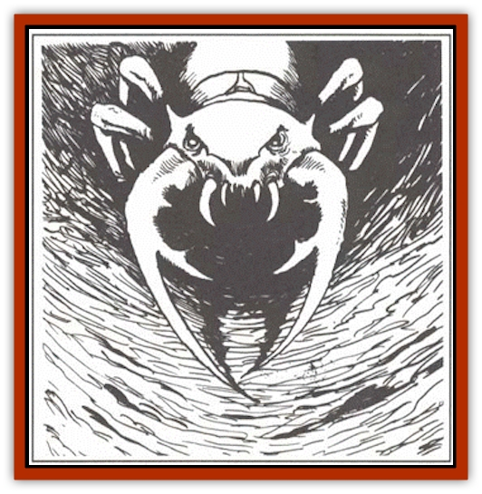

# Ant Lion - Giant

| Statistic | **Ant Lion, Giant** |
| --- | --- |
| **Activity Cycle:** | Any |
| **Alignment:** | Neutral |
| **Armor Class:** | 2 |
| **Climate/Terrain:** | Tropical and temperate/Mountains, hills, and plains |
| **Damage/Attack:** | 5-20 |
| **Diet:** | Carnivore |
| **Frequency:** | Rare |
| **Hit Dice:** | 8 |
| **Intelligence:** | Animal (1) |
| **Magic Resistance:** | Nil |
| **Morale:** | Average (8) |
| **Movement:** | 9, Br 1 (in loose soil) |
| **No. Appearing:** | 1 |
| **No. of Attacks:** | 1 |
| **Organization:** | Solitary |
| **Size:** | L (10' long) |
| **Special Attacks:** | See below |
| **Special Defenses:** | Nil |
| **THAC0:** | 12 |
| **Treasure:** | See below |
| **XP Value:** | 1,400 |

The ant lion is a huge, vicious insect that lurks in the bottom of deep pits, feeding on creatures unlucky enough to fall in. Ant lions live in badlands, desert fringes, and other areas with loose soil and sand.

The ant lion resembles a cross between a mole and a giant ant. Its body, gray or sandy brown in color, is covered completely by a leathery exoskeleton with patches of coarse black bristles that are sensitive to movement and odor. It has deep-set beady eyes, rows of jagged teeth capable of both tearing and grinding, and six thick legs with sharp claws and flat bristles. The claws are used for digging while the bristles sweep away the loose soil. The ant 1ion's most prominent features are its mandibles, silvery gray and razor-edged, extending three feet from it's mouth. A single barb centered on the inner ridge of each mandible is used to impale and hold prey.

**Combat:** The ant lion seldom stalks or pursues prey. Instead, it digs deep, tapering pits about 60 feet in diameter, buries itself at the bottom beneath a covering of sand, gravel, and stones, then patiently waits for falling victims. About 50% of the time, the entrance to the pit looks like a funnel lined with sand. The rest of the time it looks like the entrance to a cave or lair. A creature coming within three feet of the edge of the entrance has a 20% chance of slipping in the loose soil and sand and sliding into the pit. A creature entering the pit has a 50% chance per round of sliding to the bottom. A character who takes precautions when approaching or entering the pit, such as securing himself to a tree with a rope, will not slip into the pit.

When a victim lands in the bottom of the pit, the ant lion bursts from its covering of sand and stones and attempts to grab its victim with its mandibles. If successful, the ant lion will not release its prey until either it or the prey is dead. The ant lion impales its victim with its barbs, crushes with its mandibles, then grinds its mandibles back and forth in a sawing motion, automatically inflicting 5d4 points of damage each round after the initial hit.

**Habitat/Society:** Ant lions mate once per year in mid-summer. The male ant lion is drawn to the female by aromatic secretions she releases when entering her mating cycle. Only ant lions can smell these secretions. Once a male enters the female's lair, she stops secreting, and the couple begin clicking their mandibles at each other. This ritual clicking lasts for three full days, during which time the couple neither sleeps nor eats. The clicking has a trance-like effect on the ant lions; even if attacked, it takes the ant lions 1d4 rounds to break their trance and respond to an intruder. At the conclusion of the clicking ritual, the male fertilize the female, then leaves her nest. Within a week, the female lays between one and four eggs and buries them in a hole in the floor. The young ant lions hatch in about six months, immediately burrowing away to construct lairs of their own. A young ant lion has 4 Hit Dice, but otherwise has all the abilities of an adult. It reaches full maturity in about a year.

The ant lion's lair typically consists of its pit trap and a narrow passage leading to a large chamber where the ant lion sleeps and eats. Another passage, winding from this chamber to the surface, is used as an escape route. The ant lion also drags the remnants of its meals through this passage and conceals them outside; this is usually the only opportunity to encounter an ant lion out of its lair. Although ant lions do not collect treasure, there is a 30% chance that 1d4 of the following items will be found in a lair from previous kills (roll 1d20 to determine randomly):

| 1d20 | Treasure |
| --- | --- |
| 1-6 | 10-40 gp |
| 7-10 | 5-20 pp |
| 11-13 | Shield* |
| 14-17 | Metal weapon* |
| 18-19 | Jewelry* |
| 20 | Miscellaneous item* |

*10% chance the item is magical. Roll on the appropriate table in the *Dungeon Master's Guide* or assign an item of relatively low value.

**Ecology:** Ant lions near civilized regions are considered dangerous predators. Rewards are often available for proof of their destruction. Ant lions eat any creature that falls into their pits, though they prefer giant insets, usually eating one or more [[Ant|giant ants]] per day. Ant lions have no commercial value, though farmers of some primitive cultures use their mandibles for plows.

---
## Discovery & Documentation

**Source Publication:** MC2 Volume II (1993)
**Campaign Setting:** Advanced Dungeons & Dragons 2nd Edition
**Author(s):** Jay Batista, Scott Bennie, Grant Boucher, William W. Connors, Steve Gilbert, Heike Kubasch, James Lowder, David Edward Martin, Bruce Nesmith, Jean Rabe, Rick Swan, John J. Terra, Gary L. Thomas

### Other Creatures Found in This Source Book
   * [[Ant|Ant]]
   * [[Ape_Carnivorous|Ape, Carnivorous]]
   * [[Baboon|Baboon]]
   * [[Badger|Badger]]
   * [[Barracuda|Barracuda]]
   * [[Beetle_Giant|Beetle, Giant]]
   * [[Bulette|Bulette]]
   * [[Bullywug|Bullywug]]
   * [[Dwarf_Duergar|Dwarf, Duergar]]
   * [[Dwarf_Gully|Dwarf, Gully]]
   * [[Eagle|Eagle]]
   * [[Eel|Eel]]
   * [[Elemental_Air_Kin|Elemental, Air Kin]]
   * [[Elemental_Water_Kin|Elemental, Water Kin]]
   * [[Elemental_Water_Kin_Water_Weird|Elemental, Water Kin, Water Weird]]
   * [[Firestar|Firestar]]
   * [[Firetail|Firetail]]
   * [[Fish_Giant|Fish, Giant]]
   * [[Frog|Frog]]
   * [[Gorgon|Gorgon]]
   * [[Hawk|Hawk]]
   * [[Heucuva|Heucuva]]
   * [[Hippocampus|Hippocampus]]
   * [[Hippogriff|Hippogriff]]
   * [[Kelpie|Kelpie]]
   * [[Kenku|Kenku]]
   * [[Killmoulis|Killmoulis]]
   * [[Kuo-Toa|Kuo-Toa]]
   * [[Lamia|Lamia]]
   * [[Lammasu|Lammasu]]
   * [[Lamprey|Lamprey]]
   * [[Leech|Leech]]
   * [[Leprechaun|Leprechaun]]
   * [[Leucrotta|Leucrotta]]
   * [[Locathah|Locathah]]
   * [[Lycanthrope_Wereboar|Lycanthrope, Wereboar]]
   * [[Lycanthrope_Werefox|Lycanthrope, Werefox]]
   * [[Mammal_Minimal|Mammal, Minimal]]
   * [[Mammal_Small|Mammal, Small]]
   * [[Mimic|Mimic]]
   * [[Morkoth|Morkoth]]
   * [[Muckdweller|Muckdweller]]
   * [[Myconid|Myconid]]
   * [[Naga|Naga]]
   * [[Obliviax|Obliviax]]
   * [[Octopus_Giant|Octopus, Giant]]
   * [[Otyugh|Otyugh]]
   * [[Piranha|Piranha]]
   * [[Plant_Dangerous_I|Plant, Dangerous I]]
   * [[Plant_Intelligent|Plant, Intelligent]]
   * [[Poltergeist|Poltergeist]]
   * [[Porcupine|Porcupine]]
   * [[Rat_Osquip|Rat, Osquip]]
   * [[Roc|Roc]]
   * [[Roper|Roper]]
   * [[Rot_Grub|Rot Grub]]
   * [[Rust_Monster|Rust Monster]]
   * [[Sahuagin|Sahuagin]]
   * [[Sea_Lion|Sea Lion]]
   * [[Sea_Horse_Giant|Sea Horse, Giant]]
   * [[Shambling_Mound|Shambling Mound]]
   * [[Shark|Shark]]
   * [[Sphinx|Sphinx]]
   * [[Squid_Giant|Squid, Giant]]
   * [[Stirge|Stirge]]
   * [[Swanmay|Swanmay]]
   * [[Tarrasque|Tarrasque]]
   * [[Tasloi|Tasloi]]
   * [[Triton|Triton]]
   * [[Troglodyte|Troglodyte]]
   * [[Urchin|Urchin]]
   * [[Urd|Urd]]
   * [[Weasel|Weasel]]
   * [[Wolverine|Wolverine]]
   * [[Yellow_Musk_Creeper|Yellow Musk Creeper]]
