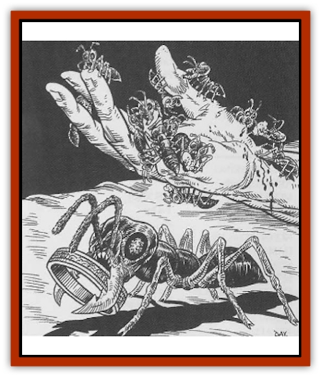

# Ant - Piranha

| Statistic | **Ant, Piranha** |
| --- | --- |
| **Activity Cycle:** | Any |
| **Alignment:** | Neutral |
| **Armor Class:** | 10 |
| **Climate/Terrain:** | Temperate urban |
| **Damage/Attack:** | See below |
| **Diet:** | Carnivore |
| **Frequency:** | Rare |
| **Hit Dice:** | 1 hp per 10 ants |
| **Intelligence:** | Average (8) |
| **Magic Resistance:** | Nil |
| **Morale:** | Fearless (20) |
| **Movement:** | 6 |
| **No. Appearing:** | See below |
| **No. of Attacks:** | 1 |
| **Organization:** | Colony |
| **Size:** | See below |
| **Special Attacks:** | Surprise |
| **Special Defenses:** | Nil |
| **THAC0:** | Special |
| **Treasure:** | Nil |
| **XP Value:** | 2,000 per swarm |

At a mere inch in length, an individual piranha [[Ant|ant]] is easily dismissed as a harmless insect unworthy of notice. The danger lies not in the individual ant but in the swarm of thousands of the creatures, who fear no foe and can strip a man to his bones in a matter of minutes.

A piranha ant's head is disproportionately larger than that of other ant species. Its sharp mandibles are serrated. The creature is a dull gray or black in color, allowing it to easily blend in with stone, the dirt of the street, or the shadows.

**Combat:** Piranha ants are vicious in combat. They only strike unsuspecting opponents, often waiting until their prey is fast asleep before attacking. This guarantees at least one round of free attack due to surprise. When attacking, the entire colony swarms over the victim, each ant ripping off a hunk of flesh and moving on, making room for others of its kind to attack in turn. Combat with a piranha ant colony is therefore treated as if the victim were battling a single large creature.

Because of the vast number of attacks each round, piranha ants automatically strike their targets during each round of combat. The victim takes damage as follows: roll 1d4 and multiply the result by the victim's Armor Class. Piranha ants scout out their victims ahead of time and generally do not attack those who have an AC of 0 or less.

Each hit point of damage inflicted upon a piranha ant swarm kills 1d20 of the ants. However, due to the vast number of creatures making up the swarm (1d20 x 1,000), it is usually easier (not to mention safer) to flee from the swarm rather than to try to fight them.

**Habitat/Society:** Piranha ants live in a mobile colony, making temporary homes in large buildings. They are led by a slightly larger than normal queen in charge of egg production. There are several winged males (movement Fl 12, maneuverability class C) in each colony, but the vast majority are infertile female warriors. Together, the thousands of piranha ants making up a colony have a single collective consciousness. Each ant communicates instantly with the others of its colony, and the creatures coordinate attacks with ruthless efficiency.

Piranha ants are similar to the swarms of army ants in the jungle, but in many ways they're worse. Their collective intelligence allows them to plot action in advance. Piranha ants send out scouts to scour the city for likely targets; they prefer humans living alone. Once a likely target is found, the colony moves into the target building, often living between the walls or in unused basement or attic rooms, well out of sight. Scouts are sent throughout the building to keep an eye on the intended prey. When the time is right (usually after the victim has gone to bed for the night), the ants silently enter the victim's room en masse. More often than not, the victim is slain before he knows what's going on. The ants pick the victim's body clean of flesh and leave as silently as they came.

In winter, piranha ants go to ground, holing up in some out of the way place. The queen lays eggs during the winter, which hatch by winter's end. After a brief larval stage, the pupae are sealed into cocoons from which they emerge by spring, ready to join the colony in swarm attacks.

**Ecology:** Piranha ants take care to leave no traces of their attacks behind. After an attack, usually only a skeleton remains of the ants' prey. Slain ants are themselves eaten by the surviving colony members; this not only makes use of a food source but also prevents anyone from finding the bodies and figuring out what caused the victim's death.

Piranha ants are at the top of the food chain. While many creatures eat individual ants, none attack the colony as a whole.

---
## Discovery & Documentation

**Source Publication:** Dragon Magazine Annual 3 - 1998 (1998)
**Campaign Setting:** Dragon Magazine
**Author(s):** Johnathan M. Richards, David Day

### Other Creatures Found in This Source Book
   * [[Pigeon_Acid|Pigeon, Acid]]
   * [[Rat_Burglar|Rat, Burglar]]
