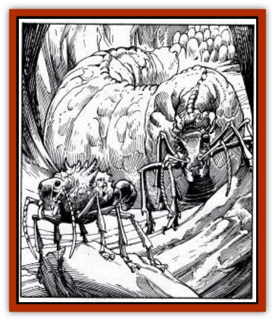

# Antloid - Desert

| Statistic | **Dynamis** | **Queen** | **Soldier** | **Worker** |
| --- | --- | --- | --- | --- |
| **Activity Cycle:** | Any | Any | Any | Any |
| **Alignment:** | Neutral | Neutral | Neutral | Neutral |
| **Armor Class:** | 6 | 10 | 3 | 6 |
| **Climate/Terrain:** | Sandy Wastes | Sandy Wastes | Sandy Wastes | Sandy Wastes |
| **Damage/Attack:** | 1-6 | Nil | 3-18 | 13-18 (1d6+12) |
| **Diet:** | Omnivore | Omnivore | Omnivore | Omnivore |
| **Frequency:** | Rare | Very rare | Uncommon | Uncommon |
| **Hit Dice:** | 4+2 | 8+1 | 6+1 | 3 |
| **Intelligence:** | Low (5) | Semi- (3) | Animal (1) | Animal (1) |
| **Magic Resistance:** | Nil | Nil | Nil | Nil |
| **Morale:** | Champion (15) | Elite (13) | Elite (13) | Average (10) |
| **Movement:** | 12 | 3 | 18 | 12 |
| **No. Appearing:** | 1-10 | 1 | 1-20 | 1-100 |
| **No. of Attacks:** | 1 | 1 | 1 | 1 |
| **Organization:** | Warrens | Warrens | Warrens | Warrens |
| **Size:** | L (10') | H (20'+) | L (10') | L (8') |
| **Special Attacks:** | Psionic | Pheromones | Poison | Nil |
| **Special Defenses:** | Psionic | Pheromones | Nil | Nil |
| **THAC0:** | 17 | 13 | 15 | 17 |
| **Treasure:** | Nil | J,K,N,U | Nil | Nil |
| **XP Value:** | 270 | 975 | 420 | 120 |

Antloids are giant [[Ant|ants]] that inhabit huge warrens in the Athasian desert. Their species has evolved through adaptive specialization which gives certain antloids special powers. There are four different groups: workers, soldiers, dynamis, and queens; each group fulfills a specialized task within antloid society. Antloids have a heavy exoskeleton that provides excellent protection from weapon attack and dehydration. All antloids have segmented bodies and six legs. They also have sharp mandibles used for cutting, carrying, or combat. All sensory organs are located on the front of their head. Compound eyes give them 180-degree regular vision, plus infravision for 60'. A segmented pair of antennas are used for communication and allow antloids to sense almost any vibration within 30'.

**Workers**

  Workers' bodies have three, easily-defined, sapphire-blue segments: head, torso, and a metasoma segment. They average 8' in length with stocky broad bodies. Workers spend their lives doing specific jobs: carrying water, carrying foodstuffs, caring for their queen, repairing or continuing construction on the warren, etc. Workers are the strongest of the antloids with almost giant-like strength. Their mandibles are designed for lifting and carrying rather than combat. Workers only fight if something tries to take away whatever they are carrying or the queen is threatened. In combat they use their mandibles and their incredible strength (1d6+12) to crush their opponent. Worker antloids digest desert sand along with their normal food and excrete a concrete-like material that they use to build the warren. The material will withstand 100 points of damage over a 5-cubic-foot area before crumbling.

**Soldiers**

  These antloids grow to be 10' in length and have a mottled, dark blue-green-grey exoskeleton. Their large, sharp, oversized mandibles do 3d6 damage on a successful attack. Longer and sleeker than workers, soldiers also have a poison attack. There are two types of soldier antloids: infantry and archers.

The infantry antloid has a 17' gaster stinger located at the rear tip of its metasoma segment. A successful attack does 1d4 stinger damage and injects of a deadly neurotoxin. The archer antloid does not have a stinger, but rather a poison gland that can shoot a thin stream of the same deadly poison 50'. If a soldier antloid makes a successful poison attack (Poison Type D: 30/2-12), the victim is entitled to a saving throw versus the poison's effects. A failed save means the victim automatically takes 30 points of poison damage. A successful saving throw means that less of the toxin was injected/sprayed and the victim only takes 2d6 poison damage. (Note: In some cases a character may roll a successful saving throw and still die from the hit point loss. See DMG, page 73, for more information on poisons.) Soldier antloids are immune to their own poison.

Exploration, defense of the warren (and its water supply) and mating with the queen are the chief jobs of soldier antloids. They constantly raid surrounding areas for food.

**Dynamis**

  **Psionics Summary**

| Level | Dis/Sci/Dev | Attack/Defense | Score | PSPs |
| --- | --- | --- | --- | --- |
| 6 | 2/3/8 | -/IF,MB | 15 | 100 |

**Psychometabolism -** *Sciences:* death field, shadow form; *Devotions:* absorb disease, cause decay, chemical simulation, double pain, flesh armor, heightened senses.

**Telepathy -** *Science:* mind link; *Devotions:* contact, telepathic projection.

*Mindlink* and *Contact*: with other dynamis at no cost

  These are the strangest and most deadly of the antloids. Their exoskeleton is grey-black in color. They have a greatly enlarged center body segment, a small head, and a vestigial metasoma segment. Dynamis' bodies house large brains, which give this species its intellect and psionic abilities. They will always use psionic attacks first and melee as a last resort.

Dynamis stay in contact with other dynamis within their warren via a natural ability to mindlink with one another. Dynamis prefer to combine their powers when attacking. They will move close to a victim using shadow form, then create a death field. This strategy makes the target more vulnerable to soldier antloids' attacks. They may also use cause decay combined with chemical stimulation and double pain. Dynamis will not hesitate to use all of their PSPs in skirmishes, and they will sacrifice themselves to protect the queen.

As masters of the warren, dynamis make sure soldiers explore for food, workers keep busy, and that the queen is protected and comfortable at all times.

**Queens**

  Antloid warrens will generally have only one queen, and she can grow to over 20. in length. Queens have fat, bloated bodies and serve only one purpose in the warren.to lay eggs. Red to apricot in color, the queen lives in the deepest defendable part of the warren, where she lays 10-20 eggs a week. The eggs are cared for by sterile workers. Of the four different antloid types hatched, 80% are workers, 15% soldiers, 4% dynamis, and 1% queens. Any time the dynamis feel there are too many of any one type, they will order the eggs used as food rather than letting them mature. This keeps the warren from overpopulating and assures the proper balance among the species. The queen is always attended by young, immature queens.

When queens mature they gain the ability to release pheromones in an adjacent 60-cubic-foot area. The pheromones create two different reactions: attraction and madness. Attraction pheromones lure virile soldier antloids to the queens. chambers for reproduction. A queen uses the madness pheromones to protect herself against younger queens or intruders (including humanoids and demihumans). Madness manifests itself through hallucinations, causing the victim to see, hear, feel, and otherwise sense things that do not exist. The victim must save versus poison (at -4) or suffer the effects of madness. The victim will frequently believe he/she is on fire, drowning, or being attacked by a terrible enemy. If not removed from the area of the pheromones, the victim must make a successful system shock roll each round or die from the hallucination. Under the effects of madness the victim may only fight or flee the imagined danger; no other action is possible.

**Habitat/Society:** The antloid warrens appear as large mounds in the desert, up to 250' across and 25' in height. Underground warrens are conical in shape, widest at the surface and narrowing toward the bottom. They extend deep into the ground, frequently to a small subterranean water source. Antloids will abandon a warren for many reasons: lack of water or food, accidental death of all of their queens, or to attack another antloid warren. Infrequently, a rogue dynamis will lead a young queen, some workers, and a couple of soldier antloids from an established warren and attempt to set up a competing warren. More often than not this attempt fails. If the warren has any shiny or pretty objects (treasure), those items will always be in the queen's chamber, placed there for her pleasure.

**Ecology:** Whether occupied or not, great caution should be taken whenever entering an antloid warren. Abandoned warrens seldom offer safe haven for desert travellers since dangerous desert dwellers tend to take refuge in the unoccupied labyrinth as well. Because of the constantly changing desert sands, a warren is in constant danger of collapsing. Water can be found in the deepest part of an abandoned warren 15% of the time, but it, too, is often guarded by some new inhabitant.

---
## Discovery & Documentation

**Source Publication:** MC12 Dark Sun Appendix I - Terrors of the Desert (1991)
**Campaign Setting:** Dark Sun
**Author(s):** Tom Prusa, Louis J. Prosperi, Walter M. Baas

### Other Creatures Found in This Source Book
   * [[Animal_Herd_Athas|Animal, Herd (Athas)]]
   * [[Animal_Household_Athas|Animal, Household (Athas)]]
   * [[Banshee_Dwarf|Banshee, Dwarf]]
   * [[Beetle_Agony|Beetle, Agony]]
   * [[Bog_Wader|Bog Wader]]
   * [[Brambleweed|Brambleweed]]
   * [[B'rohg|B'rohg]]
   * [[Burnflower|Burnflower]]
   * [[Cat_Psionic|Cat, Psionic]]
   * [[Cha'thrang|Cha'thrang]]
   * [[Cistern_Fiend|Cistern Fiend]]
   * [[Clam_Giant|Clam, Giant]]
   * [[Cloud_Ray|Cloud Ray]]
   * [[Drake_Athas_Air|Drake (Athas), Air]]
   * [[Drake_Athas_Earth|Drake (Athas), Earth]]
   * [[Drake_Athas_Fire|Drake (Athas), Fire]]
   * [[Drake_Athas_Water|Drake (Athas), Water]]
   * [[Dune_Runner|Dune Runner]]
   * [[Dune_Trapper|Dune Trapper]]
   * [[Elemental_Athas_Greater_Air|Elemental (Athas), Greater, Air]]
   * [[Elemental_Athas_Greater_Earth|Elemental (Athas), Greater, Earth]]
   * [[Elemental_Athas_Greater_Fire|Elemental (Athas), Greater, Fire]]
   * [[Elemental_Athas_Greater_Water|Elemental (Athas), Greater, Water]]
   * [[Elemental_Athas_Lesser_Air_Earth|Elemental (Athas), Lesser, Air/Earth]]
   * [[Elemental_Athas_Lesser_Fire_Water|Elemental (Athas), Lesser, Fire/Water]]
   * [[Elemental_Athas_General_Information|Elemental (Athas), General Information]]
   * [[Erdland|Erdland]]
   * [[Esperweed|Esperweed]]
   * [[Flailer|Flailer]]
   * [[Floater|Floater]]
   * [[Giant_Athas|Giant (Athas)]]
   * [[Golem_Athas_I|Golem (Athas) I]]
   * [[Golem_Athas_II|Golem (Athas) II]]
   * [[Golem_Athas_III|Golem (Athas) III]]
   * [[Golem_Athas_General_Information|Golem (Athas), General Information]]
   * [[Halfling_Renegade|Halfling, Renegade]]
   * [[Hej-kin|Hej-kin]]
   * [[Id_Fiend|Id Fiend]]
   * [[Insect_Swarm_Athas|Insect Swarm (Athas)]]
   * [[Kank_Wild|Kank, Wild]]
   * [[Kirre|Kirre]]
   * [[Megapede|Megapede]]
   * [[Mul_Wild|Mul, Wild]]
   * [[Nightmare_Beast|Nightmare Beast]]
   * [[Plant_Carnivorous_Athas|Plant, Carnivorous (Athas)]]
   * [[Pterran|Pterran]]
   * [[Pterrax|Pterrax]]
   * [[Pulp_Bee|Pulp Bee]]
   * [[Pyreen|Pyreen]]
   * [[Rasclinn|Rasclinn]]
   * [[Razorwing|Razorwing]]
   * [[Roc_Athas|Roc (Athas)]]
   * [[Sand_Bride|Sand Bride]]
   * [[Sand_Cactus|Sand Cactus]]
   * [[Sand_Vortex|Sand Vortex]]
   * [[Scrab|Scrab]]
   * [[Silt_Horror|Silt Horror]]
   * [[Silt_Runner|Silt Runner]]
   * [[Sink_Worm|Sink Worm]]
   * [[Sloth_Athas|Sloth (Athas)]]
   * [[So-ut|So-ut]]
   * [[Spider_Cactus|Spider Cactus]]
   * [[Spider_Crystal|Spider, Crystal]]
   * [[Spirit_of_the_Land|Spirit of the Land]]
   * [[T'Chowb|T'Chowb]]
   * [[Thrax|Thrax]]
   * [[Tohr-kreen_I|Tohr-kreen I]]
   * [[Villichi|Villichi]]
   * [[Zhackal|Zhackal]]
   * [[Zombie_Plant|Zombie Plant]]
