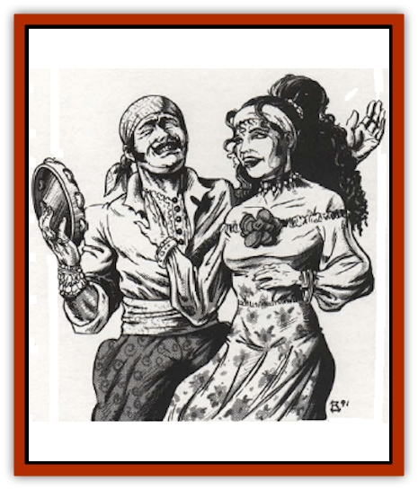

# Aperusa

| Statistic | **Aperusa** |
| --- | --- |
| **Activity Cycle:** | Any |
| **Alignment:** | Chaotic neutral (good) |
| **Armor Class:** | 6 |
| **Climate/Terrain:** | Any |
| **Damage/Attack:** | By weapon |
| **Diet:** | Omnivore |
| **Frequency:** | Common |
| **Hit Dice:** | 1+1 |
| **Intelligence:** | Average (8-10) |
| **Magic Resistance:** | 10% |
| **Morale:** | Steady (11) |
| **Movement:** | 12 |
| **No. Appearing:** | 5-50 |
| **No. of Attacks:** | 1 |
| **Organization:** | Clan |
| **Size:** | M (5-6' tall) |
| **Special Attacks:** | See below |
| **Special Defenses:** | See below |
| **THAC0:** | 19 |
| **Treasure:** | E (O,V) |
| **XP Value:** | 175 / Sword: 975 / Umbra: 975 / Clan Leader: 3,000 |

The Aperusa are wildspace gypsies. They are a swarthy, nimble, handsome folk who dress in colorful silks and lots of jewelry. For all intents and purposes, they act like groundling gypsies, though no one knows whether the Aperusa are groundling gypsies who somehow made it into space, or spacefarers who met gypsies and chose to imitate them. Like other gypsies, the Aperusa are silent about their origins, and they resent intrusions into their pasts. This fanatical concealment of their past overrides even their love for money and 'stuff".

These fun-loving folk wander wildspace in brightly painted, slapdash spelljammers. The Aperusa salvage wrecks, run confidence games, engage in petty thievery, and tell fortunes. They speak their own secret tongue, as well as Thieves' Cant and Common.

**Combat:** Treat most Aperusa as 1st-level thieves, their thief skills modified by appropriate Dexterity bonuses. Any Aperusa quickly points out that they are lovers, not fighters. They pursue wealth and fun, not combat and its result, pain. They gladly let others fight their battles for them; in fact, the Aperusa reward their benefactors by selling them healing balms - at bargain prices!

If combat is inevitable, the Aperusa try to delay fighting until they get the advantage. They defend themselves with short swords and main-gauches (40%), daggers and slings (30%), rapiers (20%), or longswords (10%). They wear no armor, trusting their tough skin and high Dexterity. Some (20%) wear *protection* rings and cloaks, or *bracers of defense*.

Every Aperusa can feign death once per day, usually after taking a small flesh wound, or falling and pretending to hit his head. After the foe leaves the fight, the Aperusa plot a rematch, making sure the assailants won't know what hit them.

Aperusa are slightly magic-resistant and 75% immune to all detection spells. Their minds cannot be read, and they cannot have psionic abilities. Furthermore, due to their hearty nature and constant exposure to wildspace, Aperusa have learned to use very little air. Their bodies retain enough air to let them breath for 2d10 days.

**Habitat/Society:** Aperusa, not aggressive overall, give the responsibility of fighting and spying to two groups. The first, Blades, are accomplished warriors, with saving throws and abilities of 5th-level fighters, along with the normal Aperusa thieving skills (also 5th-level). In addition, Blades can cast spells as a 5th-level bard. Thus Blades can power the helm of a spelljammer. Blades are responsible for strategy and tactics for their clans. Only males can be Blades.

The second group, the Umbra, are spies who infiltrate other races to gather information, scout, and (rarely) assassinate a powerful enemy. Umbra are 5th-level thieves and have the spell abilities of a 5th-level bard. Males and females can be Umbra. In rare cases, some races hire Umbra to carry out spy missions. The Umbra usually cannot resist pilfering a few things for themselves, and they usually get caught.

*Clans:* For every 10 Aperusa there are two Blades and one Umbra. (Blades and Umbras look like normal Aperusa.) Twenty or more adult Aperusa make up a familial clan, led by a matriarch or patriarch (or both) of 10+ level - the eldest male and his wife. The clan indludes 2d6 children who have the skills of 1st-level thieves, the first skills taught to them. Aperusan clan surnames have a distinctly wildspace flavor. The best known clans are the Wildjammmers, Phlogestos, and the Astralusians.

Clan leaders, called Beloved Grandfather and Beloved Grandmother, are either Blades or Umbras, with appropriate abilities at 10th level. A leader usually has at least one protective magical item, often a symbol of authority. Clan leaders do not enter combat, though in direst emergencies they can summon a [[Constellate|constellate]] once per year to fight for their clans. The leader permanently loses 1 hp for each summoning.

If the Grandfather dies, his widow rules the clan, but she may never remarry. If the Grandmother dies instead, the Grandfather may remarry. Aperusans are monogamous.

*Culture:* Aperusan culture is thoroughly sexist. Males, considered the brains and brawn of the clan, make all decisions, enjoythe most freedom, and take the best loot found. Females, besides bearing children, doing domestic duties, and tending the sick and wounded, serve the clan in "glamorous" rolls like fortunetellers, bait for scam victims, and dancers.

Truly motivated women can become Umbras, though such women still must obey orders from any adult male. Males view non-Aperusan women no better. They especially enjoy taking advantage of women who think the gypsy life "romantic".

The Aperusa have no single faith; rather, in an effort not to offend or slight any patron whose good graces may someday be needed, they worship whoever seems most impressive at the moment. If an Aperusa is healed by a cleric of Ptah, for instance, the whole clan will be impressed and undergo a mass conversion. Everyone sings and chants to Ptah, wears Ptah's symbols, and swears eternal loyalty to Ptah. This lasts until a cleric of another patron performs a similar feat the following week, whereupon the Aperusa undergo mass conversion and swear to follow the new patron until the end of time.

Aperusa clans excel at making loaded dice, decks of cards (normal and marked), and small melee weapons such as daggers, knives, darts, and mains-gauche.

**Ecology:** The Aperusa help keep wildspace tidy, because they wander space collecting salvage. They are notorious packrats, for they never know what debris may be in demand.

Inquiries about an Aperusa homeworld are usually greeted with, "What's a homeworld?" Still, some scholars and shamefully optimistic adventurers insist the homeworld exists and is cluttered with treasures that all Aperusa clans give as tribute to the sovereign "King and Queen of the Aperusa".

Proponents of the homeworld theory each point to one solid piece of evidence: star maps that show the location of the Aperusa homeworld. Of course, the maps were bought from the Aperusa. Of course, no two maps are alike. Of course.

---
## Discovery & Documentation

**Source Publication:** MC9 Spelljammer Appendix II (1991)
**Campaign Setting:** Planescape
**Author(s):** Scott Davis, Newton Ewell, John Terra

### Other Creatures Found in This Source Book
   * [[Alchemy_Plant|Alchemy Plant]]
   * [[Allura|Allura]]
   * [[Autognome|Autognome]]
   * [[Bionoid|Bionoid]]
   * [[Bloodsac|Bloodsac]]
   * [[Buzzjewel|Buzzjewel]]
   * [[Constellate|Constellate]]
   * [[Contemplator|Contemplator]]
   * [[Dohwar|Dohwar]]
   * [[Dragon_Moon|Dragon, Moon]]
   * [[Dragon_Stellar|Dragon, Stellar]]
   * [[Dragon_Sun|Dragon, Sun]]
   * [[Dreamslayer|Dreamslayer]]
   * [[Dweomerborn|Dweomerborn]]
   * [[Fal|Fal]]
   * [[Feesu|Feesu]]
   * [[Fire_Bat|Fire Bat]]
   * [[Firebird|Firebird]]
   * [[Firelich|Firelich]]
   * [[Flowfiend|Flowfiend]]
   * [[Gadabout|Gadabout]]
   * [[Gammaroid|Gammaroid]]
   * [[Gonn|Gonn]]
   * [[Gossamer|Gossamer]]
   * [[Grav|Grav]]
   * [[Great_Dreamer|Great Dreamer]]
   * [[Greatswan|Greatswan]]
   * [[Grell_Colonial|Grell, Colonial]]
   * [[Gullion|Gullion]]
   * [[Insectare|Insectare]]
   * [[Lhee|Lhee]]
   * [[Mercurial_Slime|Mercurial Slime]]
   * [[Meteorspawn|Meteorspawn]]
   * [[Monitor|Monitor]]
   * [[Owl_Space|Owl, Space]]
   * [[Pristatic|Pristatic]]
   * [[Scro|Scro]]
   * [[Selkie_Star|Selkie, Star]]
   * [[Silatic|Silatic]]
   * [[Skullbird|Skullbird]]
   * [[Sleek|Sleek]]
   * [[Sluk|Sluk]]
   * [[Space_Swine|Space Swine]]
   * [[Sphinx_Astro-|Sphinx, Astro-]]
   * [[Spirit_Warrior|Spirit Warrior]]
   * [[Starfly_Plant|Starfly Plant]]
   * [[Stargazer|Stargazer]]
   * [[Undead_Stellar|Undead, Stellar]]
   * [[Witchlight_Marauder|Witchlight Marauder]]
   * [[Xixchil|Xixchil]]
   * [[Yitsan|Yitsan]]
   * [[Zurchin|Zurchin]]
