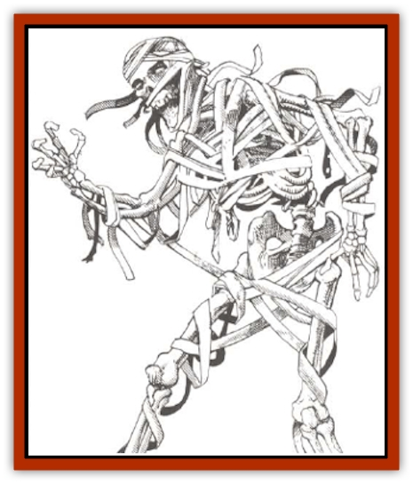

# Apparition

| Statistic | **Apparition** |
| --- | --- |
| **Activity Cycle:** | Any |
| **Alignment:** | Chaotic evil |
| **Armor Class:** | 0 |
| **Climate/Terrain:** | Any |
| **Damage/Attack:** | See below |
| **Diet:** | None |
| **Frequency:** | Very rare |
| **Hit Dice:** | 8 |
| **Intelligence:** | Average (8-10) |
| **Magic Resistance:** | Nil |
| **Morale:** | Steady (12) |
| **Movement:** | 24 |
| **No. Appearing:** | 1-4 |
| **No. of Attacks:** | 1 |
| **Organization:** | Tribal |
| **Size:** | M (4'1&rdquo;-7') |
| **Special Attacks:** | See below |
| **Special Defenses:** | Hit only by magical or silver weapons |
| **THAC0:** | See below |
| **Treasure:** | E |
| **XP Value:** | 1,400 |

Apparitions are a particularly horrible and persistent form of undead, existing primarily on the Ethereal Plane. They are able to move easily between the Ethereal Plane and the Prime Material Plane twice per day, requiring only one round for the transition.

They appear on the Prime Material Plane as [[Skeleton|skeletons]], loosely shrouded with filthy bandages. They are semi-solid in form only during any round in which they are attacking; otherwise, they are airy and insubstantial.

**Combat:** Apparitions have the ability to "pop in" from any solid, non-living object, such as walls, floors, or furniture. Opponents therefore suffer a -5 to their surprise rolls.

Apparitions can telepathically sense any creature of greater than 5 Intelligence at a range of 100 feet in any direction, although they have no other psionic abilities. Since they are noncorporeal, apparitions can travel directly to their intended destination without being hindered by clumsy physical barriers such as locked doors.

The apparition is not able to physically attack its victim. Rather, it uses an improved form of *suggestion*, an innate ability, to convince the victim that he/she is being strangled by its bony claws. There is no need to make an attack roll for this attack. Victims must make an Intelligence check at -4 to disbelieve, even if they are aware that they are being attacked by an apparition. A successful check means that the victim cannot thenceforth be harmed by that particular apparition. A failure means the victim must make a Constitution check: success means the victim flees as though affected by a fear spell for 1-4 rounds (during which time the apparition may attack again); failure means the victim has been literally "scared to death". The victim will immediately die of fright, unless a *remove fear* spell is cast upon him/her in the same round as the attack. *Protection from evil* or *protection from evil, 10' radius* spells already in effect at the time of the attack will assure a successful Constitution check. If the slain victim's life is restored, he/she will forever after automatically fail his/her Intelligence roll to disbelieve. However, if a slain victim is not restored to life within 24 hours, he/she will rise as an apparition 2-8 hours later.

Apparitions can be attacked on the Prime Material Plane only during the one melee round it takes them to attack their victim. Only magical or silver weapons can affect the apparition in this form. On its home plane, it can be attacked normally. The apparition has an AC of 5 on the Ethereal Plane.

An apparition can be turned by a cleric as though it were a spectre or 8 HD undead creature.

**Habitat/Society:** Apparitions have no structured society, although newly-created apparitions will often stay close to the apparition which killed them until they adjust to their new circumstances. They do not build dwellings, nor do they have lairs, as they have no need of either sleep or sustenance. Any incidental treasure they may have found is generally left at the scene of combat.

**Ecology:** An apparition which is "killed" on the Prime Material Plane will reform on the Ethereal Plane in 5-8 days, and will seek out its killer as soon as it is able. Only by killing it on its home plane can it be truly destroyed.

Victims who are left by their party to become apparitions will often (80%) seek out the surviving members of their band in an attempt to inflict the same fate on them.

---
## Discovery & Documentation

**Source Publication:** MC14 Fiend Folio Appendix (1992)
**Campaign Setting:** Fiends Folio
**Author(s):** Don Bingle, John Terra, Wes Nicholson, Tim Beach, Steve Hardinger, Kris Hardinger, Rob Nicholls, Greg Swedberg, Al Boyce, Vince Garcia, Norm Ritchie

### Other Creatures Found in This Source Book
   * [[Aballin|Aballin]]
   * [[Achaierai|Achaierai]]
   * [[Adherer|Adherer]]
   * [[Algoid|Algoid]]
   * [[Al-Mi'raj|Al-Mi'raj]]
   * [[Caterwaul|Caterwaul]]
   * [[Coffer_Corpse|Coffer Corpse]]
   * [[Crabman|Crabman]]
   * [[Dark_Creeper|Dark Creeper]]
   * [[Dark_Stalker|Dark Stalker]]
   * [[Darter|Darter]]
   * [[Denzelian|Denzelian]]
   * [[Dune_Stalker|Dune Stalker]]
   * [[Dwarf_Urdunnir|Dwarf, Urdunnir]]
   * [[Falcon_Fire|Falcon, Fire]]
   * [[Faux_Faerie|Faux Faerie]]
   * [[Flawder|Flawder]]
   * [[Fyrefly|Fyrefly]]
   * [[Gambado|Gambado]]
   * [[Garbug|Garbug]]
   * [[Giant_Fhoimorien|Giant, Fhoimorien]]
   * [[Gibberling|Gibberling]]
   * [[Gorbel|Gorbel]]
   * [[Grimlock|Grimlock]]
   * [[Hellcat|Hellcat]]
   * [[Ice_Lizard|Ice Lizard]]
   * [[Iron_Cobra|Iron Cobra]]
   * [[Khargra|Khargra]]
   * [[Mantari|Mantari]]
   * [[Penanggalan|Penanggalan]]
   * [[Pernicon|Pernicon]]
   * [[Phantom_Stalker|Phantom Stalker]]
   * [[Retriever|Retriever]]
   * [[Ruve|Ruve]]
   * [[Scathe|Scathe]]
   * [[Sheet_Ghoul_Sheet_Phantom|Sheet Ghoul/Sheet Phantom]]
   * [[Shocker|Shocker]]
   * [[Spanner|Spanner]]
   * [[Stwinger|Stwinger]]
   * [[Sussurus|Sussurus]]
   * [[Symbiotic_Jelly|Symbiotic Jelly]]
   * [[Terithran|Terithran]]
   * [[Thunder_Children|Thunder Children]]
   * [[Troll_Ice|Troll, Ice]]
   * [[Tween|Tween]]
   * [[Umpleby|Umpleby]]
   * [[Volt|Volt]]
   * [[Xill|Xill]]
   * [[Xvart|Xvart]]
   * [[Zygraat|Zygraat]]
