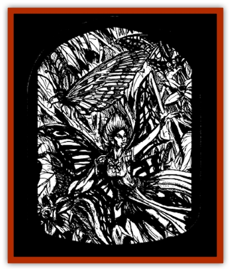

# Arak - Alven

| Statistic | **Arak, Alven** |
| --- | --- |
| **Activity Cycle:** | Night |
| **Alignment:** | Chaotic good |
| **Armor Class:** | 2 |
| **Climate/Terrain:** | The Shadow Rift |
| **Damage/Attack:** | 1 point |
| **Diet:** | Flowers, nectar |
| **Frequency:** | Rare |
| **Hit Dice:** | 1 |
| **Intelligence:** | High (13-14) |
| **Magic Resistance:** | 75% |
| **Morale:** | Unsteady (5-7) |
| **Movement:** | 9, F1 15 (A) |
| **No. Appearing:** | 2d4 |
| **No. of Attacks:** | 1 |
| **Organization:** | Clan |
| **Size:** | T (1' tall) |
| **Special Attacks:** | Spells (3/3/1), wing dance (enthralls or cause blindness and deafness) |
| **Special Defenses:** | +3 or better magical weapon to hit; immune to stone weapons, electricity, and lightning |
| **THAC0:** | 19 |
| **Treasure:** | Q |
| **XP Value:** | 1,400 |

The alven are a diminutive race of winged [[Arak_General_Information|Arak]] easily mistaken for fairies, [[Sprite|pixies]], and other such creatures. They are fond of flowers and plants, having great skill as farmers and gardeners.

Adult alven stand between ten and fourteen inches in height and have butterflylike wings. Their skin is a leafy green in color, and their bright orange hair has earned them the nicknames <q>carrot-tops</q> and <q>fire flits</q>. Alven favor light, silky clothes made from spider's silk, which they dye shades of orange and green.

Alven have the ability to change themselves into both bumblebees and butterflies (most prefer the latter). They can spend up to twelve hours a day in this form, changing back and forth at will, as long as they do not exceed the total duration in any twenty-four hour period. When encountered they are often found cavorting in butterfly-form.

The alven speak the language of all shadow elves, although they do so with a sing-song lilt. Their voices are soft and high-pitched, so listeners must pay close attention.

**Combat:** These tiny creatures avoid physical combat whenever possible. When called upon to defend themselves, they generally rely on their magical abilities. If someone actually gets close enough to attack, alven employ pinlike daggers and swords that inflict one point of damage per attack.

Alven cast spells of the plant sphere as if they were 5th-level clerics.

When called upon to defend themselves, alven flit about in apparently random patterns, dodging and interweaving. Anyone who looks upon this <q>wing dance</q> must make two saving throws vs. spell. Failure of the first leaves the viewer *enthralled*, as per the spell. Failure of the second causes him or her to be instantly stricken both deaf and blind (as per the spells *deafness* and *blindness*).

Only cold-wrought iron weapons or those of +3 or greater enchantment can harm fire flits. Also, they are immune to stone weapons (including obsidian), even if magical, and to lightning or electricity-based attacks.

Exposure to direct sunlight is harmful to the alven, whatever their form. Each round that an alven is exposed to direct sunlight, it suffers one point of damage, first its wings and then its skin burning and crackling. If the light is filtered, as on a cloudy or overcast day, the damage slows to one point per turn.

The natural affinity that alven have for flowers, plants, and other growing things gives them the ability to travel freely and easily from place to place, actually being guided by the flora around them. When in such surroundings, these creatures act as if using a *find the path* spell. (This ability does not function in places devoid of plant life.)

Alven also have superior infravision (120 feet) and keen senses of smell that enable them to detect invisible creatures within 120 feet.

**Habitat/Society:** The alven live in underground warrens beneath beautiful gardens or fields of wildflowers. They are vigilant defenders of their homes, quickly lashing out at those who pick the flowers without permission or damage their plants. It is said the best way to make friends with an alven is to compliment its garden or leave a gift of seeds. Presenting an alien with cut flowers, however, is insulting and sure to draw its wrath.

**Ecology:** Alven tend to the gardens and groves of the Arak. They finalize in night-blooming plants but are fond of all manner of growing things. The alven sometimes visit mortal realms to examine their gardens and hone their horticultural skills. If they find a person with an exceptionally green thumb, they may take him or her back to the Shadow Rift and transform him of her into a <a href="">changeling</a>.

---
## Discovery & Documentation

**Source Publication:** The Shadow Rift (1998)
**Campaign Setting:** Ravenloft
**Author(s):** William W. Connors, John D. Rateliff, Cindi Rice

### Other Creatures Found in This Source Book
   * [[Arak_General_Information|Arak, General Information]]
   * [[Arak_Brag|Arak, Brag]]
   * [[Arak_Fir|Arak, Fir]]
   * [[Arak_Muryan|Arak, Muryan]]
   * [[Arak_Portune|Arak, Portune]]
   * [[Arak_Powrie|Arak, Powrie]]
   * [[Arak_Shee|Arak, Shee]]
   * [[Arak_Sith|Arak, Sith]]
   * [[Arak_Teg|Arak, Teg]]
   * [[Avanc|Avanc]]
   * [[Changeling_Kin|Changeling (Kin)]]
   * [[Crimson_Bones|Crimson Bones]]
   * [[Grim|Grim]]
   * [[Saugh_Dearg-Due|Saugh, Dearg-Due]]
   * [[Saugh_Gossamer|Saugh, Gossamer]]
   * [[Treant_Evil_Blackroot|Treant, Evil (Blackroot)]]
