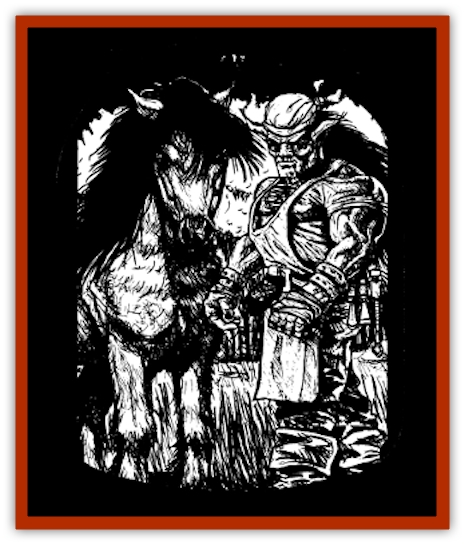

# Arak - Brag

| Statistic | **Arak, Brag** |
| --- | --- |
| **Activity Cycle:** | Night |
| **Alignment:** | Lawful neutral |
| **Armor Class:** | 4 |
| **Climate/Terrain:** | The Shadow Rift |
| **Damage/Attack:** | 1d4+1 (fist or hoof) |
| **Diet:** | Vegetarian (grains) |
| **Frequency:** | Uncommon |
| **Hit Dice:** | 4 |
| **Intelligence:** | High (13-14) |
| **Magic Resistance:** | 30% |
| **Morale:** | Average (8-10) |
| **Movement:** | 12 (2-legged) or 18 (4-legged) |
| **No. Appearing:** | 2d6 |
| **No. of Attacks:** | 2 |
| **Organization:** | Clan |
| **Size:** | S (3' tall) |
| **Special Attacks:** | Spells (4/2/1), sleep, delusion |
| **Special Defenses:** | +2 or better magical weapon to hit; immune to wooden weapons, cold, and ice magic |
| **THAC0:** | 16 |
| **Treasure:** | Q |
| **XP Value:** | 3,000 |

Brag are a wild-eyed race of [[Arak_General_Information|Arak]] who are fond of hard work, amusing tales, and skill in carpentry, stonework, and other such crafts.

Mature brag stand between thirty and thirty-six inches in height but are less stout and muscular as dwarves. Their hair, eyes, and fingernails are all a deep black, although their skin is an almost albino white. Brag wear their hair back in long tails that look very much like the mane of a horse. Most brag clothing is white, especially the kerchiefs they tie about their heads like caps.

Brag have the ability to change themselves into [[Horse|ponies]]. They can spend up to twelve hours a day in this form. changing back and forth at will, as long as they do not exceed the total duration in any twenty-four hour period.

The brag speak their own language, which consists of nickering and snorting. They are skilled engineers and love to carry on very technical conversations about such matters as stoneworking, engineering, architecture, and the like.

**Combat:** Although fairly small in stature, brag are feisty and stubborn. They are not opposed to physical violence when needed and even enjoy wrestling and similar tests of strength. When brag enter into combat they either punch with their fists or turn into pony form and lash out with their hooves. Anyone struck in melee by a brag's fist or hoof must save vs. spell or suffer the delusion that he or she is a horse (the hero walks on all fours and makes all attacks with his or her "hooves"; the character is allowed a new saving throw each day at a cumulative -1 penalty.

Like all races of Arak, the brag have magical abilities and can cast spells from the abjuration school as if they were 5th-level mages.

The piercing black eyes of a brag can have a most distressing effect on mortals. If the Arak desires it, any human or demihuman who meets the gaze of a brag must make a successful saving throw vs. spell or suffer the effects of a *sleep* spell (normal resistance stall applies).

Only leather weapons (such as whips) or those of +2 or greater enchantment can harm brag. They are altogether immune to wooden weapons, even if magical, and to cold or ice-based attacks.

Exposure to direct sunlight is harmful to brag in either form. Each round that a brag is exposed to direct sunlight, it suffers two points of damage, its skin burning and crackling. If the light is filtered, as on a cloudy or overcast day, the damage slows to two points per turn.

Brag are skilled climbers, a talent very useful in their role as laborers and builders. Because of this, they are able to climb wails per the thief skill, with a 75% chance of success. Brag also have superior infravision (120 feet).

**Habitat/Society:** The brag live in whitewashed cottages made from stone, with an adjoining structure that serves as a workshop for the family group. Cairns often mark the boundaries of a brag's property, although low stone fences are not uncommon. All brag stonework is unmortered. The best way to befriend a brag is to show it an architectural secret it did not know before - for example, how a flying buttress works. They reward their friends with very potent brag ale.

**Ecology:** The brag are a race of builders and laborers. In the regions around the Shadow Rift, especially in Tepest, a difficult task (like a barn-raising) is described as brag-work.

The brag occasionally make forays into human villages to steal tools or building supplies. If these things are easy to obtain, they simply take them and leave. If they are locked away and difficult to get at, the brag ransack the place. Sometimes they scrutinize buildings under construction, either aiding or hindering the work depending on their respect (or lack of it) for the workmanship. Many a dependable craftsman has left a job half-finished at nightfall, only to find it finished at sunrise.

On occasion, a clan of brag capture a human carpenter or builder who has shown himself or herself to be of exceptional skill. Such folk are brought into the Shadow Rift and made into [[Changeling_Kin|changeling]].

---
## Discovery & Documentation

**Source Publication:** The Shadow Rift (1998)
**Campaign Setting:** Ravenloft
**Author(s):** William W. Connors, John D. Rateliff, Cindi Rice

### Other Creatures Found in This Source Book
   * [[Arak_General_Information|Arak, General Information]]
   * [[Arak_Alven|Arak, Alven]]
   * [[Arak_Fir|Arak, Fir]]
   * [[Arak_Muryan|Arak, Muryan]]
   * [[Arak_Portune|Arak, Portune]]
   * [[Arak_Powrie|Arak, Powrie]]
   * [[Arak_Shee|Arak, Shee]]
   * [[Arak_Sith|Arak, Sith]]
   * [[Arak_Teg|Arak, Teg]]
   * [[Avanc|Avanc]]
   * [[Changeling_Kin|Changeling (Kin)]]
   * [[Crimson_Bones|Crimson Bones]]
   * [[Grim|Grim]]
   * [[Saugh_Dearg-Due|Saugh, Dearg-Due]]
   * [[Saugh_Gossamer|Saugh, Gossamer]]
   * [[Treant_Evil_Blackroot|Treant, Evil (Blackroot)]]
