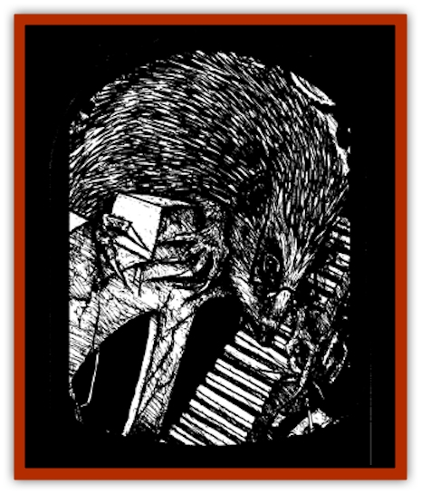

# Arak - Fir

| Statistic | **Arak, Fir** |
| --- | --- |
| **Activity Cycle:** | Night |
| **Alignment:** | Neutral good |
| **Armor Class:** | 4 |
| **Climate/Terrain:** | The Shadow Rift |
| **Damage/Attack:** | 1d4+1 (fingers) |
| **Diet:** | Omnivore |
| **Frequency:** | Rare |
| **Hit Dice:** | 3 |
| **Intelligence:** | Exceptional (15-16) |
| **Magic Resistance:** | 30% |
| **Morale:** | Average (8-10) |
| **Movement:** | 9 |
| **No. Appearing:** | 2d6 |
| **No. of Attacks:** | 1 |
| **Organization:** | Clan |
| **Size:** | S (3' tall) |
| **Special Attacks:** | Spells (4/2/1), charm, confusion, mechanical devices |
| **Special Defenses:** | +2 or better magical weapon to hit; immune to stone weapons, cold, and ice |
| **THAC0:** | 17 |
| **Treasure:** | Q |
| **XP Value:** | 3,000 |

The fir are a clever, cunning breed who are fascinated by clockwork, machinery, and other works of precision and engineering. They are tinkers and inventors who delight in fine work and quality craftsmanship.

In their humanoid form, fir are a slender, almost spritelike race of [[Arak_General_Information|Arak]] with very, very long fingers so thin that they taper almost to needle-like points. They are noted for their wide intelligent eyes, pale skin, and long silver hair. Fir dress in various shades of purple, ranging from indigo to violet.

Fir have the ability to change themselves into [[Mammal_Small|hedgehogs]]. They can spend up to twelve hours a day in this form, changing back and forth at will, so long as they do not exceed the total duration in any twenty-four hour period.

The fir are fluent in the common language of all Arak. They tend to speak in long. flowery prose, especially when discussing craftsmanship and inventions.

**Combat:** Fir are not skilled warriors, having almost no interest in warfare or battle (although they are fascinated by catapults and other engines of war). When forced to enter battle, they stab with their long pointed fingers for 1d4+1 points of damage. Usually, however, they either rely on others to protect them or else use small mechanical devices (small clockwork men, wind-up attack birds, booby traps, and the like) to occupy their attackers while they escape. None of these devices, if captured, works for anyone but the fir.

A fir's conversation is often defense enough. Anyone listening to one go on and on about some projected design must successfully save vs. spell or suffer *confusion* as per the spell. (The DM is encouraged to roleplay this effect by babbling on and on disjointedly.)

The eyes of a fir constantly sparkle and twinkle with magical light. In most cases, this is merely a fascinating characteristic to observe. When the fir wishes, however, the glint in its eye can *charm person* (per the spell) in order to ensure a captive audience. Anyone who meets the fir's gaze must make a successful saving throw vs. spell to avoid its effects. A character so charmed will be forced to endure hour after hour of the fir's excruciatingly detailed description of some clockwork project the fir has not yet quite perfected.

In addition, fir can cast spells of the creation and guardian spheres as 5th-level clerics.

Only tin weapons or those with a +2 or greater enchantment can harm fir. Also, they are immune to stone weapons, even if magical, and cold- or ice-based attacks.

Fir are quite sensitive to direct sunlight. Each round of exposure causes it to suffer two points of damage, its skin burning and crackling while it wails in agony. If the light is filtered, as on a cloudy or overcast day, the damage slows to two points per turn.

The fir are a breed of skilled craftsmen, able to easily repair complex devices like clocks and watches. They sometimes create clockwork men to aid them in their work by lifting and carrying; these typically are made of brass and have AC 5 and 2 HD. Fir also have superior infravision (120 feet), and their nimble fingers give them a 75% chance to pick pockets.

**Habitat/Society:** Fir live in homes made of many small, multi-level compartments, each littered with tools, gears, and diagrams. Typically these dwellings are in hollowed-out trees or in underground cavern complexes. They are always very well-hidden (90% camouflage).

Fir alternate between two states: an intent working phase when they labor nonstop and a ruminating stage when they meditate on their next project.

**Ecology:** Fir will eat almost anything. When working, they rarely notice what it is and may skip meals for days at a time. When in meditative mode. they prefer slugs above all else but will also eat grubs, worms, bugs, and other such small fry.

From time to time, a fir will make its way into the mortal lands in hopes of stealing small devices. tools. or parts. If these expeditions bring to their attention a craftsman of unusual talent, he or she may be brought back to the Shadow Rift and made into a [[Changeling_Kin|changeling]].

---
## Discovery & Documentation

**Source Publication:** The Shadow Rift (1998)
**Campaign Setting:** Ravenloft
**Author(s):** William W. Connors, John D. Rateliff, Cindi Rice

### Other Creatures Found in This Source Book
   * [[Arak_General_Information|Arak, General Information]]
   * [[Arak_Alven|Arak, Alven]]
   * [[Arak_Brag|Arak, Brag]]
   * [[Arak_Muryan|Arak, Muryan]]
   * [[Arak_Portune|Arak, Portune]]
   * [[Arak_Powrie|Arak, Powrie]]
   * [[Arak_Shee|Arak, Shee]]
   * [[Arak_Sith|Arak, Sith]]
   * [[Arak_Teg|Arak, Teg]]
   * [[Avanc|Avanc]]
   * [[Changeling_Kin|Changeling (Kin)]]
   * [[Crimson_Bones|Crimson Bones]]
   * [[Grim|Grim]]
   * [[Saugh_Dearg-Due|Saugh, Dearg-Due]]
   * [[Saugh_Gossamer|Saugh, Gossamer]]
   * [[Treant_Evil_Blackroot|Treant, Evil (Blackroot)]]
