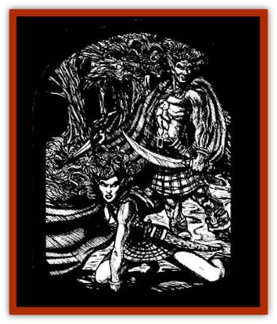

# Arak - Muryan

| Statistic | **Arak, Muryan** |
| --- | --- |
| **Activity Cycle:** | Night |
| **Alignment:** | Chaotic neutral |
| **Armor Class:** | 2 |
| **Climate/Terrain:** | The Shadow Rift |
| **Damage/Attack:** | 1d6 (by weapon) |
| **Diet:** | Omnivore |
| **Frequency:** | Uncommon |
| **Hit Dice:** | 5 |
| **Intelligence:** | High (13-14) |
| **Magic Resistance:** | 15% |
| **Morale:** | Fanatic (17) |
| **Movement:** | 15 |
| **No. Appearing:** | 2d4 |
| **No. of Attacks:** | 1 |
| **Organization:** | Clan |
| **Size:** | M (5' tall) |
| **Special Attacks:** | Spells (4/2/1), dance, slow, deafness, blindness |
| **Special Defenses:** | +1 or better magical weapon to hit; immune to wooden weapons, lightning and electricity |
| **THAC0:** | 15 |
| **Treasure:** | Q |
| **XP Value:** | 5,000 |

Muryan are the warriors of [[Arak_General_Information|Arak]] society. Both violent and aggressive, these creatures are known both for the bloodthirsty, berserk rages that overtake them in battle and the smooth grace in which they conduct them.

A muryan stands as tall as a man, with the finely muscled limbs of an athlete. They are often clad in gray cloaks and kilts and have wild hair that tangles and coils about their head almost like the asps of a medusa. No muryan is ever seen without a weapon on his or her person of close at hand.

Muryan have the ability to change themselves into [[Mammal_Small|ferrets]]. They can spend up to three hours a day in this form, changing back and forth at will, as long as they do not exceed the total duration in any twenty-four hour period.

The muryan are a tight-lipped folk, although they speak the language of the shadow elves as well as any other breed of Arak. In battle, the Dancing Men sometimes hum pleasantly, a trait which can unnerve their enemies.

**Combat:** Muryan are quick to enter battle, although they do not do so needlessly. When attacking, they depend upon wickedly-curving scimitars and slender long bows, both of which inflict 1d6 points of damage. Muryan depend more upon ferocity in combat than tactics.

Anyone struck by the bunyan in melee must make two saving throws vs. spell. Failure of the first causes the hero to begin to <q>dance</q>, suffering a -4 penalty to attack rolls and Armor Class. Often the muryan will match its movements to those of its battle-partner in an eerie dance of death. Failure of the second causes the person struck to be struck blind, as if targeted by a *blindness* spell.

In addition, anyone within 30 feet of a fighting muryan must make two more saving throws vs. spell. Failure of the first causes that character to be *slowed* for the duration of the combat, while failing the second renders the target deaf, as if struck by a *deafness* spell.

These abilities, plus their undoubted battle-prowess, make the Dancing Men terrible foes indeed, from whom more than one battle-hardened adventurer has fled at second sight. If this were not enough, muryan can cast spells from the school of invocation/evocation as 5th-level mages.

Only mithral weapons or those with a +1 or greater enchantment can harm bunyan; they are immune to wooden weapons, even if magical, and to lightning- or electricity-based attacks.

Exposure to direct sunlight is very harmful to the bunyan in either form. When a dancing man is exposed to direct sunlight, he or she must successfully save vs. spell or begin to thrash about wildly, suffering three points of damage per round as its hair burns and its skin smolders and crackles. If the light is filtered, as on a cloudy or overcast day, the damage slows to three points per turn.

Because of their knowledge of traps and ambushes, the muryan have mastered the ability to find and remove traps (per thief ability) with a 75% chance of success. Muryan also have superior infravision (120 feet).

**Habitat/Society:** The muryan are quick to attack if they see a chance to hone their battle-skills. They care little for the rules of war that humans seem to be fond of and often adopt tactics that human generals consider barbaric or uncivilized. They respect worthy opponents, however, and may hold back in combat in order to study their foe's tactics and technique.

**Ecology:** Muryan are eerily graceful in battle, striking with extreme grace and deadly intent. When a warrior of great skill is defeated in battle, he or she may be spared so that the hero can be taken back to the Shadow Rift and made into a [[Changeling_Kin|changeling]].

---
## Discovery & Documentation

**Source Publication:** The Shadow Rift (1998)
**Campaign Setting:** Ravenloft
**Author(s):** William W. Connors, John D. Rateliff, Cindi Rice

### Other Creatures Found in This Source Book
   * [[Arak_General_Information|Arak, General Information]]
   * [[Arak_Alven|Arak, Alven]]
   * [[Arak_Brag|Arak, Brag]]
   * [[Arak_Fir|Arak, Fir]]
   * [[Arak_Portune|Arak, Portune]]
   * [[Arak_Powrie|Arak, Powrie]]
   * [[Arak_Shee|Arak, Shee]]
   * [[Arak_Sith|Arak, Sith]]
   * [[Arak_Teg|Arak, Teg]]
   * [[Avanc|Avanc]]
   * [[Changeling_Kin|Changeling (Kin)]]
   * [[Crimson_Bones|Crimson Bones]]
   * [[Grim|Grim]]
   * [[Saugh_Dearg-Due|Saugh, Dearg-Due]]
   * [[Saugh_Gossamer|Saugh, Gossamer]]
   * [[Treant_Evil_Blackroot|Treant, Evil (Blackroot)]]
