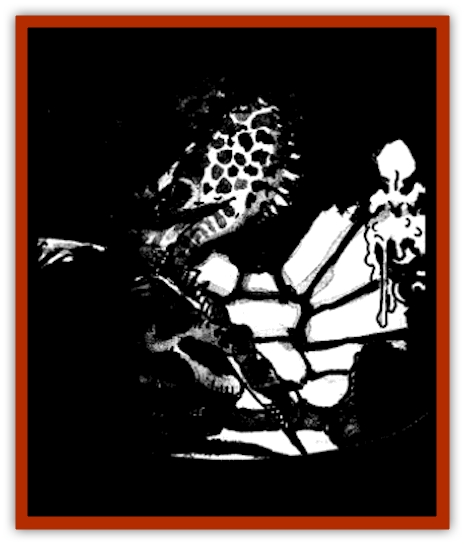

# Arak - Portune

| Statistic | **Arak, Portune** |
| --- | --- |
| **Activity Cycle:** | Night |
| **Alignment:** | Lawful good |
| **Armor Class:** | -2 |
| **Climate/Terrain:** | The Shadow Rift |
| **Damage/Attack:** | 1d2 + special |
| **Diet:** | Omnivore |
| **Frequency:** | Very rare |
| **Hit Dice:** | 2 |
| **Intelligence:** | Genius (17-18) |
| **Magic Resistance:** | 45% |
| **Morale:** | Unreliable (2-4) |
| **Movement:** | 3 |
| **No. Appearing:** | 1 |
| **No. of Attacks:** | 1 |
| **Organization:** | Solitary |
| **Size:** | T (6&rdquo; tall) |
| **Special Attacks:** | Spells (3/3/1), fumble, mortifying wound |
| **Special Defenses:** | +3 or better magical weapon to hit; immune to wooden weapons, heat, and fire |
| **THAC0:** | 18 |
| **Treasure:** | Q |
| **XP Value:** | 3,000 |

The portune are a somber and scholarly breed of [[Arak_General_Information|shadow elf]] who practice medicine and healing. They are skilled alchemists, a trait that carries over and makes them fine cocks, masterful vintners, and excellent herbalists. Portune are especially fond of clever wordplay.

They very rarely take their humanoid forms, but when they do portune are tiny black-skinned creatures with mothlike wings who never stand more than six inches in height. They have white hair, white eyes devoid of irises or pupils, and slender fingers.

Portune spend most of their time in animal form, either as turtles (the males) or asps (the females). They can remain in these forms for as long as they want, sometimes not resuming their true shapes for years.

Portune speak the common language of all the Arak, but because of their interest in word games and languages odd quirks they also tend to speak at least a little bit of a dozen of more other languages, from the arcane to the mundane.

**Combat:** Portune dislike violence, no doubt because of their role as healers, and usually withdraw if threatened. Still, when forced to defend themselves, they can deliver small bites that do not heal, even with the application of clerical spells; only a *wish* or the ministrations of the portune who inflicted the injury, will close the wound. In addition, anyone attacking a fortune must successfully save vs. spell or suffer the effects of a *fumble*. 

Portune can cast spells of the healing sphere as if they were 5th-level clerics.

Only copper weapons or those of +3 or greater enchantment can harm a fortune, Also, they are immune to wooden weapons, even if magical, and to heat or fire-based attacks.

Exposure to direct sunlight is harmful to the portune in either form. A portune exposed to direct sunlight suffers one point of damage every other round, its shell or scales smoldering. If the light is filtered, as on a cloudy or overcast day, the damage slows to one point every other turn.

All portune are skilled herbalists, a talent that enables them to *detect poisons* (as per the spell of that name) with a 75% chance of success. In addition, they have great knowledge of medicinal plants and can cure almost any disease or condition, including poisoning. (The males carry these herbs with them in or on their shells, the females stash them nearby where they can be quickly fetched if needed.) Portune have poor vision and infravision but very keen hearing.

**Habitat/Society:** The portune are wanderers who may be encountered in almost any terrain as they pursue various <q>research projects</q>. They tend to make their homes in marshy regions where many of the strange and interesting plants and fungi they work with can be readily gathered. They dig small burrows in small patches of higher ground, often concealed by clusters of cattails. A portune home is likely to have a nest of friendly vipers nearby, acting both as protectors and a source of (medicinal) venom.

**Ecology:** Portune are compassionate people who do not like to see others suffer. When they find wounded humans and demihumans, they always pause to do what they can for them. They occasionally make forays into human lands on one of their research projects or to study human medicine. If a skilled healer comes to their attention, they may take up residence in his or her home to study this mortal's craft. If they are impressed, the portune may either teach him or her some herblore or bring the person back to the Shadow Rift to become a [[Changeling_Kin|changeling]].

---
## Discovery & Documentation

**Source Publication:** The Shadow Rift (1998)
**Campaign Setting:** Ravenloft
**Author(s):** William W. Connors, John D. Rateliff, Cindi Rice

### Other Creatures Found in This Source Book
   * [[Arak_General_Information|Arak, General Information]]
   * [[Arak_Alven|Arak, Alven]]
   * [[Arak_Brag|Arak, Brag]]
   * [[Arak_Fir|Arak, Fir]]
   * [[Arak_Muryan|Arak, Muryan]]
   * [[Arak_Powrie|Arak, Powrie]]
   * [[Arak_Shee|Arak, Shee]]
   * [[Arak_Sith|Arak, Sith]]
   * [[Arak_Teg|Arak, Teg]]
   * [[Avanc|Avanc]]
   * [[Changeling_Kin|Changeling (Kin)]]
   * [[Crimson_Bones|Crimson Bones]]
   * [[Grim|Grim]]
   * [[Saugh_Dearg-Due|Saugh, Dearg-Due]]
   * [[Saugh_Gossamer|Saugh, Gossamer]]
   * [[Treant_Evil_Blackroot|Treant, Evil (Blackroot)]]
