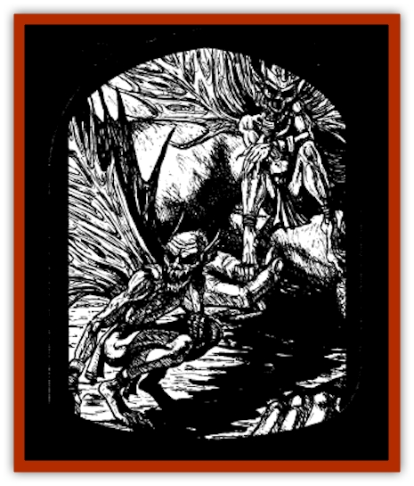

# Arak - Powrie

| Statistic | **Arak, Powrie** |
| --- | --- |
| **Activity Cycle:** | Night |
| **Alignment:** | Chaotic evil |
| **Armor Class:** | 2 |
| **Climate/Terrain:** | The Shadow Rift |
| **Damage/Attack:** | 1 point (dagger) or 1d4 (bite) |
| **Diet:** | Omnivore |
| **Frequency:** | Common |
| **Hit Dice:** | 5 |
| **Intelligence:** | High (13-14) |
| **Magic Resistance:** | 45% |
| **Morale:** | Fanatic (17-18) |
| **Movement:** | 9, fly 15 (A) |
| **No. Appearing:** | 2d4 |
| **No. of Attacks:** | 1 |
| **Organization:** | Clan |
| **Size:** | T (1' tall) |
| **Special Attacks:** | Spells (4/2/1), fear, backstab, shriek |
| **Special Defenses:** | +3 or better magical weapon to hit; immune to steel weapons, electricity, and lightning |
| **THAC0:** | 15 |
| **Treasure:** | Q |
| **XP Value:** | 5,000 |

The powrie are evil and sinister creatures who delight in violence, murder, and cruel torture. Skillful assassins and masterful spies, they prosper in the Shadow Rift under the rule of [[Arak_General_Information|Loht]], acting as his eyes and ears.

Powrie are a spritelike race with wiry beards, feral teeth, and snakelike eyes. They have wasplike wings and wear caps dyed red with the blood of past victims. Most powrie wear scarlet or crimson tunics and long sashes that can be used as strangling cords or garrotes.

Powrie have the ability to change themselves into red wasps, hornets, or any other similar small flying, stinging insect (dirt dobbers, ichneumon wasp, etc.) They can spend up to three hours a day in this form, changing back and forth at will, as long as they do not exceed the total duration in any twenty-four hour period.

Powrie are insulting and offensive, even to their allies. For that reason, those of foul temperament are often said to have the voice of a powrie or a red tongue.

**Combat:** The powrie love violence and mayhem, using keen-edged daggers that inflict one point of damage or biting with their needlelike teeth for 1d4 points of damage. Anyone bit by a powrie must make a successful saving throw vs. poison or go blind (per the *blindness* spell). The powrie can also emit a high-pitched shriek, causing all within thirty feet to make a successful saving throw vs. spell or go deaf (per the *deafness* spell).

The mouth of a powrie is filled with needlelike teeth that give it a most menacing countenance. In battle, these creatures can contort their features into a maniacal grin before opening their mouths impossibly wide, requiring anyone within thirty feet who sees this to successfully save vs. spell or suffer the effects of a *fear* spell.

Powrie can cast spells from the illusion/phantasm school as 5th-level mages.

Only platinum weapons or those of +3 or greater enchantment can harm powrie. They are immune to steel weapons (which includes most normal weapons), even if magical, and lightning or electricity-based attacks.

Exposure to direct sunlight is harmful to the powrie in either form. Each round that a redcap is exposed to direct sunlight, it suffers one point of damage, its skin burning and crackling. If the light is filtered, as on a cloudy or overcast day, the damage slows to one point per turn.

Powrie are skilled assassins and have mastered the thief's ability to backstab, performing this action as 5th-level thieves and inflicting triple damage when successful. Because of the diminutive size of their weapons, they always backstab with blades treated with type-O poison. Powrie also have superior infravision (120 feet).

**Habitat/Society:** The powrie live in small paper houses much like large wasp nests. They enter and exit these dwellings through small holes, requiring them to assume insect form. The inside of a powrie nest is cluttered with souvenirs from the bodies of their victims.

**Ecology:** The powrie are deadly predators who are relentless in their attacks, allowing nothing to stop them.

From time to time, the powrie come upon a particularly despicable rogue or mercenary. Should such a character prove himself or herself to be utterly base, he or she is taken back to the Shadow Rift and transformed into a [[Changeling_Kin|changeling]].

---
## Discovery & Documentation

**Source Publication:** The Shadow Rift (1998)
**Campaign Setting:** Ravenloft
**Author(s):** William W. Connors, John D. Rateliff, Cindi Rice

### Other Creatures Found in This Source Book
   * [[Arak_General_Information|Arak, General Information]]
   * [[Arak_Alven|Arak, Alven]]
   * [[Arak_Brag|Arak, Brag]]
   * [[Arak_Fir|Arak, Fir]]
   * [[Arak_Muryan|Arak, Muryan]]
   * [[Arak_Portune|Arak, Portune]]
   * [[Arak_Shee|Arak, Shee]]
   * [[Arak_Sith|Arak, Sith]]
   * [[Arak_Teg|Arak, Teg]]
   * [[Avanc|Avanc]]
   * [[Changeling_Kin|Changeling (Kin)]]
   * [[Crimson_Bones|Crimson Bones]]
   * [[Grim|Grim]]
   * [[Saugh_Dearg-Due|Saugh, Dearg-Due]]
   * [[Saugh_Gossamer|Saugh, Gossamer]]
   * [[Treant_Evil_Blackroot|Treant, Evil (Blackroot)]]
