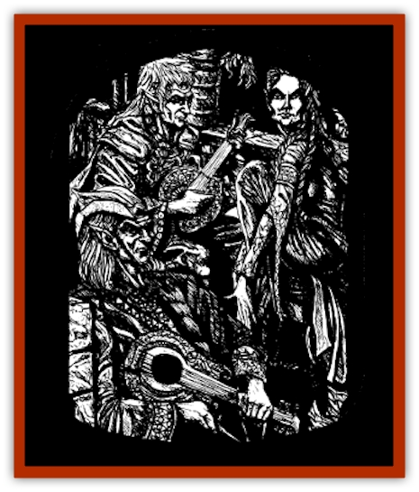
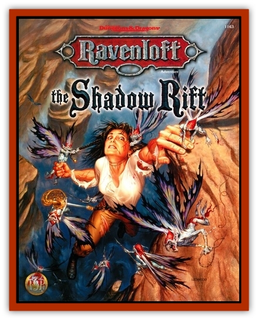

# Arak - Shee

| Statistic | **Arak, Shee** |
| --- | --- |
| **Activity Cycle:** | Night |
| **Alignment:** | Neutral |
| **Armor Class:** | 6 |
| **Climate/Terrain:** | The Shadow Rift |
| **Damage/Attack:** | 1d8 (elfshot) |
| **Diet:** | Omnivore |
| **Frequency:** | Rare |
| **Hit Dice:** | 7 |
| **Intelligence:** | Exceptional (15-16) |
| **Magic Resistance:** | 15% |
| **Morale:** | Steady (11-12) |
| **Movement:** | 15 |
| **No. Appearing:** | 1d3 |
| **No. of Attacks:** | 1 |
| **Organization:** | Clan |
| **Size:** | M (6' tall) |
| **Special Attacks:** | Spells (4/3/2/1), charm, fumble |
| **Special Defenses:** | +1 or better magical weapon to hit: immune to stone weapons, fire, and heat |
| **THAC0:** | 13 |
| **Treasure:** | Q |
| **XP Value:** | 5,000 |

The shee dominate Maeve's Seelie Court, and Maeve herself is Princess of the Shee as well as Faerie Queen. They are the most artistic of all the [[Arak_General_Information|shadow elves]], loving music, poetry, and performances of all kind.

The shee stand slightly taller than the average human, although their slender and graceful builds make them weigh far less. They are the fairest of all the fey, with pale hair, amber eyes, and very light, almost milky-white, skin. They wear silky, flowing clothes of medieval or renaissance design, always carefully chosen for best effect.

All shee have the ability to change themselves into birds; they typically choose nightingales or other songbirds, or swans if they have great distances to journey. They can spend up to eight hours a day in this form, changing back and forth at will, as long as they do not exceed the total duration in any twenty-four hour period. They never take the forms of owls, birds of prey, or carrion-birds, preferring more elegant avians.

Shee speak the language of the shadow elves, but their voices are always melodious and soft. They never seem to lose their temper or become panicked, always speaking in calm, measured tones.

**Combat:** Shee do whatever they can to avoid a fight. If pressed into battle, they use slender, rapierlike swords and elegant bows that inflict 1d8 points of damage and force the target to successfully save vs. spell or suffer a *curse*.

The kiss of a shee is highly magical and requires the recipient to make a successful saving throw vs. spell or suffer the effects of a *charm person* spell that is permanent until the shee decides to release his or her victim.

Anyone who directs a melee or missile (but not magical) attack at a shee must make a successful saving throw vs. spell or suffer the influence of a *fumble* spell. Importantly, this ability takes effect before determining the attack's success.

Shee are experts at enchantments of all types and can cast enchantment/charm spells as if they were 7th-level mages. Targets of these spells suffer a -2 penalty to their saving throws.

Only lead weapons or those of +1 or greater enchantment can harm shee. Also, they are immune to stone weapons, even if magical, and heat- or fire-based attacks.

Exposure to direct sunlight is harmful to the shee in either avian or humanoid form. Each round that a shee is exposed to direct sunlight, he or she suffers three points of damage, his or her flawless skin or well-preened feathers burning and crackling. If the light is filtered, as on a cloudy of overcast day, the damage slows to three points per turn.

The shee are masterful storytellers and serve as the keepers of history and lore for the Arak. As such, they have a vast store of knowledge to draw on. Thus, a shee has a 75% chance to know something about any given person, place, or object found in the Shadow Rift or its neighboring domains. Shee also have superior infravision (120 feet).

**Habitat/Society:** The shee are often perceived as singers and entertainers, but their role in Arak culture is actually more important than that. The shee serve as the keepers of shadow elf history and lore, a role they fell into during the centuries that their race served under the dark sorcerer-fiend Gwydion.

Shee generally make their homes at hearts of oak copses. These places are always brightly lit, elegantly furnished, and stocked with scrolls, books, and other valuable records of history and lore, plus at least one musical instrument.

**Ecology:** The shee often travel in the lands of mortals, hoping to hear stories and songs to bring back to their people. More than any other Arak, shee are fond of humans and indeed often take mortal lovers. Indeed, on rare occasions they have even married humans.

When the shee meet a particularly enthralling storyteller. they may bring him or her back to the Shadow Rift and transform him or her into a [[Changeling_Kin|changeling]].

---
## Discovery & Documentation

**Source Publication:** The Shadow Rift (1998)
**Campaign Setting:** Ravenloft
**Author(s):** William W. Connors, John D. Rateliff, Cindi Rice

### Other Creatures Found in This Source Book
   * [[Arak_General_Information|Arak, General Information]]
   * [[Arak_Alven|Arak, Alven]]
   * [[Arak_Brag|Arak, Brag]]
   * [[Arak_Fir|Arak, Fir]]
   * [[Arak_Muryan|Arak, Muryan]]
   * [[Arak_Portune|Arak, Portune]]
   * [[Arak_Powrie|Arak, Powrie]]
   * [[Arak_Sith|Arak, Sith]]
   * [[Arak_Teg|Arak, Teg]]
   * [[Avanc|Avanc]]
   * [[Changeling_Kin|Changeling (Kin)]]
   * [[Crimson_Bones|Crimson Bones]]
   * [[Grim|Grim]]
   * [[Saugh_Dearg-Due|Saugh, Dearg-Due]]
   * [[Saugh_Gossamer|Saugh, Gossamer]]
   * [[Treant_Evil_Blackroot|Treant, Evil (Blackroot)]]
