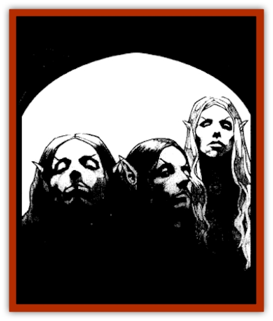

# Arak - Sith

| Statistic | **Arak, Sith** |
| --- | --- |
| **Activity Cycle:** | Night |
| **Alignment:** | Lawful evil |
| **Armor Class:** | 0 |
| **Climate/Terrain:** | The Shadow Rift |
| **Damage/Attack:** | 1d8/1d8/1d8 (needle-sharp rapier) |
| **Diet:** | Omnivore |
| **Frequency:** | Rare |
| **Hit Dice:** | 7 |
| **Intelligence:** | Genius (17-18) |
| **Magic Resistance:** | 30% |
| **Morale:** | Fearless (19) |
| **Movement:** | 15 |
| **No. Appearing:** | 2d6 |
| **No. of Attacks:** | 3 |
| **Organization:** | Clan |
| **Size:** | M (6' tall) |
| **Special Attacks:** | Spells (4/3/2/1), gaze, fear aura |
| **Special Defenses:** | Parry, +1 or better magical weapon to hit, immune to steel weapons, fire, and heat |
| **THAC0:** | 13 |
| **Treasure:** | Q |
| **XP Value:** | 6,000 |

Under the rule of Loht, the sith have risen to power and prominence among the fey of the Shadow Rift. Their love of darkness and fascination with death makes them the most sinister of the [[Arak_General_Information|Arak]].

Sith are the tallest of the shadow elves, standing just over six feet in height. They are extremely gaunt, however, and so pale skinned as to look disturbingly like undead but for the smoothness and grace of their movements. Their hair is always pure, snowy white, while their clothes are generally black and somber, highlighted with dark yellow sashes or scarves. Sith are extremely fastidious and always immaculately dressed.

Sith have the ability to change themselves into shadows - not the monsters but perfect replicas of a normal shadow like those cast by player characters. They can stay in this form indefinitely, and some of the older sith indeed have so merged with the shadows that they no longer take corporeal form at all.

The sith are able to speak the language of all the shadow elves, of course, but always speak in quiet, somber whispers. Some find their gentle voices far more disturbing than the shouts of the [[Arak_Muryan|muryan]] or [[Arak_Powrie|powrie]]. Sith also have a very morbid sense of humor ("graveyard humor") that many find unsettling.

**Combat:** The sith dislike battles, for they are messy and chaotic affairs. When forced into battle, they can attack with blinding spede, gaining three attacks every round. Any or all of these can be used to parry instead of thrust, with a successful "attack" roll on the sith's part negating a melee or missile attack by an opponent. Sith prefer slender, gentlemanly weapons like sword canes, foils, and rapiers, inflicting 1d8 points of damage per strike.

At will, the sith can radiate a magical aura that imposes images of death on the minds of their enemies. This power affects every living creature within thirty feet, causing them to make immediate fear checks. In addition, the piercing gaze of these unwholesome creatures can break the nerve of anyone who meets their gazes (successfully save vs. spell or suffer the effect of a fumble spell).

Sith can cast spells from the school of necromancy as if they were 7th-level mages.

Only silver weapons or those of +1 or greater enchantment can harm sith. Also, they are immune to steel weapons (which includes most normal weapons), even if magical, and to heat- or fire-based attacks.

Exposure to direct sunlight is dangerous to the sith, as for all shadow elves. Each round that a sith is exposed to direct sunlight, he or she suffers three points of damage, the skin literally boiling off the bones. If the light is filtered, as on a cloudy or overcast day, the damage slows to three points per turn.

The sith are a naturally reserved and quiet race. Thus, they have a 75% chance to move silently, as per the thief ability. Sith also have superior infravision (120').

**Habitat/Society:** The sith dominate the Unseelie Court (and hence Arak society) and serve Loht faithfully. With his backing, they have become the current masters of the Shadow Rift. Needless to say, their macabre bearing and sinister thoughts have begun to taint all aspects of Arak life.

Sith make their solitary homes in neolithic-style chambers inside barrows, sometimes planted round with copses of yew trees. Before inhabiting such a place, however, they must first bury alive a human there, only taking up residence after he or she has expired.

**Ecology:** Sith have a great respect for the dead and their places of rest, often decorating their homes with bones or remnants of departed friends, foes, or allies. They even pause after battle to bury of otherwise dispose of the bodies of their enemies. They find the powrie lust for death and killing offensive and the [[Arak_Teg|teg]] beneath contempt.

When the sith travel into the mortal lands, they visit places of death and burial. When they come upon someone who has been left alone in the world due to the death of a loved one, they sometimes spirit the grieving one away and make him or her into a [[Changeling_Kin|changeling]].

---
## Discovery & Documentation

**Source Publication:** The Shadow Rift (1998)
**Campaign Setting:** Ravenloft
**Author(s):** William W. Connors, John D. Rateliff, Cindi Rice

### Other Creatures Found in This Source Book
   * [[Arak_General_Information|Arak, General Information]]
   * [[Arak_Alven|Arak, Alven]]
   * [[Arak_Brag|Arak, Brag]]
   * [[Arak_Fir|Arak, Fir]]
   * [[Arak_Muryan|Arak, Muryan]]
   * [[Arak_Portune|Arak, Portune]]
   * [[Arak_Powrie|Arak, Powrie]]
   * [[Arak_Shee|Arak, Shee]]
   * [[Arak_Teg|Arak, Teg]]
   * [[Avanc|Avanc]]
   * [[Changeling_Kin|Changeling (Kin)]]
   * [[Crimson_Bones|Crimson Bones]]
   * [[Grim|Grim]]
   * [[Saugh_Dearg-Due|Saugh, Dearg-Due]]
   * [[Saugh_Gossamer|Saugh, Gossamer]]
   * [[Treant_Evil_Blackroot|Treant, Evil (Blackroot)]]
