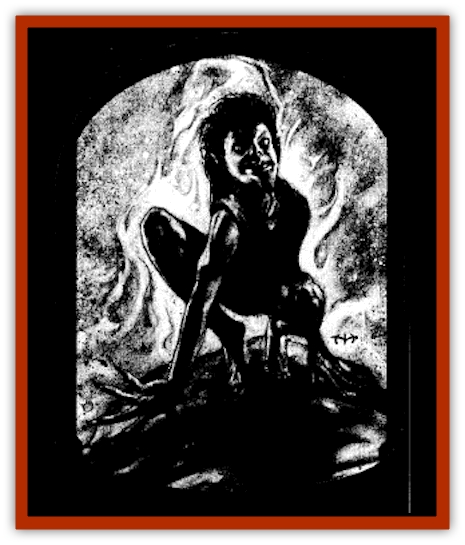

# Arak - Teg

| Statistic | **Arak, Teg** |
| --- | --- |
| **Activity Cycle:** | Night |
| **Alignment:** | Neutral evil |
| **Armor Class:** | 4 |
| **Climate/Terrain:** | The Shadow Rift |
| **Damage/Attack:** | 1d4 (claws or bite) |
| **Diet:** | Omnivore |
| **Frequency:** | Common |
| **Hit Dice:** | 3 |
| **Intelligence:** | High (13-14) |
| **Magic Resistance:** | 30% |
| **Morale:** | Average (8-10) |
| **Movement:** | 6, burrow 12 |
| **No. Appearing:** | 2d10 |
| **No. of Attacks:** | 1 |
| **Organization:** | Clan |
| **Size:** | S (3' tall) |
| **Special Attacks:** | Spells (3/3/l), grab, howl |
| **Special Defenses:** | +2 or better magical weapon to hit; immune to wooden weapons, cold, and ice |
| **THAC0:** | 17 |
| **Treasure:** | Q |
| **XP Value:** | 3,000 |

The teg are a feral race of [[Arak_General_Information|shadow elves]]. They are wild and difficult to control, ever-eager to indulge their own animalistic desires and needs. Teg run wild and are often encountered with foxes and other clever, sly hunting beasts.

The teg are small and slender but not frail by any means. They have long, pointed ears and wide face with foxlike features, large hands with wide-spread, claw-tipped fingers, evil grins that reveal pointed teeth, and the gold-flecked, emerald eyes of a cat. Their clothes are almost always shades of muddy green, which enables them to conceal themselves in the soil or foliage when stalking or when planning an ambush.

Teg have the ability to change themselves into foxes. They can spend up to six hours a day in this form, changing back and forth at will, as long as they do not exceed the total duration in any twenty-four hour period.

The teg are fluent in the common language of all Arak, but seldom speak it, preferring to use their own language of grunts, hisses, howls, and other animal sounds to communicate. Teg can speak freely with any animals normally found in temperate forests and grasslands.

**Combat:** Teg enjoy hunting more than the actual act of killing. As such, they often play with an enemy before moving in for the kill. When the teg do attack, they spring from cover, biting and clawing for 1d4 points of damage. Their favorite tactic is to burrow up beneath their prey, suddenly seizing an opponent, and then dragging him or her down below the ground where the whole pack can attack the hapless character at once.

As they attack, the teg often howl in exultation. Thiswild, haunting sound is so unnerving that it causes all those within thirty feet of the creature to make a successful saving throw vs. spell or suffer the effects of a *confusion* spell.

Teg can cast spells from the animal sphere as if they were 5th-level clerics.

Only gold weapons or those with a +2 or greater enchantment can harm teg. They are immune to wooden weapons, even if magical, and to cold- or ice-based attacks.

Exposure to direct sunlight is harmful to the teg, as for all shadow elves. For each round of exposure, the teg suffers two points of damage, its skin burning and crackling. If the light is filtered, as on a cloudy or overcast day, the damage slows to two points per turn.

As skilled hunters, the teg have mastered the ability to hide in shadows (per the thief ability). When they practice this art, they have a 75% chance of success. The teg often use this ability to lie in wait prior to an ambush or the start of a hunt. Teg also have superior infravision (120').

**Habitat/Society:** Teg make their homes in treetops, using long knotted ropes to ascend and descend from their roosts. Invariably, a fox den can be found at the base of the tree, and the animals who live there are under the charm of the teg.

**Ecology:** The teg are hunters by nature, stalking animals for meat and hides. They delight in killing. but even more they rejoice in the hunt. The longer a prey eludes them, the greater their joy at the hunt and the deeper their satisfaction when it is at last brought down.

The teg visit the mortal world only for the hunting. When they come across a bunter who lives for the chase and shares their taste for bloodletting, they sometimes bring him or her back to the Shadow Rift and transform him or her into a [[Changeling_Kin|changeling]] - if he or she can survive their stalking for an entire night.

---
## Discovery & Documentation

**Source Publication:** The Shadow Rift (1998)
**Campaign Setting:** Ravenloft
**Author(s):** William W. Connors, John D. Rateliff, Cindi Rice

### Other Creatures Found in This Source Book
   * [[Arak_General_Information|Arak, General Information]]
   * [[Arak_Alven|Arak, Alven]]
   * [[Arak_Brag|Arak, Brag]]
   * [[Arak_Fir|Arak, Fir]]
   * [[Arak_Muryan|Arak, Muryan]]
   * [[Arak_Portune|Arak, Portune]]
   * [[Arak_Powrie|Arak, Powrie]]
   * [[Arak_Shee|Arak, Shee]]
   * [[Arak_Sith|Arak, Sith]]
   * [[Avanc|Avanc]]
   * [[Changeling_Kin|Changeling (Kin)]]
   * [[Crimson_Bones|Crimson Bones]]
   * [[Grim|Grim]]
   * [[Saugh_Dearg-Due|Saugh, Dearg-Due]]
   * [[Saugh_Gossamer|Saugh, Gossamer]]
   * [[Treant_Evil_Blackroot|Treant, Evil (Blackroot)]]
