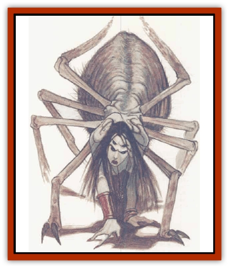

# Aranea - Savage Coast

| Statistic | **Aranea (Savage Coast)** |
| --- | --- |
| **Activity Cycle:** | Any |
| **Alignment:** | Neutral |
| **Armor Class:** | 7 |
| **Climate/Terrain:** | Any |
| **Damage/Attack:** | 1d6 (or by weapon) |
| **Diet:** | Omnivore |
| **Frequency:** | Uncommon |
| **Hit Dice:** | 3 |
| **Intelligence:** | High (13-14) |
| **Magic Resistance:** | Nil |
| **Morale:** | Steady (11-12) |
| **Movement:** | 18, Wb 12 |
| **No. Appearing:** | 1d6 |
| **No. of Attacks:** | 1 |
| **Organization:** | Clan |
| **Size:** | M (6' diameter) |
| **Special Attacks:** | Poison, spells, webbing |
| **Special Defenses:** | Spells, webbing |
| **THAC0:** | 17 |
| **Treasure:** | M,O (U) |
| **XP Value:** | 650 |

[[Spider-kin|Aranea]] are intelligent, forest-dwelling arachnoids that are skilled in magic use. They have two true forms - that of a humanoid and that of a large, intelligent [[Spider|spider]] - and can shapeshift into a hybrid form that combines the two.

In *humanoid form*, an aranea resembles one other creature, from as small as a [[Goblin|goblin]] to as large as a [[Gnoll|gnoll]]. Human, elf, and half-elf forms are common. In *spider form*, an aranea resembles a large spider, hut has an oddly-shaped lump on its back that houses its brain. Beneath its impressive mandibles, sprouting from the front of its body, are two small limbs, each about two feet long. Each of the small limbs has four fingers plus a single thumb (the fingers are many-jointed and the thumb has an extra joint). The *hybrid form* is humanoid with arachnid elements: fangs, two spinnerets (in the palm of each hand), and four eyes (the second pair often in the temples). Each finger and thumb typically has an extra joint as well. No two aranea have exactly the same hybrid form.

Most aranea are neutral, thoueh most others think them to be evil. Aranea have infravision with a range of 60 feet. Aranea have their own lanruage and each knows the native Lmguage of the race they emulate.

**Combat:** Araneas prefer to avoid physical combat when possible, relying instead on magical abilities. In arachnid form, they wait in trees for prey to pass underneath; then, they lower themselves silently on web strands and attack with spells. A victim attacked in this manner suffers a -1 penalty to surprise rolls. In humanoid or demispider form, araneas battle as per the emulated race.

Each aranea is considered to be at least a 3rd-level mage. (Araneas retain the 8-sided Hit Die up to this level, then using the appropriate Hit Die for their class.) This represents their natural relationship with magic and their initial years of training. Most are specialist wizards, preferring illusions and charms but avoiding fire-based spells. Araneas can cast spells in any of their three forms. To avoid arousing suspicion, araneas living among other humanoids keep their spellcasting abilities secret unless they are posing as mages. Most araneas do continue to pursue the magical practices - at least in private - and are higher than 3rd level. Many araneas become multi-class mages, gaining the additional benefit of swordplay or thieving abilities. Single-class thieves are not uncommon, but single-class clerics or fighters are very rare. Even as a single-class character, though, an aranea still retains its abilities as a third-level mage. This is considered more a dual-class than multi-class.

If forced into physical combat, an adult aranea can attempt to bite and inject venom into an opponent. This can only be accomplished in spider or demispider form and requires a successful attack roll. A victim who fails a saving throw vs. poison immediately feels a faint stiffness in his limbs and takes 1d4 points of damage per round for 1d4 rounds, cumulative for each successful bite. The aranean venom loses potency after a short time, so it cannot be saved and used on weapons.

Upon reaching maturity, araneas can also learn to spin webs. As with the poisonous bite, an aranea can spin or climb webs only while in arachnid or demispider form. This ability does not make araneas immune to the web spell. An aranea can produce up to 10 feet of webbing per level per day - half from each spinneret. Web strands measure ¼ inch in diameter and are strong enough to support approximately 500 pounds. Entangling an opponent with a web requires a normal attack roll. Severing a strand requires only 2 points of cutting damage (which must be inflicted in a single blow) or a successful open doors roll. Immobilizing a man-sized creature requires at least 20 feet of webbing, but considerably less is needed to entangle.

Araneas wear armor only if allowed by class. In humanoid form they have a base AC of 10. In arachnid form, they have an Armor Class of 7. If an aranea shifts into arachnid form while wearing armor, it takes damage equal to 10 points minus the AC value of the armor. Magical armor must also be removed unless it has the power to alter its size. In this case, the armor expands enough for the aranea to slip out of it during transformation.

Araneas possess 60-foot infravision and the ability to change form. The aranean shapechanging ability is natural, and young araneas have complete control within a few weeks of birth. Though not physically limited by a specific number of transformations per day, an aranea trying to maintain secrecy will never assume arachnid or demispider form among nonaranea. It requires 1 round to shift between arachnid and demispider or demispider and humanoid. Thus, changing from humanoid to arachnid or the reverse takes a minimum of 2 rounds. The demispider form is merely transitionary and can never be maintained for more than 2 rounds per level.

An aranea in humanoid form effectively becomes a member of the emulated race and possesses any special abilities that the race has to offer: hearing, special vision, familiarity with tunnels, etc.

The aranean shapechanging ability gives each aranea two true forms. For this reason, the creature's true race cannot be determined unless someone actually sees the transformation, can read the aranea's mind, or possesses some other extraordinary means. Even a *true seeing* spell is useless unless the aranea is in demispider form; if this happens, there is an equal chance that it will reveal either the aranea's humanoid or arachnid form. Since the *identify species* spell was originally invented by the araneas, it is useless against them. Though the shapechanging ability was originally gained through arcane means, neither form is truly magical, so a *dispel magic* cast on the aranea while it is in humanoid form will not cause it to revert to its arachnid form. If successfully cast on the demispider form (using the aranea's level or Hit Dice as the value of the opposing caster), there is an equal chance that the aranea will revert to its humanoid or arachnid form.

The shapechanging ability gives araneas partial immunity to *polymorph* spells, as with [[Lycanthrope_General_Information|lycanthropes]] and [[Doppelganger|doppelgangers]]. They can resume their normal form after being affected by the spell for 1 round. However, weapons designed to battle shapechangers are also more effective against araneas (as with a *sword +1, +3 versus lycanthropes and shapechangers*). Shapechanging does not restore any lost hit points and, if killed, the aranea remains in the form held just before death.

**Habitat/Society:** Araneas prefer to live in forests, the natural home of their ancestors, where they can hunt and hide. They are the secret rulers of the Magiocracy of Herath, where the cities and villages resemble those of neighboring lands, though with a more diverse mixture of races.

Araneas take great pains to conceal their dual nature, partly because of the unjust animosity felt toward them by other races. From birth, they are taught that they have two distinct identities. Individuals are forced to keep these two identities separate, never to reveal the secret to other races. Those who do are considered traitors; they are dealt with harshly and quickly by other araneas.

Due to old legends of their purported evil, araneas are almost universally despised as a sort of <q>bogeyman</q>. A revealed aranea will most likely be hunted down by everyone in the area - especially other araneas. The pose of a <q>tame</q> aranea who has <q>converted to the cause of good</q> may be possible, but it would still be hunted by other araneas.

**Ecology:** Araneas use magic to subdue their environment, shaping it to fit their desires. For this reason they can never resist magical items and will go to any extremes to obtain them. They are predators, and many enjoy the flesh of sentient beings, though these are the exception rather than the rule. Araneas are generally talented in cloth production and naturally dominate the silk market with the silk they produce.

Most araneas feel superior to other races due to their long history and special abilities. They can be cold, calculating, and secretive, but they are rarely evil. They also tend to be suspicious of others, expecting them to have secrets as well. Currently, these shapeshifters get along with the nearby races.

---
## Discovery & Documentation

**Source Publication:** Monstrous Compendium, 1996 Annual, Volume 3 (1995)
**Campaign Setting:** Advanced Dungeons & Dragons 2nd Edition
**Author(s):** Jon Pickens

### Other Creatures Found in This Source Book
   * [[Alaghi|Alaghi]]
   * [[Alhoon|Alhoon]]
   * [[Arcane_Head|Arcane Head]]
   * [[Banedead|Banedead]]
   * [[Banelich|Banelich]]
   * [[Bat_Bonebat|Bat, Bonebat]]
   * [[Beetle|Beetle]]
   * [[Belgoi|Belgoi]]
   * [[Bladeling|Bladeling]]
   * [[Braxat|Braxat]]
   * [[Bunyip|Bunyip]]
   * [[Burbur|Burbur]]
   * [[Bvanen|Bvanen]]
   * [[Cat_Great_Snow_Tiger|Cat, Great, Snow Tiger]]
   * [[Chosen_One|Chosen One]]
   * [[Chronovoid|Chronovoid]]
   * [[Cildabrin|Cildabrin]]
   * [[Coffer_Corpse|Coffer Corpse]]
   * [[Disenchanter|Disenchanter]]
   * [[Dog_Temporal|Dog, Temporal]]
   * [[Dragon_Cerilia|Dragon (Cerilia)]]
   * [[Dragon_Ghost|Dragon, Ghost]]
   * [[Dragon_Lesser_Undead|Dragon, Lesser Undead]]
   * [[Dragon_Neutral_Amber|Dragon, Neutral, Amber]]
   * [[Dread_Warrior|Dread Warrior]]
   * [[Dreamweaver|Dreamweaver]]
   * [[Dream_Spawn_Greater_Ennui|Dream Spawn, Greater, Ennui]]
   * [[Dream_Spawn_Lesser_Morph|Dream Spawn, Lesser, Morph]]
   * [[Dwarf_Arctic|Dwarf, Arctic]]
   * [[Dwarf_Urdunnir|Dwarf, Urdunnir]]
   * [[Eel_Giant_Moray|Eel, Giant Moray]]
   * [[Elemental_Fire_Kin_Tome_Guardian|Elemental, Fire Kin, Tome Guardian]]
   * [[Elf_Rockseer|Elf, Rockseer]]
   * [[Ethyk|Ethyk]]
   * [[Faerie_Faerie_Fiddler|Faerie, Faerie Fiddler]]
   * [[Faerie_Petty_Bramble|Faerie, Petty, Bramble]]
   * [[Faerie_Petty_Gorse|Faerie, Petty, Gorse]]
   * [[Faerie_Petty|Faerie, Petty]]
   * [[Firenewt|Firenewt]]
   * [[Formian|Formian]]
   * [[Gargoyle_II|Gargoyle II]]
   * [[Giant_Cerilia|Giant (Cerilia)]]
   * [[Goblin_Cerilia|Goblin (Cerilia)]]
   * [[Golem_Magic|Golem, Magic]]
   * [[Golem_Shaboath|Golem, Shaboath]]
   * [[Hag_Bheur|Hag, Bheur]]
   * [[Hamadryad|Hamadryad]]
   * [[Hound_of_Ill-Omen|Hound of Ill-Omen]]
   * [[Human_Cerilia|Human (Cerilia)]]
   * [[Hybsil|Hybsil]]
   * [[Ibrandlin|Ibrandlin]]
   * [[Imp_Chaos|Imp, Chaos]]
   * [[Ixitxachitl_Ixzan|Ixitxachitl, Ixzan]]
   * [[Jabberwock|Jabberwock]]
   * [[Kyton|Kyton]]
   * [[Kyuss_Son_of|Kyuss, Son of]]
   * [[Lillend|Lillend]]
   * [[Life-Shaped_Creation_Guardian|Life-Shaped Creation, Guardian]]
   * [[Life-Shaped_Creation_Transport|Life-Shaped Creation, Transport]]
   * [[Lycanthrope_Werecrocodile|Lycanthrope, Werecrocodile]]
   * [[Lycanthrope_Werespider|Lycanthrope, Werespider]]
   * [[Magedoom|Magedoom]]
   * [[Manotaur|Manotaur]]
   * [[Mastiff_Shadow|Mastiff, Shadow]]
   * [[Meazel|Meazel]]
   * [[Mist_Scarlet_Dancer|Mist, Scarlet Dancer]]
   * [[Needleman|Needleman]]
   * [[Orc_Neo-Orog|Orc, Neo-Orog]]
   * [[Orc_Ondonti|Orc, Ondonti]]
   * [[Owlbear_II|Owlbear II]]
   * [[Pegataur|Pegataur]]
   * [[Phaerimm|Phaerimm]]
   * [[Reggelid|Reggelid]]
   * [[Render|Render]]
   * [[Saurial|Saurial]]
   * [[Scalamagdrion|Scalamagdrion]]
   * [[Sharn|Sharn]]
   * [[Snake_Messenger|Snake, Messenger]]
   * [[Spirit_Forest_Uthraki|Spirit, Forest, Uthraki]]
   * [[Spirit_Forest_Wood_Man|Spirit, Forest, Wood Man]]
   * [[Spirit_Ice_Orglash|Spirit, Ice, Orglash]]
   * [[Spirit_Rock_Thomil|Spirit, Rock, Thomil]]
   * [[Strider_Giant|Strider, Giant]]
   * [[Tembo|Tembo]]
   * [[Temporal_Glider|Temporal Glider]]
   * [[Temporal_Stalker|Temporal Stalker]]
   * [[Tether_Beast|Tether Beast]]
   * [[Thessalmonster|Thessalmonster]]
   * [[Time_Dimensional|Time Dimensional]]
   * [[Tomb_Tapper|Tomb Tapper]]
   * [[Undead_Dragon_Slayer|Undead Dragon Slayer]]
   * [[Unicorn_Black_Toril|Unicorn, Black (Toril)]]
   * [[Vaath|Vaath]]
   * [[Vortex_Spider|Vortex Spider]]
   * [[Weredragon|Weredragon]]
   * [[Zhentarim_Spirit|Zhentarim Spirit]]
