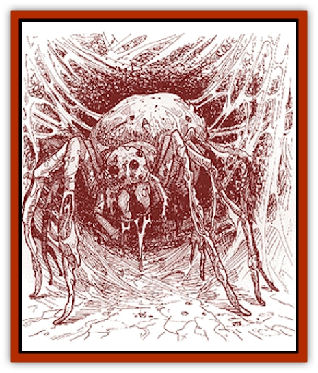

# Arashaeem

| Statistic | **Arashaeem** |
| --- | --- |
| **Activity Cycle:** | Night |
| **Alignment:** | Evil (chaotic) |
| **Armor Class:** | 3 |
| **Climate/Terrain:** | Any |
| **Damage/Attack:** | 1d8 (or by weapon) |
| **Diet:** | Carnivore |
| **Frequency:** | Very rare |
| **Hit Dice:** | 9+3 |
| **Intelligence:** | High (13-14) |
| **Magic Resistance:** | 20% |
| **Morale:** | Elite (13-14) |
| **Movement:** | 18, Wb 12 |
| **No. Appearing:** | 1 |
| **No. of Attacks:** | 1 |
| **Organization:** | Solitary |
| **Size:** | M (6' diameter) |
| **Special Attacks:** | Paralysis, spells, webbing |
| **Special Defenses:** | Spells, webbing |
| **THAC0:** | 11 |
| **Treasure:** | T,U (H) |
| **XP Value:** | 7,000 |

These undead [[Aranea_Savage_Coast|araneas]] retain the High Intelligence of the spider-humanoid race and still possess superior magical ability. Though they are rumored to be failed [[Lich|liches]], no proof of this fact has been discovered.

Arashaeem can assume the same three forms as their living counterparts - arachnid, demispider, and humanoid. The arachnid form reflects the arashaeem's hideous nature: a giant, horrifying [[Spider|spider]] with loose flesh hanging from its body and poison constantly dripping from its fangs. In humanoid form, the arashaeem resemble [[Zombie|zombies]] wearing noble, if somewhat tattered, trappings. As before, the demispider form consists of a slightly altered version of the humanoid form.

Arashaeem still remember any languages they learned during their lifetime. In any of their three forms, they speak in quiet, ominous whispers. While all arashaeem are evil, only about half are chaotic in nature.

**Combat:** Arashaeem possess many of the powers and immunities of the undead. They are immune to *sleep*, *charm*, and *hold* spells; all poisons; and paralysis. Cold and electricity based spells inflict only half damage. In addition, the arashaeem's venom and webbing causes complete paralysis (successful saving throw vs. poison negates) for 1d6+2 rounds or until negated by a spell or special effect. The venom must be injected by bite, but the webbing need only come into contact with skin.

As when they were alive, these creatures prefer magic over physical combat. They cast spells as 9th-level mages, still holding to the aranean preferences for illusion and charm and their aversion to all fire-based spells. They employ stealth when possible, attacking from behind webbing or dropping down quietly from above. Victims attacked in this way suffer a -1 penalty to surprise rolls. Arashaeem also value deception and preparation, perhaps herding victims into a web before attacking from a safe distance.

Arashaeem in arachnid or demispider form can attempt to bite or entangle their opponents. Both tactics call for a successful attack roll. An arashaeem suffers no limitations on the number of poisonous bite attacks it can inflict; the venom flows freely. Likewise, all webbing attacks have the potential to cause paralysis. An arashaeem can produce up to 90 feet of webbing per day. Webbing can be saved but will lose the ability of paralysis after 1d6 days (arashaeem constantly replenish the poison in their own webs). The poison from their fangs and poison sacks, however, can be saved indefinitely and used on sword edges and arrow points. The potency of the poison diminishes after the death of the arashaeem, causing paralysis for only 1d4 rounds and granting a +1 bonus to the victim's saving throw. Twelve ounces (12 sword applications, 24 dagger or arrow applications) can be removed from a dead arashaeem within the first few moments. After that, the poison dries up at a rate of 1 ounce per round.

The arashaeem shapechanging ability works like that of the araneas. This grants the arashaeem limited protection from polymorph spells, allowing the creature to return to its normal form after 1 round. Weapons that affect shapechangers (+1 sword, +3 versus lycanthropes and shapechangers) strike the arashaeem for full effect.

**Habitat/Society:** Failed lich or not, the arashaeem are still among the most dangerous undead because of their magical abilities and high Intelligence. They live in solitude, driven by the desire for power. Arashaeem spend most of their time in arachnid form, enjoying this freedom after a lifetime of hiding and secrecy. However, so strong is the aranean education, that even after death, they will not divulge the secret of the living araneas. The arashaeem do, however, build off the legends to broaden their own influence.

The arashaeem are thought by most other races to be spirits of the outer planes. Those who do connect the arashaeem to the araneas usually theorize that the araneas must have been punished by the Immortals, the entire race being turned into spirits of the netherworld. Quite often, the araneas themselves support such claims as a way of further shielding their own continued existence.

The arashaeem crave power, sometimes making deals with humanoids and offering treasure to those who will serve. These few attempt to create a power base from which they might find a way to achieve levels of magic they failed to reach during their lives. Other arashaeem are content to simply prey on humanoids. Still, all arashaeem agree that they were meant to dominate.

**Ecology:** Unlike many undead, the arashaeem do affect the ecology. Some still require *cinnabryl*, and their taste for flesh makes them natural predators of the intelligent races of the Savage Coast.

More people know of the arashaeem than the araneas, and some adventurers hunt the creatures for their treasure and powerful venom. Araneas also listen for details that might indicate arashaeem presence; because the undead creatures are a possible weakness in their camouflage, araneas try to eliminate them quickly and discreetly.

An arashaeem prefers to take a cave or ruined castle as a lair, but it can make do with a dense stretch of forest. Strung with enough webbing to make concealed blinds, hidden passages, and deadly traps, each lair will have 10d10 Hit Dice worth of spiders in it, all under the care and training of the arashaeem.

Traps can amount to almost any web-related design: a net of webbing that falls from overhead (successful saving throw vs. death magic or be automatically entangled) or webs holding up a deadfall of rocks (cut the webbing and pillars of rocks fall). Arashaeem almost always create at least one dead-end, where they can lure adventurers and seal the opening behind them. Though arashaeem webbing is slightly resistant to fire, it will burn.

Arashaeem collect both treasure and magical items, stored in the upper portions of webbing where humanoids cannot reach without great difficulty. This often deters adventurers from relying on fire, as it might destroy the magical items they hope to recover.

---
## Discovery & Documentation

**Source Publication:** Monstrous Compendium Savage Coast Appendix (Online Exclusive) (1995)
**Campaign Setting:** Mystara
**Author(s):** Loren L Coleman, Ted James, Thomas Zuvich, Cindi M. Rice

### Other Creatures Found in This Source Book
   * [[Aranea_Savage_Coast|Aranea (Savage Coast)]]
   * [[Batracine|Batracine]]
   * [[Cat_Marine|Cat, Marine]]
   * [[Cinnavixen|Cinnavixen]]
   * [[Clockwork_Swordsman|Clockwork Swordsman]]
   * [[Critter_Temple|Critter, Temple]]
   * [[Cursed_One|Cursed One]]
   * [[Deathmare|Deathmare]]
   * [[Dragon_Savage_Coast_Crimson|Dragon (Savage Coast), Crimson]]
   * [[Dragon_Savage_Coast_Red_Hawk|Dragon (Savage Coast), Red Hawk]]
   * [[Echyan|Echyan]]
   * [[Ee'aar|Ee'aar]]
   * [[Enduk|Enduk]]
   * [[Fachan_Savage_Coast|Fachan (Savage Coast)]]
   * [[Feliquine|Feliquine]]
   * [[Fiend_Narvaezan|Fiend, Narvaezan]]
   * [[Frelôn|Frelôn]]
   * [[Ghriest|Ghriest]]
   * [[Glutton_Sea|Glutton, Sea]]
   * [[Goatman|Goatman]]
   * [[Golem_Naâruk|Golem, Naâruk]]
   * [[Golem_Savage_Coast|Golem (Savage Coast)]]
   * [[Grudgling|Grudgling]]
   * [[Heraldic_Servant_I|Heraldic Servant I]]
   * [[Heraldic_Servant_II|Heraldic Servant II]]
   * [[Heraldic_Servant_III|Heraldic Servant III]]
   * [[Heraldic_Servant_IV|Heraldic Servant IV]]
   * [[Heraldic_Servant_V|Heraldic Servant V]]
   * [[Heraldic_Servant_General_Information|Heraldic Servant, General Information]]
   * [[Hermit_Sea|Hermit, Sea]]
   * [[Jorri|Jorri]]
   * [[Juhrion|Juhrion]]
   * [[Kla'a-tah|Kla'a-tah]]
   * [[Leech_Legacy|Leech, Legacy]]
   * [[Lich_Inheritor|Lich, Inheritor]]
   * [[Lizard_Kin_Savage_Coast|Lizard Kin (Savage Coast)]]
   * [[Lupasus|Lupasus]]
   * [[Lupin|Lupin]]
   * [[Lyra_Bird_Saragón|Lyra Bird, Saragón]]
   * [[Malfera|Malfera]]
   * [[Manscorpion_Nimmurian|Manscorpion, Nimmurian]]
   * [[Mythuínn_Folk|Mythuínn Folk]]
   * [[Neshezu|Neshezu]]
   * [[Nikt'oo|Nikt'oo]]
   * [[Nosferatu|Nosferatu]]
   * [[Omm-wa|Omm-wa]]
   * [[Omshirim|Omshirim]]
   * [[Parasite_Savage_Coast|Parasite (Savage Coast)]]
   * [[Phanaton|Phanaton]]
   * [[Plant_Savage_Coast|Plant (Savage Coast)]]
   * [[Pudding_Vermilion|Pudding, Vermilion]]
   * [[Rakasta|Rakasta]]
   * [[Ray_Forest|Ray, Forest]]
   * [[Shedu_Greater_Savage_Coast|Shedu, Greater (Savage Coast)]]
   * [[Shimmerfish|Shimmerfish]]
   * [[Skinwing|Skinwing]]
   * [[Spawn_of_Nimmur|Spawn of Nimmur]]
   * [[Spider-spy|Spider-spy]]
   * [[Spirit_Heroic|Spirit, Heroic]]
   * [[Spirit_Walleran|Spirit, Walleran]]
   * [[Succulus|Succulus]]
   * [[Swampmare|Swampmare]]
   * [[Symbiont_Shadow|Symbiont, Shadow]]
   * [[Tortle|Tortle]]
   * [[Troll_Legacy|Troll, Legacy]]
   * [[Trosip|Trosip]]
   * [[Tyminid|Tyminid]]
   * [[Utukku|Utukku]]
   * [[Voat|Voat]]
   * [[Voat_Herathian|Voat, Herathian]]
   * [[Vulturehound|Vulturehound]]
   * [[Wallara|Wallara]]
   * [[Wurmling|Wurmling]]
   * [[Wynzet|Wynzet]]
   * [[Yeshom|Yeshom]]
   * [[Zombie_Red|Zombie, Red]]
