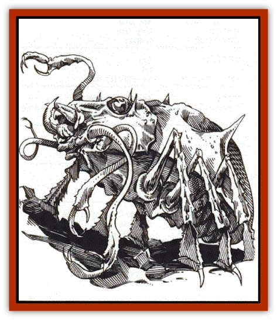
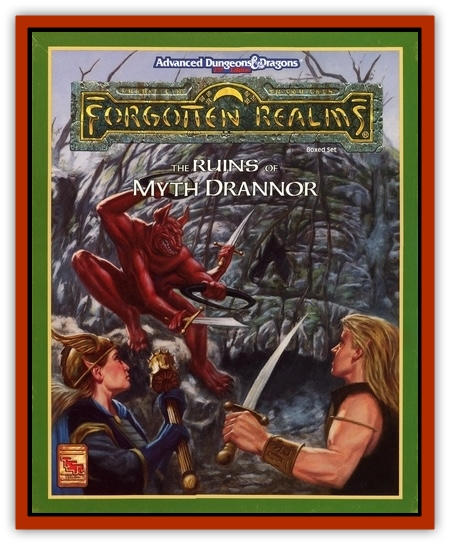

# Aratha - Killer Beetle

| Statistic | **Aratha (Killer Beetle)** |
| --- | --- |
| **Activity Cycle:** | Any |
| **Alignment:** | Neutral |
| **Armor Class:** | 3 |
| **Climate/Terrain:** | Sub-tropical and temperate/nonmountainous land |
| **Damage/Attack:** | 1d10/1d10/1d10/1d10 |
| **Diet:** | Carnivore |
| **Frequency:** | Rare |
| **Hit Dice:** | 9 |
| **Intelligence:** | Average (8-10) |
| **Magic Resistance:** | Nil |
| **Morale:** | Elite (16) |
| **Movement:** | 11 |
| **No. Appearing:** | 1 |
| **No. of Attacks:** | 4 |
| **Organization:** | Solitary |
| **Size:** | L (12' long) |
| **Special Attacks:** | Psionics |
| **Special Defenses:** | Immunities |
| **THAC0:** | 11 |
| **Treasure:** | Nil |
| **XP Value:** | 6,000 |

**Psionics Summary**

| Level | Dis/Sci/Dev | Attack/Defense | Score | PSPs |
| --- | --- | --- | --- | --- |
| 9 | 3/1/7 | PsC, MT, PB/All | 13 | 202 |

**Psychokinesis -** *Devotions:* molecular agitation.

**Psychometabolism -** *Devotions:* body equilibrium, suspend animation

**Telepathy -** *Sciences:* psychic crush. *Devotions:* attraction, empathy, mind thrust, psionic blast.

The aratha, or "killer beetle" was once common in the Realms, but is so dangerous to all civilized races that it has been hunted to near-extinction. Arathas live on the flesh of creatures they locate by thought and scent (they especially prize the flesh of [[Halfling|halflings]], [[Owlbear_I|owlbears]], and <a href="braimole">brain moles</a>), and roam the wilderlands of the Realms, keeping to areas where they can find cover, and avoiding heavily populated areas. They are tireless hunters who will eat any meat in a pinch, and are greatly feared by rural folk for their toughness and abilities.

An aratha has a large, purple-to-brown carapace with upswept horns or points, four long, flexible, clawed tentacles, and six hairy legs. It can reach in any direction (including behind itself) with great speed, and usually lumbers along in near-silence, making only occasional clicking sounds. Arathas have powerful psionic powers.

**Combat:** Arathas habitually use their psionics to avoid powerful foes (or assault them, if cornered), to locate and stalk victims, and to strike when prey is disoriented, upset, or weak. Killer beetles grasp and hold prey by means of their clawed tentacles, which can lash out 201, but retract to 81 when not needed. Each tentacle ends in a pincerlike claw that can close with bonecrushing strength. An aratha does not bite opponents, but merely chews flesh torn from prey by its tentacles.

Arathas are immune to petrification magic and all heat-related damage, due to a peculiar metabolism. An aratha sees by means of primitive light- and movement/vibration-sensitive organs on its belly and back, as well as with two eye clusters at the front of its carapace. Its grinding, iris-like mouth is located at the front underside of its chitin-armored body.

**Habitat/Society:** Arathas are solitary, bisexual, wandering hunters. Wherever they go, they scout out likely food, foes, and hiding-places before they begin to hunt.

When an aratha grows old and weak, it seeks out a powerful enemy and attacks, seeking to die in battle. Arathas mate once in life; 2-4 months after mating, one of the partners bears 1-3 live young, dying in the birth (the young then devour their parent as their first meal).

**Ecology:** Few creatures other than scavengers eat arathas; their flesh has a strong vinegar-like taste. After death, an aratha's carapace softens and rots, but the claws can be salvaged and fashioned into nearly unbreakable arrow and spear points that keep their sharpness well.

---
## Discovery & Documentation

**Source Publication:** The Ruins of Myth Drannor Box Set (1993)
**Campaign Setting:** Forgotten Realms
**Author(s):** Jeff Grubb, Ed Greenwood, Julia Martin, Karen S. Boomgarden, Arnie Sweikel, John Statema

### Other Creatures Found in This Source Book
   * [[Baelnorn|Baelnorn]]
   * [[Blazing_Bones|Blazing Bones]]
   * [[Doomsphere_Ghost_Beholder|Doomsphere (Ghost Beholder)]]
   * [[Dragon_Electrum|Dragon, Electrum]]
   * [[Dragon_Fang|Dragon, Fang]]
   * [[Dread|Dread]]
   * [[Feystag|Feystag]]
   * [[Lythlyx|Lythlyx]]
   * [[Magebane|Magebane]]
   * [[Metalmaster|Metalmaster]]
   * [[Naga_Bone|Naga, Bone]]
   * [[Ormyrr|Ormyrr]]
   * [[Windghost|Windghost]]
   * [[Xantravar|Xantravar]]
   * [[Xaver|Xaver]]
