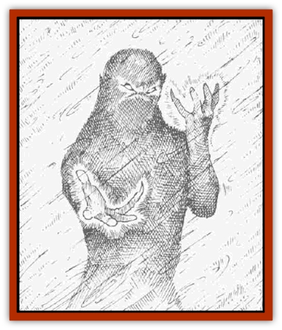
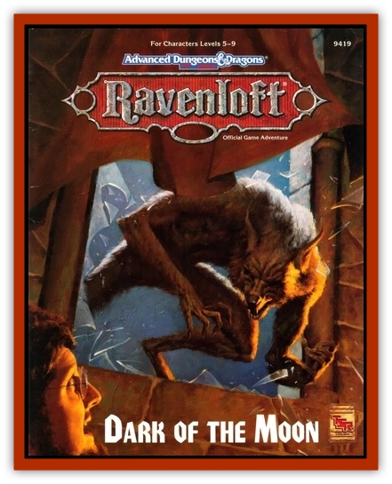

# Arayashka

| Statistic | **Arayashka** |
| --- | --- |
| **Activity Cycle:** | Any (blizzards) |
| **Alignment:** | Neutral evil |
| **Armor Class:** | 3 |
| **Climate/Terrain:** | Any arctic |
| **Damage/Attack:** | 1d6 + 1 |
| **Diet:** | See below |
| **Frequency:** | Very rare |
| **Hit Dice:** | 5 |
| **Intelligence:** | Average (8-10) |
| **Magic Resistance:** | Nil |
| **Morale:** | Fanatic (17) |
| **Movement:** | 9 |
| **No. Appearing:** | 1d6 |
| **No. of Attacks:** | 1 |
| **Organization:** | Solitary |
| **Size:** | M (6' tall) |
| **Special Attacks:** | Chilling touch |
| **Special Defenses:** | See below |
| **THAC0:** | 15 |
| **Treasure:** | C |
| **XP Value:** | 975 |

Arayashka (or *snow [[Wraith|wraiths]]*) are the undead spirits of travelers killed by cold and exposure in some arctic lands. A person must possess an intense strength of will and a purpose that is left unfulfilled by death in order to become an arayashka. Arayashka appear to be gray, misty shadows about the size of a man. They roam the icy wastes during fierce blizzards similar to the storms in which they themselves perished.

**Combat:** Arayashka are dangerous opponents that often choose the worst time to attack travelers, appearing out of a raging arctic storm to drain the warmth from their victims. The arayashka move and fight with no penalties for obscured vision, strong winds, or deep snow; they ignore the weather and terrain to press home their attacks.

Arayashka attack once per round with their freezing touch, inflicting 1d6 + 1 points of damage to living creatures. Each time an arayashka successfully attacks a character, the victim is affected as though hit with a *chilling touch* spell, losing one point of Strength. Lost Strength points return at the rate of one per hour. A character reduced to a Strength of 2 or less collapses and falls unconscious. A character reduced to 0 dies.

Arayashka have the ability to drain heat from a living target at range as well, although this is not as effective as their touch. The arayashka can drain 1 hit point per round from one character within 30 feet. A favorite tactic of the arayashka is to lurk in the white-out of a blizzard and attack travelers without ever showing themselves. Any character that loses more than 50% of total hit points to the attacks of the arayashka begins to suffer from hypothermia.

Lastly, arayashka can use their heat-draining ability against any open flame or source of heat within 30 feet. One arayashka can smother a normal campfire in 1d3 rounds, while three can extinguish a large bonfire.

Arayashka are immune to any *sleep*, *charm*, or mindaffecting magic. They are also immune to any cold attacks, as well as sleet, hail, or ice effects. They are vulnerable to fire attacks and suffer 2d4 points of damage from contact with normal fires, burning oil, hot coals, or even weapons warmed for a round or more in a fire. Otherwise, snow wraiths can only be harmed by magical weapons. They can be turned as wraiths.

Arayashka only appear in blizzard-like conditions. If the storm dies down, the snow wraiths retreat.

**Habitat/Society:** Arayashka are only found near the place where they perished, and then only if the weather conditions are right. A mountain pass might be safe during spring, summer, and fall, but is a deadly hazard by wintertime. Areas haunted by arayashka seem to be subject to storms of unusual strength, and it is possible that the snow wraith's spirit somehow causes bad weather.

**Ecology:** As with most other undead, arayashka exist on both the Prime Material and Negative Material Planes simultaneously. Their connection to the Negative Material Plane gives them their ability to drain heat and their immunities to many attacks. The snow wraiths' hunger for heat is almost insatiable.

Any character killed by an arayashka and interred anywhere near the location of death must be cremated while a *bless* spell is cast, or the PC rises as an arayashka the next time a winter storm rages. A character that is killed by an arayashka but is then interred in some warmer clime does not return as one.

---
## Discovery & Documentation

**Source Publication:** RM5 Dark of the Moon (1993)
**Campaign Setting:** Ravenloft
**Author(s):** L Richard Baker III, Thomas M Reid

### Other Creatures Found in This Source Book
   * [[Lycanthrope_Loup_de_Noir|Lycanthrope, Loup de Noir]]
