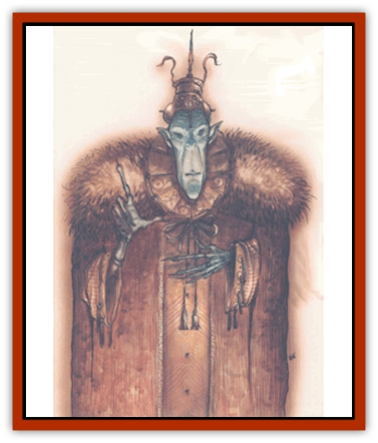

# Arcane

| Statistic | **Arcane** |
| --- | --- |
| **Activity Cycle:** | Any |
| **Alignment:** | Lawful neutral |
| **Armor Class:** | 5 (3) |
| **Climate/Terrain:** | Any |
| **Damage/Attack:** | 1-8 (weapon) |
| **Diet:** | Omnivore |
| **Frequency:** | Very rare |
| **Hit Dice:** | 10 |
| **Intelligence:** | Genius (17-18) |
| **Magic Resistance:** | 40% |
| **Morale:** | Champion (15) |
| **Movement:** | 12 |
| **No. Appearing:** | 1 (1-6) |
| **No. of Attacks:** | 1 |
| **Organization:** | Entourage |
| **Size:** | L (12' tall) |
| **Special Attacks:** | Nil |
| **Special Defenses:** | <i>Invisibility</i>, <i>dimension door</i> |
| **THAC0:** | 11 |
| **Treasure:** | R |
| **XP Value:** | 3,000 |

The arcane are a race of merchants, found wherever there is potential trade in magical items. They appear as tall, lanky, blue giants with elongated faces and thin fingers; each finger having one more joint than is common in most humanoid life. The arcane dress in robes, although there are individuals who are found in heavier armor, a combination of chain links with patches of plate (AC 3).

The arcane are normally found in those locations where there is an awareness and an interest in spelljamming equipment, which is their stock in trade. In those groundling backwaters that do not believe in space travel or life on other worlds, or on those insular worlds that make such travels by dimension-hopping, the Arcane are nonexistent. They speak the common tongue, and are believed to have their own language.

**Combat:** For creatures of their size, the arcane are noticeably weak and non-combative. They can defend themselves when called upon, but prefer to talk and/or buy themselves out of dangerous situations. If entering an area that is potentially dangerous (like most human cities), the arcane hires a group of adventurers as his entourage.

The arcane can become *invisible*, and can *dimension door* up to three times a day, usually with the intention of avoiding combat. An arcane feels no concern about abandoning his entourage in chancy situations. They can also use any magical items, regardless of the limitations of those items. This includes swords, wands, magical tomes, and similar items restricted to one type of character class. They will use such items if pressed in combat and they cannot escape, but more often use them as bartering tools with others. 

Arcane have a form of racial telepathy, such that an injury to one arcane is immediately known by all other arcane. The arcane do not seek vengeance against the one who hurt or killed their fellow. They react negatively to such individuals, and dealing with the arcane will be next to impossible until that individual makes restitution.

**Habitat/Society:** Nothing is known about the arcane's origins; they come and go as they please, and are found throughout the known worlds. When they travel, they do so on the ships and vehicles of other races. Finding such ships with arcane aboard is rare, and it is suspected that the arcane have another way of travelling over long distances.

Contacting the arcane is no trouble in most civilized areas: a few words spread through the local grapevine, through taverns, guilds, and barracks, are enough to bring one of these creatures to the surface. In game terms, there is a base 10% chance per day of finding an arcane, if PCs actively look for one; the chance increases or decreases depending on their location. Arcane never set up permanent <q>magic shops</q>.

The arcane's stock in trade is to provide magical items, particularly spelljamming helms, which allow rapid movement through space. The arcanes' high quality and uniform (if high) prices make them the trusted retailers. They accept payment in gold, or barter for other magical items (as a rule of thumb, costs should be five times the XP reward of the item, or a more valuable item).

The arcane take no responsibility for the use of the items they sell. The arcane will deal with almost anyone. They often make deals with both sides in a conflict, fully aware that they might annihilate all of their potential customers in a region. The arcane have no dealings with neogi, nor with creatures from other planes, such as genies, tanar'ri, and fiends. It is unknown whether the arcane create a wide variety of magical devices, or secure them from an unknown source.

Those dealing with the arcane find them cool, efficient, and most importantly, uncaring. Trying to haggle with an arcane is a chancy business, at best. Sometimes they will engage in haggling with a bemused smirk, but just as often leave the buyer hanging and walk out on the negotiations. They do not like being threatened, insulted, or blackmailed. Those who do so will find it very difficult to purchase reliable equipment. An arcane will not raise his hand in vengeance or anger - there are more subtle ways to wreak revenge.

Other races view the arcane with a combination of irritation and recognition of them as a necessary evil. The various gods are silent or misdirecting as far as their origins go, and a number of rumors abound, including their possible links with the *Spelljammer* itself. One tale claims that the arcane traded their homeworld to an elder god for the *Spelljammer*, only to find that they could not control it, plunging the ship into a nearby sun and destroying their former planet. As a result they are doomed to wander as cosmic traders. The fact that the *Spelljammer* is still sighted indicates that this is only a tale, but the arcane have let the story pass from world to world without correction or comment.

**Ecology:** The arcane as a race need to eat and breathe as all normal creatures: they cannot breathe the void or survive for long periods without food. They will often rnake deals with both sides in a conAict, fully aware that the amount of firepower they provide will annihilate all of their potential customers in a sphere. Their market is large enough that such small losses as an entire planet and race do not have a serious impact on their trade.

The arcane seem sexless, or rather rnembers at times seem to act in female or male roles, depending on the situation. No young arcane have been seen, though whether this is due to their reproductive cycle or their society is not known.

It is not known what arcane do with the gold, gems, and magic they collect. One theory says they need the items for reproduction (the basis for a large number of bawdy arcane jokes), while another links it to production and acquisition of more magical items. The arcane seem sexless. No young arcane have been reported, and the arcane keep their own counsel.

---
## Discovery & Documentation

**Source Publication:** Monstrous Manual (1995)
**Campaign Setting:** Advanced Dungeons & Dragons 2nd Edition
**Author(s):** Tim Beach

### Other Creatures Found in This Source Book
   * [[Aarakocra|Aarakocra]]
   * [[Aboleth|Aboleth]]
   * [[Ankheg|Ankheg]]
   * [[Argos|Argos]]
   * [[Aurumvorax|Aurumvorax]]
   * [[Baatezu_Lesser_Abishai|Baatezu, Lesser, Abishai]]
   * [[Baatezu_General_Information|Baatezu, General Information]]
   * [[Baatezu_Greater_Pit_Fiend|Baatezu, Greater, Pit Fiend]]
   * [[Banshee|Banshee]]
   * [[Basilisk|Basilisk]]
   * [[Bat|Bat]]
   * [[Bear|Bear]]
   * [[Beetle_Giant|Beetle, Giant]]
   * [[Behir|Behir]]
   * [[Beholder_and_Beholder-kin_I|Beholder and Beholder-kin I]]
   * [[Beholder_and_Beholder-kin_II|Beholder and Beholder-kin II]]
   * [[Bird|Bird]]
   * [[Brain_Mole|Brain Mole]]
   * [[Broken_One|Broken One]]
   * [[Brownie|Brownie]]
   * [[Bugbear|Bugbear]]
   * [[Bulette|Bulette]]
   * [[Bullywug|Bullywug]]
   * [[Carrion_Crawler|Carrion Crawler]]
   * [[Cat_Great|Cat, Great]]
   * [[Catoblepas|Catoblepas]]
   * [[Cat_Small|Cat, Small]]
   * [[Cave_Fisher|Cave Fisher]]
   * [[Centaur|Centaur]]
   * [[Centipede|Centipede]]
   * [[Chimera|Chimera]]
   * [[Cloaker|Cloaker]]
   * [[Cockatrice|Cockatrice]]
   * [[Couatl|Couatl]]
   * [[Crabman|Crabman]]
   * [[Crawling_Claw|Crawling Claw]]
   * [[Crocodile|Crocodile]]
   * [[Crustacean_Giant|Crustacean, Giant]]
   * [[Crypt_Thing|Crypt Thing]]
   * [[Death_Knight|Death Knight]]
   * [[Deepspawn|Deepspawn]]
   * [[Dinosaur_I|Dinosaur I]]
   * [[Displacer_Beast|Displacer Beast]]
   * [[Dog|Dog]]
   * [[Dog_Moon|Dog, Moon]]
   * [[Dolphin|Dolphin]]
   * [[Doppelganger|Doppelganger]]
   * [[Dracolich|Dracolich]]
   * [[Dragon_Brown|Dragon, Brown]]
   * [[Dragon_Chromatic_Black|Dragon, Chromatic, Black]]
   * [[Dragon_Chromatic_Blue|Dragon, Chromatic, Blue]]
   * [[Dragon_Chromatic_Green|Dragon, Chromatic, Green]]
   * [[Dragon_Cloud|Dragon, Cloud]]
   * [[Dragon_Chromatic_Red|Dragon, Chromatic, Red]]
   * [[Dragon_Chromatic_White|Dragon, Chromatic, White]]
   * [[Dragon_Deep|Dragon, Deep]]
   * [[Dragon_Gem_Amethyst|Dragon, Gem, Amethyst]]
   * [[Dragon_Gem_Crystal|Dragon, Gem, Crystal]]
   * [[Dragon_Gem_Emerald|Dragon, Gem, Emerald]]
   * [[Dragon_Gem_Sapphire|Dragon, Gem, Sapphire]]
   * [[Dragon_Gem_Topaz|Dragon, Gem, Topaz]]
   * [[Dragon_Metallic_Brass|Dragon, Metallic, Brass]]
   * [[Dragon_Metallic_Bronze|Dragon, Metallic, Bronze]]
   * [[Dragon_Metallic_Copper|Dragon, Metallic, Copper]]
   * [[Dragon_Mercury|Dragon, Mercury]]
   * [[Dragon_Metallic_Gold|Dragon, Metallic, Gold]]
   * [[Dragon_Mist|Dragon, Mist]]
   * [[Dragon_Metallic_Silver|Dragon, Metallic, Silver]]
   * [[Dragon_General_Information|Dragon, General Information]]
   * [[Dragon_Shadow|Dragon, Shadow]]
   * [[Dragon_Steel|Dragon, Steel]]
   * [[Dragon_Yellow|Dragon, Yellow]]
   * [[Dragonne|Dragonne]]
   * [[Dragon_Turtle|Dragon Turtle]]
   * [[Dragonet_Faerie_Dragon|Dragonet, Faerie Dragon]]
   * [[Dragonet_Fire_Drake|Dragonet, Fire Drake]]
   * [[Dragonet_Pseudodragon|Dragonet, Pseudodragon]]
   * [[Dryad|Dryad]]
   * [[Dwarf_Derro|Dwarf, Derro]]
   * [[Dwarf|Dwarf]]
   * [[Elemental_Athas_General_Information|Elemental (Athas), General Information]]
   * [[Elemental_Air_Kin|Elemental, Air Kin]]
   * [[Elemental_Earth_Kin|Elemental, Earth Kin]]
   * [[Elemental_Fire_Kin|Elemental, Fire Kin]]
   * [[Elemental_Water_Kin|Elemental, Water Kin]]
   * [[Elemental_of_Chaos_Air_Earth|Elemental of Chaos, Air/Earth]]
   * [[Elemental_of_Chaos_Fire_Water|Elemental of Chaos, Fire/Water]]
   * [[Elemental_Composite|Elemental, Composite]]
   * [[Elemental_Air_Earth|Elemental, Air/Earth]]
   * [[Elemental_Fire_Water|Elemental, Fire/Water]]
   * [[Elemental_General_Information|Elemental, General Information]]
   * [[Elephant|Elephant]]
   * [[Elf|Elf]]
   * [[Elf_Aquatic|Elf, Aquatic]]
   * [[Elf_Drow|Elf, Drow]]
   * [[Ettercap|Ettercap]]
   * [[Eyewing|Eyewing]]
   * [[Feyr|Feyr]]
   * [[Fish|Fish]]
   * [[Frog|Frog]]
   * [[Fungus|Fungus]]
   * [[Galeb_Duhr|Galeb Duhr]]
   * [[Gargantua|Gargantua]]
   * [[Gargoyle_I|Gargoyle I]]
   * [[Genie|Genie]]
   * [[Ghost|Ghost]]
   * [[Ghoul|Ghoul]]
   * [[Giant_Cloud|Giant, Cloud]]
   * [[Giant_Cyclops|Giant, Cyclops]]
   * [[Giant_Desert|Giant, Desert]]
   * [[Giant_Ettin|Giant, Ettin]]
   * [[Giant_Firbolg|Giant, Firbolg]]
   * [[Giant_Fire|Giant, Fire]]
   * [[Giant_Fog|Giant, Fog]]
   * [[Giant_Fomorian|Giant, Fomorian]]
   * [[Giant_Frost|Giant, Frost]]
   * [[Giant_Hill|Giant, Hill]]
   * [[Giant_Jungle|Giant, Jungle]]
   * [[Giant_Mountain|Giant, Mountain]]
   * [[Giant_Reef|Giant, Reef]]
   * [[Giant_Stone|Giant, Stone]]
   * [[Giant_Storm|Giant, Storm]]
   * [[Giant_Verbeeg|Giant, Verbeeg]]
   * [[Giant_Wood|Giant, Wood]]
   * [[Gibberling|Gibberling]]
   * [[Giff|Giff]]
   * [[Gith|Gith]]
   * [[Gith_Pirate_of|Gith, Pirate of]]
   * [[Githyanki|Githyanki]]
   * [[Githzerai|Githzerai]]
   * [[Gloomwing|Gloomwing]]
   * [[Gnoll|Gnoll]]
   * [[Gnome|Gnome]]
   * [[Gnome_Spriggan|Gnome, Spriggan]]
   * [[Goblin|Goblin]]
   * [[Golem_General_Information|Golem, General Information]]
   * [[Golem_I_Greater_Golem|Golem I (Greater Golem)]]
   * [[Golem_II_Lesser_Golem|Golem II (Lesser Golem)]]
   * [[Golem_III|Golem III]]
   * [[Golem_IV|Golem IV]]
   * [[Golem_V|Golem V]]
   * [[Golem_VI_Stone_Variants|Golem VI (Stone Variants)]]
   * [[Gorgon|Gorgon]]
   * [[Grell_Colonial|Grell, Colonial]]
   * [[Gremlin_Jermlaine|Gremlin, Jermlaine]]
   * [[Gremlin|Gremlin]]
   * [[Griffon|Griffon]]
   * [[Grimlock|Grimlock]]
   * [[Grippli|Grippli]]
   * [[Hag|Hag]]
   * [[Halfling|Halfling]]
   * [[Harpy|Harpy]]
   * [[Hatori|Hatori]]
   * [[Haunt|Haunt]]
   * [[Hell_Hound|Hell Hound]]
   * [[Heucuva|Heucuva]]
   * [[Hippocampus|Hippocampus]]
   * [[Hippogriff|Hippogriff]]
   * [[Hobgoblin|Hobgoblin]]
   * [[Homunculus|Homunculus]]
   * [[Hook_Horror|Hook Horror]]
   * [[Horse|Horse]]
   * [[Human|Human]]
   * [[Hydra|Hydra]]
   * [[Imp|Imp]]
   * [[Insect_Giant|Insect, Giant]]
   * [[Insect_Swarm|Insect Swarm]]
   * [[Intellect_Devourer|Intellect Devourer]]
   * [[Invisible_Stalker|Invisible Stalker]]
   * [[Ixitxachitl|Ixitxachitl]]
   * [[Jackalwere|Jackalwere]]
   * [[Kenku|Kenku]]
   * [[Ki-rin|Ki-rin]]
   * [[Kirre|Kirre]]
   * [[Kobold|Kobold]]
   * [[Kuo-Toa|Kuo-Toa]]
   * [[Lamia|Lamia]]
   * [[Lammasu|Lammasu]]
   * [[Leech|Leech]]
   * [[Leprechaun|Leprechaun]]
   * [[Leucrotta|Leucrotta]]
   * [[Lich|Lich]]
   * [[Living_Wall|Living Wall]]
   * [[Lizard|Lizard]]
   * [[Lizard_Man|Lizard Man]]
   * [[Locathah|Locathah]]
   * [[Lurker|Lurker]]
   * [[Lycanthrope_General_Information|Lycanthrope, General Information]]
   * [[Lycanthrope_Seawolf|Lycanthrope, Seawolf]]
   * [[Lycanthrope_Werebear|Lycanthrope, Werebear]]
   * [[Lycanthrope_Wereboar|Lycanthrope, Wereboar]]
   * [[Lycanthrope_Werebat|Lycanthrope, Werebat]]
   * [[Lycanthrope_Werefox|Lycanthrope, Werefox]]
   * [[Lycanthrope_Wererat|Lycanthrope, Wererat]]
   * [[Lycanthrope_Wereraven|Lycanthrope, Wereraven]]
   * [[Lycanthrope_Weretiger|Lycanthrope, Weretiger]]
   * [[Lycanthrope_Werewolf|Lycanthrope, Werewolf]]
   * [[Mammal|Mammal]]
   * [[Mammal_Giant|Mammal, Giant]]
   * [[Mammal_Herd_I|Mammal, Herd I]]
   * [[Mammal_Small|Mammal, Small]]
   * [[Manscorpion|Manscorpion]]
   * [[Manticore|Manticore]]
   * [[Medusa_Maedar|Medusa, Maedar]]
   * [[Medusa|Medusa]]
   * [[Mephit_General_Information|Mephit, General Information]]
   * [[Merman|Merman]]
   * [[Mimic|Mimic]]
   * [[Mind_Flayer|Mind Flayer]]
   * [[Minotaur|Minotaur]]
   * [[Mist_Crimson_Death|Mist, Crimson Death]]
   * [[Mist_Vampiric|Mist, Vampiric]]
   * [[Mold_I|Mold I]]
   * [[Moldman|Moldman]]
   * [[Mongrelman|Mongrelman]]
   * [[Morkoth|Morkoth]]
   * [[Muckdweller|Muckdweller]]
   * [[Mudman|Mudman]]
   * [[Mummy_Greater|Mummy, Greater]]
   * [[Mummy|Mummy]]
   * [[Myconid|Myconid]]
   * [[Naga|Naga]]
   * [[Naga_Dark|Naga, Dark]]
   * [[Neogi|Neogi]]
   * [[Nightmare|Nightmare]]
   * [[Nymph|Nymph]]
   * [[Octopus_Giant|Octopus, Giant]]
   * [[Ogre|Ogre]]
   * [[Ogre_Half-|Ogre, Half-]]
   * [[Ooze_Slime_Jelly_I|Ooze/Slime/Jelly I]]
   * [[Ooze_Slime_Jelly_II|Ooze/Slime/Jelly II]]
   * [[Ooze_Slime_Jelly_Slithering_Tracker|Ooze/Slime/Jelly, Slithering Tracker]]
   * [[Orc|Orc]]
   * [[Otyugh|Otyugh]]
   * [[Owlbear_I|Owlbear I]]
   * [[Pegasus|Pegasus]]
   * [[Peryton|Peryton]]
   * [[Phantom|Phantom]]
   * [[Phoenix|Phoenix]]
   * [[Piercer|Piercer]]
   * [[Plant_Dangerous_I|Plant, Dangerous I]]
   * [[Plant_Intelligent|Plant, Intelligent]]
   * [[Poltergeist|Poltergeist]]
   * [[Pudding_Deadly|Pudding, Deadly]]
   * [[Quaggoth|Quaggoth]]
   * [[Rakshasa|Rakshasa]]
   * [[Rat|Rat]]
   * [[Rat_Osquip|Rat, Osquip]]
   * [[Remorhaz|Remorhaz]]
   * [[Revenant|Revenant]]
   * [[Roc|Roc]]
   * [[Roper|Roper]]
   * [[Rust_Monster|Rust Monster]]
   * [[Sahuagin|Sahuagin]]
   * [[Satyr|Satyr]]
   * [[Scorpion|Scorpion]]
   * [[Sea_Lion|Sea Lion]]
   * [[Selkie|Selkie]]
   * [[Shadow|Shadow]]
   * [[Shedu|Shedu]]
   * [[Sirine|Sirine]]
   * [[Skeleton|Skeleton]]
   * [[Skeleton_Giant|Skeleton, Giant]]
   * [[Skeleton_Warrior|Skeleton, Warrior]]
   * [[Slaad|Slaad]]
   * [[Slug_Giant|Slug, Giant]]
   * [[Snake|Snake]]
   * [[Snake_Winged|Snake, Winged]]
   * [[Spectre|Spectre]]
   * [[Sphinx|Sphinx]]
   * [[Spider|Spider]]
   * [[Sprite|Sprite]]
   * [[Squid_Giant|Squid, Giant]]
   * [[Stirge|Stirge]]
   * [[Su-Monster|Su-Monster]]
   * [[Swanmay|Swanmay]]
   * [[Tabaxi|Tabaxi]]
   * [[Tako|Tako]]
   * [[Tanar'ri_True_Balor|Tanar'ri, True, Balor]]
   * [[Tanar'ri_True_Marilith|Tanar'ri, True, Marilith]]
   * [[Tarrasque|Tarrasque]]
   * [[Tasloi|Tasloi]]
   * [[Thought_Eater|Thought Eater]]
   * [[Thri-kreen|Thri-kreen]]
   * [[Titan|Titan]]
   * [[Toad_Giant|Toad, Giant]]
   * [[Treant|Treant]]
   * [[Triton|Triton]]
   * [[Troglodyte|Troglodyte]]
   * [[Troll|Troll]]
   * [[Umber_Hulk|Umber Hulk]]
   * [[Unicorn|Unicorn]]
   * [[Urchin|Urchin]]
   * [[Vampire|Vampire]]
   * [[Wemic|Wemic]]
   * [[Whale|Whale]]
   * [[Wight|Wight]]
   * [[Will_O'Wisp|Will O'Wisp]]
   * [[Wolf|Wolf]]
   * [[Wolfwere|Wolfwere]]
   * [[Worm|Worm]]
   * [[Wraith|Wraith]]
   * [[Wyvern|Wyvern]]
   * [[Xorn|Xorn]]
   * [[Yeti|Yeti]]
   * [[Yuan-ti_Histachii|Yuan-ti, Histachii]]
   * [[Yuan-ti|Yuan-ti]]
   * [[Yugoloth_Guardian|Yugoloth, Guardian]]
   * [[Zaratan|Zaratan]]
   * [[Zombie|Zombie]]
