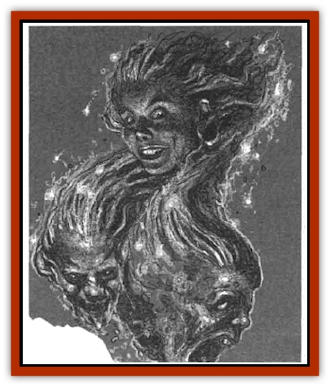

# Arcane Head

| Statistic | **Arcane Head** |
| --- | --- |
| **Activity Cycle:** | Night |
| **Alignment:** | Chaotic evil |
| **Armor Class:** | 3 (7) |
| **Climate/Terrain:** | The Nightmare Lands |
| **Damage/Attack:** | 1d6 (bite) |
| **Diet:** | Carnivore |
| **Frequency:** | Very rare |
| **Hit Dice:** | 2 |
| **Intelligence:** | Average (10) |
| **Magic Resistance:** | 20% |
| **Morale:** | Elite (13) |
| **Movement:** | Fl 15 (C) |
| **No. Appearing:** | 13 |
| **No. of Attacks:** | 1 |
| **Organization:** | Flock |
| **Size:** | T (1' tall) |
| **Special Attacks:** | Bash |
| **Special Defenses:** | Nil |
| **THAC0:** | 18 |
| **Treasure:** | Nil |
| **XP Value:** | 270 |

Arcane heads are the severed heads of wanderers whose physical bodies died in the Nightmare Lands, specifically the Terrain Between. The heads are then magically animated by [[Mullonga|Mullonga]], the aboriginal witch of the [[Nightmare_Court_The|Nightmare Court]]. A flock of 13 arcane heads serve Mullonga, searching for physical wanderers traveling in the Nightmare Lands.

An arcane head looks much as it die in life, except that it has no body. Its eyes are empty and white, and a supernatural glow surrounds it. Its teeth are much sharper than those of a  normal human, and its neck has been sewn shut where it was severed from its body. An arcane head moves through the power of magical flight, tracing mystical patterns in the air as it travels. When the mystic patterns of several heads are combined in a specific way, a portal opens through which Mullonga may travel to reach her ghastly servants.

The only sounds made by an arcane head are low, pathetic moans and the grinding of sharp teeth. It appears they can communicate with Mullonga in some way, but they do not speak or otherwise talk to their victims.

**Combat:** Arcane heads always attack in a flock, flying around their victims and darting in to bite or bash. On the first round of combat, the heads dive at a victim, trying to employ their special bash attack. A bash attack requires a successful attack roll. It is actually a magical attack that inflicts no physical damage. Instead, the victim must make a saving throw vs. spell or be stunned by the touch of the head's arcane aura for 1d4+1 rounds. Stunned characters suffer automatic bite damage round from any arcane heads that attack them.

Each head bites for 1d6 points of damage. The speed and small size of each head accounts for its Armor Class. If held in place (such as by a *web* spell), a head only has an AC 7.

In addition to flight and the bash attack, the heads use their arcane powers to open a magical portal controlled by Mullonga. It takes at least five heads spinning in unison for 1d4+1 rounds to open the portal. Mullonga can step through the portal or use it to transport wanderers into a dreamscape.

**Habitat/Society:** When not prowling the dark hours on behalf of their mistress, the flock of arcane heads rests in one of the tenements in Mullonga's evershifting Ghettoes. There are never more than 13 heads in the flock. If anv are destroved. the witch makes an effort to replace them as soon as possible. The heads serve as Mullonga's spies throughout the Terrain Between, checking on the activities of dream spawn, wanderers, and even other members of the Nightmare Court. The heads specifically search for wanderers so that Mullonga can use them in her arcane experiments. If she has ho immediate use for a wanderer, he or she is cast into a dreamscape for safekeeping.

**Ecology:** As supernatural creatures, arcane heads have no place in the natural order. They feed on the flesh of physical beings, prefering the taste of live wanderers though they also sustain themselves with the flesh of [[Lost_Souls|lost souls]] created in the Terrain Between.

---
## Discovery & Documentation

**Source Publication:** The Nightmare Lands (1995)
**Campaign Setting:** Ravenloft
**Author(s):** Shane Lacy Hensley

### Other Creatures Found in This Source Book
   * [[Dreamweaver|Dreamweaver]]
   * [[Dream_Spawn_General_Information|Dream Spawn, General Information]]
   * [[Dream_Spawn_Greater_Ennui|Dream Spawn, Greater, Ennui]]
   * [[Dream_Spawn_Lesser_Morph|Dream Spawn, Lesser, Morph]]
   * [[Ghost_Dancer_The|Ghost Dancer, The]]
   * [[Human_Abber_Shaman|Human, Abber Shaman]]
   * [[Hypnos|Hypnos]]
   * [[Lost_Souls|Lost Souls]]
   * [[Morpheus|Morpheus]]
   * [[Mullonga|Mullonga]]
   * [[Nightmare_Court_The|Nightmare Court, The]]
   * [[Nightmare_Man_The|Nightmare Man, The]]
   * [[Night_Terror_Mandalain|Night Terror, Mandalain]]
   * [[Rainbow_Serpent_The|Rainbow Serpent, The]]
