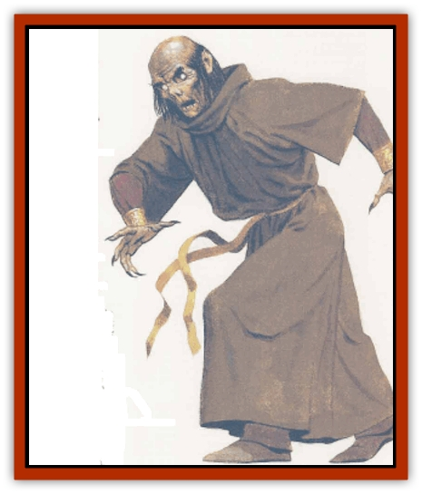

# Arch-Shadow

| Statistic | **Arch-Shadow** | **Demi-Shade** |
| --- | --- | --- |
| **Activity Cycle:** | Any | Any |
| **Alignment:** | Any evil | Any evil |
| **Armor Class:** | 6 | 1 |
| **Climate/Terrain:** | Any | Any |
| **Damage/Attack:** | 1d4+1 | 2d4 |
| **Diet:** | None | None |
| **Frequency:** | Very rare | Very rare |
| **Hit Dice:** | 8+ | 11+ |
| **Intelligence:** | Supra-genius (19) | Supra-genius (20) |
| **Magic Resistance:** | Nil | Nil |
| **Morale:** | Fearless (19-20) | Fanatic (17-18) |
| **Movement:** | 9 | 9 |
| **No. Appearing:** | 1 | 1 |
| **No. of Attacks:** | 1 | 1 |
| **Organization:** | Solitary | Solitary |
| **Size:** | M (6' tall) | M (6' tall) |
| **Special Attacks:** | Spell use, energy drain | Spell use, energy drain |
| **Special Defenses:** | +1 or better weapons to hit | +2 or better weapons to hit |
| **THAC0:** | 12 | 9 |
| **Treasure:** | Nil (C) | Nil (W) |
| **XP Value:** | 4,500 | 8,000 |

As evil wizards and priests grow older and see their deaths before them, some decide to take their chances with becoming a [[Lich|lich]]. Most fail and die. The unlucky few who survive the process but fail to achieve lichdom become arch-shadows.

Arch-shadows are undead that resemble [[Ghost|ghosts]] or [[Banshee|banshees]]. They wander the earth: brutal, unforgiving, and nearly maniacal in their quest to attain a secure existence. Although usually disguised, an arch-shadow in its natural form appears as a ghastly silhouette of its original body. Piercing blue-white pinpoints of light serve as eyes, its hair is ebony, and its fingernails have turned blue-black.

After gazing at an arch-shadow in its true form for 1d4 rounds, another side of this undead becomes apparent. The skin that covers its ghostly body becomes withdrawn and tight, and its blue-white eyes are tinged with crimson. Its face is contorted in pain and agony. Sages have speculated that this was its final appearance before death, but only the arch-shadows know for sure.

**Combat:** An arch-shadow usually fights to drain energy from powerful creatures in order to achieve demi-shade status. If an arch-shadow is forced into a battle in which it has no chance of furthering this goal, it feigns its own death and awaits another opportunity.

Each successful attack by an arch-shadow causes 1d4+1 points of damage (creatures immune to cold suffer only 1d4 points of damage). By force of will, the arch-shadow can also choose to drain one life energy level from its target, but this reveals its true form.

Arch-shadows retain the spellcasting abilities they had in life; most undead of this sort are of 18th level or higher in casting ability. They can use the same magical items they wielded in life.

Arch-shadows cannot be destroyed by simple combat, powerful magic, or chance. Their life force is stored in a receptacle, a magical item of moderate to great power that the archshadow carefully protects. A magical weapon of +1 or greater enchantment is required to strike the arch-shadow. Upon being reduced to 0 hit points the arch-shadow simply dissolves, drawn back to its receptacle. It can be permanently destroyed by destroying its receptacle.

Arch-shadows are unaffected by natural sunlight and are immune to *sleep*, *charm*, *hold*, energy drain, *enfeeblement*, and mental attacks.

Arch-shadows are especially vulnerable to turning, being turned as wraiths.

**Habitat/Society:** Arch-shadows are relentless in the pursuit of demi-shade status. This desire is immediate and overwhelming. To this end, they will take any necessary action, and may cooperate with adventurers or any other creatures who can help them accomplish their goal.

Creatures aiding an arch-shadow should expect little more than the chance to serve the demi-shade once this form has been achieved. Demi-shades expect loyalty from their subjects, but have no qualms about betraying their followers in pursuit of their goals.

**Ecology:** There are no recorded instances of a high-level priest or wizard striving to become an arch-shadow - misfortune leads to their existance.

During the process of achieving lichdom, the wizard or priest creates a special phylactery in which to store his or her life force. If this item fails during the process, there is a tremendous explosion and a 5% chance that the wizard or priest becomes an arch-shadow instead of being utterly destroyed. More often than not, faulty construction or some slight error in an incantation causes the delicate process to break down.

Once the lich-creation priocess has failed and the caster has successfully made the crossover to arch-shadow status, survival is not guaranteed. A system shock roll must be made, with failure indicating that the arch-shadow is drawn into the Plane of Negative Energy. If the roll is successful the arch-shadow is teleported to the location of an item of moderate to great power (a *staff of curing*, a +3 or better weapon, a *ring of wizardry*, or another item with an experience point value greater than 1,500), into which it can place its life force. An artifact is unsuitable, nor can the item be one owned by the arch-shadow or any former henchman; no item that was within 10 miles at the time of the failed attempt to become a lich is suitable.

The decision of which magical item to use is not made by the arch-shadow. The arch-shadow is teleported to a location where a suitable item exists. After infusing the item with its life force, the arch-shadow has tremendous capabilities regarding the uses of that item. The arch-shadow can add additional powers to the item, place *contingency* and warding magics upon it, and generally attempt to twist its magic for specific purposes. Adding additional powers to the item may destroy it and thus destroy the arch-shadow. The chance of destroying an item by placing additional powers into it is 5% per spell level of the power. In order to destroy an arch-shadow, the item inflused with its life force must be destroyed. Once the item is destroyed, the arch-shadow loses 2 hit points per day until it reaches 0 hit points, at which time it permanently dissipates.

To become a demi-shade, the arch-shadow must drain life energy from creatures that have touched its receptacle within the last 24 hours. It usually takes eight life levels gathered within two hours for the change to occur, but an arch-shadow can gamble in order to gain more Hit Dice in the process of transforming. It typically accomplishes this by draining high level characters or powerful creatures. For each additional level over eight that the arch shadow drains, one extra Hit Die is gained. If the draining takes place in a particularly unhallowed place, the arch-shadow gains an additional Hit Die. The arch-shadow cannot exceed a total of 30 Hit Dice.

## Demi-Shade

This is the mature form of the arch-shadow. After draining enough life energy to emerge in its new form, the demi-shade typically disappears from the face of the world for a time as it determines its next course of action. Since it still retains its link to the magical item that carries its life energy, the demi-shade normally brings the item with it for safekeeping. The desire to be free af the limitations of the receptacle and the threat of extinction when it is destroyed becomes paramount.

The demi-shade appears as a physical manifestation of its previous body. Skin color changes to a deep shade of gray black, and its eyes burn a fierce crimson.

**Combat:** The touch of the demi-shade inflicts 2d4 points of damage and drains one level. Magical items that grant immunity to life level loss (e.g., *scarab of protection*) are 25% likely to fail against the power of the demi-shade.

A demi-shade has all of the resistances and immunities of an arch-shadow. Furthermore, a demi-shade can be struck only by magical weapons of +2 or better enchantment. It is not adversely affected by sunlight but tends to avoid it nonetheless. If its receptacle is destroyed, the demi-shade loses 4 hp per day until it perishes.

The demi-shade can be turned as a lich.

**Habitat/Society:** The demi-shade remains highly inrerested in the affairs of the living. After at least 4d10 years of solitude, the demi-shade puts its plans to work. If there is a way to cause widespread destruction and fear in pursuit of achieving its new goal, so much the better. These acts serve only to reinforce the fear of the demi-shade's power. Although demi-shades seldom have any desire to rule countries, they possess a fierce determination to see the world burn around them.

---
## Discovery & Documentation

**Source Publication:** Monstrous Compendium, 1995 Annual, Volume 2 (1995)
**Campaign Setting:** Advanced Dungeons & Dragons 2nd Edition
**Author(s):** Jon Pickens

### Other Creatures Found in This Source Book
   * [[Aboleth_Savant|Aboleth, Savant]]
   * [[Addazahr|Addazahr]]
   * [[Amiq_Rasol|Amiq Rasol]]
   * [[Automaton_Scaladar|Automaton, Scaladar]]
   * [[Automaton_Trobriand's|Automaton, Trobriand's]]
   * [[Bat_Sporebat|Bat, Sporebat]]
   * [[Beetle_Dragon|Beetle, Dragon]]
   * [[Bi-nou|Bi-nou]]
   * [[Boggle|Boggle]]
   * [[Brownie_Dobie|Brownie, Dobie]]
   * [[Brownie_Quickling|Brownie, Quickling]]
   * [[Cat_Crypt|Cat, Crypt]]
   * [[Cat_Great_Cath_Shee|Cat, Great, Cath Shee]]
   * [[Centaur-kin_Dorvesh|Centaur-kin, Dorvesh]]
   * [[Centaur-kin_Gnoat|Centaur-kin, Gnoat]]
   * [[Centaur-kin_Ha'pony|Centaur-kin, Ha'pony]]
   * [[Centaur-kin_Zebranaur|Centaur-kin, Zebranaur]]
   * [[Chronolily|Chronolily]]
   * [[Curst|Curst]]
   * [[Darktentacles|Darktentacles]]
   * [[Dinosaur_Aquatic|Dinosaur, Aquatic]]
   * [[Dinosaur_II|Dinosaur II]]
   * [[Dinosaur_III|Dinosaur III]]
   * [[Doppelganger_Greater|Doppelganger, Greater]]
   * [[Dragon_Brine|Dragon, Brine]]
   * [[Dragon_Half-|Dragon, Half-]]
   * [[Dragon-kin_Sea_Wyrm|Dragon-kin, Sea Wyrm]]
   * [[Dwarf_Wild|Dwarf, Wild]]
   * [[Ekimmu|Ekimmu]]
   * [[Elemental_Nature|Elemental, Nature]]
   * [[Elf_Winged|Elf, Winged]]
   * [[Fish_Great_Glacier|Fish (Great Glacier)]]
   * [[Fish_Subterranean|Fish, Subterranean]]
   * [[Fish_Toril|Fish (Toril)]]
   * [[Flareater|Flareater]]
   * [[Flumph|Flumph]]
   * [[Froghemoth|Froghemoth]]
   * [[Ghost_Casurua|Ghost, Casurua]]
   * [[Ghost_Ker|Ghost, Ker]]
   * [[Ghul|Ghul]]
   * [[Ghul-Kin|Ghul-Kin]]
   * [[Giant_Half-giant|Giant, Half-giant]]
   * [[Golem_Burning_Man|Golem, Burning Man]]
   * [[Golem_Phantom_Flyer|Golem, Phantom Flyer]]
   * [[Gulguthhydra|Gulguthhydra]]
   * [[Hakeashar|Hakeashar]]
   * [[Horse_Moon-|Horse, Moon-]]
   * [[Human_Dragonslayer|Human, Dragonslayer]]
   * [[Human_Vistana|Human, Vistana]]
   * [[Jellyfish_Giant|Jellyfish, Giant]]
   * [[Kalin|Kalin]]
   * [[Kholiathra|Kholiathra]]
   * [[Laerti|Laerti]]
   * [[Leucrotta_Greater|Leucrotta, Greater]]
   * [[Lich_Suel|Lich, Suel]]
   * [[Lurker_Shadow|Lurker, Shadow]]
   * [[Lycanthrope_Werepanther|Lycanthrope, Werepanther]]
   * [[Lycanthrope_Wereshark|Lycanthrope, Wereshark]]
   * [[Mammal_Herd_II|Mammal, Herd II]]
   * [[Marl|Marl]]
   * [[Meenlock|Meenlock]]
   * [[Mimic_Greater|Mimic, Greater]]
   * [[Mold_II|Mold II]]
   * [[Mummy_Creature|Mummy, Creature]]
   * [[Nyth|Nyth]]
   * [[Ooze_Slime_Jelly_Ghaunadan|Ooze/Slime/Jelly, Ghaunadan]]
   * [[Palimpsest|Palimpsest]]
   * [[Peltast|Peltast]]
   * [[Plant_Dangerous_II|Plant, Dangerous II]]
   * [[Pleistocene_Animal|Pleistocene Animal]]
   * [[Pudding_Subterranean|Pudding, Subterranean]]
   * [[Raggamoffyn|Raggamoffyn]]
   * [[Snake_Serpent|Snake, Serpent]]
   * [[Snake_Serpent_Vine|Snake, Serpent Vine]]
   * [[Sphinx_Draco-|Sphinx, Draco-]]
   * [[Sprite_Seelie_Faerie|Sprite, Seelie Faerie]]
   * [[Sprite_Unseelie_Faerie|Sprite, Unseelie Faerie]]
   * [[Squealer|Squealer]]
   * [[Turtle_Giant|Turtle, Giant]]
   * [[Umpleby|Umpleby]]
   * [[Vizier's_Turban|Vizier's Turban]]
   * [[Wall_Walker|Wall Walker]]
   * [[Webbird|Webbird]]
   * [[Yak-Man|Yak-Man]]
   * [[Zorbo|Zorbo]]
