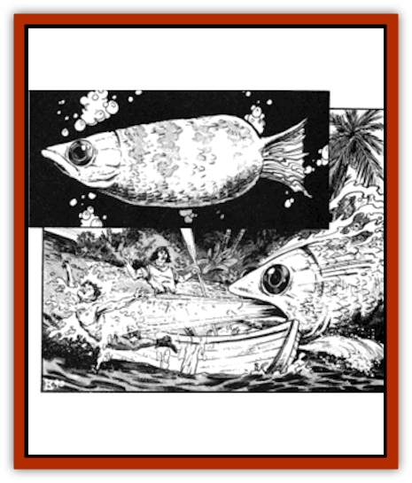
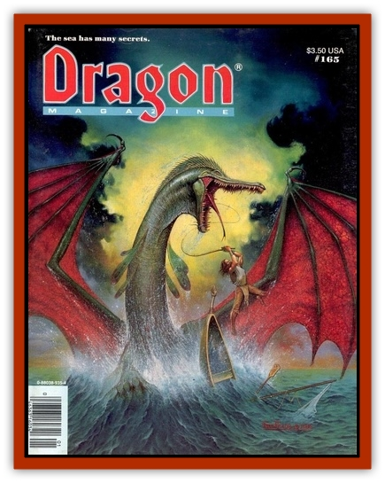

# Archerfish - Giant

| Statistic | **Archerfish, Giant** |
| --- | --- |
| **Activity Cycle:** | Day |
| **Alignment:** | Neutral |
| **Armor Class:** | 6 |
| **Climate/Terrain:** | Tropical/large freshwater lakes |
| **Damage/Attack:** | 2-8 |
| **Diet:** | Carnivore |
| **Frequency:** | Uncommon |
| **Hit Dice:** | 3+3 |
| **Intelligence:** | Animal (1) |
| **Magic Resistance:** | Nil |
| **Morale:** | Steady (11) |
| **Movement:** | Sw 20 |
| **No. Appearing:** | 90%: 1-3 adults; 10%: 5-20 young |
| **No. of Attacks:** | 1 |
| **Organization:** | Solitary |
| **Size:** | L (9' long) |
| **Special Attacks:** | Water jet, swallows whole |
| **Special Defenses:** | Nil |
| **THAC0:** | 17 |
| **Treasure:** | Nil |
| **XP Value:** | 420 |

The giant archer[[Fish|fish]] is a silvery creature with heavy jaws, giving it a squared-off look when seen head on. This is due to two powerfully muscled water bladders, one on either side of the head. Behind the head, the body narrows quickly to a streamlined shape with a powerful tail.

The water bladders can generate a water jet once per three rounds, fired from the fish's mouth, with a range of 30'. Used by a full-grown specimen, the jet can knock a human from the deck of a ship or out of a ship's rigging. A target is treated as AC 5 regardless of actual armor class, A free-standing victim is knocked backward by the force of the jet; for every 20 lbs. less than 200 lbs. he weighs, he is forced back 1', and any victim under 200 lbs. must make a dexterity check on 4d6 to remain standing (the point is moot for a victim hurled from a ship). If the victim is grasping a support or is braced, he must make a strength roll on 3d6 to avoid being knocked back. A saving throw vs. paralysis must be made to continue grasping any hand-held item. An attack roll of 20 indicates that the victim is stunned for 1-3 rounds by the force of the jet.

Once a victim is in the water, he is subject to a bite attack similar to a [[Shark|shark]]'s. On a natural roll of 20, the archerfish will swallow whole any victim the size of a halfling or gnome. A swallowed character can cut his way out if he inflicts enough damage to the AC 10 interior of the fish to slay it, but he can do so only if he has a dagger or knife in hand. Meanwhile, the character suffers 1 hp damage per round due to digestive acids, and he has no air to breathe. It should also be noted that, once in the water, a victim loses all armor-class bonuses due to dexterity unless he is wearing a *ring of free action* or similar magical item, and shields cannot be used.

These fish seldom come together except to spawn. Eggs are laid on the sea bottom and fertilized there. Those eggs not devoured by other predators hatch in 3-4 weeks. The young remain together in a school, ranging from 5-20 individuals, until they reach the length of about 3'; then they separate. Young archerfish have these statistics: AC 7; MV 18; HD 1+1; THAC0 19; #AT 1; Dmg 1-3; SA none effective; SZ 1-3'; XP 35.

The water jet is usable upon hatching. These fish cruise near the surface and track prey by sight, following long enough to orient on course and speed. Then they break the surface in a jump and squirt their jets to bring down large insects, birds, and small water-dwelling animals. The school of young is cooperative in this hunting style until the individuals reach adulthood, when the victims rarely provide enough food for the entire school (hence the break-up). The water jets of young giant archerfish do not endanger characters, and they cannot swallow characters whole, though they could consume sprites or brownies.

These fish are not territorial and travel to any place they can take down prey. They eat people only if such are available. In a pinch, giant archerfish are known to scavenge the bottoms of their shallow seas or large lakes.

Giant archerfish have no interest in treasure, though an occasional item may be found in the stomach of a slain fish. They themselves are not good to eat, nor do they have any body parts known to have practical use (except as bait to catch other fish). Nor is there any use for them as components for any known spells.

---
## Discovery & Documentation

**Source Publication:** Dragon165 (1991)
**Campaign Setting:** Dragon Magazine
**Author(s):** 

### Other Creatures Found in This Source Book
   * [[Damselfish_Giant|Damselfish, Giant]]
