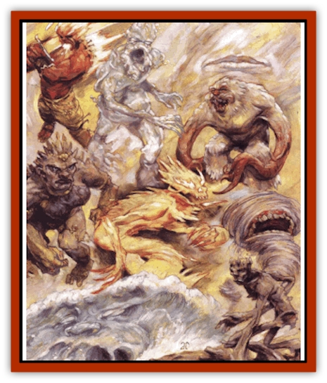

# Archomental - Evil

| Statistic | **Cryonax** | **Imix** | **Ogremoch** | **Olhydra** | **Yan-C-Bin** |
| --- | --- | --- | --- | --- | --- |
| **Activity Cycle:** | Any | Any | Any | Any | Any |
| **Alignment:** | Neutral evil | Neutral evil | Neutral evil | Neutral evil | Neutral evil |
| **Armor Class:** | -6 | -4 | -7 | -5 | -6 |
| **Climate/Terrain:** | Paraplane of Ice | Plane of Fire | Plane of Earth | Plane of Water | Plane of Air |
| **Damage/Attack:** | 5d4/5d4 | 6d6 | 5d10/5d10 | 2d12 | 2d10/2d10 |
| **Diet:** | Carnivore | Carnivore | Carnivore | Carnivore | Carnivore |
| **Frequency:** | Unique | Unique | Unique | Unique | Unique |
| **Hit Dice:** | 90 hp | 90 hp | 110 hp | 90 hp | 85 hp |
| **Intelligence:** | Genius (17) | Genius (18) | Exceptional (16) | Genius (18) | Genius (17) |
| **Magic Resistance:** | 75% | 85% | 85% | 70% | 90% |
| **Morale:** | Fearless (20) | Fearless (20) | Fearless (20) | Fearless (20) | Fearless (20) |
| **Movement:** | 9 | 18 | 9 | 6, Sw 18 | Fl 48 (A) |
| **No. Appearing:** | 1 | 1 | 1 | 1 | 1 |
| **No. of Attacks:** | 2 | 1 | 2 | 1 | 2 |
| **Organization:** | Solitary | Solitary | Solitary | Solitary | Solitary |
| **Size:** | L (15' tall) | L (18' tall) | L (10' tall) | L (20' dia.) | L (10' dia.) |
| **Special Attacks:** | See below | Heat, spells | Spells | Engulf, spells | See below |
| **Special Defenses:** | See below | See below | See below | See below | See below |
| **THAC0:** | 5 | 5 | 5 | 5 | 5 |
| **Treasure:** | H,V,X | R,U | H,U,Z | H,S,U | U,Z |
| **XP Value:** | 28,000 | 25,000 | 28,000 | 27,000 | 28,000 |

On the four Elemental Planes (and even one of the Paraelementals), there are those elemental beings that rise above their fellows, subjugating the rest under their own rule. Chant is these leaders - bloods known as archomentals - twist away from the true nature of the Inner Planes that spawned them and take on the outlooks of those beyond. In other words, they adopt the mantle of good and evil.

Fact is, some folks refer to the archomentals as the Princes of Elemental Evil (or [[Archomental_Good|Good]]) or similar derivations of that name. But the elemental high-ups resent the idea that they're anything but unique, and rarely refer to themselves as a group at all. Thus, the <q>correct</q> term is unknown.

The archomentals don't rule their respective planes or all the elementals found there. Instead, they control realms within their home planes, mastering as many of the less powerful elementals as they can. Like Abyssal lords, they're not true powers, but they are only one step removed. The princes can be slain, and yet they can grant spells to priests who serve and worship them - 1st- through 3rd-level spells through faith alone, and 4th-level spells if they appear in person. Word of the archomentals has spread throughout the multiverse. Any bark who's associated with a particular element - even if he's not native to the Inner Planes - knows of the princes and fears their power.

All archomentals are able to cast the following spells (once per round, at will) as though they were 20th-level casters: *detect invisibility*, *dispel magic*, *infravision* (duration of one day), *know alignment*, *suggestion* (duration of 12 hours), and *teleport without error*. They can cast each of the following spells three times per day: *comprehend languages* and *read magic*. Once per day, they can cast *telekinesis* (600 pounds). All archomentals have the ability to understand and converse with any intelligent creature.

The Princes of Elemental Evil are said to have a relationship with the mysterious being known only as the Elder Elemental God. Supposedly, some of the princes are that being's offspring, making them queer siblings to say the least.

**Imix:** Imix is the Prince of Evil Fire Creatures, ruling over his domain from within the heart of a powerful volcano said to contain vortices leading to the planes of Earth and Magma. Thousands of [[Elemental_Fire_Water|fire elementals]], [[Genie|efreet]], and [[Elemental_Fire_Kin|salamanders]] call him master, yet he constantly strives to destroy those creatures that refuse to bow down to him.

The Prince of Good Fire Creatures, [[Archomental_Good|Zaaman Rul]], recently launched a great war against Imix - a battle clearly won by the forces of evil. Imix now seeks to take advantage of this victory by tipping the scales of the entire plane of Fire toward evil (and declaring it all under his dominion). More consuming than even that dark agenda, however, is Imix's hatred for Olhydra, a being named by some sources as his cousin or even sister, but known by all as the Princess of Evil Water Creatures.

Imix appears as an 18-foot-tall column of flame, radiating powerful waves of heat at all times. These waves inflict 1d20 points of damage per round to every berk within 10 feet; no saving throw is allowed, though resistance to fire decreases the damage by half. When Imix strikes at his foes physically, his fiery hand causes 6d6 points of damage.

Once per day, Imix can summon his servants to do his bidding. When he calls, either 1d3 efreet, 1d3 fire elementals, or 1d3 salamanders appear immediately. The prince also wields potent spell-like abilities. Three times per day, he can cast a painfully powerful *continual light*, a *wall of fire* that's triple strength (in regard to damage and size), and *pyrotechnics*. Once per day, Imix can cast a *fireball* that inflicts 20d6 points of damage.

Finally, Imix can be struck only by +2 or better weapons, and he's immune to paralysis, poison, and petrification. Water-based attacks against the prince are made with a +1 bonus to hit. Cold-based attacks gain a +2 bonus to hit and inflict 1 additional point of damage per damage die.

**Ogremoch:** This Lord of Evil Earth Creatures is a rocky tyrant standing 10 feet tall. Although he dwells in a fortress within a giant plateau inside an immense cavern on the plane of Earth, Ogremoch often wanders his home plane looking for new subjects to intimidate, new slaves to command, or new opponents to challenge. Fear of his sudden appearance pervades all of Earth.

This fear, probably more than anything else, draws many or the plane's natives to his enemy, [[Archomental_Good|Sunnis]], the Princess of Good Earth Creatures. They look to her for protection, for her battles with Ogremoch are legendary. It's said the entire Elemental Plane of Earth shakes with the rumblings of their blows.

Ogremoch enjoys using his huge stone fists to pummel his enemies, inflicting 5d10 points of damage per punch. 'Course, he commands other great powers as well. Three times per day, he can cast the following spells: *wall of stone* (triple strength), *flesh to stone*, and *move earth* (the area of effect is doubled, and the casting time is measured in rounds rather than turns). Once per day, Ogremoch can create an *earthquake* 100 feet in diameter.

Once per day, the prince can summon 1d3 [[Elemental_Air_Earth|earth elementals]], 1d6 [[Khargra|khargra]], 1d4 [[Umber_Hulk|umber hulks]], or 1d4 [[Xorn|xorn]]. His wicked influence and magic corrupt any creatures he call, leaving them permanently evil.

Ogremoch is immune to fire and poison. Attacks based on cold, lightning, or magical fire inflict one less point of damage per die rolled against him. The prince can be struck only by weapons of +3 or greater enchantment.

**Olhydra:** As Princess of Evil Water Creatures, Olhydra is revered not only by elementals but also by prime-material monsters such as [[Sahuagin|sahuagin]], [[Umber_Hulk|vodyanoi]], [[Lycanthrope_Seawolf|seawolves]] and [[Beholder_and_Beholder-kin_I|eyes of the deep]] (among many others). Chant has it that she's even built working relationships with a good many [[Tanar'ri_True_Hezrou|hezrou tanar'ri]]. Fact is, whispers abound that Olhydra, of all the archomentals, is the closest to becoming a true power, for she has the greatest number of worshippers.

On the Elemental Plane of Water, Olhydra lives within a coral castle guarded by a shockingly large number of [[Elemental_Water_Kin_Water_Weird|water weirds]]. She spends a great deal of time in her palace, no doubt occupying her mind with hatred of Imix and schemes to bring about his destruction - there has long been a great enmity between her and the fire lord. Conversely, she ignores [[Archomental_Good|Ben-hadar]], the Prince of Good Water Creatures as well as the true deities of her plane. For now, Olhydra seems content with the power she has on Water and sees no reason to engage in needless battles.

The princess is a furious current or wave of water 20 feet in diameter, always ready to smash into a victim and inflict 2d12 points of damage. To make matters worse, she can envelop up to five man-sized creatures if she makes a successful attack roll versus AC 6 (modified only by the victims' Dexterity and magical bonuses). Those engulfed are powerless to act in any way, suffer 2d6 points of damage each round, and drown in 2d4 rounds. The only way to save the sods is to drive Olhydra away, since she can't move with enveloped victims.

Additionally, the Princess of Evil Water Creatures can summon 1d3 [[Elemental_Fire_Water|water elementals]], 1d2 [[Hag|sea hags]], 1d4+1 water weirds, or 20d10 sahuagin once per day. She can cast each of the following spells three times per day at the 20th level of ability: *wall of fog* (triple strength), *lower water*, *part water*, *transmute rock to mud*, and *ice storm*. While on another plane, she can attack surface ships, ramming them with a force likened to two heavy galleys. ('Course she must remain in a body of water while away from home.)

Olhydra can be struck only by +1 or better weapons, though edged weapons inflict only half the normal damage. She's immune to petrification and paralyzation, and she extinguishes any normal fires within 10 feet of her presence. However, assaults made on her with magical fire gain +2 to the attack roll and cause 1 extra point of damage per damage die. And though Olhydra's immune to cold damage, if 20 points of it are inflicted upon her, it acts as a slow spell. (she has no magic resistance or saving throw versus this effect).

**Yan-C-Bin:** **Yan-C-Bin:** More subtle than the other Princes of Elemental Evil, Yan-C-Bin, the Master of Evil Air, is naturally invisible. Only a slight disturbance in the air marks his passing. He lives in a palace of solid air on - guess where? - the Elemental Plane of Air, but spends much of his time wandering the plane (not to mention several others, particularly the Prime Material). All creatures that soar the skies of any plane or realm know of Yan-C-Bin and fear him.

His greatest foe is [[Archomental_Good|Chan]], the Princess of Good Air Creatures. Their conflict is not an open, physical war, but one of silent intimidation and covert chant-gathering. Truth is, the two've never even met. Neither puts much stock in amassing armies, but it's said that someday these wandering beings will meet, and that only one will survive the day.

In combat, Yan-C-Bin attacks twice per round, hammering his foe with powerful gusts of air that each inflict 2d10 points of damage. What's more, if he rolls 5 or more over the number required to hit his opponent, the victim is stunned for 1d6 rounds, unable to act.

Though he normally takes the form of a 10-foot-diameter current of air, the prince can alter his shape into that of an 80-foot-tall whirlwind with a diameter of 10 feet at the bottom and 30 feet at the top. Anyone within the area of effect is attacked automatically. The destructive form slays creatures under 3 Hit Dice outright, sweeping them away, and inflicts 4d8 points of damage to all other nonaerial creatures. (If an obstruction keeps the whirlwind from attaining its full height, it does not automatically slay creatures under 3 HD and inflicts only 2d8 points of damage on others.) Yan-C-Bin can keep this shape for up to 1d4+1 rounds at a time; formation or dissipation of the whirlwind takes a full round.

As the Prince of Evil Air Creatures, once each day YanC-Bin can summon 1d3 [[Elemental_Air_Earth|air elementals]], 1d4 [[Giant_Cloud|cloud giants]], 1d4 [[Invisible_Stalker|invisible stalkers]], or 1d3 [[Elemental_Air_Kin_Aerial_Servant|aerial servants]]. Like Ogremoch, the prince taints these creatures simply by his presence, making them evil forever.

Yan-C-Bin can be struck only by weapons of +2 or greater enchantment, though no object launched into the air can harm him. He's also immune to lightning and petrification. However, cutters who attack the prince with fire gain +1 to their attack rolls for even four experience levels they possess.

**Cryonax:** **Cryonax:** Of all the Princes of Elemental Evil, Cryonax is the one who doesn't really fit in. After all, he's not an elemental lord, but a paraelemental lord. Yet he doesn't fit in with those bashers either, since the rest or the paraelemental lords're nothing more than formidable mephits or other berks who'll claimed power in places where no one cares enough to challenge them. Cryonax is more like the archomentals in that he's a true force to contend with, and may even be another child of the Elder Elemental God (if a body believes that of any of the archomentals, that is). His plans include not only making the Paraelemental Plane of Ice as strong as the planes of the four base elements, but actually surpassing them in power, leaving Ice the mightiest force on the Inner Planes. A lofty goal indeed.

How can he plot such grandiose schemes? Well, for one thing, he has no direct foes. Imix and Olhydra hate each other, and Ogremoch and Yan-C-Bin are likewise enemies, though their hostility is not as vehement as that of the other pair. But Cryonax has no opposing elemental force (Chilimba of the paraplane of Magma is simply a powerful mephit, not nearly in the league of the archomentals.) Furthermore, Cryonax has no opposing moral force - there is no Elemental Prince or Princess of Good Ice. No one knows exactly why this is, but it leaves the lord of Ice alone to shape his plans for ultimate domination.

Cryonax is a fur-covered monstrosity standing 15 feet tall. Basically humanoid (his appearance has been likened to that of a [[Yeti|yeti]]), he has two long tentacles where folks might expect him to have arms. These tentacles inflict terrible wounds in combat (5d4 points of damage each), and any sod struck by them must also make a saving throw versus paralyzation or be frozen in place for 3d4 rounds. What's more, all creatures within 15 feet of Cryonax suffer 1d6 points of damage per round from the terrible cold he radiates (no saving throw is allowed, but those resistant to cold suffer only half damage). Fact is, his glacial palace within the Chiseled Estate is said to be the coldest part of the paraplane of Ice, though, truth to tell, many locations claim that title.

The prince can use each of the following abilities three times per day: *wall of ice* (triple strength), *hold person* and *ice storm* (inflicting 4d10 points of damage). Once per day, he can create a *cone of cold* as a 15th-level caster. Also once per day, he can summon 1d3 ice [[Paraelemental|paraelementals]], 1d4 [[Dragon_Chromatic_White|white dragons]], 1d4 [[Giant_Frost|frost giants]], or 1d6 yeti.

The lord of ice can be struck only by +2 or better weapons, and there's a cumulative 10% chance per strike that any weapon will shatter upon contact with his frigid form. An attack that shatters a weapon inflicts no damage on Cryonax. He's immune to poison and petrification, and coldbased spells heal rather than harm him (though they won't raise his hit points above his maximum). Bashers who make fire attacks on Cryonax, however, gain +2 to their attack rolls. and the fire inflicts 1 additional point of damage per damage die.

---
## Discovery & Documentation

**Source Publication:** Planescape III (1996)
**Campaign Setting:** Planescape
**Author(s):** Monte Cook

### Other Creatures Found in This Source Book
   * [[Animental|Animental]]
   * [[Archomental_Good|Archomental, Good]]
   * [[Belker|Belker]]
   * [[Bzastra|Bzastra]]
   * [[Chososion|Chososion]]
   * [[Darklight|Darklight]]
   * [[Devete|Devete]]
   * [[Devourer_Planescape|Devourer (Planescape)]]
   * [[Dharum_Suhn|Dharum Suhn]]
   * [[Egarus|Egarus]]
   * [[Elemental_Athas_Lesser_Air_Earth|Elemental (Athas), Lesser, Air/Earth]]
   * [[Elemental_Athas_Lesser_Fire_Water|Elemental (Athas), Lesser, Fire/Water]]
   * [[Elemental_Fire_Kin_Salamander_II|Elemental, Fire Kin, Salamander II]]
   * [[Entrope|Entrope]]
   * [[Facet|Facet]]
   * [[Frost_Salamander|Frost Salamander]]
   * [[Fundamental_Air_Earth|Fundamental, Air/Earth]]
   * [[Fundamental_Fire_Water|Fundamental, Fire/Water]]
   * [[Fundamental_All_Elements|Fundamental, All Elements]]
   * [[Garmorm|Garmorm]]
   * [[Homunculus_Elemental|Homunculus, Elemental]]
   * [[Immoth|Immoth]]
   * [[Khargra|Khargra]]
   * [[Klyndes|Klyndes]]
   * [[Magran|Magran]]
   * [[Menglis|Menglis]]
   * [[Nathri|Nathri]]
   * [[Ooze_Sprite|Ooze Sprite]]
   * [[Paraelemental|Paraelemental]]
   * [[Phirblas|Phirblas]]
   * [[Psurlon|Psurlon]]
   * [[Quasielemental_Negative|Quasielemental, Negative]]
   * [[Quasielemental_Positive|Quasielemental, Positive]]
   * [[Rast|Rast]]
   * [[Ravid|Ravid]]
   * [[Ruvoka|Ruvoka]]
   * [[Scile|Scile]]
   * [[Shad|Shad]]
   * [[Shocker|Shocker]]
   * [[Sislan|Sislan]]
   * [[Suisseen|Suisseen]]
   * [[Terithran|Terithran]]
   * [[Thoqqua|Thoqqua]]
   * [[Trilloch|Trilloch]]
   * [[Tsnng|Tsnng]]
   * [[Ungulosin|Ungulosin]]
   * [[Vacuous|Vacuous]]
   * [[Wavefire|Wavefire]]
   * [[Xag-Ya_Xeg-Yi|Xag-Ya/Xeg-Yi]]
   * [[Xill|Xill]]
