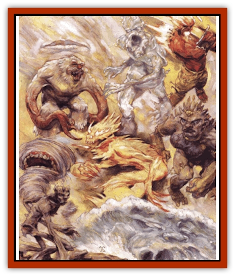

# Archomental - Good

| Statistic | **Ben-hadar** | **Chan** | **Sunnis** | **Zaaman Rul** |
| --- | --- | --- | --- | --- |
| **Activity Cycle:** | Any | Any | Any | Any |
| **Alignment:** | Neutral good | Neutral good | Neutral good | Neutral good |
| **Armor Class:** | -4 | -6 | -7 | -3 |
| **Climate/Terrain:** | Plane of Water | Plane of Air | Plane of Earth | Plane of Fire |
| **Damage/Attack:** | 3d6/3d6 | 2d10/2d10 | 3d12/3d12 | 3d10 |
| **Diet:** | Carnivore | Carnivore | Carnivore | Carnivore |
| **Frequency:** | Unique | Unique | Unique | Unique |
| **Hit Dice:** | 90 hp | 90 hp | 115 hp | 80 hp |
| **Intelligence:** | Genius (17) | Genius (18) | Exceptional (16) | Genius (17) |
| **Magic Resistance:** | 80% | 85% | 70% | 60% |
| **Morale:** | Fearless (20) | Fearless (20) | Fearless (20) | Fearless (20) |
| **Movement:** | 12, Sw 18 | Fl 48 (A) | 9 | 12 |
| **No. Appearing:** | 1 | 1 | 1 | 1 |
| **No. of Attacks:** | 2 | 2 | 2 | 1 |
| **Organization:** | Solitary | Solitary | Solitary | Solitary |
| **Size:** | L (18' tall) | L (10' diameter) | L (12' tall) | L (10' tall) |
| **Special Attacks:** | Spells | Spells | Spells | Spells, burning touch |
| **Special Defenses:** | See below | See below | See below | See below |
| **THAC0:** | 5 | 5 | 5 | 5 |
| **Treasure:** | U,Z | H,S,U | H,U,Z | R,U |
| **XP Value:** | 24,000 | 28,000 | 29,000 | 23,000 |

The origins of most or the Princes of Elemental Good aren't known for certain. In all likelihood, they were normal elementals that somehow grew in power and stature. Only Zaaman Rul is said to be related to one of the [[Archomental_Evil|Princes of Elemental Evil]]; the rest merely gained their positions as a direct result of the swelling strength of their wicked counterparts. They came afterward to champion the resistance against evil.

*Note:* For general information on archomentals, refer to the first few paragraphs of the entry for [[Archomental_Evil|evil archomentals]]. But to minimize page-flipping, here's the dark of their common powers:

All archomentals are able to cast the following spells (once per round, at will) as though they were 20th-level casters: *detect invisibility*, *dispel magic*, *infravlsion* (duration of one day), *know alignment*, *suggestion* (duration of 12 hours), and *teleport without terror*. They can cast each of the following spells three times per day: *comprehend languages* and *read magic*. Once per day, they can cast *telekinesis* (600 pounds). All archomentals have the ability to understand and converse with any intelligent creature.

**Ben-hadar:** Deep within a hidden recess in the Coral Reef of Ssesurgass, Ben-hadar rules over good-aligned water elementals. The blood's an arrogant, selfish boor, but he fights against evil at every turn and promotes the general welfare of those under him. so he's earned the title of Prince of Good Water Creatures. He has little to do with his malicious counterpart, [[Archomental_Evil|Olhydra]], but he's had feuds with both [[Archomental_Evil|Chan]] and [[Archomental_Evil|Zaaman Rul]], who find him personally repugnant and unwilling to look beyond the concerns of the Elemental Plane of Water.

Ben-hadar is a tall humanoid figure made of water. He can batter his foes with his huge, clawed hands (causing 3d6 points of damage each), but as a lord of the water, Ben-hadar has a number of other powers. He can use each of the following abilities three times per day: *lower water*, *part water*, and create a *wall of water* equal to a triple-strength *wall of ice* (this power works only underwater). At will, he can bestow the ability to breathe water on another; this gift lasts as long as he wishes. Once per day, the prince can summon 1d3 [[Elemental_Fire_Water|water elementals]], 2d4 [[Elemental_Water_Kin|nereids]], or 10d10 [[Triton|tritons]].

Ben-hadar can be struck only by weapons of +2 or greater enchantment. However, bladed weapons that strike him inflict only half their normal damage as they pass through his watery form. The prince is immune to poison, petrification, and paralyzation.

**Chan:** Like [[Archomental_Evil|Yan-C-Bin]], her evil foe, Chan is an invisible entity of softly churning air. She's the master of calm breezes and gentle sounds, though she can rage like a harsh wind or even a violent tornado when she must (striking a sod for 2d10 points of damage twice per round). Her steady surveillance of Yan-C-Bin often forces him to curb his activities for fear of her intervention. But, as they say, a peery eye stares both ways - Chan must also have a care in regard to what she does, for Yan-C-Bin could just as easily stick his nose into *her* business. This war of quiet threat has gone on for years, and will most likely continue for many more.

'Course, just because she tries to fend off evil doesn't mean she always sides with the other good archomentals. Surprisingly, Chan seems to have a great rivalry with Ben-hadar, the Prince or Good Water Creatures. While the two don't actually wage war, they refuse to help each other - or any bark who allies himself with the other.

Chan spends some of her time in the Palace of Unseen Contemplation, her floating stronghold made of glass. Otherwise, she wanders the Elemental Plane of Air, watching Yan-C-Bin and attempting to further the cause of good.

Like the other good archomentals, Chan can be struck only by +2 or better weapons. As the Princess of Good Air Creatures, she can use each of the following abilities three times per day: *wind wall* (triple strength), *gust of wind* (triple strength), *stinking cloud*, *solid fog*, and *cloudkill*. Once per day, she can *control weather*; the effects appear instantly and cover an area of 30 square miles. Finally, she can summon 1d3 [[Elemental_Air_Earth|air elementals]], 1d3 [[Genie|djinn]], 1d4 [[Elemental_Air_Kin_Aerial_Servant|aerial servants]] or 1d8 [[Mephit_I_Air_Smoke|air mephits]] once per day.

**Sunnis:** The Princess of Good Earth Creatures, who takes the form of a tall, muscular woman with features chiseled out of stone, is a power to be respected on her plane. Though she doesn't really concern herself with amassing followers, a number of [[Elemental_Air_Earth|earth elementals]], [[Galeb_Duhr|galeb duhr]], [[Xorn|xorn]], and other creatures see her in the Sandfall - a fortress built within a cavern underneath a perpetually falling column of sand. The sand eventually drains down into what appears to be a bottomless pit not far away from Sunnis's stronghold.

Some say she plans to one day lay a trap for her enemy, [[Archomental_Evil|Ogremoch]], and hurl him into the pit, but that seems farfetched. The princess is much more likely to want to pummel her foe with her mighty fists, each of which inflicts 3d12 points of damage. In addition, she can use each of the following abilities three times per day: *move earth*, *stone shape*, *stone to flesh*, *wall of iron* (double strength), and *wall of stone* (double strength). Once per day, she can animate a mass of rock as per the *animate object* spell.

Sunnis can be struck only by weapons of +2 or greater enchantment, and she's immune to petrification and poison. As the Princess of Good Earth Creatures, she can summon 1d3 earth elementals, 1d4 galeb duhr, 1d4 xorn, 2d6 [[Elemental_Earth_Kin|pech]], or 3d6 [[Elemental_Earth_Kin_Sandling|sandlings]] once per day.

**Zaaman Rul:** **Zaaman Rul:** Chant has it that Zaaman Rul is the bastard son of [[Archomental_Evil|Imix]], and, as such, has inherited some of his sire's might. Rising quickly through the ranks of the [[Elemental_Fire_Water|fire elementals]], Zaaman Rul gathered together a great army or his brethren, as well as [[Elemental_Fire_Kin_Azer|azer]], [[Firetail|firetails]], and various fiery monsters. Gathering on the Plain of Burnt Dreams, his troops waited until what he thought was the right moment, and then attacked the fortress of Imix.

Unfortunately, the berk grossly underestimated the might of his foe. Imix and his evil minions routed and scattered the army of good-aligned fire elementals, seizing and converting (or simply destroying) many prisoners. As a result, Zaaman Rul's now in hiding. He bides his time, licks his wounds, and waits for another opportunity to end the oppression of his dark sire.

Zaaman Rul is a 10-foot-tall, red-skinned humanoid with long black hair and black eyes. At will, he can conjure forth a flaming sword that inflicts 3d10 points of damage per blow. The prince can also use each of the following abilities three times per day: firebal**l (12d6 points of damage), *flame arrow* (double damage), and *wall of fire* (double size and damage). His touch burns combustibles, and he can extinguish any flame within 20 feet. Once each day, he can summon 1d2 fire elementals, 1d4 firetails, or 1d6 azer.

Zaaman Rul can be struck only by +2 or better weapons. Those of lesser (or no) enchantment simply melt when they strike his red-hot hide. Cold- and water-based attacks on the prince inflict 1 additional point of damage per damage die.

The blood's the weakest of the Princes of Elemental Good, and he's well aware of that fact - moreso after his defeat by Imix than ever before. He won't overestimate his own prowess again, but he won't give up, either.

---
## Discovery & Documentation

**Source Publication:** Planescape III (1996)
**Campaign Setting:** Planescape
**Author(s):** Monte Cook

### Other Creatures Found in This Source Book
   * [[Animental|Animental]]
   * [[Archomental_Evil|Archomental, Evil]]
   * [[Belker|Belker]]
   * [[Bzastra|Bzastra]]
   * [[Chososion|Chososion]]
   * [[Darklight|Darklight]]
   * [[Devete|Devete]]
   * [[Devourer_Planescape|Devourer (Planescape)]]
   * [[Dharum_Suhn|Dharum Suhn]]
   * [[Egarus|Egarus]]
   * [[Elemental_Athas_Lesser_Air_Earth|Elemental (Athas), Lesser, Air/Earth]]
   * [[Elemental_Athas_Lesser_Fire_Water|Elemental (Athas), Lesser, Fire/Water]]
   * [[Elemental_Fire_Kin_Salamander_II|Elemental, Fire Kin, Salamander II]]
   * [[Entrope|Entrope]]
   * [[Facet|Facet]]
   * [[Frost_Salamander|Frost Salamander]]
   * [[Fundamental_Air_Earth|Fundamental, Air/Earth]]
   * [[Fundamental_Fire_Water|Fundamental, Fire/Water]]
   * [[Fundamental_All_Elements|Fundamental, All Elements]]
   * [[Garmorm|Garmorm]]
   * [[Homunculus_Elemental|Homunculus, Elemental]]
   * [[Immoth|Immoth]]
   * [[Khargra|Khargra]]
   * [[Klyndes|Klyndes]]
   * [[Magran|Magran]]
   * [[Menglis|Menglis]]
   * [[Nathri|Nathri]]
   * [[Ooze_Sprite|Ooze Sprite]]
   * [[Paraelemental|Paraelemental]]
   * [[Phirblas|Phirblas]]
   * [[Psurlon|Psurlon]]
   * [[Quasielemental_Negative|Quasielemental, Negative]]
   * [[Quasielemental_Positive|Quasielemental, Positive]]
   * [[Rast|Rast]]
   * [[Ravid|Ravid]]
   * [[Ruvoka|Ruvoka]]
   * [[Scile|Scile]]
   * [[Shad|Shad]]
   * [[Shocker|Shocker]]
   * [[Sislan|Sislan]]
   * [[Suisseen|Suisseen]]
   * [[Terithran|Terithran]]
   * [[Thoqqua|Thoqqua]]
   * [[Trilloch|Trilloch]]
   * [[Tsnng|Tsnng]]
   * [[Ungulosin|Ungulosin]]
   * [[Vacuous|Vacuous]]
   * [[Wavefire|Wavefire]]
   * [[Xag-Ya_Xeg-Yi|Xag-Ya/Xeg-Yi]]
   * [[Xill|Xill]]
