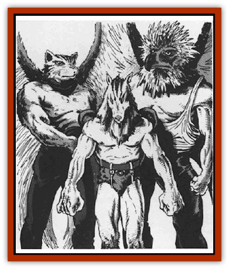
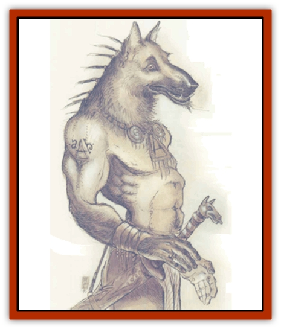
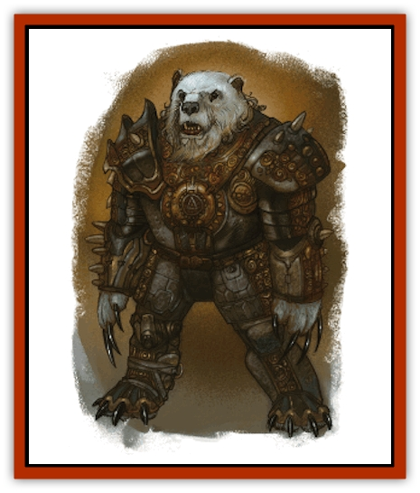
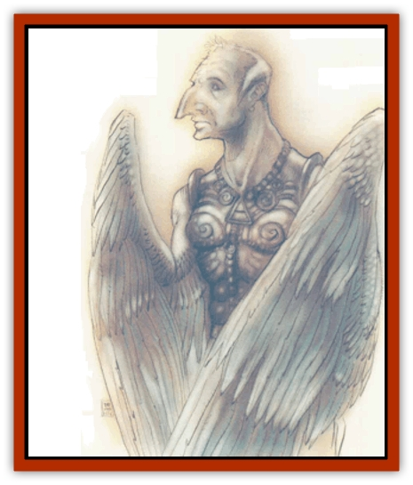
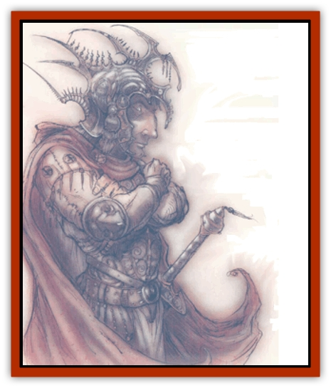

# Archon

| Statistic | **Hound** | **Lantern** | **Sword** | **Throne** | **Tome** | **Trumpet** | **Warden** |
| --- | --- | --- | --- | --- | --- | --- | --- |
| **Activity Cycle:** | Any | Any | Any | Any | Any | Any | Any |
| **Alignment:** | Lawful good | Lawful good | Lawful good | Lawful good | Lawful good | Lawful good | Lawful good |
| **Armor Class:** | 1 | 5 | -5 | -7 | -5 | -3 | -1 |
| **Climate/Terrain:** | Mount Celestia | Mount Celestia | Mount Celestia | Mount Celestia | Mount Celestia | Mount Celestia | Mount Celestia |
| **Damage/Attack:** | 1d4/1d4/1d8 or by weapon | 1d6/1d6 | 2d4/2d4/2d4/2d4 | 1d12/1d12 | 1d10/1d10 | 1d10/1d10 | 1d8/1d8/2d6 |
| **Diet:** | Omnivore | None | None | Nectar | Ambrosia | Mead | Herbivore |
| **Frequency:** | Common | Common | Uncommon | Rare | Rare | Rare | Uncommon |
| **Hit Dice:** | 6 | ½ | 10 | 12 | 20 | 11 | 8 |
| **Intelligence:** | Average (9) | Low (6) | High (13) | Genius (17) | Supra (19) | Except. (15) | Very (11) |
| **Magic Resistance:** | 10% | Nil | 30% | 50% | 60% | 40% | 20% |
| **Morale:** | Fanatic (18) | Fanatic (18) | Fanatic (18) | Fanatic (18) | Fanatic (18) | Fanatic (18) | Fanatic (18) |
| **Movement:** | 15 | Fl 24 (A) | 15, Fl 18 (C) | 15, Fl 36 (B) | 15, Fl 18 (C) | 12, Fl 21 (B) | 15 |
| **No. Appearing:** | 1d6 | 3d6 | 1d6 | 1 | 1 | 1d3 | 1d6 |
| **No. of Attacks:** | 3 or 1 | 2 | 4 | 2 | 2 | 2 | 3 |
| **Organization:** | Hierarchy | Hierarchy | Hierarchy | Hierarchy | Hierarchy | Hierarchy | Hierarchy |
| **Size:** | M (6' tall) | S (3' tall) | L (8' tall) | L (10' tall) | L (8' tall) | L (7' tall) | L (8' tall) |
| **Special Attacks:** | Shapechange | Light rays | Dive, spell use | Vorpal sword, spell use | Light rays, spell use | Trumpet, spell use | Bear hug, spell use |
| **Special Defenses:** | +1 or better weapon to hit | +1 or better weapon to hit | +2 or better weapon to hit | +3 or better weapon to hit | +3 or better weapon to hit | +3 or better weapon to hit | +2 or better weapon to hit |
| **THAC0:** | 15 | 20 | 11 | 7 | 9 | 11 | 13 |
| **Treasure:** | Nil | Nil | Nil | Nil | Nil | Nil | Nil |
| **XP Value:** | 2,000 | 975 | 14,000 | 16,000 | 23,000 | 15,000 | 7,000 |

The petitioners of Mount Celestia, archons have charged themselves with the protection of the plane and all those who are innocent or free of evil within its breathtaking vistas. When a lawful-good mortal dies, his spirit goes to this plane (frequently called the Seven Heavens by prime-material adventurers). There his essence is transformed into the body of a lantern archon, the lowest of the celestial hierarchy. However, not all lawful-good spirits are changed into archons. Some, like dwarves and halflings, become petitioners in the realms of their powers, physically unaltered.

Seven types of archons populate the seven layers of Mount Celestia. Each has a radically different appearance (as is evidenced by the illustrations in this entry), though all radiate an aura of goodness, peace, and law. Only when threatened or in baffle do archons lose this calm aura.

As both petitioners and guardians of Mount Celestia, archons are doubly vested in protecting their home from invasion, whether it is by the forces of Mechanus or Baator (two planes whose residents long to control the orderly Mount). Archons abhor combat, but when they must fight they do so with a vengeance. With ire glinting in their eyes, archons willingly enter battle against those who would despoil their plane. Simply entering a fray they are intimidating sights, hut they become even more so when they send forth their aura of extreme menace. Those who feel this aura must save versus spell (at +1 for lantern, no modifier for hound, -1 for warden, -2 for sword, -3 for trumpet, -4 for throne, -5 for tome) or suffer a -2 penalty to each attack roll until they successfully hit the archon, at which point the menacing aura disappears.

In addition to creating this aura, all archons can use one of the following abilities once per round at will (unless otherwise stated):

<ul><li>Continual light</li><li>Detect evil</li><li>Infravision</li><li>Protection from evil, 10-foot radius (always active)</li><li>Teleportation without error</li><li>Tongues (always active)</li></ul>Although a person can guess an archon's station merely by its appearance, there's an equally simple way to judge it: by which metal accoutrements adorn the archon. This ornamentation serves a twofold purpose. First, the items worn indicate whether it is a hound, warden, or whatever. The text on each type of archon indicates if it wears a collar, bracers or greaves, breastplate, helmet, or some combination thereof.

Second, the quality of the metal shows an archon's virtue within its station. From lowest to highest, the order is lead, tin, brass, bronze, silver, gold, and platinum. For example, platinum rather than brass accoutrements on a warden archon signify its greater obedience to the higher order - its virtue, if you will - and its greater willingness to serve Law and Good. Once it reaches a still higher stage of goodness, it will be transformed into a sword archon wearing lead appointments; it will start the process of advancement all over again in its new station. A visitor to Mount Celestia is likely to see any number of archons of a given station, each wearing different metals.

When an archon reaches the next state of goodness, it is not fitted with new metal accoutrements; rather, the metal simply transmogrifies into the next state. Because the metal is actually part of an archon's body and cannot be removed, it's unaffected by anything that might change normal metal - including metal-altering spells. The purpose of the metal appointments isn't to confine or hinder or even protect, but to remind the archon of its station so that it might strive to its next level.

All archons of a given station are equal, regardless of whether they have lead or gold accoutrements. The especially virtuous (those with precious metals) command just as many lower archons as do the new or less virtnous (those with base metals). There's no difference within a station except that a more virtuous member rises to the next rank (or metal) faster. There's also no jealousy among archons, and there's almost never been a recorded instance of one turning stag on its brethren in order to advance. The one archon who did turn stag decided he was better off in Baator, where [[Baatezu_General_Information|baatezu]] reward a being for manipulation and scheming; rumor has it he's clawed his way up to gelugon status now. No, on Mount Celestia archons are rewarded for good and virtuous behavior, and that means they're content to stay in their forms until they advance. Nevertheless, it's a joyous day when either body or metal changes.

Given the archons' absorption in the philosophy of goodness and law, it's not surprising that they don't covet treasure. They are beyond accumulating worldly goods, seeking only to gain treasures of another sort: celestial understanding, compassion, and so forth. They don't accept money, nor do they bargain with it. Even extremely rare magical items hold no lure for archons.

## Lantern Archon

Lanterns, lowest of archons, appear as floating balls of light. They are the equivalent of the infantry in prime-material armies. Newly arrived to Mount Celestia, these petitioners struggle to prove their worth in order to advance in station. However, their desire is not so much advancement as a longing to help those in need. Alone of archons, they bear no metal appointments.

**Combat:** In combat, lantern archons fire rays of light twice a round at their foes. Those who are pure of heart and intend no harm to an archon are unaffected by the rays, while others suffer 1d6 points of damage per hit. The range is 30 feet, with no modifiers.

Because of their incorporeal nature, lantern archons aren't hurt by nonmagical weapons, and even magical weapons cause only half damage. Lanterns are affected by magic, however, though they are immune to paralyzation and *charm* spells. Likewise, spells that require a corporeal body to cast a spell upon are ineffective against these archons.

**Habitat/Society:** Lanterns are very friendly, often helping neophyte adventurers. (Accordingly, they're a perfect introduction to Mount Celestia for prime-material player characters.) As incorporeal beings, however, they can't do much physically to help travelers. Instead, they act as sources of information about Mount Celestia, as guides to the plane, or as fonts of inspiration (often in the form of parables and metaphors).

**Ecology:** The most common archon, lanterns are typically found only on the first layer of Mount Celestia. There they absorb the light and essence of the plane, needing nothing more to sustain them. Sometimes they serve as messengers to the upper layers, and they can teleport to wherever needed when summoned by a hound archon. Their only goal is to reach the next station of goodness - that of the hounds.

## Hound Archon

Hound archons are powerfully muscled humans who have canine heads. Their broad shoulders and large fists mark them as able hand-to-hand combatants; likewise, their strong legs indicate that fleeing enemies might not get very far before being brought down. The hounds are the guardians of the first and second layers, and they command the lantern archons in the defense of Mount Celestia. They wear simple metal collars.

**Combat:** Like most other archons, hounds fight only to defend Mount Celestia or themselves. If the cause is just, or the defendant innocent of evil, hound archons will also defend those who are unable to protect themselves against a mightier foe. Regardless of their motivation for battle, hounds fight with a will. When they attack, they can use weapons, though they prefer their natural abilities. The fists cause 1d4 points of damage each, while their fierce bite causes 1d8 points.

Hounds can also *shape change* into any type of [[Dog|dog]] or [[Wolf|wolf]], though they can't take the form of a lycanthrope. While in their animal form, they can use any of its natural abilities, as well as all of their own. They are immune to nonmagical weapons - regardless of which form they are in.

Each hound archon has a telepathic link to 100 lantern archons. Whenever there's trouble, a hound can spread the message via its lanterns (which pass the word quickly indeed). If a hound ever enters combat, it can expect 1d10 lanterns to arrive each round until all 100 are gathered.

**Habitat/Society:** Guardians of the lanterns and of the first and second layers of Mount Celestia, hounds also serve as planar hosts. Much like the helpful lanterns, the hound archons welcome travelers to Mount Celestia. They will gladly direct a planewalker to where he wants to go - though often with a watchful eye.

**Ecology:** Hound archons can eat anything set before them, as long as it's organic. They have no preference for meat or plant matter, and neither affects them adversely. Interestingly, they don't hunt for meat or harvest vegetation, preferring instead to subsist on gifts of food offered by visitors. Hounds can live indefinitely until the next offering, perhaps subsisting on the remnants of planar essence gleaned as lanterns. They lose this ability once they have metamorphosed to the next station of goodness - that of warden.

## Warden Archon

Wardens are best described as hulking humans with grizzly-bear heads. Their hands, though human-shaped, end in claws. Their eyes, tiny and bright like a bear's, reflect extreme intelligence. They have the great strength and acute senses of a grizzly bear, though not its unpredictable nature. Wardens converse via telepathy, though they can (and often do) communicate vocally with ursine animals. They wear collars and arm bracers.

**Combat:** Warden archons are never surprised - at least on Mount Celestia. Since they've never been encountered beyond that plane's borders, it's still dark as to whether they can be surprised elsewhere. Furthermore, they've been known to play stupid in order to draw an enemy near, often confusing a clueless onlooker into thinking the wardens might not be so smart (the enemy, of course, quickly discovers otherwise).

If said enemy is foolish enough to approach, thinking himself undetected, the warden archon attacks as if it were a bear. Each hand delivers 1d8 points of damage, and its powerful bite causes 2d6 more. If both hands hit in a single round, the warden grabs its enemy and wraps him in a powerful hug. This hug delivers 1d10 points of additional damage, allowing the warden to make its bite attack at +4. To break free, a victim must make a successful bend bars/lift gates roll. Until he breaks free, he cannot use his arms or hands for combat - nor can he cast any spells.

Wardens have access to the lesser/greater divination schools of wizards as well as spells from the priestly divination sphere. A warden can cast any spell of 4th level or lower as if it were an 8th-level priest. Although any given spell can be cast only once per day, the warden can cast at will.

**Habitat/Society:** Wardens are the guardians of the portals between Mount Celestia's layers. These archons prevent unworthy cutters and unauthorized travelers from passing through. Likewise, they prevent lanterns from journeying upward through the layers, though they grant dispensation to those lanterns relaying messages.

**Ecology:** Unlike [[Bear|grizzly bears]], which devour virtually any edible foodstuffs, warden archons are herbivores. They are prodigious eaters, consuming any roots, vegetation, shrubbery, and even trees found in their home. However, they eat only for one hour at the break of day, and they will forgo this repast if need be. Some sages speculate that the warden archons' tremendous consumption is in preparation for their next station, for sword archons consume nothing.

## Sword Archon

Sword archons appear as mostly ordinary humans - except most ordinary humans don't have wings in place of arms. Their hair is silvery, and their eyes glow with inner light. They wear collars, leg greaves, and breastplates.

**Combat:** Sword archons can attack four times per round with their powerful bite, inflicting 2d4 points of damage for each successhl hit. Swords can also dive to attack, if they have 100 feet in which to move. This attack causes 2d10 points of damage. While diving, its AC is -8 because of its great speed. Swords can also cast spells at will from any priest sphere as if they were 15th-level priests.

**Habitat/Society:** Swords carry messages from tome archons (and sometimes from the powers themselves) to all of Mount Celestia's layers. These missives proclaim the word of the higher ranking archons - usually gems of wisdom disseminated for the benefit of lower-level archons. Thus, the arrival of a sword is always regarded with some anticipation, even if the message is of impending war.

**Ecology:** Sword archons aren't known to consume anything.

## Trumpet Archon

Trumpet archons look much like [[Elf_Winged|avariel]], or winged elves, save that trumpets are even more fair. Each archon of this type wears a collar and breastplate. Each also carries a single silver trumpet, which it blows to announce its arrival upon reaching any destination and upon its return to Mount Celestia. The sound emitted from this trumpet is one of utter clarity and piercing beauty. Nonarchons who hear the trumpet must save versus spell; failure means paralyzation for 1d4 rounds.

**Combat:** Though they disdain combat, trumpet archons are highly capable warriors. Their trumpets instantly change to silver *swords +3*, which they use to attack twice per round for 1d10 points of damage for each successful hit. If an archon's trumpet is stolen (in either trumpet or sword form), it transforms into a useless chunk of lead - and woe betide the poor thief should the archon discover him!

Trumpet archons can also cast spells from all priest spheres as if they were 17th-level priests.

**Habitat/Society:** Trumpet archons serve as the messengers of higher archons and the powers, but they also have a far more dangerous duty: They escort the spirit of a newly dead being back to its body if it's resurrected or raised. In performing this duty, the trumpets - alone of all archons - are free to leave the confines of Mount Celestia. Thus, they are held in some awe by their brethren.

Interestingly, trumpets are the only archon group in which one rules over others of the same station. Israfel, a trumpet, is known as the lord of heralds. He assigns the other trumpets to their duties.

**Ecology:** Trumpets consume only mead. Unlike the mortal version, the mead trumpets drink is made from the flowering plants of Mount Celestia. It is exceptionally potent stuff. Legend has it that this mead enhances longevity, though that may only be rumor.

## Throne Archon

A metal-clad human, with golden skin and fair hair, best describes the appearance of a typical throne archon. These archons wear helmets and carry swords, and they are protected by breastplates that radiate light.

**Combat:** Throne archons avoid combat whenever they can, instead sending their minions forth to fight their battles. However, they can cast spells from all wizard schools and priest spheres as if they were 18th level. They can also attack twice per round with their powerful *vorpal swords +5*, causing Id12 points of damage with each successful attack.

**Habitat/Society:** These archons rule the cities and realms of Mount Celestia; as such, they've got considerable influence, both spiritual and temporal. Indeed, they are said to he the true rulers of the archons, though the tome archons technically rule over more area as each is assigned to a single layer. However, the thrones are more involved with the day-to-day cares of a lawful reign, mediating disputes, resolving conflicts, and exemplifying goodness. Thrones do not politically squabble, instead gathering peacefully to negotiate differences. They can command any archon who falls into their purview.

**Ecology:** Throne archons rank only slightly below the tomes. Thrones subsist entirely on nectar, which is derived from combining the praise of lower archons with the celestial fruits found in the Seventh Heaven. They consume no other food.

## Tome Archon

Tome archons, the rulers of the seven layers, look like winged humans with hawk heads. Their bodies are covered with armor - a point to remember, for their primary duty is to defend. If necessary, however, they will take the initiative and attack first in an effort to prevent further warfare.

**Combat:** Like the throne archons, tome archons despise fighting personally, though with the tomes its also a matter of global prudence, as opposed to purely personal. Since there are only seven known tomes, their deaths would spell disaster for the archon hierarchy. Therefore, whenever needed, a tome archon can summon 1,000 lanterns, 500 hounds, 250 wardens, or 125 swords to its defense. If necessary, the tome can defend itself by firing rays of light from its hands, twice per round, for 1d10 points of damage each. A tome can also cast spells from any priest sphere as if it were a 20th-level priest.

**Habitat/Society:** The seven tome archons are each responsible for a single layer of Mount Celestia. These archons oversee the layers with near-omniscience, though they're unaware of what transpires in the realms of the powers. It's said that the tomes meet to discuss the affairs of the plane, but of course lesser creatures aren't allowed in or near these meetings, so perhaps that's conjecture.

**Ecology:** Tomes subsist on ambrosia, the distilled joy of all petitioners on the Mount.

## Fallen Archons

Of course, not every archon is perfect. Sometimes they stumble and fall from the path they've chosen; sometimes they choose to reject the ways of archons; and sometimes they are ejected from the celestial ranks by their brethren. It all depends on the magnitude of the transgression. Since archons are naturally forgiving creatures, it takes some incredible foolishness for an archon to fall completely from the grace of Mount Celestia, never to return.

Those who do fall retain their forms and capabilities, but they do not keep the mystical powers afforded them by the plane. Thus, a hound archon would keep its fists and its appearance, but would lose the ability to summon lantern archons to its aid. In addition, it would be forced to remain in its humanoid form, never again to change shape.

Naturally, the higher levels of archons fall less frequently, but it's known to happen. Those who show no sign of ridding themselves of chaos are given over to the chaotic powers to become asuras, while the spirits of those who've got evil tainting are banished to the Prime, Sigil, or elsewhere

---
## Discovery & Documentation

**Source Publication:** MC8 Outer Planes Appendix (1990)
**Campaign Setting:** Planescape
**Author(s):** Timothy B. Brown, Jamie LaFountain

### Other Creatures Found in This Source Book
   * [[Aasimon_Agathinon|Aasimon, Agathinon]]
   * [[Aasimon_Deva|Aasimon, Deva]]
   * [[Aasimon_Light|Aasimon, Light]]
   * [[Aasimon_General_Information|Aasimon, General Information]]
   * [[Aasimon_Planetar|Aasimon, Planetar]]
   * [[Aasimon_Solar|Aasimon, Solar]]
   * [[Air_Sentinel|Air Sentinel]]
   * [[Animal_Lord|Animal Lord]]
   * [[Baatezu_Lesser_Abishai|Baatezu, Lesser, Abishai]]
   * [[Baatezu_Greater_Amnizu|Baatezu, Greater, Amnizu]]
   * [[Baatezu_Lesser_Barbazu|Baatezu, Lesser, Barbazu]]
   * [[Baatezu_Greater_Cornugon|Baatezu, Greater, Cornugon]]
   * [[Baatezu_Lesser_Erinyes|Baatezu, Lesser, Erinyes]]
   * [[Baatezu_General_Information|Baatezu, General Information]]
   * [[Baatezu_Greater_Gelugon|Baatezu, Greater, Gelugon]]
   * [[Baatezu_Lesser_Hamatula|Baatezu, Lesser, Hamatula]]
   * [[Baatezu_Lemure|Baatezu, Lemure]]
   * [[Baatezu_Least_Nupperibo|Baatezu, Least, Nupperibo]]
   * [[Baatezu_Lesser_Osyluth|Baatezu, Lesser, Osyluth]]
   * [[Baatezu_Greater_Pit_Fiend|Baatezu, Greater, Pit Fiend]]
   * [[Baatezu_Least_Spinagon|Baatezu, Least, Spinagon]]
   * [[Balaena|Balaena]]
   * [[Bariaur|Bariaur]]
   * [[Bebilith|Bebilith]]
   * [[Bodak|Bodak]]
   * [[Dog_Moon|Dog, Moon]]
   * [[Dragon_Adamantite|Dragon, Adamantite]]
   * [[Einheriar|Einheriar]]
   * [[Gehreleth|Gehreleth]]
   * [[Githyanki|Githyanki]]
   * [[Githzerai|Githzerai]]
   * [[Hordling|Hordling]]
   * [[Lammasu_Celestial|Lammasu, Celestial]]
   * [[Larva|Larva]]
   * [[Maelephant|Maelephant]]
   * [[Marut|Marut]]
   * [[Mediator|Mediator]]
   * [[Mortai|Mortai]]
   * [[Night_Hag|Night Hag]]
   * [[Nightmare|Nightmare]]
   * [[Noctral|Noctral]]
   * [[Per|Per]]
   * [[Phoenix|Phoenix]]
   * [[Slaad|Slaad]]
   * [[Tanar'ri_Greater_Babau|Tanar'ri, Greater, Babau]]
   * [[Tanar'ri_Greater_Chasme|Tanar'ri, Greater, Chasme]]
   * [[Tanar'ri_Greater_Nabassu|Tanar'ri, Greater, Nabassu]]
   * [[Tanar'ri_Least_Dretch|Tanar'ri, Least, Dretch]]
   * [[Tanar'ri_Least_Manes|Tanar'ri, Least, Manes]]
   * [[Tanar'ri_Least_Rutterkin|Tanar'ri, Least, Rutterkin]]
   * [[Tanar'ri_Lesser_Alu-Fiend|Tanar'ri, Lesser, Alu-Fiend]]
   * [[Tanar'ri_Lesser_Bar-Lgura|Tanar'ri, Lesser, Bar-Lgura]]
   * [[Tanar'ri_Lesser_Cambion|Tanar'ri, Lesser, Cambion]]
   * [[Tanar'ri_Lesser_Succubus|Tanar'ri, Lesser, Succubus]]
   * [[Tanar'ri_Guardian_Molydeus|Tanar'ri, Guardian, Molydeus]]
   * [[Tanar'ri_General_Information|Tanar'ri, General Information]]
   * [[Tanar'ri_True_Balor|Tanar'ri, True, Balor]]
   * [[Tanar'ri_True_Glabrezu|Tanar'ri, True, Glabrezu]]
   * [[Tanar'ri_True_Hezrou|Tanar'ri, True, Hezrou]]
   * [[Tanar'ri_True_Marilith|Tanar'ri, True, Marilith]]
   * [[Tanar'ri_True_Nalfeshnee|Tanar'ri, True, Nalfeshnee]]
   * [[Tanar'ri_True_Vrock|Tanar'ri, True, Vrock]]
   * [[Titan|Titan]]
   * [[Translator|Translator]]
   * [[T'uen-rin|T'uen-rin]]
   * [[Vaporighu|Vaporighu]]
   * [[Warden_Beast|Warden Beast]]
   * [[Yugoloth_Greater_Arcanaloth|Yugoloth, Greater, Arcanaloth]]
   * [[Yugoloth_Lesser_Dergoloth|Yugoloth, Lesser, Dergoloth]]
   * [[Yugoloth_Lesser_Hydroloth|Yugoloth, Lesser, Hydroloth]]
   * [[Yugoloth_General_Information|Yugoloth, General Information]]
   * [[Yugoloth_Lesser_Mezzoloth|Yugoloth, Lesser, Mezzoloth]]
   * [[Yugoloth_Greater_Nycaloth|Yugoloth, Greater, Nycaloth]]
   * [[Yugoloth_Lesser_Piscoloth|Yugoloth, Lesser, Piscoloth]]
   * [[Yugoloth_Greater_Ultroloth|Yugoloth, Greater, Ultroloth]]
   * [[Yugoloth_Lesser_Yagnoloth|Yugoloth, Lesser, Yagnoloth]]
   * [[Zoveri|Zoveri]]
