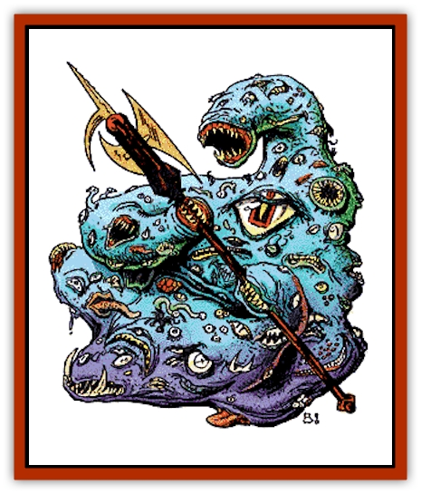

# Argos

| Statistic | **Argos** |
| --- | --- |
| **Activity Cycle:** | Feed till consume 2&times;HD, then rest 2 hours/HD |
| **Alignment:** | Neutral evil |
| **Armor Class:** | 0 |
| **Climate/Terrain:** | Space/Any Earth-based body |
| **Damage/Attack:** | 1-4 |
| **Diet:** | Omnivore |
| **Frequency:** | Very rare |
| **Hit Dice:** | 5-10 |
| **Intelligence:** | Low to High (5-14) |
| **Magic Resistance:** | 25% |
| **Morale:** | Champion (16) |
| **Movement:** | 9, Fl 3 (B) |
| **No. Appearing:** | 1 |
| **No. of Attacks:** | 3 per victim |
| **Organization:** | Solitary |
| **Size:** | L-G (2' per HD) |
| **Special Attacks:** | See below |
| **Special Defenses:** | See below |
| **THAC0:** | 5-6 HD: 15 / 7-8 HD: 13 / 9-10 HD: 11 /  |
| **Treasure:** | U |
| **XP Value:** | 5-6 HD: 2,000 (+1,000 for each additional HD) |

Argos are found in the same regions of wildspace as the baleful [[Beholder_and_Beholder-kin_I|beholder]] nations. An argos resembles a giant amoeba. It has one large, central eye with a tripartite pupil, and a hundred lashless, inhuman eyes and many sharp-toothed mouths. An argos can extrude several pseudopods, each tipped with a fanged maw that functions as a hand to manipulate various tools.

Argos move by slithering; they can cling to walls and ceilings. They can levitate and fly at the very slow rate of 3.

Argos colors tend toward shades of transparent blues and violets; they smell like a bouquet of flowers. They are huge beasts ranging in size from 10 to 20 feet in diameter, weighing about 200 pounds per Hit Die. Though they exhibit signs of being intelligent tool users, they do not wear clothes, choosing rather to carry gear stored in temporary cavities within their bodies. However, their digestive juices often ruin devices within two to three weeks (saving throw vs. acid).

**Combat:** An argos can attack with one to three weapons or items, or it can enfold a victim in a pseudopod and attack with 1d3 mouths for 1d4 points of damage each. It may attack as many foes in this way as it can physically reach.

If an argos rolls a natural 20 on an attack, it envelopes its victim, swallowing him whole. A swallowed victim suffers 2d8 points of damage each round from the creature's digestive juices. The victim may attempt to cut his way free from within, using only short cutting weapons. He must inflict 8 points of damage to break free.

The eyes of an argos, like those of a beholder, have a variety of special powers. An argos can bring 1d10 of its smaller eyes to bear on any target. The large, central eye can focus only on targets that are in front of the creature (within 90 degrees of the <q>straight-ahead point</q> of the central eye). Though the creature has nearly 100 eyes, only 20 special powers have been noted; therefore a number of eyes must possess the same power.

Each point of damage inflicted on an argos eliminates one eye; the DM decides which powers are reduced in the process. It is possible to target one particular eye by attacking with a -4 penalty to the attack roll.

Each ability of an argos's eye is treated as a spell effect. Use the argos's Hit Dice as the caster level. Roll 1d20 and check the following table for a particular eye's power.

<ol><li>*Blindness*</li><li>*Burning Eyes (Hands)*</li><li>*Charm Monster*</li><li>*Clairvoyance*</li><li>*Confusion*</li><li>*Darkness, 15' rad.*</li><li>*Dispel Magic*</li><li>*Emotion*</li><li>*ESP*</li><li>*Fumble*</li><li>*Gaze Reflection*</li><li>*Heat Metal*</li><li>*Hold Monster*</li><li>*Improved Phantasmal Force*</li><li>*Irritation*</li><li>*Light*</li><li>*Slow*</li><li>*Suggestion*</li><li>*Tongues*</li><li>*Turn Flesh to Stone*</li></ol>The central eye can use one of three different powers once per round. It can create a personal illusion (an *alter self* spell), or it can cast a *color spray* or a *ray of enfeeblement* spell.

**Habitat/Society:** Argos are solitary creatures, though it is not unheard of to discover an argos guardian aboard an [[Beholder_and_Beholder-kin_I|eye tyrant]] ship. Argos appear capable of replenishing their own air envelope and thus may be encountered wandering asteroid rings and dust clouds alone.

Despite its relative intelligence, the argos is a ravenous creature driven by its hunger. It tries to lure prey into its grasp, feeding until it has consumed a number of creatures equal to two times its own Hit Dice. It then slips away to digest its meal for a period equal to two hours per Die. If an argos is unable to find food within a week of its last meal, it loses 1 Hit Die per week until it becomes a 5-Hit Die creature. After that point, it can hibernate for up to a year by crystallizing its outer shell and forming a chrysalis.

**Ecology:** Argos consume anything that moves and is digestible. Their preference is to use their abilities to lure their prey into traps and then to pick off individuals one at a time. It sorts through the tools and weapons of its victims and keeps the useful items.

---
## Discovery & Documentation

**Source Publication:** MC7 Spelljammer Appendix I (1990)
**Campaign Setting:** Advanced Dungeons & Dragons 2nd Edition
**Author(s):** various

### Other Creatures Found in This Source Book
   * [[Aartuk|Aartuk]]
   * [[Albari|Albari]]
   * [[Ancient_Mariner|Ancient Mariner]]
   * [[Beholder_Abomination_Astereater|Beholder (Abomination), Astereater]]
   * [[Blazozoid|Blazozoid]]
   * [[Chattur|Chattur]]
   * [[Chevall|Chevall]]
   * [[Clockwork_Horror|Clockwork Horror]]
   * [[Colossus|Colossus]]
   * [[Delphinid|Delphinid]]
   * [[Dizantar|Dizantar]]
   * [[Dog|Dog]]
   * [[Dog_Bog_Hound|Dog, Bog Hound]]
   * [[Esthetic|Esthetic]]
   * [[Focoid|Focoid]]
   * [[Fractine|Fractine]]
   * [[Giant_Spacesea|Giant, Spacesea]]
   * [[Golem_Furnace|Golem, Furnace]]
   * [[Golem_Radiant|Golem, Radiant]]
   * [[Gravislayer|Gravislayer]]
   * [[Grommam|Grommam]]
   * [[Hadozee|Hadozee]]
   * [[Hamster_Giant_Space|Hamster, Giant Space]]
   * [[Jammer_Leech|Jammer Leech]]
   * [[Lakshu|Lakshu]]
   * [[Lumineaux|Lumineaux]]
   * [[Lutum|Lutum]]
   * [[Mimic_Space|Mimic, Space]]
   * [[Misi|Misi]]
   * [[Moon_Rogue|Moon, Rogue]]
   * [[Mortiss|Mortiss]]
   * [[Murderoid|Murderoid]]
   * [[Nay-Churr|Nay-Churr]]
   * [[Phlog-Crawler|Phlog-Crawler]]
   * [[Plasman|Plasman]]
   * [[Plasmoid_DeGleash|Plasmoid, DeGleash]]
   * [[Plasmoid_DelNoric|Plasmoid, DelNoric]]
   * [[Plasmoid_General_Information|Plasmoid, General Information]]
   * [[Plasmoid_Ontalak|Plasmoid, Ontalak]]
   * [[Puffer|Puffer]]
   * [[Q'nidar|Q'nidar]]
   * [[Rastipede|Rastipede]]
   * [[Reigar|Reigar]]
   * [[Rock_Hopper|Rock Hopper]]
   * [[Slinker|Slinker]]
   * [[Spider_Asteroid|Spider, Asteroid]]
   * [[Spiritjam|Spiritjam]]
   * [[Survivor|Survivor]]
   * [[Syllix|Syllix]]
   * [[Symbiont_Power|Symbiont, Power]]
   * [[Vine_Infinity|Vine, Infinity]]
   * [[Wiggle|Wiggle]]
   * [[Wizshade|Wizshade]]
   * [[Wryback|Wryback]]
   * [[Zard|Zard]]
   * [[Zodar|Zodar]]
