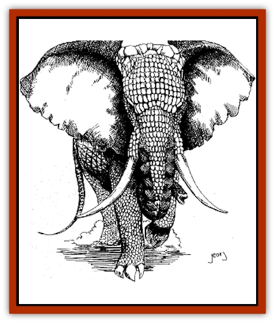

# Armadillephant

| Statistic | **Armadillephant** |
| --- | --- |
| **Activity Cycle:** | Day |
| **Alignment:** | Neutral |
| **Armor Class:** | 1 |
| **Climate/Terrain:** | Subtropical and tropical jungle and plains |
| **Damage/Attack:** | 2-16/2-16/2-12/2-12/2-12 |
| **Diet:** | Herbivore |
| **Frequency:** | Very rare |
| **Hit Dice:** | 12 |
| **Intelligence:** | Semi- (2-4) |
| **Magic Resistance:** | Nil |
| **Morale:** | Average (10) |
| **Movement:** | 15 (burrowing 3) |
| **No. Appearing:** | 1-10 |
| **No. of Attacks:** | 5 |
| **Organization:** | Herd |
| **Size:** | L (11' tall) |
| **Special Attacks:** | Nil |
| **Special Defenses:** | Nil |
| **THAC0:** | 9 |
| **Treasure:** | Nil |
| **XP Value:** | 3,000 |

As indicated by its name, the armadillephant is a creature resulting from the magical merging of an [[Elephant|elephant]] and an armadillo. The elephant physiognomy is predominant, with the armadillo's hardened armor covering the creature. In addition, the armadillo's sharp, curved burrowing claws appear on the creature's forelegs, and its armored tail is much longer than a normal elephant's.

**Combat:** The mighty armadillephant is a creature created specifically for combat, Combining the attributes of a war elephant and the added protection of an armadillo's tough outer hide, the armadillephant is able to wade into a pitched battle and take little damage while it dishes out plenty of its own. Each of its two tusks inflicts 2-16 hp damage, while it simultaneously tramples with its two front feet and constricts with its trunk. The three latter attacks each cause 2-12 hp damage.

In addition, armadillephants often carry battle platforms on their backs. These howdahs usually carry the general and his advisors and frequently are equipped with crossbows or other similar ranged weapons, often making the appearance of an armadillephant in the ranks of the enemy a cause for a morale check.

**Habitat/Society:** Except for their armored skin, armadillephants are indistinguishable from normal (African) elephants. In fact, they are occasionally found in herds of normal elephants, with whom they are capable of breeding (90% of the offspring are standard elephants; 10% are armadillephants). Armadillephants, because of their greater defensive abilities, are often the herd leaders in a mixed herd.

Most armadillephants, however, are created solely for the purpose of combat and so spend their lives in the care of the army for which they fight. The majority of armadillephants are created by the deities of the humanoid races, as gifts for particularly worthy humanoid tribes. Thus, armadillephants are most often ridden into battle by [[Orc|orcs]], [[Goblin|goblins]], [[Gnoll|gnolls]], and the like. A human or demihuman mage can certainly create an armadillephant on his own, but such an act is likely to incur the wrath of various humanoid deities, who consider the creation of such a beast to be their own purview.

**Ecology:** Armadillephants are highly prized by the tribes to whom they are given, and the tribes will go to great lengths to keep the beasts happy and healthy. In many cases the armadillephant is valued much higher than that of individual tribal members, a fact that causes some resentment, especially among those assigned to care for the beasts. Of course, this varies from tribe to tribe; in some humanoid armies, the armadillephant handler is a position of great respect.

In addition to being assets during battle, armadillephants are useful in other ways. With the proper training, they can be taught to use their sharp foreclaws to dig trenches, latrines, and pit traps in a fraction of the time it would take a small group of humanoids. A humanoid army with an armadillephant is sure to make use of this ability, so raiders should expect to find a great number of pit traps surrounding the army's campsites.

Armadillephant meat is quite tasty, although the beast is too highly regarded to be slaughtered for food. However, if an armadillephant is slain in battle, the surviving humanoid troops will certainly take the opportunity to feast well that night. Of course, before devouring armadillephant flesh the band undergoes a ceremony of thanksgiving, thanking their deities for the mighty war beast who first aided them in battle and then made them stronger. It is believed that eating an armadillephant's heart causes fearlessness in battle; this vital organ is usually reserved for the chieftain.

As might be expected, armadillephant hide makes excellent armor. While generally too inflexible to be used by smaller races except as shields, hill giants and larger creatures can fashion respectable armor from an armadillephant's hide. In addition, the hide is often used to form a crude type of barding for normal elephants, giving them added protection in battle. In this way, a slain armadillephant can still benefit its humanoid tribe long after its own death.

---
## Discovery & Documentation

**Source Publication:** Dragon243 (1998)
**Campaign Setting:** Dragon Magazine
**Author(s):** Steve Berman, Roger Raupp, Johnathan M. Richards, George Vrbanic

### Other Creatures Found in This Source Book
   * [[Cat_Moat|Cat, Moat]]
   * [[Duckbunny|Duckbunny]]
   * [[Horse_Spider-|Horse, Spider-]]
   * [[Turtle_Dragonfly|Turtle, Dragonfly]]
