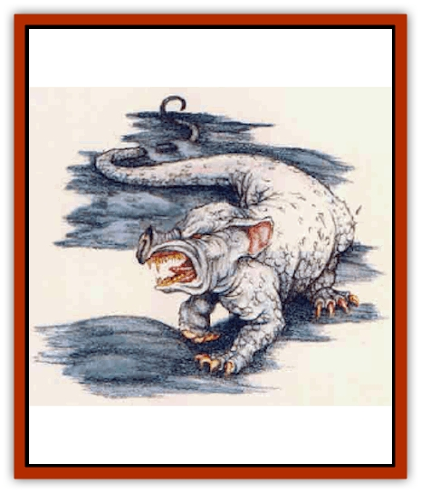

# Ash Crawler

| Statistic | **Ash Crawler** |
| --- | --- |
| **Activity Cycle:** | Any |
| **Alignment:** | Neutral |
| **Armor Class:** | 6 |
| **Climate/Terrain:** | Arid areas with fire |
| **Damage/Attack:** | 1d2 (bite) |
| **Diet:** | Carnivore |
| **Frequency:** | Rare |
| **Hit Dice:** | 3+1 |
| **Intelligence:** | Semi- (2) |
| **Magic Resistance:** | Nil |
| **Morale:** | Average (10) |
| **Movement:** | 6, Br 6 (ash only) |
| **No. Appearing:** | 1d6 |
| **No. of Attacks:** | 1 |
| **Organization:** | Solitary |
| **Size:** | S (just over 2' long without tail) |
| **Special Attacks:** | Tail, locking jaws, 2 claw attacks (+4 to attack, 1d4 damage each) |
| **Special Defenses:** | Resitant to fire |
| **THAC0:** | 17 |
| **Treasure:** | See below |
| **XP Value:** | 270 |

This peculiar creature always dwells near a permanent source of fire, where it may lie nearly buried in the ash, awaiting the unwary visitor. Its sooty gray skin flakes and sheds weekly in ashlike sheets. Its body measures about 2' long from its hog-nosed snout to its rear, followed hy a naked tail that is 4' long and prehensile

**Combat:** An ash crawler gains a +4 bonus to its Armor Class and saving throws when hidden beneath the ash of its territory. It loses this bonus as soon as it is exposed - for example, when it attacks. The creatures are agitated by movement in their ashy lair and by displays of bright colors.

Whenever possible, the creature's <q>first move</q> in combat is a special tail swipe. Using its long, prehensile tail, it attempts to snare an opponent, dragging the victim beneath the ash. The tail swipe requires an attack roll, and if successful, a man-sized or smaller victim must succeed in a Dexterity check or fall. Those who fall into the ash suffer a -4 Armor Class penalty and strike at -4. The tail attack cannot be used while the crawler has its jaws locked onto a creature (see below).

Next, an ash crawler bites its victim, locking its jaws into the wound. A successful bite means the creature has effectively attached itself, causing 1d2 points of damage immediately. Each round thereafter the bite-hold inflicts 1 point of damage (no attack roll needed), and the ash crawler attacks with its front claws. An ash crawler only makes claw attacks while attached to a victim; each claw gains a +4 attack bonus and causes 1d4 damage. The creature continues to attack until it suffers 5 points of damage, at which point it releases its grip and must attack again normally, by biting.

An ash crawler's tough hide makes it immune to normal fire. It also gains a +2 bonus to any saving throw against magical fire, and this damage is reduced by 1 point per die of damage (minimum 1 point per die).

**Habitat/Society:** Ash crawlers favor warm areas with an existing fire source. They dwell in caverns, deserts, and mountains, near places of volcanic activity, or even in human ruins, provided there is a ready source of fire. They always protect the source of fire and attack any invaders. Although their diet consists mainly of smaller animals, ash crawlers have large and sturdy jaws that serve well in defending their lairs.

Ash crawler lairs are carpeted with 2 to 4 feet of fine ash and shed skin through which the creatures can burrow rapidly. Often the lair smells of seared flesh and wood smoke, and the air is hot and difficult to breathe, preventing any swift actions. These creatures dislike water and curl over their fire source to prevent it from being extinguished.

Ash crawlers live alone or in small families, with 1d6 of the beasts sharing one fire source or a group of nearby fires. Treasure in such lairs is rare and incidental: 10% chance of d10 copper, silver, or gold pieces; 5% chance of 1d4 gems or 1d2 jewels (art objects); and 2% chance of 1 magical item.

**Ecology:** Ash crawlers feed most commonly on rodents, birds and other small creatures that pass near or fall into the ash. Feasting occurs in the colder months, when many creatures are drawn to an ash crawler's warm lair for shelter.

The flaky hide of the ash crawler may be fashioned into fire resistant clothing. It takes the hides of four ash crawlers to make a suit of protective leather for a halfling, and at least nine for the typical human. Properly tanned and hardened, the leather may serve as leather armor (base AC 8).

Alternately, the hide can be treated to become soft and supple leather. In this case it confers no benefit to Armor Class, but does provide fire protection - and it is usable by classes (like wizards) who are not permitted armor.

The special virtue of ash crawler leather is that it is immune to normal fire, and such fire inflicts 1 fewer point of damage per die. It also grants the wearer a +1 bonus to saving throws vs. magical fire (including breath weapons).

It is very important that the hide be treated properly. A skilled leather-worker or tanner is required; the DM may demand a appropriate nonweapon proficiency check at half the normal chance of success. If improperly prepared, the hide peels away and crumbles to useless ash whenever it is first exposed to flame, or within 1d4 weeks at most.

---
## Discovery & Documentation

**Source Publication:** Mystara Appendix (1994)
**Campaign Setting:** Mystara
**Author(s):** John Nephew, Teeuwynn Woodruff, John Terra, Skip Williams

### Other Creatures Found in This Source Book
   * [[Actaeon|Actaeon]]
   * [[Agarat|Agarat]]
   * [[Baldandar|Baldandar]]
   * [[Bargda|Bargda]]
   * [[Bhut|Bhut]]
   * [[Bird_Mystara|Bird (Mystara)]]
   * [[Blackball|Blackball]]
   * [[Choker|Choker]]
   * [[Coltpixie|Coltpixie]]
   * [[Crone_of_Chaos|Crone of Chaos]]
   * [[Darkhood|Darkhood]]
   * [[Darkwing|Darkwing]]
   * [[Decapus|Decapus]]
   * [[Deep_Glaurant|Deep Glaurant]]
   * [[Diabolus|Diabolus]]
   * [[Dimensional_Warper|Dimensional Warper]]
   * [[Dragon_Mystara_Crystalline|Dragon (Mystara), Crystalline]]
   * [[Dragon_Mystara_Jade|Dragon (Mystara), Jade]]
   * [[Dragon_Mystara_Onyx|Dragon (Mystara), Onyx]]
   * [[Dragon_Mystara_Ruby|Dragon (Mystara), Ruby]]
   * [[Drake_Mystara|Drake (Mystara)]]
   * [[Dragonfly|Dragonfly]]
   * [[Dusanu|Dusanu]]
   * [[Elemental_of_Chaos_Air_Earth|Elemental of Chaos, Air/Earth]]
   * [[Elemental_of_Chaos_Fire_Water|Elemental of Chaos, Fire/Water]]
   * [[Elemental_of_Law_Air_Earth|Elemental of Law, Air/Earth]]
   * [[Elemental_of_Law_Fire_Water|Elemental of Law, Fire/Water]]
   * [[Familiar_Mystara|Familiar (Mystara)]]
   * [[Frost_Salamander|Frost Salamander]]
   * [[Fundamental_Air_Earth|Fundamental, Air/Earth]]
   * [[Fundamental_Fire_Water|Fundamental, Fire/Water]]
   * [[Gargantua_Mystara|Gargantua (Mystara)]]
   * [[Geonid|Geonid]]
   * [[Ghostly_Horde|Ghostly Horde]]
   * [[Giant_Athach|Giant, Athach]]
   * [[Giant_Hephaeston|Giant, Hephaeston]]
   * [[Golem_Drolem|Golem, Drolem]]
   * [[Golem_Mystara_I|Golem (Mystara) I]]
   * [[Golem_Mystara_II|Golem (Mystara) II]]
   * [[Golem_Mystara_III|Golem (Mystara) III]]
   * [[Gray_Philosopher|Gray Philosopher]]
   * [[Guardian_Warrior|Guardian Warrior]]
   * [[Gyerian|Gyerian]]
   * [[Herex|Herex]]
   * [[Hivebrood|Hivebrood]]
   * [[Horde|Horde]]
   * [[Hsiao|Hsiao]]
   * [[Huptzeen|Huptzeen]]
   * [[Hutaakan|Hutaakan]]
   * [[Imp_Mystara|Imp (Mystara)]]
   * [[Jellyfish_Giant_Mystara|Jellyfish, Giant (Mystara)]]
   * [[Kna|Kna]]
   * [[Kopru|Kopru]]
   * [[Lizard_Mystara|Lizard (Mystara)]]
   * [[Lizard-kin_Mystara|Lizard-kin (Mystara)]]
   * [[Lupin|Lupin]]
   * [[Lycanthrope_Werejaguar_Mystara|Lycanthrope, Werejaguar (Mystara)]]
   * [[Lycanthrope_Wereswine|Lycanthrope, Wereswine]]
   * [[Magen|Magen]]
   * [[Manikin|Manikin]]
   * [[Mek|Mek]]
   * [[Mujina|Mujina]]
   * [[Nagpa|Nagpa]]
   * [[Neh-thalggu|Neh-thalggu]]
   * [[Nightshade_Mystara|Nightshade (Mystara)]]
   * [[Nuckalavee|Nuckalavee]]
   * [[Pegataur|Pegataur]]
   * [[Phanaton|Phanaton]]
   * [[Plant_Dangerous_Mystara|Plant, Dangerous (Mystara)]]
   * [[Plasm|Plasm]]
   * [[Rakasta|Rakasta]]
   * [[Rock_Man|Rock Man]]
   * [[Sabreclaw|Sabreclaw]]
   * [[Sacrol|Sacrol]]
   * [[Scamille|Scamille]]
   * [[Shapeshifter|Shapeshifter]]
   * [[Shargugh|Shargugh]]
   * [[Shark-kin|Shark-kin]]
   * [[Sollux|Sollux]]
   * [[Spectral_Death|Spectral Death]]
   * [[Spectral_Hound|Spectral Hound]]
   * [[Spider-kin|Spider-kin]]
   * [[Spirit_Mystara|Spirit (Mystara)]]
   * [[Statue_Living|Statue, Living]]
   * [[Surtaki|Surtaki]]
   * [[Tabi|Tabi]]
   * [[Thoul|Thoul]]
   * [[Thunderhead|Thunderhead]]
   * [[Tiger_Ebon|Tiger, Ebon]]
   * [[Topi|Topi]]
   * [[Tortle|Tortle]]
   * [[Vampire_Velya|Vampire, Velya]]
   * [[White_Fang|White Fang]]
   * [[Worm_Mystara|Worm (Mystara)]]
   * [[Wyrd|Wyrd]]
   * [[Yowler|Yowler]]
   * [[Zombie_Lightning|Zombie, Lightning]]
