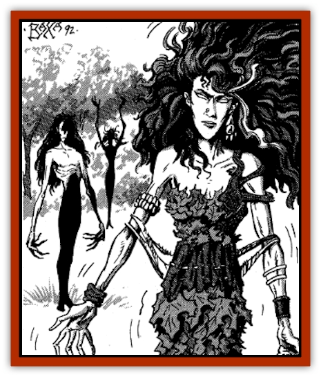

# Ashira

| Statistic | **Ashira** |
| --- | --- |
| **Activity Cycle:** | Day |
| **Alignment:** | Chaotic good |
| **Armor Class:** | 7 |
| **Climate/Terrain:** | Domesticated trees |
| **Damage/Attack:** | 1-6/1-6 |
| **Diet:** | Sunlight |
| **Frequency:** | Rare |
| **Hit Dice:** | 3 |
| **Intelligence:** | Average (8-10) |
| **Magic Resistance:** | 10% |
| **Morale:** | Average (8) |
| **Movement:** | 12 |
| **No. Appearing:** | 2-12 |
| **No. of Attacks:** | 2 |
| **Organization:** | Clan |
| **Size:** | M |
| **Special Attacks:** | Charm |
| **Special Defenses:** | Meld with tree |
| **THAC0:** | 17 |
| **Treasure:** | Nil |
| **XP Value:** | 270 |

The ashira are tree spirits that live in domesticated trees such as date and coconut palms, and banana, orange, lemon, plum, fig, and pomegranate trees. They are a joyous and lighthearted group of faerie creatures native to the lands of Zakhara, referred to as <q>close friends</q> by the humans who tend their trees. They can sometimes be heard singing and dancing when their trees are passed at night.

An ashira has unnaturally thin limbs and wild, curly black hair. By day they are fidgety, almost incapable of standing still, constantly swaying in a breeze, shifting their arms and wiggling their fingers. Their hair sometimes moves by itself, curling first one way and then another. By night they are quieter, swaying slowly, eyes listless. In the blooming and fruiting seasons their dress generally improves from rags and scraps of cloth to complicated woven garments of leaves, flowers, and vines.

**Combat:** Ashira abhor all forms of violence and always flee from combat unless their home trees are threatened. In defense of their orchard they can grow fierce, even bloodthirsty. Some claim that the ashira once demanded yearly blood sacrifices to nourish their bountiful trees, but their present peaceful nature seems to belie this tale.

They can cast *charm person or mammal* at will and frequently do so to avoid combat. In general, though, they prefer to win the trust and friendship of others without the use of magic.

Unlike [[Dryad|dryads]], ashira are not linked to a specific tree. Instead, they are connected to a whole orchard or stand of trees under the protection of a single caretaker. If the orchard is threatened, all the ashira respond. If they must flee, they can enter and exit any tree in the orchard; they are not restricted to a "home tree". This ability functions as either a *pass plant* or *plant door* spell, cast at the 8th level of ability.

If trapped away from its orchard or if its fellows are threatened, an ashira can strike with its thorny hands and nails for 1d6 points of damage per attack. Even so, an ashira will never deliver a killing blow to a wounded or unconscious opponent, preferring to nurse him back to health and release him far away from the orchard.

**Habitat/Society:** Ashira are very clannish and cannot live alone without becoming morose and moody. They are almost always in contact with one another when they are met, holding hands, weaving their curls into ragged braids, dressing one another, massaging each other's hurts, and dancing and singing close together. All of them make decisions together, arguing and voting until they all agree (or until the majority manage to browbeat the remainder into accepting a course of action).

The orchard itself is only half the domain of the ashira; they also live in a separate faerie realm within the trees. This they leave only on rare occasions, such as days of irresistible soft breezes and sunshine, when no humans are in the orchard.

**Ecology:** The ashira can live on the sap and fruit that their orchard provides, but more often they simply soak up sunlight during the day and convert the light to food by night, thus giving their orchard a faint, eerie glow from the magically stored sunlight. This light is so dim that it can only be seen on moonless nights, but it adds weight to the tales of orchards haunted by faerie folk.

The ashira are dependent on humans for care, protection, and usually for the propagation of the trees the creatures use for nourishment. They form close attachments to the horticulturists they meet, often plying them with song and dance at harvest time and even performing favors for them, such as watching over their children and livestock. They are friendly with winged serpents as well. They are friendly with all other creatures often found in orchards, especially the birds, hive insects, and monkeys. They enjoy keeping pets, sometimes lodging them in the branches of their trees and caring for them as a group.

---
## Discovery & Documentation

**Source Publication:** MC13 Al-Qadim Appendix (1992)
**Campaign Setting:** Al-Qadim (Forgotten Realms)
**Author(s):** C. Terry Phillips

### Other Creatures Found in This Source Book
   * [[Ammut|Ammut]]
   * [[Asuras|Asuras]]
   * [[Black_Cloud_of_Vengeance|Black Cloud of Vengeance]]
   * [[Buraq|Buraq]]
   * [[Camel|Camel]]
   * [[Camel_of_the_Pearl|Camel of the Pearl]]
   * [[Centaur_Desert|Centaur, Desert]]
   * [[Copper_Automaton|Copper Automaton]]
   * [[Debbi|Debbi]]
   * [[Elephant_Bird|Elephant Bird]]
   * [[Gen|Gen]]
   * [[Genie_Noble_Dao|Genie, Noble Dao]]
   * [[Genie_Noble_Djinni|Genie, Noble Djinni]]
   * [[Genie_Noble_Efreeti|Genie, Noble Efreeti]]
   * [[Genie_Noble_Marid|Genie, Noble Marid]]
   * [[Genie_Tasked_Architect_Builder|Genie, Tasked, Architect/Builder]]
   * [[Genie_Tasked_Artist|Genie, Tasked, Artist]]
   * [[Genie_Tasked_Guardian|Genie, Tasked, Guardian]]
   * [[Genie_Tasked_Herdsman|Genie, Tasked, Herdsman]]
   * [[Genie_Tasked_Slayer|Genie, Tasked, Slayer]]
   * [[Genie_Tasked_Warmonger|Genie, Tasked, Warmonger]]
   * [[Genie_Tasked_Winemaker|Genie, Tasked, Winemaker]]
   * [[Ghost_Mount|Ghost Mount]]
   * [[Ghul|Ghul]]
   * [[Giant_Desert|Giant, Desert]]
   * [[Giant_Jungle|Giant, Jungle]]
   * [[Giant_Reef|Giant, Reef]]
   * [[Giant_Zakhara_General_Information|Giant (Zakhara), General Information]]
   * [[Hama|Hama]]
   * [[Heway|Heway]]
   * [[Living_Idol|Living Idol]]
   * [[Lycanthrope_Werehyena|Lycanthrope, Werehyena]]
   * [[Lycanthrope_Werelion|Lycanthrope, Werelion]]
   * [[Markeen|Markeen]]
   * [[Maskhi|Maskhi]]
   * [[Mason_Wasp_Giant|Mason Wasp, Giant]]
   * [[Nasnas|Nasnas]]
   * [[Pahari|Pahari]]
   * [[Rom|Rom]]
   * [[Sabu_Lord|Sabu Lord]]
   * [[Sakina|Sakina]]
   * [[Serpent_Lord|Serpent Lord]]
   * [[Serpent_Winged|Serpent, Winged]]
   * [[Silat|Silat]]
   * [[Simurgh|Simurgh]]
   * [[Stone_Maiden|Stone Maiden]]
   * [[Vishap|Vishap]]
   * [[Zaratan|Zaratan]]
   * [[Zin|Zin]]
