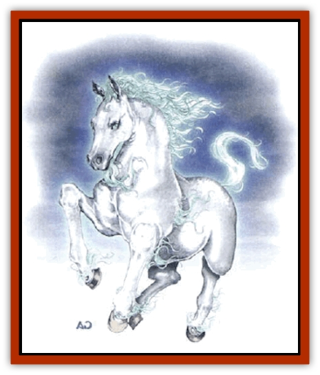

# Asperii

| Statistic | **Asperii** |
| --- | --- |
| **Activity Cycle:** | Day |
| **Alignment:** | Neutral good |
| **Armor Class:** | 4 |
| **Climate/Terrain:** | Mountain peaks |
| **Damage/Attack:** | 1d8/1d8/1d4 |
| **Diet:** | Omnivore |
| **Frequency:** | Rare |
| **Hit Dice:** | 4 |
| **Intelligence:** | High (13-14) |
| **Magic Resistance:** | Nil |
| **Morale:** | Elite (13-14) |
| **Movement:** | 21, Fl 42 (C) |
| **No. Appearing:** | 1-4 (rarely 4-40) |
| **No. of Attacks:** | 3 |
| **Organization:** | Herd |
| **Size:** | L (8') |
| **Special Attacks:** | Nil |
| **Special Defenses:** | Immune to cold-, air-based, and gaze attacks, <i>true seeing</i>, <i>featherfall</i> (4/day); double damage from fire |
| **THAC0:** | 17 |
| **Treasure:** | Nil |
| **XP Value:** | 420 |

Commonly known as *wind [[Horse|steeds]]*, asperii are highly priced as mount, and can be very loyal to the rider. They are white, gray, or dun in color, and have flowing manes that are usually silver, white, or light gray.

Asperii communicate with each other by means of a limited form of telepathy which has a range of 60 yards. With this power, they can also speak with other intelligent beings.

**Combat:** Asperii have keen eyes that give them the ability of *true seeing*, including sight into the Ethereal and Astral planes. This often allows them to warn their riders of approaching creatures that might otherwise be undetected. Although they are gentle beings, asperii are quite able to defend themselves if forced into combat. Each round asperii can kick with their front hooves and bite with their sharp teeth. As a rule, they direct their bites at the wings and faces of their opponents.

Asperii are utterly immune to any form of cold-based attack. Similarly, they are unharmed by winds of any type, including the whirlwind attacks of air elementals, djinn, and like creatures. Wind steeds can slip free of the grasp of an aerial servant with unusual ease, having a 40% chance to do so. Conversely, they are especially vulnerable to flames, though not to heat, and suffer double damage from any attack employing open flames. Asperii are immune to all gaze attacks, such as those of a basilisk or catoblepus.

The wingless asperii are capable of flight due to their natural powers of levitation. They are able ride winds of any nature, magical or otherwise. When they do so, they can add 1 to their movement rate for each mile per hour over 20 of the wind. They have the inherent ability to cast a feather fall spell up to four times per day on themselves or any creature they touch. In flight, the asteria is fairly agile (Maneuverability Class C). It remains so as long as it carries not more than 150 pounds. Although it can still fly while carrying up to 600 pounds weight, its maneuverability class is reduced to D if it carries over 150 pounds.

A loyal asperii (that is, one that has accepted the rider as a master) can fly so smoothly as to allow spellcasting from its back. lf the asperii engages in violent maneuvering or strikes with its hooves or bite, the individual cannot successfully cast spells while riding.

**Habitat/Society:** Asperii sometimes live in herds of as many as 20, but are most often encountered in groups of four or less. As a rule, they live in the uppermost regions of virtually inaccessible mountain peaks.

Asperii are mortal enemies of [[Hippogriff|hippogriffs]] and [[Griffon|griffons]], tending to attack these creatures on sight. They have also been known to do battle with [[Roc|rocs]], though asperii normally ignore these creatures if possible. They get on quite will with pegasi, and the two species are often found in each other's company.

If taken when young, an asperii can be trained to accept a single master. If this is properly done, the creature becomes utterly loyal to that individual, and will not bear another on its back unless so instructed by its master. An asperii will not accept a master who is not of lawful neutral, neutral, or neutral good alignment. Young asperii, commonly known as "doffs" can be sold to those who wish to train them for between 4,000 and 6,000 gold pieces.

**Ecology:** Although asperii are omnivorous and eat a great variety of plants and animals, they do have a few favorite foods. Asperii prize mint leaves, mistletoe, fish, and hawk flesh. In fact, they so delight in eating fish that they have been known to raid fishing boats and coastal villages in search of them. Perhaps because asperii can go for long periods of time without eating, they seem to have unlimited appetites when given the chance to feed on their favorite foods.

**Noble Asperii**

  The noble asperii are a very rare off-shoot of this species. Many describe the hide of a noble asperii as looking like an iridescent, polished abalone shell.

Their telepathy is more powerful than that of their more common counterparts, having a 90-foot range and being forceful enough to admit the noble to implant a suggestion in creatures of 3 Hit Dice or fewer.

Nobles have 6 Hit Dice (THAC0 15) and are often found at the head of large herds of asperii.

---
## Discovery & Documentation

**Source Publication:** MC3 Volume III Forgotten Realms Appendix I (1989)
**Campaign Setting:** Forgotten Realms
**Author(s):** William Connors, David Martin, Rick Swan, Gary Thomas

### Other Creatures Found in This Source Book
   * [[Belabra|Belabra]]
   * [[Berbalang|Berbalang]]
   * [[Bhaergala|Bhaergala]]
   * [[Bichir|Bichir]]
   * [[Bunyip|Bunyip]]
   * [[Burbur|Burbur]]
   * [[Cloaker|Cloaker]]
   * [[Crawling_Claw|Crawling Claw]]
   * [[Darkenbeast|Darkenbeast]]
   * [[Dracolich|Dracolich]]
   * [[Dragon_Oriental_Carp_Yu_Lung|Dragon, Oriental, Carp (Yu Lung)]]
   * [[Dragon_Oriental_Celestial_T'ien_Lung|Dragon, Oriental, Celestial (T'ien Lung)]]
   * [[Dragon_Oriental_Coiled_Pan_Lung|Dragon, Oriental, Coiled (Pan Lung)]]
   * [[Dragon_Oriental_Earth_Li_Lung|Dragon, Oriental, Earth (Li Lung)]]
   * [[Dragon_Oriental_Lung_General_Information|Dragon, Oriental (Lung), General Information]]
   * [[Dragon_Oriental_River_Chiang_Lung|Dragon, Oriental, River (Chiang Lung)]]
   * [[Dragon_Oriental_Sea_Lung_Wang|Dragon, Oriental, Sea (Lung Wang)]]
   * [[Dragon_Oriental_Spirit_Shen_Lung|Dragon, Oriental, Spirit (Shen Lung)]]
   * [[Dragon_Oriental_Typhoon_Tun_Mi_Lung|Dragon, Oriental, Typhoon (Tun Mi Lung)]]
   * [[Dragonet_Faerie_Dragon|Dragonet, Faerie Dragon]]
   * [[Firenewt|Firenewt]]
   * [[Firestar|Firestar]]
   * [[Fish_Ascallion|Fish, Ascallion]]
   * [[Fish_Vurgens|Fish, Vurgens]]
   * [[Meazel|Meazel]]
   * [[Medusa_Maedar|Medusa, Maedar]]
   * [[Mist_Crimson_Death|Mist, Crimson Death]]
   * [[Revenant|Revenant]]
   * [[Rhaumbusun|Rhaumbusun]]
   * [[Strider_Giant|Strider, Giant]]
   * [[Thessalmonster|Thessalmonster]]
   * [[Web_Living|Web, Living]]
   * [[Wemic|Wemic]]
