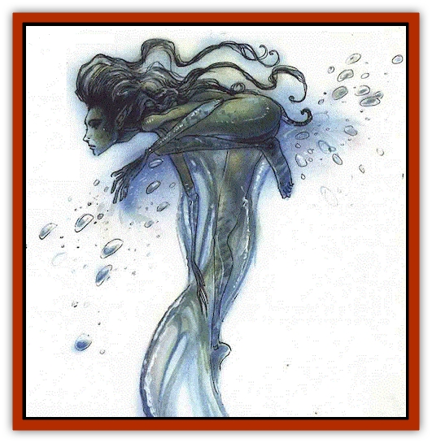

# Asrai

| Statistic | **Asrai** |
| --- | --- |
| **Activity Cycle:** | Night |
| **Alignment:** | Chaotic good |
| **Armor Class:** | 8 |
| **Climate/Terrain:** | River Oceanus and other waters in Ysgard, Arborea, Beastlands |
| **Damage/Attack:** | 1 or by weapon type |
| **Diet:** | Herbivore |
| **Frequency:** | Rare |
| **Hit Dice:** | ½ to 3 |
| **Intelligence:** | High (13-14) |
| **Magic Resistance:** | 25% |
| **Morale:** | Unsteady to steady (5-9) |
| **Movement:** | 9, Sw 18 |
| **No. Appearing:** | 2d10 |
| **No. of Attacks:** | 1 |
| **Organization:** | School |
| **Size:** | T-S (1-4' tall) |
| **Special Attacks:** | Hypnotism |
| **Special Defenses:** | Protective pact |
| **THAC0:** | ½ HD: 20 / 1-2 HD: 19 / 3 HD: 17 |
| **Treasure:** | R |
| **XP Value:** | ½ HD: 120 / 1 HD: 176 / 2 HD: 270 / 3 HD: 420 |

The asrai are delicate female faeries that melt away like ice when exposed to sunlight. Called Sjörå in Ysgard and water sprites in the Beastlands, the small, beautiful water [[Nymph|nymphs]] stand no more than four feet high. Their hair is long and gold and shimmers warmly as they glide through the cool blue water of their home. Asrai are wonderfully adept in their element, dazzling all who see them.

The asrai can live in either salt or fresh water, though they are sluggish for a few days after they make the transition from one to the other. The largest schools or asrai live in the depths of the River Oceanus, rarely coming to the surface except on nights the algae blooms, when they feed voraciously and harvest all they can in a flurry of activity.

Asrai rarely wear clothing, preferring to use their hair to preserve their modesty. This works better than might be expected, for asrai hair is a living thing, twisting, flexing, and twining about their bodies in unconscious reaction to their feelings, much as a dog's tail wags or droops. Their hair grows constantly and often reaches their buttocks or calves.

Asrai speak their own language, as well as the languages of [[Balaena|balaena]], fish, [[Nixie|nixies]], [[Sirine|sirines]], mermaids, [[Triton|tritons]], and sea elves.

**Combat:** The asrai rarely attack out of malice. They bite anyone trying to scoop them out of their native waters with nets, though they prefer to flee when they can, to return for their vengeance later.

When a school of asrai works in unison, they can hypnotize enemies. They swim at the water's surface, creating a weaving, darting water dance that has the same effect as a *hypnotic pattern* spell. Their golden hair turns and twists, forming a myriad or captivating sparkles that hold the viewer's attention for as long as the asrai wishes.

Hypnotized sailors sometimes fall into the water and drown, and for this reason sharks, giant pike, and other predatory fish follow a school of asrai, hoping for a windfall. The asrai and the fish rarely have any bond of friendship, but the fish often attack anything in the water near the asrai, expecting it to be hypnotized food.

Sunlight inflicts 1d4 points of damage to asrai each round, but a *sunray* spell has no effect. Only direct, true sunlight affects them, so they can take cover in shadows under stones, docks, or ships if they are caught unaware by the dawn.

Some types of deep-dwelling asrai, primarily those of the River Oceanus, cannot survive capture and cannot live in air for any length of lime. This may explain why so little is know about the history and society of these creatures.

**Habitat/Society:** Most asrai wander in fresh waters and travel in schools like fish. They are highly intelligent but very fearful of larger creatures, and so they can almost never be persuaded to talk. When they do speak, it is usually to insult the larger creatures.

To avoid sunlight they live far beneath the sea during the day and come up to feed only at night. Fresh-water asrai must have shadowy lairs under banks, logs, or in caves to hide from the sun. Ocean-living asrai keep giant flying fish as mounts, using them as others might use horses. The giant flying fish are INT animal, AC 8, HD 1-1, MV sw 24, and #AT Nil.

The small water spirits live exactly nine years; they have ½ Hit Die as young, and a number of Hit Dice equal to half their age after a year. When they die, the asrai dissolve into water that later spontaneously forms 1d4+1 new asray equal in all respects to their <q>mother</q>.

Asrai leaders are the school pilots, guiding the tribe's yearly navigation from warmer to cooler waters after the summer's feeding season. Pilots are respected, and competition to become an apprentice to the clan's pilot can be intense. The most skilled pilots can lead the school skillfully enough to swim in a ship's shadow during the day; at night the whole clan attempts to seduce the sailors on watch into abandoning their posts. The asrai consider this especially amusing if it results in a shipwreck.

The few tribes of asrai in Arborea are protective nature spirits watching over springs, streams, rivers, lakes, and seas. They are fiercely watchful of the territory in their custody, and quick to punish any wrongdoer who infringes on the pure waters. These gurdian asrai can speak the languages of oreads, dryads, and other nature spirits, in order to coordinate punishments. They also use bows of springy willow strung with braided waters; these poor weapons have a range of 2/4/8 yards, but the arrows are smeared with fish gut, which *cause disease* unless the victim makes a saving throw versus poison.

**Ecology:** The asrai are fond of algae and all freshwater plants; they eat no meat, prepared or raw. They also eat foods thrown on the surface of the water, swarming to it much as fish do. Their vegetarianism is part of a greater pact, for no predator of the deeps will attack them, even if under magical influence.

The asrai have loose ties to the Seelie Court and its servants. Though they rarely show themselves there, they are welcomed among nixies, selkies, and sea elves. There are even rumors from time to time of an asrai queen who dwells in the Seelie Court, hidden from most eyes. Her home is said to be either a bottomless well or a pure, everflowing spring, but she may be no more than a sprite's trick turned into common wisdom.

In the River Oceanus, the asrai sometimes serve as guides, translators, or companions for balaena, whose songs they understand. They are indifferent to most other sentient races, except as possible targets of abuse.

Hydroloths, slaadi, and marraenoloths consider live asrai one of the finest delicacies. Evil fisherfolk cast vegetables, kelp, algae pellets, and other food on the water by night, hoping to draw more than schools of fish. Captured asrai are sealed in amphorae of water protected by a *darkness* spell and sold to the denizens of the Lower Planes. In this form, asrai fetch as much as 200 to 300 gp each in the Gray Wastes and nearby Lower Planes.

Ancient legends tell of a time when the asrai served as guides throughout the length and breadth of Oceanus, as the marraenoloths still do on the River Styx, but the asrai have long since abandoned this duty (perhaps because they are so hunted and persecuted) and have scattered across the planes. Stories abound of asrai on the Plane of Elemental Water, the Prime Material, Sigil's aqueducts and sewers, and elsewhere. Elusive as the asrai are, it's not surprising that these stories cannot be confirmed.

---
## Discovery & Documentation

**Source Publication:** Planes of Chaos (1994)
**Campaign Setting:** Planescape
**Author(s):** Wolfgang Baur, L. W. Smith

### Other Creatures Found in This Source Book
   * [[Astral_Dreadnought|Astral Dreadnought]]
   * [[Bacchae|Bacchae]]
   * [[Chaos_Beast|Chaos Beast]]
   * [[Fensir|Fensir]]
   * [[Abyssal_Lord|Abyssal Lord]]
   * [[Howler|Howler]]
   * [[Imp_Chaos|Imp, Chaos]]
   * [[Lillend|Lillend]]
   * [[Murska|Murska]]
   * [[Oread|Oread]]
   * [[Ratatosk|Ratatosk]]
   * [[Tanar'ri_Greater_Goristro|Tanar'ri, Greater, Goristro]]
   * [[Tanar'ri_Lesser_Armanite|Tanar'ri, Lesser, Armanite]]
   * [[Varrangoin|Varrangoin]]
   * [[Viper_Tree|Viper Tree]]
