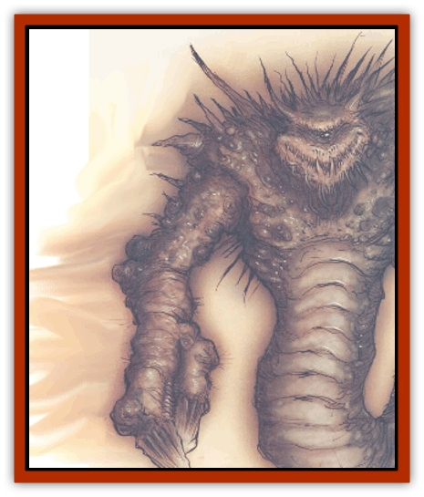

# Astral Dreadnought

| Statistic | **Astral Dreadnought** |
| --- | --- |
| **Activity Cycle:** | Any |
| **Alignment:** | Chaotic neutral |
| **Armor Class:** | -4 |
| **Climate/Terrain:** | Astral Plane |
| **Damage/Attack:** | 4d8/4d8/2d10 |
| **Diet:** | Carnivore |
| **Frequency:** | Very rare |
| **Hit Dice:** | 15+30 |
| **Intelligence:** | Exceptional (15-16) |
| **Magic Resistance:** | 35% |
| **Morale:** | Fearless (19-20) |
| **Movement:** | 15 (480' per round astral) |
| **No. Appearing:** | 1 |
| **No. of Attacks:** | 3 |
| **Organization:** | Solitary |
| **Size:** | G (30' tall) |
| **Special Attacks:** | <i>Antimagic</i>, <i>fear</i> |
| **Special Defenses:** | +1 or better weapon to hit |
| **THAC0:** | 5 |
| **Treasure:** | Nil |
| **XP Value:** | 22,000 |

The gods alone know what these things are or where they come from, bot one thing is certain: Where the astral dreadnought goes, even the most powerful fiends know fear. The astral dreadnought's a gigantic creature the size of a [[Giant_Storm|storm giant]], with gaping jaws; huge, pincerlike claws; a reddish, armored carapace; and a single, black, malevolent eye. The dreadnought's lower quarters are serpentine or wormlike, but some cutters who've seen one claim that its <q>tail</q> has no end, stretching off into an infinitely long silver cord as thick as a stout barrel. If this is true, it'd imply that the astral dreadnought is not a native of this plane and is projecting its spirit into the Silver void from some prime-material world.

The dreadnought's sole interest appears to be feeding on any astral traveler unlucky enough to cross its path. No one has managed to communicate with the dreadnought and lived to tell the tale.

**Combat:** The astral dreadnought's an absolute terror in combat. Its massive claws are lined with sharp, serrated edges that can easily catch and crush a human. If the dreadnought scores a natural 18 or better against a creature of size L or smaller with its claws, the victim is pinned. Trapped victims are automatically crushed for normal claw damage in subsequent rounds and are 50% likely to have 1d4 limbs pinned as well - possibly rendering them helpless in the dreadnought�s grip. Getting free of the dreadnought requires a bend bars/lift gates roll with a +30% penalty. Instead of crushing a trapped victim, the dreadnought can bring it to its maw for a bite attack with a +4 bonus to hit, or throw the hapless victim 30 to 180 (3d6x10) yards. ('Course, a sod won't stop going in the Astral once he's been thrown until he collects himself and uses his mind to stop his movement.)

The dreadnought's gaping maw is capable of crunching through even the toughest armor or shield. If the creature makes its bite attack roll by 4 or more, the victim's armor must survive a saving throw versus crushing blow or be destroyed. If the victim has no armor, he must successfully save versus death magic or lose a random limb, severed cleanly by those razor-sharp teeth. The dreadnought can sever a victim's silver cord with its bite if it aims for the cord and makes an attack roll that hits AC 0. This destroys the victim's astral form and causes the death of the victim's body.

To make matters worse, the astral dreadnought has several magical powers as well. Its gaze creates a cone-shaped area of *antimagic*, 100 yards long by 20 yards wide at its far end. No spell or magical item can function in this area. Any creature who meets the gaze of the dreadnought must make a successful saving throw versus spell or be affected by magical *fear*.

The dreadnought has only two weaknesses: its single eye and its silver cord. The creature's eye is effectively AC -8, since it's protected by several large, bony ridges on the monster's face, and can suffer 10 hit points of damage before being destroyed. If the dreadnought's blinded it'll flee the fight. The creature's silver cord is AC -5, and requires 60 hit points of damage from Type S weapons to sever. If the cord is severed, the dreadnought is destroyed. Naturally, the dreadnought's fiercely protective of its own silver cord.

**Habitat/Society:** Fortunately, astral dreadnoughts're exceedingly rare. In fact, some sages argue that only one of the creatures can exist at any given time. The dreadnought roams the Astral Plane without cease, searching for prey. The creature appears to be joined with the plane on a level not fully understood by other beings: sages have theorized that the dreadnought is *of* the Astral, not *on* it. This property allows it to avoid or ignore phenomena such as shifting conduits, ether cyclones, and similar hazards.

**Ecology:** The dreadnought has a very unusual and specific diet: It devours astral bodies. The monster is uninterested in creatures who are physically present in the Silver Void, so characters who are *plane shifted*, *probability travelling*, or present in the Astral by means of a magical device are beneath the notice of the dreadnought. On the other hand, characters who are *astrally projecting* form the basis of the monster's diet. The astral dreadnought usually destroys and then devours the astral body, but doesn't strike at the silver cord except as it may be incidental to the process of devouring the astral character.

The dreadnought's encountered only when an astral body is nearby. It doesn't bother physical travelers unless they happen to get between it and its prey.

---
## Discovery & Documentation

**Source Publication:** Planes of Chaos (1994)
**Campaign Setting:** Planescape
**Author(s):** Wolfgang Baur, L. W. Smith

### Other Creatures Found in This Source Book
   * [[Asrai|Asrai]]
   * [[Bacchae|Bacchae]]
   * [[Chaos_Beast|Chaos Beast]]
   * [[Fensir|Fensir]]
   * [[Abyssal_Lord|Abyssal Lord]]
   * [[Howler|Howler]]
   * [[Imp_Chaos|Imp, Chaos]]
   * [[Lillend|Lillend]]
   * [[Murska|Murska]]
   * [[Oread|Oread]]
   * [[Ratatosk|Ratatosk]]
   * [[Tanar'ri_Greater_Goristro|Tanar'ri, Greater, Goristro]]
   * [[Tanar'ri_Lesser_Armanite|Tanar'ri, Lesser, Armanite]]
   * [[Varrangoin|Varrangoin]]
   * [[Viper_Tree|Viper Tree]]
