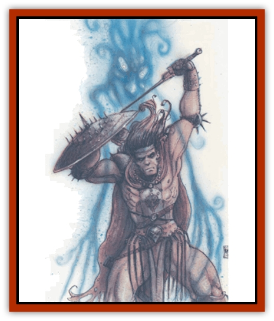

# Astral Searcher

| Statistic | **Astral Searcher** |
| --- | --- |
| **Activity Cycle:** | Any |
| **Alignment:** | Any |
| **Armor Class:** | 10 |
| **Climate/Terrain:** | Outer Planes |
| **Damage/Attack:** | 1d6 |
| **Diet:** | None |
| **Frequency:** | Very rare |
| **Hit Dice:** | 2 |
| **Intelligence:** | Non- (0) |
| **Magic Resistance:** | 50% |
| **Morale:** | Fearless (19) |
| **Movement:** | 12 |
| **No. Appearing:** | 4d6 |
| **No. of Attacks:** | 1 |
| **Organization:** | Solitary |
| **Size:** | M |
| **Special Attacks:** | All victims are AC 5 |
| **Special Defenses:** | Nil |
| **THAC0:** | 19 |
| **Treasure:** | 4 |
| **XP Value:** | 175 |

Astral searchers are the bane of planar travelers in the silvery void. They are mindless shells of nebulous humanoid shape, created by concentrated or traumatized thoughts of prime-material characters in the Astral Plane. Violent death, destructive spells cast while on the Astral Plane, and astral combat often result in the creation of astral searchers. More often than not, the creator or source of the astral searcher isn't even aware of the results of his or her actions, and this creature comes into being without malice of forethought or other intent.

Driven by their past connection with material beings, astral searchers obsessively search for material bodies to possess. As they wander the Astral Plane, they seek weak points in the cosmic fabric that connects the Astral to the other planes, and they cluster at those points, waiting for the stress lines to become collinear so that they can pass into other worlds. Such "rips" in the planar tapestry exist naturally, but they also may be created at points where astral travelers enter and leave the Astral Plane, in which case they exist only temporarily (1d6 rounds). Astral searchers also gather near the color pools that lead to the Prime Material and Outer Planes, but they are incapable of passing through them unless a planar being passes through before them.

**Combat:** As soon as an astral searcher finds its way into another plane or encounters a planar character in the Astral Plane, it seeks to attack. The creature is fussy about its targets - only living humanoids are considered prey. Furthermore, characters from the Prime Material Plane are immune to attacks while on the Astral Plane, for their silver cords somehow act as a shield. On the other hand, characters from the Inner and Outer Planes (who lack silver cords on the Astral) are not protected in this way.

Astral searchers can be attacked either physically or with spells that cause damage. Although weapons seem to slice right through their ghostly forms, they actually cause harm. However, astral searchers are 50% resistant to magic and can only be hit by weapons of +1 or greater enchantment. If reduced to 0 hit points, the creature's will to exist is finally broken and it dissipates into a cloud of harmless vapor.

An astral searcher attacks the psyche of its intended victim, and all targets are treated as having Armor Class 5 for the purposes of this battle. Only *rings of protection* and bonuses for high Wisdom alter the Armor Class of the target. The creature attacks with ghostly claws, as it must touch its victim to be effective. The attack is like a searing lash of psychic energy. Its assault can be blocked psionically in the same way as *id insinuation*.

All damage inflicted by the astral searcher is purely mental, although the victim's mind creates feelings of pain and injury, giving the impression of a physical attack. The mental agony "heals" quickly, though, at the rate of 1d8 points per turn. Nevertheless, the offensive is real. If an astral searcher strikes a fatal blow (hits and reduces the victim to 0 hit points or fewer), the victim falls into a coma while the searcher enters the body and destroys the victim's psyche, effectively killing him. Damage caused by an astral searcher can be combined with that from another source. If another creature actually strikes the fatal blow, however, the astral searcher cannot take possession of the body.

If the astral searcher successfully takes possession of a body, the mind and personality of the victim are destroyed. The searcher acquires the victim's physical abilities and total hit points (as all damage inflicted in the attack now disappears), but not the character's former personality. Instead, the character is filled with the strong emotion that first led to the searcher's creation: rage, fear, determination, or whatever. The newly possessed body can make noise reflecting its emotional state, but it cannot speak. All knowledge of spells and skills is lost.

**Habitat/Society:** Until they inhabit a body, astral searchers have no life. They are simply masses of emotion, disconnected from all else. Once a body is secured, the creature's first concern is to recreate the atmosphere that led to its creation. Thus, an astral searcher born of a mage's dread of capture by the [[Githyanki|githyanki]] would continually attempt to create an atmosphere of terror around it. The searcher assumes the emotion is the true and natural state of the multiverse.

Astral Searchers are quick learners, however, since they reside inside minds already once taught. Skills such as language and nonweapon proficiencies quickly come back - perhaps within a few hours - and relearning most other tasks takes only a quarter or less of the normal time. Even class abilities and levels can be regained. However, memories and life experiences are lost forever, as if the original character were suffering from permanent amnesia. The searcher/character will allow itself to be named, and it may even fall into parts of its victim's old identity, but it will never forego its obsessions, nor can it gain new levels of experience.

**Ecology:** Astral searchers have no physical substance until such time that they take possession of a body. They can be exorcised, but the original psyche has been completely destroyed, and the character cannot be raised or brought back by means short of a wish spell. If the astral searcher is driven from its host, the empty body remains bereft of any essence and may pose an open invitation to fiends or other incorporeal creatures looking for a physical form to dominate.

There are talkes of planars returning home, all knowiedge of their past gone; and still living among their family and friends for many years as mental invalids. It is only later, when someone more knowledgeable comes through town, that those close to the victim discover the real truth.

---
## Discovery & Documentation

**Source Publication:** Planescape Campaign Setting (1994)
**Campaign Setting:** Planescape
**Author(s):** David Cook

### Other Creatures Found in This Source Book
   * [[Aleax|Aleax]]
   * [[Barghest|Barghest]]
   * [[Bariaur|Bariaur]]
   * [[Cranium_Rat|Cranium Rat]]
   * [[Dabus|Dabus]]
   * [[Magman|Magman]]
   * [[Minion_of_Set|Minion of Set]]
   * [[Modron|Modron]]
   * [[Nic'Epona|Nic'Epona]]
   * [[Spirit_of_the_Air|Spirit of the Air]]
   * [[Vortex|Vortex]]
   * [[Yugoloth_Lesser_Marraenoloth|Yugoloth, Lesser, Marraenoloth]]
