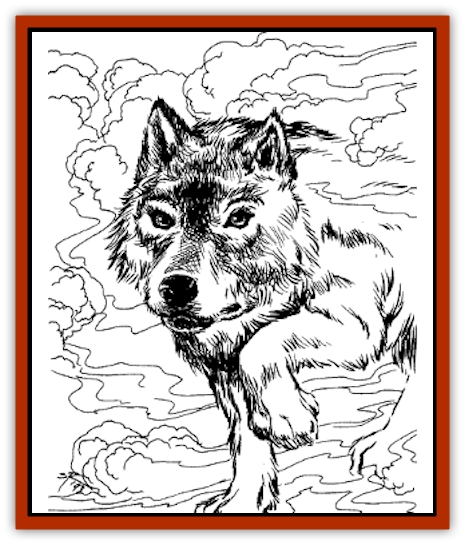

# Astral Wolf

| Statistic | **Astral Wolf** |
| --- | --- |
| **Activity Cycle:** | Any |
| **Alignment:** | Neutral evil |
| **Armor Class:** | 3 (on Astral Plane) |
| **Climate/Terrain:** | Astral Plane |
| **Damage/Attack:** | 2-8 |
| **Diet:** | Carnivorous (special) |
| **Frequency:** | Very rare |
| **Hit Dice:** | 3 |
| **Intelligence:** | Animal (1) |
| **Magic Resistance:** | Nil |
| **Morale:** | Champion (16) |
| **Movement:** | 18 |
| **No. Appearing:** | 3-12 |
| **No. of Attacks:** | 1 |
| **Organization:** | Pack |
| **Size:** | L (4' at shoulder) |
| **Special Attacks:** | Astral attack |
| **Special Defenses:** | Nil |
| **THAC0:** | 17 |
| **Treasure:** | Nil |
| **XP Value:** | 270 |

Astral [[Wolf|wolves]] are the spirits of [[Dog|canines]] and similar animals that died of hunger. They roam the wastelands of the Astral Plane, seeking to draw prey to them in dreams or through magic. If they were intentionally starved to death, astral wolves have an unstoppable thirst for vengeance against their tormentors. The killer can only hope to survive by diverting the wolves' hunger with hapless sacrifices.

**Combat:** Whenever a potential victim is in the vicinity of astral wolves, their howling can be faintly heard even during the day. While sleeping, the victim must save vs. spell or be drawn into the Astral Plane, where the wolves attack. Victims may fight with whatever weapons they carry on their persons. Any damage taken on the Astral Plane is transferred to the sleeping body. Combat on the Astral Plane lasts for 3-12 turns.

A potion exists which banishes a victim to the Astral Plane without a saving throw, where they are hunted by the astral wolves. This potion is most often used by potential victims who seek to throw the wolves off his trail.

**Habitat/Society:** Astral hounds roam their home plane in packs. They have no society except the packs and all pack members' energies are directed at finding and hunting down food. Packs of astral hounds are sometimes accompanied by the ghosts of slain humans, who also seek vengeance on their killers.

**Ecology:** Hunger and vengeance are the only forces that drive a pack of astral hounds. Once the pack has fed, it stops hunting for 1-6 days. If a victim who has not injured the hounds while they lived leaves the area during this time, the hounds pursue only 25% of the time. A victim who slew one or more of the hounds in the hunting pack can escape the hounds in only two ways - divert them with sacrifices or enter the Astral Plane and kill all the hounds.

---
## Discovery & Documentation

**Source Publication:** Lankhmar: City of Adventure (2nd Ed.) (1993)
**Campaign Setting:** Lankhmar
**Author(s):** Bruce Nesmith, Douglas Niles, and Ken Rolston

### Other Creatures Found in This Source Book
   * [[Behemoth|Behemoth]]
   * [[Bird_of_Tyaa|Bird of Tyaa]]
   * [[Cat_War|Cat, War]]
   * [[Cloaker_Sea|Cloaker, Sea]]
   * [[Cold_Woman|Cold Woman]]
   * [[Devourer_Lankhmar|Devourer (Lankhmar)]]
   * [[Ghoul_Kleshite|Ghoul, Kleshite]]
   * [[Ghoul_Lankhmar|Ghoul (Lankhmar)]]
   * [[Gladiator_Lizard|Gladiator Lizard]]
   * [[Horag|Horag]]
   * [[Howler|Howler]]
   * [[Ice_Gnome|Ice Gnome]]
   * [[Invisible_of_Stardock|Invisible of Stardock]]
   * [[Lizard|Lizard]]
   * [[Ophidian|Ophidian]]
   * [[Ray_Invisible_Flying|Ray, Invisible Flying]]
   * [[Scorpion|Scorpion]]
   * [[Simorgyan|Simorgyan]]
   * [[Snow_Serpent|Snow Serpent]]
   * [[Thunder_Children|Thunder Children]]
   * [[Wraith-Spider|Wraith-Spider]]
   * [[Zombie_Sea|Zombie, Sea]]
