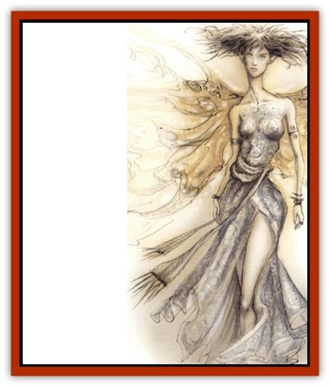

# Asuras

| Statistic | **Asuras** |
| --- | --- |
| **Activity Cycle:** | Unsleeping |
| **Alignment:** | Chaotic good |
| **Armor Class:** | -2 |
| **Climate/Terrain:** | Any/Upper Planes |
| **Damage/Attack:** | 1-10/1-10/by weapon type |
| **Diet:** | Positive energy |
| **Frequency:** | Very rare (Rare on Upper Planes) |
| **Hit Dice:** | 8 |
| **Intelligence:** | Genius (17-18) |
| **Magic Resistance:** | 40% |
| **Morale:** | Fearless (19) |
| **Movement:** | 12, Fl 33 (A) |
| **No. Appearing:** | 1 (2d20 on Upper Planes) |
| **No. of Attacks:** | 3 |
| **Organization:** | Hierarchy |
| **Size:** | M (6') |
| **Special Attacks:** | Fiery eyes, trumpet blare, burning winds, spells |
| **Special Defenses:** | Spell immunities |
| **THAC0:** | 13 |
| **Treasure:** | Nil |
| **XP Value:** | 7,000 |

Asuras are found throughout the Upper Planes, serving various powers as messengers and heralds with a righteous zealotry. They may serve as the voices of knowledge, sharing wisdom that guides mortal oracles and mystics. More often, however, the asuras carry messages of revenge, punishment, and death, sent to those who have angered one of the powers.

Noble warriors, asuras have birdlike talons for feet and wings of brightly burning flame. Marble-white flesh of pleasing countenance covers their stately frame, and their eyes are piercing orbs of the purest fire. Males and females alike wear loose togas of sky blue or snow white. A long mane of red, gold, or copper locks crowns their pale heads. Male asuras adorn their heads in feather-crested helms of bronze. The unjust understandably find asuras terrifying to behold.

**Combat:** The claws of the asuras have been likened to rubies both for their color and their consistency. Very sharp and very hard, the talons tear into the flesh of the wicked with terrible force, dealing 1d10 points of damage each blow. Because of the potency of its claws, an asuras prefers to attack from the air, swooping and hovering above foes. Additionally, this righteous avenger can carry a scimitar or huge spear. Weapon attacks can be directed at a second enemy or at the victim being clawed. There is a 25% chance that an asuras carries a magical flaming weapon similar to a flame tongue sword.

Large groups of asuras blow mighty trumpets while entering battle, the sound of which chills a dark soul to its core. Evil beings of 3 Hit Dice or less must make a morale check upon hearing these horns, even if not yet engaged in conflict. The horns can be heard for miles.

Moreover, three or more asuras can create a burning wind with their wings. This mode of attack inflicts 2d10 hit points of damage upon evil beings, while not harming good or neutral creatures at all.

The renowned intuition of the asuras is spoken of throughout the planes. Asuras have a Wisdom score of 21, giving them an immunity to *charm*, *command*, *fear*, *forget*, *friends*, *hold person*, *hypnotism*, *ray of enfeeblement* and *scare* spells. They also can see the truth behind all illusions. The golden fires of their eyes dim in the presence of untrue words as a *detect lie* spell, and three times each day they can see through all deceptive or concealing veils, as the spell *true seeing*. All asuras cast priest spells as 9th-level casters, with full benefits gained from their remarkable Wisdom scores. Lastly, these beings can *polymorph self* twice per day into the form of a human or demihuman in order to blend in with normal societies. Their forms are always extremely pleasing, and they remain capable fighters and spellcasters no matter what their outward appearance.

**Habitat/Society:** The asuras are organized into hosts, although there is little more structure to their ranks than that. Nevertheless, the host operates well together and gladly obeys the commands of its superiors. All asuras are free to leave their current host and join another at any time. Their service is always freely offered and gladly accepted by the host leader. These leaders have double the normal number of Hit Dice and maximum hit points. They are also blessed with a Wisdom score or 22, along with the corresponding spell immunities. Standing before the host that they command, asuras leaders are visibly different from their subordinates. Taller and more noble in appearance, they have a visible aura of golden light circling their forms.

The general of the Grand Celestial Host is an asuras named Absalom. This radiant individual outshines all others of his kind, leading his holy army of thousands like a handsome, luminous beacon of righteous power. Despite his might and appearance, Absalom is not a power and does not aspire to such high office.

Asuras dislike [[Aasimon_Deva|devas]] and other [[Aasimon_General_Information|aasimon]] (especially lawful ones), seeing them as rivals for the attention of the good powers. Unlike their lower-planar counterparts, however, aasimon and asuras rarely allow their rivalry to degenerate to blows. Likewise, due to the nature of both types of beings, neither resorts to any sort of double-dealing or underhanded measures. Instead, their feelings for each other are openly contemptuous.

**Ecology:** The asuras feed upon energies from the Positive Energy Plane. Gaining their sustenance from this otherworldly source, they have no base requirements such as food, air, or even sleep.

**Rogue Asuras**

  As a creature born of a chaotic nature, sometimes an asuras <q>falls through the cracks</q>. For whatever reason, such an asuras may end up without a power to serve. These rare individuals roam the planes, committing random acts of charity and good will. They defend the downtrodden, rescue the oppressed, and provide for the needy. These rogues often become so narrowly focused in their deeds that they do anything to meet the desired end - sometimes getting carried away in violence and their use of power.

In the words of the planar merchant Gillias Fornmith:

<q>Asuras without a host wander about the planes, giving a good turn wherever they go. But here's the real dark of it: When they travel alone they go a little barmy. You meet one, get greeted politely, and the next thing you know he'll take your head off to save a rabbit you've trapped for your dinner, or steal your whole haul to give to some poor street waif. You might say they lose a bit of perspective on the whole good/evil thing. Lucky for a sod like me, a clever tongue can talk them out of their cockeyed notions. You can use the good sense within the creatures to show them their own folly.</q>

Occasionally, a rogue asuras succumbs to the charms of a particularly pious or righteous human. If such a union occurs, the offspring is usually a fair-skinned human with bright, piercing eyes. A few are able to detect lie in the same manner as their asuras progenitor. All asuras offspring are likely to become mystics, holy figures, or powerful warriors - always significant figures for the force of goodness. These offspring closely resemble the [[Aasimar|aasimar]], having similar origins.

---
## Discovery & Documentation

**Source Publication:** MC13 Al-Qadim Appendix (1992)
**Campaign Setting:** Al-Qadim (Forgotten Realms)
**Author(s):** C. Terry Phillips

### Other Creatures Found in This Source Book
   * [[Ammut|Ammut]]
   * [[Ashira|Ashira]]
   * [[Black_Cloud_of_Vengeance|Black Cloud of Vengeance]]
   * [[Buraq|Buraq]]
   * [[Camel|Camel]]
   * [[Camel_of_the_Pearl|Camel of the Pearl]]
   * [[Centaur_Desert|Centaur, Desert]]
   * [[Copper_Automaton|Copper Automaton]]
   * [[Debbi|Debbi]]
   * [[Elephant_Bird|Elephant Bird]]
   * [[Gen|Gen]]
   * [[Genie_Noble_Dao|Genie, Noble Dao]]
   * [[Genie_Noble_Djinni|Genie, Noble Djinni]]
   * [[Genie_Noble_Efreeti|Genie, Noble Efreeti]]
   * [[Genie_Noble_Marid|Genie, Noble Marid]]
   * [[Genie_Tasked_Architect_Builder|Genie, Tasked, Architect/Builder]]
   * [[Genie_Tasked_Artist|Genie, Tasked, Artist]]
   * [[Genie_Tasked_Guardian|Genie, Tasked, Guardian]]
   * [[Genie_Tasked_Herdsman|Genie, Tasked, Herdsman]]
   * [[Genie_Tasked_Slayer|Genie, Tasked, Slayer]]
   * [[Genie_Tasked_Warmonger|Genie, Tasked, Warmonger]]
   * [[Genie_Tasked_Winemaker|Genie, Tasked, Winemaker]]
   * [[Ghost_Mount|Ghost Mount]]
   * [[Ghul|Ghul]]
   * [[Giant_Desert|Giant, Desert]]
   * [[Giant_Jungle|Giant, Jungle]]
   * [[Giant_Reef|Giant, Reef]]
   * [[Giant_Zakhara_General_Information|Giant (Zakhara), General Information]]
   * [[Hama|Hama]]
   * [[Heway|Heway]]
   * [[Living_Idol|Living Idol]]
   * [[Lycanthrope_Werehyena|Lycanthrope, Werehyena]]
   * [[Lycanthrope_Werelion|Lycanthrope, Werelion]]
   * [[Markeen|Markeen]]
   * [[Maskhi|Maskhi]]
   * [[Mason_Wasp_Giant|Mason Wasp, Giant]]
   * [[Nasnas|Nasnas]]
   * [[Pahari|Pahari]]
   * [[Rom|Rom]]
   * [[Sabu_Lord|Sabu Lord]]
   * [[Sakina|Sakina]]
   * [[Serpent_Lord|Serpent Lord]]
   * [[Serpent_Winged|Serpent, Winged]]
   * [[Silat|Silat]]
   * [[Simurgh|Simurgh]]
   * [[Stone_Maiden|Stone Maiden]]
   * [[Vishap|Vishap]]
   * [[Zaratan|Zaratan]]
   * [[Zin|Zin]]
