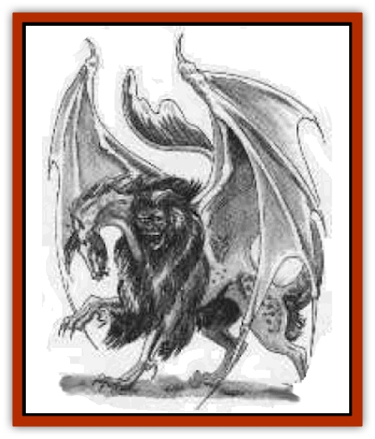

# Audreeana

| Statistic | **Audreeana** |
| --- | --- |
| **Activity Cycle:** | Any |
| **Alignment:** | Any good |
| **Armor Class:** | 3 |
| **Climate/Terrain:** | Any |
| **Damage/Attack:** | 1d6/1d6/1d12/1d12/1d8 |
| **Diet:** | Omnivore |
| **Frequency:** | Mythical |
| **Hit Dice:** | 14 |
| **Intelligence:** | Exceptional (15-16) |
| **Magic Resistance:** | 35% |
| **Morale:** | Elite (14) |
| **Movement:** | 15, Fl 12 (C), Sw 24 |
| **No. Appearing:** | 1 |
| **No. of Attacks:** | 5 |
| **Organization:** | Solitary |
| **Size:** | M (5-6½' tall) |
| **Special Attacks:** | Spells |
| **Special Defenses:** | Immune to missile weapons |
| **THAC0:** | 7 |
| **Treasure:** | I,W |
| **XP Value:** | 9,000 |

Perhaps the most physically powerful of the [[Garradalaigh_General_Information|garradalaighs]], the Audreeana (aw-dree-AN-a) looks like a patchwork beast. It has the body of a [[Horse|horse]], though its legs are shorter, thicker, and end in grasping claws. Its tail is long and [[Fish|fish]]like. Sprouting from its back are two [[Bat|bat]]like wings that - unless it is flying - remain folded into its body, nearly invisible beneath a shaggy band of hair that circles its neck, and extends well down its back. The creature has two heads, one equine and one simian. Each has sharp teeth for rending food and attacking foes. It is spotted gray in color; the hair about its neck is deep black.

Although the andreeana has a single personality, its heads have different functions. It can speak any human or demihuman language fluently through its simian head and communicates with all other warm-blooded animals via its equine head. If either head is severed, the creature dies.

A strong, fast swimmer, it can breathe water as easily as air. Thc audreeana can cast the following spells each once per day at the 10th level of ability: *ESP*, *know alignment*, *clairaudience*, *clairvoyance*, *delude*, *suggestion*, *confusion*, *mislead*. Twice per day it can cast *improved invisiblity*.

A wizard companion gains the audreeana's ability to communicate with warm-blooded animals - as long as the audreeana is within the wizard's line of sight (independent of scrying devices such as crystal balls).

**Combat:** The audreeana first uses spells, reserving one *improved invisibility* enchantment for self-protection. It attacks in melee by biting, each successful bite inflicts 1d6 points of damage. Its front hooves can inflict 1d12 points of damage, and its tail causes 1d8 points of damage. The tail strikes anything to the rear or sides of the creature.

The audreeana is immune to all missile weapons, including the following missile-like spells: *magic missile*, *flame arrow*, *Melf's minute meteors*, and *Melf's acid arrow*. It is not immune to other spells.

**Habitat/Society:** The audreeana avoids other creatures, preferring to spend time alone in contemplation. It fancies mountaintops, heavily wooded forests, and desolate lands crossed by rivers or streams. Folklore claims it wanders the mountains of Brecht�r, prefering the ranges on the eastern side of the Krakennauricht. The audreeana is curious about warfare, though it has no interest in participating in large-scale battles.

**Ecology:** The audreeana has no known predators, though it tends to prey on all manner of things, especially fish, plump game birds, tall grasses, and ripe fruit.

---
## Discovery & Documentation

**Source Publication:** Book of Magecraft (1994)
**Campaign Setting:** Birthright
**Author(s):** Carrie A. Bebris, Anne Brown, Jean Rabe, Steven Schend, Ed Stark

### Other Creatures Found in This Source Book
   * [[Breiryn|Breiryn]]
   * [[Cabhaigh|Cabhaigh]]
   * [[Daegandal|Daegandal]]
   * [[Garigal|Garigal]]
   * [[Garradalaigh_General_Information|Garradalaigh, General Information]]
   * [[Rhoeghn|Rhoeghn]]
   * [[Siddwynd|Siddwynd]]
   * [[Tualleiaght|Tualleiaght]]
