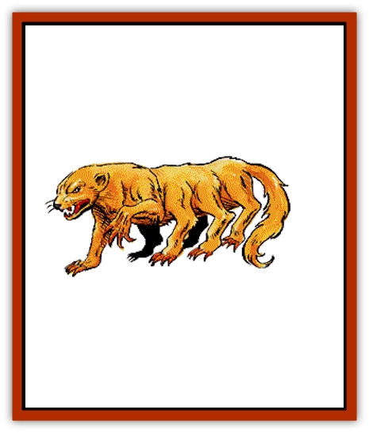

# Aurumvorax

| Statistic | **Aurumvorax** |
| --- | --- |
| **Activity Cycle:** | Day |
| **Alignment:** | Neutral |
| **Armor Class:** | 0 |
| **Climate/Terrain:** | Temperate hills |
| **Damage/Attack:** | 2-8 |
| **Diet:** | Carnivore (see below) |
| **Frequency:** | Very rare |
| **Hit Dice:** | 12 |
| **Intelligence:** | Animal (1) |
| **Magic Resistance:** | Nil |
| **Morale:** | Fearless (19-20) |
| **Movement:** | 9, Br 3 |
| **No. Appearing:** | 1 |
| **No. of Attacks:** | 1 |
| **Organization:** | Solitary |
| **Size:** | S (3' long) |
| **Special Attacks:** | 2-8 claws for 2-8 each |
| **Special Defenses:** | See below |
| **THAC0:** | 9 |
| **Treasure:** | Special |
| **XP Value:** | 9,000 |

Despite being only the size of a large badger, the aurumvorax, or <q>golden gorger</q>, is an incredibly dangerous creature. The animal is covered with coarse golden hair and has small silver eyes with golden pupils. It has eight powerful legs that end in 3-inch-long copper claws. The aurumvorax's shoulders are massively muscled while its heavy jaw is full of coppery teeth.

The creature weighs over 500 pounds. This incredible density provides the animal with much of its natural protection. This, combined with its speed, power, and sheer viciousness, makes it one of the most dangerous species yet known.

**Combat:** The aurumvorax charges any creature that enters its territory, causing a -3 to opponents' surprise rolls if attacking from its den. A female of the species receives a +2 bonus to attack rolls when guarding her young.

The creature bites at its prey until it hits, clamping its massive jaws onto the victim and doing 2-8 hit points of damage. After it hits, the aurumvorax locks its jaws and hangs on, doing an additional 8 points of damage per round until either the aurumvorax or its enemy is dead. Only death will cause the aurumvorax to relax its grip.

Once its jaws lock, the golden gorger also rakes its victim with 2-8 of its legs, causing 2-8 hit points of damage per additional hit. An opponent who is held by an aurumvorax receives no dexterity adjustment to Armor Class.

Due to its incredibly dense hide and bones, the aurumvorax takes only half damage from blunt weapons. It is immune to the effects of small, normal fires and takes only half damage from magical fires. Neither poison nor gases have any effect on the sturdy creature.

**Habitat/Society:** The aurumvorax makes its solitary home in light forests, hills, and at the timberline on mountainsides. An aurumvorax chooses a likely spot and then uses its powerfully clawed legs to create a burrow, sometimes into solid rock.

Due to their unusual dietary needs, aurumvorae make their lairs in spots that either contain rich veins of gold ore or are very near to an area where gold is readily available.

The aurumvorax is a solitary creature which jealously guards its territory, even from others of its kind. The only time adult aurumvorae willingly meet is during mating season, which occurs approximately every eight years.

The pair will stay together for a week or two before the male returns to his territory and the female prepares for the birth of her kits. A litter of 1d6+2 kits is born four months after mating. For the first two weeks of life, the kits are blind and hairless. They must be fed both meat and precious ores, including gold, in order to survive. It is unusual for more than 1-2 of the strongest kits to survive. If a kit is found and <q>adopted</q> before its eyes are open, it can be tamed and trained.

[[Dwarf|Dwarves]] tend to dislike aurumvoraces, though some communities have been known to raise one or more of the beasts for use in sniffing out veins of ore.

**Ecology:** In order to survive, the aurumvorax supplements its carnivorous diet with quantities of gold. The ability to digest and utilize gold and other ores makes it possible for the creature to develop the dense fur, hide, and bones that protect it so well.

If an aurumvorax is killed with a minimum of cutting damage to its hide, the hide may be turned into a garment of incredible strength and beauty worth 15,000-20,000 gold pieces. The garment will also protect its wearer as armor, the specific Armor Class depending on the size of the aurumvorax. A garment with AC 2 weighs 50 pounds, one with AC 3 weighs 40 pounds, and one with AC 4 weighs 30 pounds.

The wearer also receives a +4 bonus on saving throws vs. normal fires and a +2 bonus on saving throws vs. magical fire.

If an aurumvorax is burned in a forge, approximately 150-200 pounds of gold are left behind. This burning process is very difficult and usually takes between one and two weeks to perform. Of course, the hide may be removed before the creature is burned; if burned at the same time, the hide will provide an additional 21-40 (1d20+20) pounds of gold.

The aurumvorax's teeth and claws are also prized for decoration, and can bring up to 1 gp each on the open market.

---
## Discovery & Documentation

**Source Publication:** Monstrous Manual (1995)
**Campaign Setting:** Advanced Dungeons & Dragons 2nd Edition
**Author(s):** Tim Beach

### Other Creatures Found in This Source Book
   * [[Aarakocra|Aarakocra]]
   * [[Aboleth|Aboleth]]
   * [[Ankheg|Ankheg]]
   * [[Arcane|Arcane]]
   * [[Argos|Argos]]
   * [[Baatezu_Lesser_Abishai|Baatezu, Lesser, Abishai]]
   * [[Baatezu_General_Information|Baatezu, General Information]]
   * [[Baatezu_Greater_Pit_Fiend|Baatezu, Greater, Pit Fiend]]
   * [[Banshee|Banshee]]
   * [[Basilisk|Basilisk]]
   * [[Bat|Bat]]
   * [[Bear|Bear]]
   * [[Beetle_Giant|Beetle, Giant]]
   * [[Behir|Behir]]
   * [[Beholder_and_Beholder-kin_I|Beholder and Beholder-kin I]]
   * [[Beholder_and_Beholder-kin_II|Beholder and Beholder-kin II]]
   * [[Bird|Bird]]
   * [[Brain_Mole|Brain Mole]]
   * [[Broken_One|Broken One]]
   * [[Brownie|Brownie]]
   * [[Bugbear|Bugbear]]
   * [[Bulette|Bulette]]
   * [[Bullywug|Bullywug]]
   * [[Carrion_Crawler|Carrion Crawler]]
   * [[Cat_Great|Cat, Great]]
   * [[Catoblepas|Catoblepas]]
   * [[Cat_Small|Cat, Small]]
   * [[Cave_Fisher|Cave Fisher]]
   * [[Centaur|Centaur]]
   * [[Centipede|Centipede]]
   * [[Chimera|Chimera]]
   * [[Cloaker|Cloaker]]
   * [[Cockatrice|Cockatrice]]
   * [[Couatl|Couatl]]
   * [[Crabman|Crabman]]
   * [[Crawling_Claw|Crawling Claw]]
   * [[Crocodile|Crocodile]]
   * [[Crustacean_Giant|Crustacean, Giant]]
   * [[Crypt_Thing|Crypt Thing]]
   * [[Death_Knight|Death Knight]]
   * [[Deepspawn|Deepspawn]]
   * [[Dinosaur_I|Dinosaur I]]
   * [[Displacer_Beast|Displacer Beast]]
   * [[Dog|Dog]]
   * [[Dog_Moon|Dog, Moon]]
   * [[Dolphin|Dolphin]]
   * [[Doppelganger|Doppelganger]]
   * [[Dracolich|Dracolich]]
   * [[Dragon_Brown|Dragon, Brown]]
   * [[Dragon_Chromatic_Black|Dragon, Chromatic, Black]]
   * [[Dragon_Chromatic_Blue|Dragon, Chromatic, Blue]]
   * [[Dragon_Chromatic_Green|Dragon, Chromatic, Green]]
   * [[Dragon_Cloud|Dragon, Cloud]]
   * [[Dragon_Chromatic_Red|Dragon, Chromatic, Red]]
   * [[Dragon_Chromatic_White|Dragon, Chromatic, White]]
   * [[Dragon_Deep|Dragon, Deep]]
   * [[Dragon_Gem_Amethyst|Dragon, Gem, Amethyst]]
   * [[Dragon_Gem_Crystal|Dragon, Gem, Crystal]]
   * [[Dragon_Gem_Emerald|Dragon, Gem, Emerald]]
   * [[Dragon_Gem_Sapphire|Dragon, Gem, Sapphire]]
   * [[Dragon_Gem_Topaz|Dragon, Gem, Topaz]]
   * [[Dragon_Metallic_Brass|Dragon, Metallic, Brass]]
   * [[Dragon_Metallic_Bronze|Dragon, Metallic, Bronze]]
   * [[Dragon_Metallic_Copper|Dragon, Metallic, Copper]]
   * [[Dragon_Mercury|Dragon, Mercury]]
   * [[Dragon_Metallic_Gold|Dragon, Metallic, Gold]]
   * [[Dragon_Mist|Dragon, Mist]]
   * [[Dragon_Metallic_Silver|Dragon, Metallic, Silver]]
   * [[Dragon_General_Information|Dragon, General Information]]
   * [[Dragon_Shadow|Dragon, Shadow]]
   * [[Dragon_Steel|Dragon, Steel]]
   * [[Dragon_Yellow|Dragon, Yellow]]
   * [[Dragonne|Dragonne]]
   * [[Dragon_Turtle|Dragon Turtle]]
   * [[Dragonet_Faerie_Dragon|Dragonet, Faerie Dragon]]
   * [[Dragonet_Fire_Drake|Dragonet, Fire Drake]]
   * [[Dragonet_Pseudodragon|Dragonet, Pseudodragon]]
   * [[Dryad|Dryad]]
   * [[Dwarf_Derro|Dwarf, Derro]]
   * [[Dwarf|Dwarf]]
   * [[Elemental_Athas_General_Information|Elemental (Athas), General Information]]
   * [[Elemental_Air_Kin|Elemental, Air Kin]]
   * [[Elemental_Earth_Kin|Elemental, Earth Kin]]
   * [[Elemental_Fire_Kin|Elemental, Fire Kin]]
   * [[Elemental_Water_Kin|Elemental, Water Kin]]
   * [[Elemental_of_Chaos_Air_Earth|Elemental of Chaos, Air/Earth]]
   * [[Elemental_of_Chaos_Fire_Water|Elemental of Chaos, Fire/Water]]
   * [[Elemental_Composite|Elemental, Composite]]
   * [[Elemental_Air_Earth|Elemental, Air/Earth]]
   * [[Elemental_Fire_Water|Elemental, Fire/Water]]
   * [[Elemental_General_Information|Elemental, General Information]]
   * [[Elephant|Elephant]]
   * [[Elf|Elf]]
   * [[Elf_Aquatic|Elf, Aquatic]]
   * [[Elf_Drow|Elf, Drow]]
   * [[Ettercap|Ettercap]]
   * [[Eyewing|Eyewing]]
   * [[Feyr|Feyr]]
   * [[Fish|Fish]]
   * [[Frog|Frog]]
   * [[Fungus|Fungus]]
   * [[Galeb_Duhr|Galeb Duhr]]
   * [[Gargantua|Gargantua]]
   * [[Gargoyle_I|Gargoyle I]]
   * [[Genie|Genie]]
   * [[Ghost|Ghost]]
   * [[Ghoul|Ghoul]]
   * [[Giant_Cloud|Giant, Cloud]]
   * [[Giant_Cyclops|Giant, Cyclops]]
   * [[Giant_Desert|Giant, Desert]]
   * [[Giant_Ettin|Giant, Ettin]]
   * [[Giant_Firbolg|Giant, Firbolg]]
   * [[Giant_Fire|Giant, Fire]]
   * [[Giant_Fog|Giant, Fog]]
   * [[Giant_Fomorian|Giant, Fomorian]]
   * [[Giant_Frost|Giant, Frost]]
   * [[Giant_Hill|Giant, Hill]]
   * [[Giant_Jungle|Giant, Jungle]]
   * [[Giant_Mountain|Giant, Mountain]]
   * [[Giant_Reef|Giant, Reef]]
   * [[Giant_Stone|Giant, Stone]]
   * [[Giant_Storm|Giant, Storm]]
   * [[Giant_Verbeeg|Giant, Verbeeg]]
   * [[Giant_Wood|Giant, Wood]]
   * [[Gibberling|Gibberling]]
   * [[Giff|Giff]]
   * [[Gith|Gith]]
   * [[Gith_Pirate_of|Gith, Pirate of]]
   * [[Githyanki|Githyanki]]
   * [[Githzerai|Githzerai]]
   * [[Gloomwing|Gloomwing]]
   * [[Gnoll|Gnoll]]
   * [[Gnome|Gnome]]
   * [[Gnome_Spriggan|Gnome, Spriggan]]
   * [[Goblin|Goblin]]
   * [[Golem_General_Information|Golem, General Information]]
   * [[Golem_I_Greater_Golem|Golem I (Greater Golem)]]
   * [[Golem_II_Lesser_Golem|Golem II (Lesser Golem)]]
   * [[Golem_III|Golem III]]
   * [[Golem_IV|Golem IV]]
   * [[Golem_V|Golem V]]
   * [[Golem_VI_Stone_Variants|Golem VI (Stone Variants)]]
   * [[Gorgon|Gorgon]]
   * [[Grell_Colonial|Grell, Colonial]]
   * [[Gremlin_Jermlaine|Gremlin, Jermlaine]]
   * [[Gremlin|Gremlin]]
   * [[Griffon|Griffon]]
   * [[Grimlock|Grimlock]]
   * [[Grippli|Grippli]]
   * [[Hag|Hag]]
   * [[Halfling|Halfling]]
   * [[Harpy|Harpy]]
   * [[Hatori|Hatori]]
   * [[Haunt|Haunt]]
   * [[Hell_Hound|Hell Hound]]
   * [[Heucuva|Heucuva]]
   * [[Hippocampus|Hippocampus]]
   * [[Hippogriff|Hippogriff]]
   * [[Hobgoblin|Hobgoblin]]
   * [[Homunculus|Homunculus]]
   * [[Hook_Horror|Hook Horror]]
   * [[Horse|Horse]]
   * [[Human|Human]]
   * [[Hydra|Hydra]]
   * [[Imp|Imp]]
   * [[Insect_Giant|Insect, Giant]]
   * [[Insect_Swarm|Insect Swarm]]
   * [[Intellect_Devourer|Intellect Devourer]]
   * [[Invisible_Stalker|Invisible Stalker]]
   * [[Ixitxachitl|Ixitxachitl]]
   * [[Jackalwere|Jackalwere]]
   * [[Kenku|Kenku]]
   * [[Ki-rin|Ki-rin]]
   * [[Kirre|Kirre]]
   * [[Kobold|Kobold]]
   * [[Kuo-Toa|Kuo-Toa]]
   * [[Lamia|Lamia]]
   * [[Lammasu|Lammasu]]
   * [[Leech|Leech]]
   * [[Leprechaun|Leprechaun]]
   * [[Leucrotta|Leucrotta]]
   * [[Lich|Lich]]
   * [[Living_Wall|Living Wall]]
   * [[Lizard|Lizard]]
   * [[Lizard_Man|Lizard Man]]
   * [[Locathah|Locathah]]
   * [[Lurker|Lurker]]
   * [[Lycanthrope_General_Information|Lycanthrope, General Information]]
   * [[Lycanthrope_Seawolf|Lycanthrope, Seawolf]]
   * [[Lycanthrope_Werebear|Lycanthrope, Werebear]]
   * [[Lycanthrope_Wereboar|Lycanthrope, Wereboar]]
   * [[Lycanthrope_Werebat|Lycanthrope, Werebat]]
   * [[Lycanthrope_Werefox|Lycanthrope, Werefox]]
   * [[Lycanthrope_Wererat|Lycanthrope, Wererat]]
   * [[Lycanthrope_Wereraven|Lycanthrope, Wereraven]]
   * [[Lycanthrope_Weretiger|Lycanthrope, Weretiger]]
   * [[Lycanthrope_Werewolf|Lycanthrope, Werewolf]]
   * [[Mammal|Mammal]]
   * [[Mammal_Giant|Mammal, Giant]]
   * [[Mammal_Herd_I|Mammal, Herd I]]
   * [[Mammal_Small|Mammal, Small]]
   * [[Manscorpion|Manscorpion]]
   * [[Manticore|Manticore]]
   * [[Medusa_Maedar|Medusa, Maedar]]
   * [[Medusa|Medusa]]
   * [[Mephit_General_Information|Mephit, General Information]]
   * [[Merman|Merman]]
   * [[Mimic|Mimic]]
   * [[Mind_Flayer|Mind Flayer]]
   * [[Minotaur|Minotaur]]
   * [[Mist_Crimson_Death|Mist, Crimson Death]]
   * [[Mist_Vampiric|Mist, Vampiric]]
   * [[Mold_I|Mold I]]
   * [[Moldman|Moldman]]
   * [[Mongrelman|Mongrelman]]
   * [[Morkoth|Morkoth]]
   * [[Muckdweller|Muckdweller]]
   * [[Mudman|Mudman]]
   * [[Mummy_Greater|Mummy, Greater]]
   * [[Mummy|Mummy]]
   * [[Myconid|Myconid]]
   * [[Naga|Naga]]
   * [[Naga_Dark|Naga, Dark]]
   * [[Neogi|Neogi]]
   * [[Nightmare|Nightmare]]
   * [[Nymph|Nymph]]
   * [[Octopus_Giant|Octopus, Giant]]
   * [[Ogre|Ogre]]
   * [[Ogre_Half-|Ogre, Half-]]
   * [[Ooze_Slime_Jelly_I|Ooze/Slime/Jelly I]]
   * [[Ooze_Slime_Jelly_II|Ooze/Slime/Jelly II]]
   * [[Ooze_Slime_Jelly_Slithering_Tracker|Ooze/Slime/Jelly, Slithering Tracker]]
   * [[Orc|Orc]]
   * [[Otyugh|Otyugh]]
   * [[Owlbear_I|Owlbear I]]
   * [[Pegasus|Pegasus]]
   * [[Peryton|Peryton]]
   * [[Phantom|Phantom]]
   * [[Phoenix|Phoenix]]
   * [[Piercer|Piercer]]
   * [[Plant_Dangerous_I|Plant, Dangerous I]]
   * [[Plant_Intelligent|Plant, Intelligent]]
   * [[Poltergeist|Poltergeist]]
   * [[Pudding_Deadly|Pudding, Deadly]]
   * [[Quaggoth|Quaggoth]]
   * [[Rakshasa|Rakshasa]]
   * [[Rat|Rat]]
   * [[Rat_Osquip|Rat, Osquip]]
   * [[Remorhaz|Remorhaz]]
   * [[Revenant|Revenant]]
   * [[Roc|Roc]]
   * [[Roper|Roper]]
   * [[Rust_Monster|Rust Monster]]
   * [[Sahuagin|Sahuagin]]
   * [[Satyr|Satyr]]
   * [[Scorpion|Scorpion]]
   * [[Sea_Lion|Sea Lion]]
   * [[Selkie|Selkie]]
   * [[Shadow|Shadow]]
   * [[Shedu|Shedu]]
   * [[Sirine|Sirine]]
   * [[Skeleton|Skeleton]]
   * [[Skeleton_Giant|Skeleton, Giant]]
   * [[Skeleton_Warrior|Skeleton, Warrior]]
   * [[Slaad|Slaad]]
   * [[Slug_Giant|Slug, Giant]]
   * [[Snake|Snake]]
   * [[Snake_Winged|Snake, Winged]]
   * [[Spectre|Spectre]]
   * [[Sphinx|Sphinx]]
   * [[Spider|Spider]]
   * [[Sprite|Sprite]]
   * [[Squid_Giant|Squid, Giant]]
   * [[Stirge|Stirge]]
   * [[Su-Monster|Su-Monster]]
   * [[Swanmay|Swanmay]]
   * [[Tabaxi|Tabaxi]]
   * [[Tako|Tako]]
   * [[Tanar'ri_True_Balor|Tanar'ri, True, Balor]]
   * [[Tanar'ri_True_Marilith|Tanar'ri, True, Marilith]]
   * [[Tarrasque|Tarrasque]]
   * [[Tasloi|Tasloi]]
   * [[Thought_Eater|Thought Eater]]
   * [[Thri-kreen|Thri-kreen]]
   * [[Titan|Titan]]
   * [[Toad_Giant|Toad, Giant]]
   * [[Treant|Treant]]
   * [[Triton|Triton]]
   * [[Troglodyte|Troglodyte]]
   * [[Troll|Troll]]
   * [[Umber_Hulk|Umber Hulk]]
   * [[Unicorn|Unicorn]]
   * [[Urchin|Urchin]]
   * [[Vampire|Vampire]]
   * [[Wemic|Wemic]]
   * [[Whale|Whale]]
   * [[Wight|Wight]]
   * [[Will_O'Wisp|Will O'Wisp]]
   * [[Wolf|Wolf]]
   * [[Wolfwere|Wolfwere]]
   * [[Worm|Worm]]
   * [[Wraith|Wraith]]
   * [[Wyvern|Wyvern]]
   * [[Xorn|Xorn]]
   * [[Yeti|Yeti]]
   * [[Yuan-ti_Histachii|Yuan-ti, Histachii]]
   * [[Yuan-ti|Yuan-ti]]
   * [[Yugoloth_Guardian|Yugoloth, Guardian]]
   * [[Zaratan|Zaratan]]
   * [[Zombie|Zombie]]
