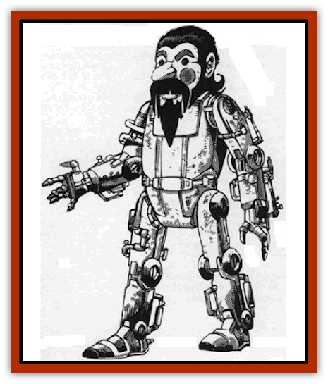

# Autognome

| Statistic | **Autognome** |
| --- | --- |
| **Activity Cycle:** | Any |
| **Alignment:** | Neutral good |
| **Armor Class:** | 0 |
| **Climate/Terrain:** | Any |
| **Damage/Attack:** | 1d10/1d10 or special |
| **Diet:** | None |
| **Frequency:** | Very rare |
| **Hit Dice:** | 5+5 |
| **Intelligence:** | Semi- (4) |
| **Magic Resistance:** | Nil |
| **Morale:** | Fearless (19) |
| **Movement:** | 5, Fl 6 (E), Sw 3, Br 4 |
| **No. Appearing:** | 1 |
| **No. of Attacks:** | 3 or special |
| **Organization:** | None |
| **Size:** | S (3' tall) |
| **Special Attacks:** | See below |
| **Special Defenses:** | See below |
| **THAC0:** | 15 |
| **Treasure:** | Special |
| **XP Value:** | 975 |

An autognome is a mechanical [[Gnome|gnome]] with gears, pulleys, and bits of magic inside it. The [[Gnome_Tinker|tinker gnomes]] create the autognome for exploration, rescue, prospecting, and defense in environments hostile to human- and demihumankind. It works just as well as any other gnomish invention.

These automatons resemble gnomes, though no one could ever confuse an autognome with a real gnome. Autognome faces are painted, even down to red circles on their cheeks. They walk with a stiff gait, clanking, wheezing, whirring, and razzing, their arms swinging out of rhythm. Autognomes speak gnomish and Common in a nasal monotone.

Autognomes are either *directed*, under the gnomes' control; or *rogues*, which have forgotten their orders and now wander wildspace doing anything except what they were designed for.

**Combat:** Autognomes obey the following directives: (1) defend gnomes under attack by non-gnomes; (2) defend yourself against attack; and (3) defend babies and children from harm. The last directive arose from the best inentions, but unfortunately, it neglects to specify races; so if, for instance, an autognome sees elves battling young beholders, the autognome blasts away at the elves.

Autognomes attack with two heavy metallic fists, doing 1d10 damage each. Unfortunately, autognomes are slow and always attack last in a round when using their fists.

Since one of their functions is to collect soil samples from different planets, most autognomes (90%) have a retractable metal scoop. If the scoop is used as a weapon (only when the autognome malfunctions), it inflicts 1d12 damage.

Some autognomes (33%) are used exclusively for combat, and have a *wand of lightning* set in their chests. These wands have 5d10 charges remaining and are salvageable after the autognome is defeated or (more likely) when it breaks down and collapses into a useless heap.

Whichever attack form the autognome uses, it yells as it fights: <q>Crush! Kill! Destroy! Exterminate, exterminate! Maim! Hurt! Incapacitate!</q>

Autognomes save as hard metal. They are immune to poison and all spells except *disintegrate*.

*Malfunctions:* Every successful hit on an autognome has a 10% chance of causing a malfunction. Any time an autognome rolls a 1 for its attack roll, it has a 25% chance of malfunctioning. Finally, an autognome has a 5% non-cumulative chance per day to malfunction. Whatever the cause, roll 1d12 and consult the following table:

| 1d12 | Malfunction |
| --- | --- |
| 1-2. | Autognome becomes a rogue (if already a rogue, use #10) |
| 3. | Autognome attacks itself for 1d4 rounds |
| 4-5. | Head or limb falls off (20% chance for each appendage) |
| 6-7. | As 4-5, but the autognome spends one round reattaching the lost limb |
| 8-9. | Autognome attempts to extract a core sample from victim |
| 10. | Autognome shuts down for 1d10 hours |
| 11. | Autognome explodes (3d10 damage in a 20' radius; save vs. breath weapon for half damage |
| 12. | Autognome's orders change. Roll 1d6:1. Self-destruct sequence starts. Autognome explodes in 1d4 rounds unless doused with water2. Autognome gives its report3. Autognome asks to record report, and remains stationary until the PC stops talking4. Autognome begins talking backwards5. Nearest PC is recognized as a baby6. Nearest PC is recognized as a gnome; autognome followsPC around |

**Habitat/Society:** Since autognomes are automatons, they have no society or preferred habitat. A gnomish spelljammer has a 10% chance of having 1d4 autognomes on board to explore hostile environments.

Autognomes can follow up to 100 different orders, including what to do in certain situations, or what minerals to look for on a planet. An autognome can memorize and recite everything it sees and hears in a 24-hour period.

An autognome can converse with others, but its thought processes are inflexible, and it does not deviate from its orders. Figures of speech are lost on it. Autognome logic is narrow. For instance, an autognome may be ordered to fetch a rock sample. In its travels, it meets a human warrior named Rok. Therefore, out comes the sample scoop and&hellip;

There is a 1/3 chance that an encountered autognome is a rogue. It has forgotten its orders and is now in one of the following conditions (roll 1d4):
1) The autognome believes itself to be a real gnome, and tries to live a normal life, including eating, sleeping, etc.
2) The autognome awaits new orders from anyone it meets.
3) Same as #2, except it does the opposite of what is it told.
4) The autognome attacks all living creatures in sight.

The gnomes guard the secret of building autognomes jealously, though no one but gnomes wants to build the things. It is rumored that it requires many spells such as *enchant an item*, *animate object*, and *permanency*, and it costs at least 10,000 gp.

For some reason, the [[Dohwar|dohwar]] are interested in purchasing intact, working autognomes. All other intelligent races either flee the things or, if the autognome is unaccompanied by a gnome, blow it up.

**Ecology:** Autognomes contribute nothing to the ecosystem except for piles of scrap metal when they inevitably break down. Rogue types can be a wildspace hazard.

---
## Discovery & Documentation

**Source Publication:** MC9 Spelljammer Appendix II (1991)
**Campaign Setting:** Planescape
**Author(s):** Scott Davis, Newton Ewell, John Terra

### Other Creatures Found in This Source Book
   * [[Alchemy_Plant|Alchemy Plant]]
   * [[Allura|Allura]]
   * [[Aperusa|Aperusa]]
   * [[Bionoid|Bionoid]]
   * [[Bloodsac|Bloodsac]]
   * [[Buzzjewel|Buzzjewel]]
   * [[Constellate|Constellate]]
   * [[Contemplator|Contemplator]]
   * [[Dohwar|Dohwar]]
   * [[Dragon_Moon|Dragon, Moon]]
   * [[Dragon_Stellar|Dragon, Stellar]]
   * [[Dragon_Sun|Dragon, Sun]]
   * [[Dreamslayer|Dreamslayer]]
   * [[Dweomerborn|Dweomerborn]]
   * [[Fal|Fal]]
   * [[Feesu|Feesu]]
   * [[Fire_Bat|Fire Bat]]
   * [[Firebird|Firebird]]
   * [[Firelich|Firelich]]
   * [[Flowfiend|Flowfiend]]
   * [[Gadabout|Gadabout]]
   * [[Gammaroid|Gammaroid]]
   * [[Gonn|Gonn]]
   * [[Gossamer|Gossamer]]
   * [[Grav|Grav]]
   * [[Great_Dreamer|Great Dreamer]]
   * [[Greatswan|Greatswan]]
   * [[Grell_Colonial|Grell, Colonial]]
   * [[Gullion|Gullion]]
   * [[Insectare|Insectare]]
   * [[Lhee|Lhee]]
   * [[Mercurial_Slime|Mercurial Slime]]
   * [[Meteorspawn|Meteorspawn]]
   * [[Monitor|Monitor]]
   * [[Owl_Space|Owl, Space]]
   * [[Pristatic|Pristatic]]
   * [[Scro|Scro]]
   * [[Selkie_Star|Selkie, Star]]
   * [[Silatic|Silatic]]
   * [[Skullbird|Skullbird]]
   * [[Sleek|Sleek]]
   * [[Sluk|Sluk]]
   * [[Space_Swine|Space Swine]]
   * [[Sphinx_Astro-|Sphinx, Astro-]]
   * [[Spirit_Warrior|Spirit Warrior]]
   * [[Starfly_Plant|Starfly Plant]]
   * [[Stargazer|Stargazer]]
   * [[Undead_Stellar|Undead, Stellar]]
   * [[Witchlight_Marauder|Witchlight Marauder]]
   * [[Xixchil|Xixchil]]
   * [[Yitsan|Yitsan]]
   * [[Zurchin|Zurchin]]
