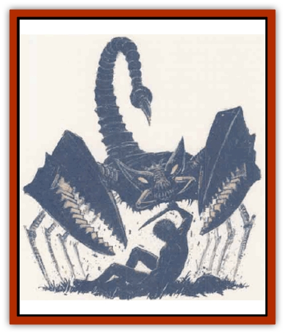

# Automaton - Scaladar

| Statistic | **Automaton, Scaladar** |
| --- | --- |
| **Activity Cycle:** | Any |
| **Alignment:** | Neutral |
| **Armor Class:** | 2 |
| **Climate/Terrain:** | Any warm land or subterranean |
| **Damage/Attack:** | 1d12/1d12/2d4 + special |
| **Diet:** | None |
| **Frequency:** | Very rare |
| **Hit Dice:** | 7+7 |
| **Intelligence:** | Non- (0) |
| **Magic Resistance:** | 35%; see below |
| **Morale:** | Special |
| **Movement:** | 9 |
| **No. Appearing:** | 14 |
| **No. of Attacks:** | 3 |
| **Organization:** | Special |
| **Size:** | H (12'+ long) |
| **Special Attacks:** | Electrical sting |
| **Special Defenses:** | See below |
| **THAC0:** | 13 |
| **Treasure:** | Any possible (guardian) |
| **XP Value:** | 5,000 |

Scaladar are [[Automaton_Trobriand's|automatons]], scorpion-like guardian monsters originally created by a mage named Trobriand. Rumor has it that some of these cold, methodical killers are released with orders to simply destroy all living things they encounter - for that is how many of them behave.

**Combat:** These smoothly-moving metallic constructs attack by grabbing prey with two huge pincer claws while they also lash out with their sting-equipped tails. Thus, a scaladar can potentially fight three opponents at one time. The claws do 1d12 points of damage when they close on a victim, repeating that damage each round thereafter until the victim breaks free. Victims may try to escape a claw once per combat with a successful bend bars/lift gates roll. If the roll fails, they are trapped until the scaladar drops them to grasp another opponent. Trapped beings are automatically struck by the scaladar's sting, no attack roll is required for the sting attack. Trapped victims are also used to bludgeon other beings or surroundings - the pincer does not release the victim but makes an attack roll; if successful, it bludgeons an opponent for 1d4 damage, which does an already-gripped victim an additional 1d6 damage.

A scaladar's sting does 2d4 points of physical damage, and also delivers an electrical discharge of 1d12 points to any victim it <q>stings</q>. This attack can be generated by the scaladar only once per turn, but its sting can be augmented by electrical attacks, lightning strikes, and by magic cast at it.

Scaladar absorb all electrical attacks and all *magic missiles*. The former are retained as stored energy; calculate the hit points of damage of the attack and retain it - each point of damage equals one point of stored energy. The scaladar's stored energy is released by the tail sting in d12 discharge attacks. The scaladar cannot release its stored energy in a <q>sting</q> unless it has 12 points or more stored away.

Scaladar can absorb *magic missiles*. These serve to heal hit points of damage suffered by the scaladar. The magical energy :an be used to heal the scaladar only during the round the *magic missiles* hit. After that time, the magical energy is dissipated and lost.

Scaladar take only half damage from fire-and-heat-based attacks, and half from all edged or piercing weapon attacks. The <q>metal monsters</q> are immune to *disintegrate*, *maze*, *cystalbrittle*, and any acid- or cold-based spells. Attempts to mentally influence a scaladar will always fail, making *charm*, control, and illusion spells useless; unless one is the creator of a particular scaladar, or another being identified by the same creator as a legitimate <q>controller</q>, characters will never command scaladars with powers less than a full *wish*.

Scaladar can climb trees and rockpiles, albeit clumsily, but cannot swim or float. They can temporarily operate underwater without impairment; treat their electrical <q>stings</q> as 30 foot radius *fireballs*, doing the scaladar itself no harm. However, the metallic scorpions rust within 1d20 days, reducing them to half movement rate, and later (another 1d20 days) into total immobility.

**Habitat/Society:** The scaladar form no social groupings; they are encountered singly or in groups as ordered and deployed by their controllers.

Scaladar are always aware of the presence of others of their own kind within 100 feet. This detection also applies to sensing their creator or controller. If a scaladar is attacked within the range of others, they all immediately sense the threat - and may aid their fellow if their current operational orders allow it. In a like manner, the controller of a scaladar can mentally or verbally communicate an order to all scaladar within 100 feet. A controller can only mentally command scaladar if he has one of the *rings of Trobriand*.

Some wizards have attempted to devise specific spells allowing them to control encountered scaladar, while others are rumored to have attempted to make their own scaladar. If any mages have achieved success, they have so far kept silent. It is suspected that Trobriand has created some scaladar to destroy any <q>inferior models</q> of scaladar made by other wizards.

**Ecology:** Scaladar eat nothing, and function as predators only when ordered to do so. Most serve as guardians of their controller's keep, programmed with a specific range, and specific objectives, such as <q>Keep this area around my tower free of any creatures larger than 1 foot tall</q>. The scaladar pursue their orders without question and kill without compunction, if so ordered. As cold, bloodless, nigh-mindless killers, they are enemies of all living creatures.

Most scaladar are under orders to seize and swallow intact any magical items that they detect save those directly wielded by their controller; in this role, they constantly attempt to remove objects bearing dweomers from open use in their vicinity. A scaladar's orders are usually structured for primary and secondary goals - the collection of magical items is often its primary goal, though it often has to use force to achieve that goal.

Scaladar are created by a complex, exacting, jointly mechanical and magical process, so far solely practiced by their inventor, the archmage Trobriand. Sages believe that similar creatures were once in use in Myth Drannor, Netheril, and other magic-proud realms of long ago - and that a few of these may yet survive in long-sealed tombs and lost treasure-vaults. Other sages, those versed with spelljamming, argue that the scaladar are a larger derivation of the dreaded mechanized [[Clockwork_Horror|clockwork horrors]]. This theory is supported by Trobriand's duplicate [[Clockwork_Horror|copper horror]] in his laboratory.

***Rings of Trobriand***

  These magical rings are the creation of Trobriand, an apprentice of Halaster and creator of the metallic scaladar. The rings allow mental contact and command of any scaladar within 100 feet. The rings of Trobriand also protect the wearer from attack by any scaladar, regardless of its orders; the ring will cause the scaladar to shut itself off for 1d12 turns immediately upon contact with the wearer. The only exceptions to this effect are scaladar under the command of Trobriands Master Ring of the Scaladar. Trobriand's ring can override any scabadar's orders and issue new commands from a distance of 500 feet. The Master Ring temporarily locks out all other orders as the scaladar pursues the objectives given by Trobriand and cancels the shut-down effect of a minor ring. Trobriand has eliminated hated ex-apprentices as well as rival mages by attacking them with their own scaladar forces.

## Enhanced Scaladar (Squch)

The enhanced scaladar, of which the only known example calls itself Squch, is an automaton especially created by Trobriand. Squch is physically identical to a normal scaladar, aside from its intelligence (16), magic resistance, independent will (neutral evil alignment), and a magical voicebox that allows it to speak common and drow.

**Combat:** Squch attacks like other scaladar. Moreover, the enhanced scaladar holds the victim in its vise-like grip and bludgeons other enemies with that unfortunate, dealing 1d4 points of damage to the bludgeoned foe, and an additional 1d6 points of damage to the tightly-held victim/weapon.

Like its less-intelligent cousins, Squch can absorb all *magic missiles* and all electrical attacks, and these have the normal effects. In addition, Squch has a magic resistance of 50%.

Like all of Trobriand's constructs, Squch is immune to *disintegrate*, *maze*, *crystalbrittle*, and any acid- or cold-based spells. It takes only half damage from fire- and heat-based attacks, and half damage from any attacks with edged or piercing weapons. All attempts to mentally control Squch will fail unless they specifically use Trobriand's Master Ring.

**Habitat/Society:** The enhanced scaladar has a more advanced artificial intelligence, allowing it to directly control its fellow constructs. Its primary magical <q>programming</q> instills in it a directive for control. It does realize, however, that it and the other metal monsters of its kind are unquestoningly under the control of the *Master Ring* (though Squch thinks it might have ways around that, provided enough magic&hellip;)

Squch is intelligent and ambitious and is following its directive of control quite well. It has delusions of grandeur along with its control directive, and is ruthless and totally lacking in qualities such as compassion or curiosity. It want only one thing: to further its ambitions and obey its <q>need</q> for control. It is driven by a mechanical logic and is too intelligent to fall for spurious arguments or unsupported threats. Unlike others of its kind, Squch does not kill blindly and automatically; each opponent is evaluated in terms of what Squch might gain from him or her.

Squch moves smoothly on level ground, but can climb rockpiles in a clumsy fashion. It knows that it cannot swim or float, and that its metallic body would eventually rust if exposed to water for extended periods of time, and so it remains on dry
ground at all times.

**Ecology:** Squch eats nothing, and requires no fuel. Trobriand knows of its ambitions, but only finds them <q>amusing from an point of anthropological view</q>. He also knows that the construct will obey him without question, due to his *Master Ring*. With matters at an apparent impasse, Trobriand continues to observe Squch and its fellows with much amusement and interest. Squch, on the other hand, works incessantly to gain control of itself (it wants to find magic that allows it to defy Trobriand's control).

---
## Discovery & Documentation

**Source Publication:** Monstrous Compendium, 1995 Annual, Volume 2 (1995)
**Campaign Setting:** Advanced Dungeons & Dragons 2nd Edition
**Author(s):** Jon Pickens

### Other Creatures Found in This Source Book
   * [[Aboleth_Savant|Aboleth, Savant]]
   * [[Addazahr|Addazahr]]
   * [[Amiq_Rasol|Amiq Rasol]]
   * [[Arch-Shadow|Arch-Shadow]]
   * [[Automaton_Trobriand's|Automaton, Trobriand's]]
   * [[Bat_Sporebat|Bat, Sporebat]]
   * [[Beetle_Dragon|Beetle, Dragon]]
   * [[Bi-nou|Bi-nou]]
   * [[Boggle|Boggle]]
   * [[Brownie_Dobie|Brownie, Dobie]]
   * [[Brownie_Quickling|Brownie, Quickling]]
   * [[Cat_Crypt|Cat, Crypt]]
   * [[Cat_Great_Cath_Shee|Cat, Great, Cath Shee]]
   * [[Centaur-kin_Dorvesh|Centaur-kin, Dorvesh]]
   * [[Centaur-kin_Gnoat|Centaur-kin, Gnoat]]
   * [[Centaur-kin_Ha'pony|Centaur-kin, Ha'pony]]
   * [[Centaur-kin_Zebranaur|Centaur-kin, Zebranaur]]
   * [[Chronolily|Chronolily]]
   * [[Curst|Curst]]
   * [[Darktentacles|Darktentacles]]
   * [[Dinosaur_Aquatic|Dinosaur, Aquatic]]
   * [[Dinosaur_II|Dinosaur II]]
   * [[Dinosaur_III|Dinosaur III]]
   * [[Doppelganger_Greater|Doppelganger, Greater]]
   * [[Dragon_Brine|Dragon, Brine]]
   * [[Dragon_Half-|Dragon, Half-]]
   * [[Dragon-kin_Sea_Wyrm|Dragon-kin, Sea Wyrm]]
   * [[Dwarf_Wild|Dwarf, Wild]]
   * [[Ekimmu|Ekimmu]]
   * [[Elemental_Nature|Elemental, Nature]]
   * [[Elf_Winged|Elf, Winged]]
   * [[Fish_Great_Glacier|Fish (Great Glacier)]]
   * [[Fish_Subterranean|Fish, Subterranean]]
   * [[Fish_Toril|Fish (Toril)]]
   * [[Flareater|Flareater]]
   * [[Flumph|Flumph]]
   * [[Froghemoth|Froghemoth]]
   * [[Ghost_Casurua|Ghost, Casurua]]
   * [[Ghost_Ker|Ghost, Ker]]
   * [[Ghul|Ghul]]
   * [[Ghul-Kin|Ghul-Kin]]
   * [[Giant_Half-giant|Giant, Half-giant]]
   * [[Golem_Burning_Man|Golem, Burning Man]]
   * [[Golem_Phantom_Flyer|Golem, Phantom Flyer]]
   * [[Gulguthhydra|Gulguthhydra]]
   * [[Hakeashar|Hakeashar]]
   * [[Horse_Moon-|Horse, Moon-]]
   * [[Human_Dragonslayer|Human, Dragonslayer]]
   * [[Human_Vistana|Human, Vistana]]
   * [[Jellyfish_Giant|Jellyfish, Giant]]
   * [[Kalin|Kalin]]
   * [[Kholiathra|Kholiathra]]
   * [[Laerti|Laerti]]
   * [[Leucrotta_Greater|Leucrotta, Greater]]
   * [[Lich_Suel|Lich, Suel]]
   * [[Lurker_Shadow|Lurker, Shadow]]
   * [[Lycanthrope_Werepanther|Lycanthrope, Werepanther]]
   * [[Lycanthrope_Wereshark|Lycanthrope, Wereshark]]
   * [[Mammal_Herd_II|Mammal, Herd II]]
   * [[Marl|Marl]]
   * [[Meenlock|Meenlock]]
   * [[Mimic_Greater|Mimic, Greater]]
   * [[Mold_II|Mold II]]
   * [[Mummy_Creature|Mummy, Creature]]
   * [[Nyth|Nyth]]
   * [[Ooze_Slime_Jelly_Ghaunadan|Ooze/Slime/Jelly, Ghaunadan]]
   * [[Palimpsest|Palimpsest]]
   * [[Peltast|Peltast]]
   * [[Plant_Dangerous_II|Plant, Dangerous II]]
   * [[Pleistocene_Animal|Pleistocene Animal]]
   * [[Pudding_Subterranean|Pudding, Subterranean]]
   * [[Raggamoffyn|Raggamoffyn]]
   * [[Snake_Serpent|Snake, Serpent]]
   * [[Snake_Serpent_Vine|Snake, Serpent Vine]]
   * [[Sphinx_Draco-|Sphinx, Draco-]]
   * [[Sprite_Seelie_Faerie|Sprite, Seelie Faerie]]
   * [[Sprite_Unseelie_Faerie|Sprite, Unseelie Faerie]]
   * [[Squealer|Squealer]]
   * [[Turtle_Giant|Turtle, Giant]]
   * [[Umpleby|Umpleby]]
   * [[Vizier's_Turban|Vizier's Turban]]
   * [[Wall_Walker|Wall Walker]]
   * [[Webbird|Webbird]]
   * [[Yak-Man|Yak-Man]]
   * [[Zorbo|Zorbo]]
