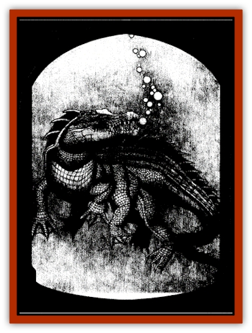

# Avanc

| Statistic | **Avanc** |
| --- | --- |
| **Activity Cycle:** | Night |
| **Alignment:** | Neutral evil |
| **Armor Class:** | 4 |
| **Climate/Terrain:** | Lake Kronov, Tepest |
| **Damage/Attack:** | 3d4/3d4/2d10 |
| **Diet:** | Carnivore |
| **Frequency:** | Unique |
| **Hit Dice:** | 6+3 |
| **Intelligence:** | Average (10) |
| **Magic Resistance:** | Nil |
| **Morale:** | Champion (16) |
| **Movement:** | 9, Sw 12 |
| **No. Appearing:** | 1 |
| **No. of Attacks:** | 3 (bite/bite/tail) |
| **Organization:** | Solitary |
| **Size:** | H (20' long) |
| **Special Attacks:** | Surprise, whirlpool |
| **Special Defenses:** | Strength, immunity to fire and heat |
| **THAC0:** | 15 |
| **Treasure:** | Nil |
| **XP Value:** | 2,000 |

The avanc is a huge, six-legged or six-finned [[Crocodile|crocodilian]] beast that inhabits Lake Kronov, a lake in Ravenloft's mysterious domain of Tepest. Both ravenous and malicious, this creature is the bane of swimmers and fishermen alike.

From snout to tail, the avanc runs fully twenty feet long. Its dark, mottled green scales enable it to blend into the vegetation of marshy areas and strike its victims without warning. The eyes of the avanc are black and beady - inhuman as those of a viper, yet filled with malign intelligence. Its long lean snout resembles a cayman's. Reliable accounts suggest that it has legs in shallow water and fins in deep water.

The avanc speaks the language of both crocodiles and fish, who generally carry out its orders (although they are not magically compelled to do so). In addition, it speaks the languages of the various Unseelie [[Arak_General_Information|shadow elves]], especially the [[Arak_Sith|sith]].

**Combat:** The avanc is a deadly enemy, for it can often strike without warning and catch an opponent completely off guard. When the avanc hears travelers approaching along the shore, it moves to an area of marsh or swamp grass on the side of the lake and waits, perfectly motionless, for its prey to come within striking distance. Even vigilant scouts (that is, those who have specifically stated that they are watching for some type of ambush) have only a 5% chance per experience level of spotting the creature. As soon as someone comes within fifteen feet of the great beast, it surges forward and attacks, imposing a -2 penalty on the surprise roll of its target.

When the avanc strikes, it does so with its powerful jaws and daggerlike teeth, inflicting 3d4 points of damage per bite. In addition, it can lash at another enemy with its muscular tail for another 2d10 points of damage. Fortunately, the avanc cannot employ both its jaw and tail attacks on the same target.

Against targets on the water, the avanc uses slightly different tactics. Swimmers it simply comes up under and seizes, pulling them down to their deaths one by one. For those in small boats, it uses its whirlpool to destroy the boat then drags its prey down into the dark waters to drown.

In addition to providing it with an excellent Armor Class, the thick scales that cover the avanc make it very resistant to fire- and heat-based attacks. Normal fire used against the creature has no effect at all. Magical fire, like that created by a *fireball* spell, inflicts only half damage to the creature (one-quarter with a successful saving throw).

Once per day, when the avanc is not in combat, it can cause a whirlpool to form in the waters of a lake, pond, or other body of fresh water. The whirlpool is one hundred feet across, and all vessels who enter its swirling grip must make a successful seaworthiness check each round or capsize. It primarily uses this power to force sailors into the water so that it can devour them.

**Habitat/Society:** The origins of the avanc are lost in the Mists, but it is believed to have once been a man (or at least a humanoid creature) who ran afoul of Loht. In return for its transgression, the poor fellow was polymorphed into the gilled, crocodilelike thing that it is today.

The avanc does not associate with other crocodiles or fish, although it does sometimes encounter them and can converse with them. Similarly, it has never taken a mate and may not even be able to reproduce, at least in its present form.

**Ecology:** Although the avanc is a ravenous creature that will greedily consume a dozen grown men if given the chance, it can also go for long periods of time without eating. After the beast has eaten its fill (between twelve and fifteen man-sized creatures) it will retreat to the bottom of the lake and sleep for one week per creature consumed. It is the chief predator of Lake Kronov and the subject of many legends among the children and fisher-folk who dwell along its shores.

---
## Discovery & Documentation

**Source Publication:** The Shadow Rift (1998)
**Campaign Setting:** Ravenloft
**Author(s):** William W. Connors, John D. Rateliff, Cindi Rice

### Other Creatures Found in This Source Book
   * [[Arak_General_Information|Arak, General Information]]
   * [[Arak_Alven|Arak, Alven]]
   * [[Arak_Brag|Arak, Brag]]
   * [[Arak_Fir|Arak, Fir]]
   * [[Arak_Muryan|Arak, Muryan]]
   * [[Arak_Portune|Arak, Portune]]
   * [[Arak_Powrie|Arak, Powrie]]
   * [[Arak_Shee|Arak, Shee]]
   * [[Arak_Sith|Arak, Sith]]
   * [[Arak_Teg|Arak, Teg]]
   * [[Changeling_Kin|Changeling (Kin)]]
   * [[Crimson_Bones|Crimson Bones]]
   * [[Grim|Grim]]
   * [[Saugh_Dearg-Due|Saugh, Dearg-Due]]
   * [[Saugh_Gossamer|Saugh, Gossamer]]
   * [[Treant_Evil_Blackroot|Treant, Evil (Blackroot)]]
