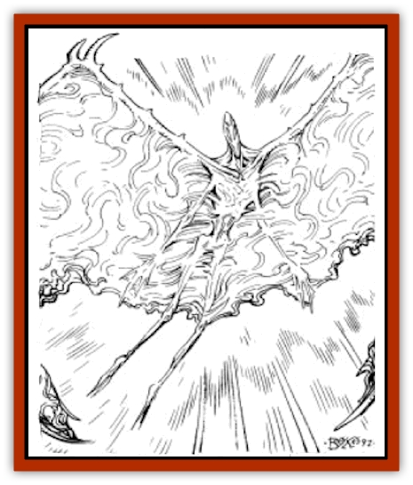

# Avangion

| Statistic | **Avangion** |
| --- | --- |
| **Activity Cycle:** | Any |
| **Alignment:** | Varies |
| **Armor Class:** | Varies |
| **Climate/Terrain:** | Any |
| **Damage/Attack:** | Varies |
| **Diet:** | Omnivore |
| **Frequency:** | Very rare |
| **Hit Dice:** | Varies |
| **Intelligence:** | High to Supra-genius (13-14) |
| **Magic Resistance:** | Varies |
| **Morale:** | Fanatic (17-18) |
| **Movement:** | Varies |
| **No. Appearing:** | 1 |
| **No. of Attacks:** | Varies |
| **Organization:** | Solitary |
| **Size:** | M to L (6-12') |
| **Special Attacks:** | See below |
| **Special Defenses:** | See below |
| **THAC0:** | Varies |
| **Treasure:** | Varies |
| **XP Value:** | Varies |

In the entire known history of the Tyr region, there has never been a preserver who has advanced far enough in experience to mimic the metamorphosis of defilers and become an advanced being. But it is possible.

The transformation forces the preserver to pass through a series of steps that lead from human to avangion, but where the [[Dragon_Athas|defiler/dragon]] metamorphosis is characterized by massive destruction and great pain, the preserver/avangion blend is a more serene, peaceful process of light, water, and the life-giving properties of the dying world of Athas.

Only humans who are dual-classed 20th-level preservers and psionicists can proceed from 21st to 30th level as an avangion. The transformation is time-consuming and difficult, but ultimately rewarding.

A preserver who transforms into an avangion undergoes a series of magnificent changes. In the earliest stages of this metamorphosis, the avangion retains almost all human characteristics. Closer to the ultimate form, the flesh becomes radiant silver, and wide, elegant gossamer wings sprout. Eventually, the preserver's arms and legs become less and less useful. In the end, the legs are too fragile to support body weight, the arms too delicate for anything but fine manipulation.

Like dragons, avangions are effectively immortal. The passage of long periods of time mean nothing to their physical form. Avangions also have the following spell-like abilities, which are permanently active: *tongues*, *know alignment*, *ESP*, and *detect lies*.

**Combat:** Avangions are not fond of physical combat. They are generally physically weak and depend upon their powerful magics and potent psionics to defend themselves. Among the most powerful weapons of the avangion is its ability to employ *psionic enchantment*. The spell chart at the end of this entry indicates the magic available to the avangion at the various levels of progression. Further, an avangion has the powers of a psionicist of equal level.

Another powerful ability is the gradual development of a magical aura. This aura is visible as a bright light that radiates from the creature's gleaming body. When it first manifests, the aura acts as a *protection from evil spell* and also dissipates any magical darkness on contacts. Later, it causes all evil creatures within to suffer as if they had been hit by a *ray of enfeeblement*. Ultimately, it becomes an almost impenetrable defensive barrier, acting as a massive globe of invulnerability.

**Habitat/Society:** Unlike dragons, avangions go through no animalistic stage where they lose their mental faculties. On the contrary, as an avangion progresses through the stages of its metamorphosis, its intellect increases, marked by increases in its Wisdom score (presented on the chart at the end of this entry).

These extremely powerful creatures are concerned with adventures of epic proportions - they have the power and influence to do so. They are the first of their kind in recorded history, a focus of change toward good, and perhaps are the most powerful good creatures on Athas.

Advanced beings like the avangion are extremely powerful, but large numbers of lesser creatures can still bring them down. The downfall of many dragons is their inability to work as a team. Avangion certainly attract followers in campaign play, though they must leave these people for stretches of time during their metamorphosis.

**Ecology:** Avangions and dragons are arch-enemies who seek each other out for battle whenever possible. Clashes between such powerful creatures can have horrible side effects and often end in stalemates. In such battles, the dragon generally takes a wholly offensive tack, whereas the avangion employs more subtle strategies and defensive tactics.

A preserver on the road to becoming an avangion must employ the*preserver metamorphosis* spell at each stage of advancement in level and power. The preserver changes physical form drastically upon the spell's completion, each time bridging approximately one-tenth the gap between human and full avangion form.

The exact material components, preparation time, and casting time depend on what level the preserver is about to achieve (grouped by level into low, middle, high, and final metamorphosis).

*Low (21st, 22nd, and 23rd levels):* As the next level draws near, a calling within leads the preserver to leave the company of his fellows and seek isolation. For low-level metamorphosis, the preserver must gather physical remains of the enemies of life, usually those of high-level defilers-their bodily remains, destructive belongings or artifacts, ash from their spellcasting, etc. These items must be gathered during the preserver's period of isolation as evidence of a devotion to life and the land. The spell must then be cast at night, beneath the light of both Athasian moons. Any interruption results in spell failure. The preserver may have other characters present during casting.

*Middle (24th, 25th, and 26th levels):* The preserver advancing through these intermediate levels hears another calling for isolation. The material components at the middle levels are gifts gathered from no fewer than three powerful good creatures during isolation. Obviously, the powerful creatures realize the consequences of contact for the preserver, so they leave the gifts after the preserver achieves extremely dangerous or important goals. The material component for the spell (not consumed in casting) is a single tree or bush personally saved by the preserver from defiler magic destruction. The casting time is 12 hours. The preserver must cast the spell in a forest or area of dense vegetation - at the time of casting, there must be living vegetation for at least one mile in all directions, untainted by defiler ash or evil creatures.

*High (27th, 28th, and 29th levels):* Unlike previous eve a advancements, the preserver has no calling toward isolation at high levels, but instead must collect a core group of companions, no fewer than eight in number and of at least 10 levels or Hit Dice each. All the companions must be of good alignment. The preserver must spend the preparation time with these characters. The material components are a single gift from each of the companions in the core group. During the casting of the spell, the preserver must have the aid of a single companion for the entire ceremony. If the companion is not absolutely good, the spell fails and the companion is slain in the release of failed magical energy. Companions cannot repeat the process with a single preserver - new companions must be found for each of 27th, 28th, and 29th levels.

*Final (30th level):* To cast this spell, the preserver must make an area of lush vegetation (crops, scrub grass, forests, or any combination) at least five miles in diameter. At the time of casting, the lush lands must be free of evil creatures. The material components are a diamond, of no less than 10,000 gp value, with which to capture the life-giving qualities of sunlight; a large stone tomb; and a perfectly sealed glass case built around both preserver and tomb. The casting time is one round. Once the spell is cast, the preserver/avangion, diamond, and stone tomb disappear, bound for planes unknown. After many months, perhaps as long as two years, the avangion returns, wholly transformed, to the glass case. If the glass case *is* damaged in the meantime, the avangion is lost to oblivion.

## Avangion Ability Charts

| Lvl | HD* | AC | Immune | THAC0 | Move | MR | Aura | Bonus |
| --- | --- | --- | --- | --- | --- | --- | --- | --- |
| 21 | 10+11 | 9 | - | 10 | ? | 10% | Nil | Nil |
| 22 | 10+12 | 8 | +1 | 10 | ? | 15% | Nil | Nil |
| 23 | 10+13 | 7 | +l | 9 | ? | 20% | Nil | Nil |
| 24 | 10+14 | 6 | +2 | 9 | ? | 25% | Nil | Nil |
| 25 | 10+15 | 41 | +2 | 8 | ?a | 30% | Nil | Nil |
| 26 | 10+16 | 21 | +3 | 8 | ?b | 40% | Nil | Nil |
| 27 | 10+17 | 01 | +3 | 7c | 0d | 50% | Nil | +1Wis |
| 28 | 10+18 | -22 | +5 | 7c | 0e | 60% | 90f | +1Wis |
| 29 | 10+19 | -42 | +5 | 5c | 0e | 70% | 150g | +1Wis |
| 30 | 10+20 | -62 | +5 | 5c | 0h | 80% | 200i | +2Wis |

*avangions use 4-sided hit dice
1 can be hit only by +1 or better magical weapons
2 tan be hit only by +2 or better magical weapons
a now has a <q>flying</q> movement rate of 24 (A)
b now has a <q>flying</q> movement rate of 36 (A)
c can no longer wield weapons or make any physical attacks
d can no longer walk, must hover or fly at all times
e now has a <q>flying</q> movement rate of 48 (A)
f the aura of light acts as a protection from evil at this point and dispels any magical darkness within its listed radius
g the aura of light gains the ability to affect all evil creatures in its radius with a ray of enfeeblement
h now has a <q>flying</q> movement rate of 60 (A)
i the aura of light gains the ability to act as a globe of invulnerability
*Note:* Regardless of level, an avangion saves as a 21+-level wizard.

|  | Spells Available |
| --- | --- |
| Level | 1 | 2 | 3 | 4 | 5 | 6 | 7 | 8 | 9 | 10 |
| --- | --- | --- | --- | --- | --- | --- | --- | --- | --- | --- |
| 20 | 5 | 5 | 5 | 5 | 5 | 4 | 3 | 3 | 2 | 1 |
| 21 | 5 | 5 | 5 | 5 | 5 | 4 | 4 | 4 | 2 | 1 |
| 22 | 5 | 5 | 5 | 5 | 5 | 5 | 4 | 4 | 3 | 1 |
| 23 | 5 | 5 | 5 | 5 | 5 | 5 | 5 | 5 | 3 | 2 |
| 24 | 5 | 5 | 5 | 5 | 5 | 5 | 5 | 5 | 4 | 2 |
| 25 | 5 | 5 | 5 | 5 | 5 | 5 | 5 | 5 | 5 | 2 |
| 26 | 6 | 6 | 6 | 6 | 5 | 5 | 5 | 5 | 5 | 3 |
| 27 | 6 | 6 | 6 | 6 | 6 | 6 | 6 | 5 | 5 | 3 |
| 28 | 6 | 6 | 6 | 6 | 6 | 6 | 6 | 6 | 6 | 3 |
| 29 | 7 | 7 | 7 | 7 | 6 | 6 | 6 | 6 | 6 | 4 |
| 30 | 7 | 7 | 7 | 7 | 7 | 7 | 7 | 6 | 6 | 4 |

---
## Discovery & Documentation

**Source Publication:** Dragon Kings (hardback) (1992)
**Campaign Setting:** Dark Sun
**Author(s):** Timothy B. Brown

### Other Creatures Found in This Source Book
   * [[Dragon_Athas|Dragon (Athas)]]
   * [[Elemental_Athas_Clerical|Elemental (Athas), Clerical]]
